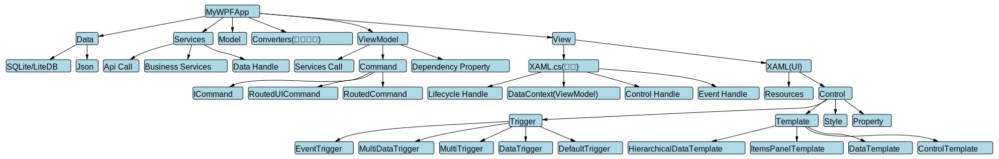
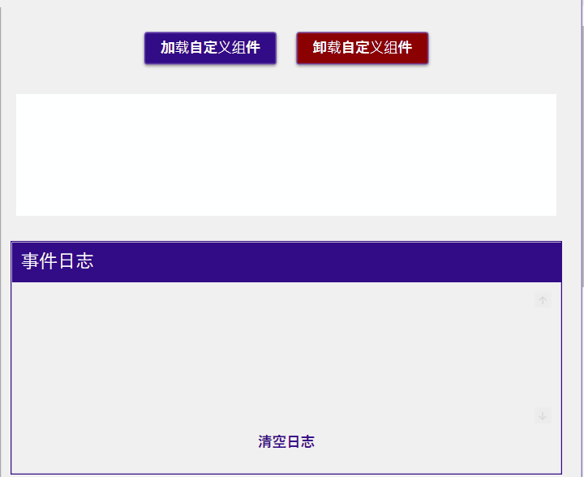
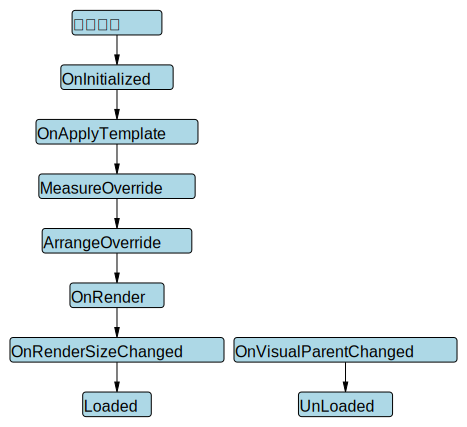
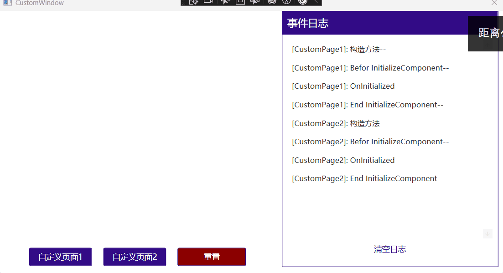
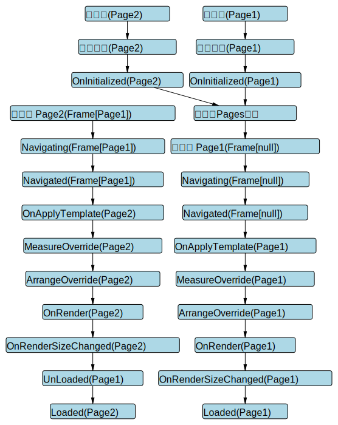
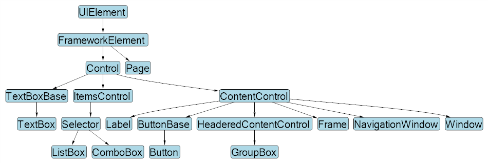
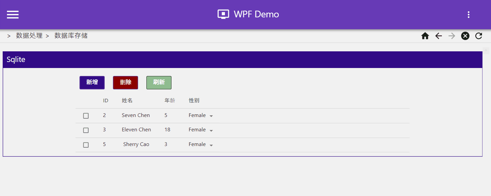

# WPF

## 介绍

WPF（Windows Presentation Foundation）是微软推出的下一代桌面应用程序开发技术，用于构建在 Windows 上运行的富客户端应用（Rich Client Applications）。

它首次随 .NET Framework 3.0 于 2006 年发布，并在后续版本中不断完善。

WPF Demo 地址：https://github.com/chenrui1996/WpfDemo

::: danger 跨平台支持

- 桌面端的跨平台需求推荐使用 [Avalonia UI](https://avaloniaui.net/gettingstarted)（常简称 Ava）
- 移动端的跨平台需求推荐使用 [MAUI(Xamarin 后续)](https://dotnet.microsoft.com/en-us/apps/maui)（常简称 Ava）
- 全平台需求推荐 [Uno Platform(/ˈuːnoʊ/)](https://platform.uno/)

**以上平台与WPF开发过程一脉相承，容易上手。**

:::

::: tip WPF与Electron

| **对比**        | **WPF**                        | **Electron**                               |
| --------------- | ------------------------------ | ------------------------------------------ |
| **开发语言**    | C#, XAML (.NET)                | HTML, CSS, JavaScript (Node.js + Chromium) |
| **UI 描述方式** | XAML                           | HTML + CSS                                 |
| **技术栈**      | .NET Framework / .NET Core     | Chromium + Node.js                         |
| **平台支持**    | Windows（原生）                | Windows / macOS / Linux（跨平台）          |
| **性能**        | 高性能（原生，DirectX 渲染）   | 较低（嵌套浏览器，内存消耗大）             |
| **启动速度**    | 快                             | 慢（需要加载整个 Chromium 引擎）           |
| **内存占用**    | 较低                           | 高（100MB 起步）                           |
| **UI 自定义**   | 强（基于样式、模板、矢量图形） | 也强（HTML/CSS 灵活）                      |
| **生态**        | .NET 生态，NuGet 包丰富        | Web 生态，NPM 包丰富                       |
| **调试工具**    | Visual Studio 调试器           | Chrome DevTools、VS Code                   |
| **部署体积**    | 小（几十 MB）                  | 大（通常 >100MB）                          |
| **开发门槛**    | 需熟悉 C#/XAML                 | 需熟悉 Web 技术栈                          |

:::

::: tip 推荐

开源控件库推荐 [MaterialDesignInXamlToolkit](https://github.com/MaterialDesignInXAML/MaterialDesignInXamlToolkit)， 相对于DevExpress开源，免费，好看

开源国产控件库推荐 [HandyOrg](https://handyorg.github.io/) 

:::

::: danger 注意

`Prism`  2023 年不再是完全开放的 MIT 协议项目

推荐使用 `CommunityToolkit.Mvvm`

:::

## 基本用法

### 创建 WPF 应用

参考 [使用 .NET 创建新的 WPF 应用](https://learn.microsoft.com/zh-cn/dotnet/desktop/wpf/get-started/create-app-visual-studio)

#### 代码分析

一个 **WPF 空应用** 由以下几个部分组成：

``` text
MyApp/
├── App.xaml            --> 应用入口，资源字典、启动窗口等配置
├── App.xaml.cs         --> App.xaml 的后台代码
├── MainWindow.xaml     --> 主窗口 UI 定义
├── MainWindow.xaml.cs  --> 主窗口逻辑
```

- **`App.xaml`**

``` xml
<Application x:Class="MyWpfApp.App"
             xmlns="http://schemas.microsoft.com/winfx/2006/xaml/presentation"
             StartupUri="MainWindow.xaml">
    <Application.Resources>
        <!-- 应用级资源，如样式、模板 -->
    </Application.Resources>
</Application>

```

::: tip 解析
- `<Application>` : `App.xaml` 文件的根元素，它定义了 整个 `WPF` 应用程序的全局资源、启动配置和事件绑定。
- `x:Class="MyWpfApp.App"`: 指定当前 XAML 文件对应的后台代码（.xaml.cs）类名与命名空间。
- `xmlns="http://schemas.microsoft.com/winfx/2006/xaml/presentation"` : 指定默认命名空间，WPF 控件的 XML 命名空间地址。
  
  - 命名空间：

    XAML 使用 XML 命名空间（xmlns）来引用 CLR 类型。
    
    这个地址虽是一个 URL，但它并不会请求网络，而是被映射为 .NET 类型库。其他页面的命名空间类似。

  - 常见命名空间：

    | 前缀       | 命名空间地址                                                | 说明                                 |
    | ---------- | ----------------------------------------------------------- | ------------------------------------ |
    | (无前缀)   | `http://schemas.microsoft.com/winfx/2006/xaml/presentation` | WPF控件默认命名空间                  |
    | `x:`       | `http://schemas.microsoft.com/winfx/2006/xaml`              | XAML语言关键字（如x\:Class、x\:Key） |
    | 自定义前缀 | `clr-namespace:MyWpfApp.ViewModels`                         | 引用自定义 .NET 命名空间             |


- `StartupUri="MainWindow.xaml"`: 设置 StartupUri 启动页面。(也可以在`App.xaml.cs`创建MainWindow实例启动，甚至可以使用依赖注入启动。)
- `<Application.Resources> </Application.Resources>`: 注册全局资源字典（`ResourceDictionary`）如样式、模板。
:::

::: danger 提示
除命名空间声明， XAML 和后台代码绑定之外，Application 大多数功能都可以在代码中实现或替代。

实践中推荐:

- 使用 `MVVM / DI` 容器管理页面时， 可以完全移除 StartupUri，转为在 `App.xaml.cs` 中 `OnStartup()` 里手动加载窗口。
- 推荐使用资源字典等 `UI` 样式， 保留 `Application.Resources` 在 `XAML` 中配置。
:::


- **`App.xaml.cs`** ： App 类是继承自 System.Windows.Application 的，表示应用程序的入口点。可以通过重写 Application 类提供的一些方法或事件来控制应用的生命周期、异常处理、启动逻辑等。

::: tip 常见可重写的方法（virtual）
| 方法名                                                                    | 说明                                                                     |
| ------------------------------------------------------------------------- | ------------------------------------------------------------------------ |
| `OnStartup(StartupEventArgs e)`                                           | 应用启动时触发，在 MainWindow 显示前调用。可设置主窗口、自定义启动流程。 |
| `OnExit(ExitEventArgs e)`                                                 | 应用退出时触发，用于释放资源、保存设置等。                               |
| `OnStartupNextInstance(StartupNextInstanceEventArgs e)`                   | 单实例应用再次启动时触发（需额外设置）。                                 |
| `OnActivated(EventArgs e)`                                                | 应用程序激活时调用（如被 Alt+Tab 激活）。                                |
| `OnDeactivated(EventArgs e)`                                              | 应用失去焦点时调用。                                                     |
| `OnSessionEnding(SessionEndingCancelEventArgs e)`                         | 系统注销或关机前调用，可取消关机。                                       |
| `OnDispatcherUnhandledException(DispatcherUnhandledExceptionEventArgs e)` | UI线程未捕获异常处理（推荐捕获崩溃日志）。                               |
:::

- **`MainWindow.xaml`** : 默认的主窗口 UI 定义（界面）
  - 常见标签与属性：
  
  | 区域               | 说明                                                  |
  | ------------------ | ----------------------------------------------------- |
  | `<Window>`         | 主窗口的根标签（继承自 `System.Windows.Window`）      |
  | `x:Class`          | 指定该窗口绑定的后台类（`MainWindow.xaml.cs`）        |
  | `xmlns`            | XAML 命名空间（标准 WPF 控件库）                      |
  | `xmlns:x`          | XAML 标准命名空间，用于指令（如 `x:Class`, `x:Name`） |
  | `xmlns:local`      | 自定义命名空间（项目内部类引用）                      |
  | `Title`            | 窗口标题                                              |
  | `Height` / `Width` | 窗口大小                                              |

- **`MainWindow.xaml.cs`** : 主窗口逻辑代码

  - 常见可重写方法汇总(主要来自其基类 System.Windows.Window 和其上级 ContentControl, FrameworkElement, UIElement 等):

  | 方法名                                    | 作用                   | 何时调用                          |
  | ----------------------------------------- | ---------------------- | --------------------------------- |
  | `OnInitialized(EventArgs e)`              | 窗口初始化时调用       | 调用 `InitializeComponent()` 之后 |
  | `OnContentRendered(EventArgs e)`          | 内容完全呈现后调用     | 窗口第一次可见时                  |
  | `OnActivated(EventArgs e)`                | 窗口获得焦点时调用     | 每次获得焦点                      |
  | `OnDeactivated(EventArgs e)`              | 窗口失去焦点时调用     | 每次失去焦点                      |
  | `OnClosing(CancelEventArgs e)`            | 窗口关闭前调用         | 可拦截并取消关闭                  |
  | `OnClosed(EventArgs e)`                   | 窗口关闭后调用         | 无法拦截，窗口已关闭              |
  | `OnKeyDown(KeyEventArgs e)`               | 用户按下键盘按键时调用 | UIElement 提供                    |
  | `OnMouseDown(MouseButtonEventArgs e)`     | 鼠标点击窗口时         |                                   |
  | `OnRender(DrawingContext drawingContext)` | 控件渲染时调用         | 通常用于自定义控件                |
  | `OnLoaded(RoutedEventArgs e)`             | 元素加载完成           | 推荐使用事件而非重写              |

#### 完整结构解析

<div class="SummaryGraph" style="border: solid 0px; position: relative;">



</div>

<style>
.SummaryGraph{
  width: 100%;
  overflow: auto;
}

.SummaryGraph p img{
  max-width: none;
}
</style>

#### 常见三方包集成

1. **依赖注入**

   - **Autofac**

     * **用途**：功能强大的 IoC 容器，支持模块注册、生命周期控制等。
     * **官网/文档**：[https://autofac.org/](https://autofac.org/)
     * **GitHub**：[https://github.com/autofac/Autofac](https://github.com/autofac/Autofac)

   - **Autofac.Extensions.DependencyInjection**

     * **用途**：用于将 Autofac 集成到 `Microsoft.Extensions.DependencyInjection` 系统中，支持 ASP.NET Core / WPF HostBuilder。
     * **GitHub**：[https://github.com/autofac/Autofac.Extensions.DependencyInjection](https://github.com/autofac/Autofac.Extensions.DependencyInjection)

2. **MVVM 框架**

   - **CommunityToolkit.Mvvm**

     * **用途**：微软官方推出的现代 MVVM 框架，支持属性自动通知、命令、导航等。
     * **文档**：[https://learn.microsoft.com/dotnet/communitytoolkit/mvvm/](https://learn.microsoft.com/dotnet/communitytoolkit/mvvm/)
     * **GitHub**：[https://github.com/CommunityToolkit/dotnet](https://github.com/CommunityToolkit/dotnet)

3. **图形/图表**

   - **LiveCharts.Core**

     * **用途**：用于 WPF 的高性能图表控件，支持折线图、柱状图、饼图等。
     * **文档**：[https://lvcharts.com/docs/](https://lvcharts.com/docs/)
     * **GitHub**：[https://github.com/beto-rodriguez/LiveCharts2](https://github.com/beto-rodriguez/LiveCharts2)

4. **UI 控件库**

   - **MaterialDesignThemes**

     * **用途**：为 WPF 提供 Material Design 风格的控件和样式库，包含 Snackbar、Dialog、颜色主题等。
     * **官网**：[https://materialdesigninxaml.net/](https://materialdesigninxaml.net/)
     * **GitHub**：[https://github.com/MaterialDesignInXAML/MaterialDesignInXamlToolkit](https://github.com/MaterialDesignInXAML/MaterialDesignInXamlToolkit)


   - **VirtualizingWrapPanel**

     * **用途**：用于替代 WPF 的 WrapPanel，实现 UI 虚拟化，提升滚动性能。
     * **GitHub**：[https://github.com/DenisBiondic/WpfVirtualizingWrapPanel](https://github.com/DenisBiondic/WpfVirtualizingWrapPanel)


### 视图(View)

#### XAML(UI)

WPF 的核心之一就是 XAML（eXtensible Application Markup Language），它是一种声明式的 XML 语言，用于定义用户界面。通过 XAML，可以直观、结构化地构建 UI 元素，而不必完全依赖 C# 代码。

##### 控件使用

- **布局控件（用于安排子元素位置）**

| 控件          | 说明                             | 填充父容器                                                            |
| ------------- | -------------------------------- | --------------------------------------------------------------------- |
| `Grid`        | 网格布局，可以创建多行多列       | 是                                                                    |
| `StackPanel`  | 垂直或水平堆叠子控件             | 否（需要设置HorizontalAlignment 和 VerticalAlignment 必须是 Stretch） |
| `WrapPanel`   | 自动换行排列控件                 | 否                                                                    |
| `DockPanel`   | 将子控件“停靠”在容器边缘         | 是（HorizontalAlignment 和 VerticalAlignment 默认 Stretch）           |
| `Canvas`      | 绝对定位布局（不推荐用于复杂UI） | 是                                                                    |
| `UniformGrid` | 所有单元格大小相同的网格         | 是                                                                    |

::: danger 注意
1. 如果需要填充父元素的同时子元素居中，可以在StackPanel/DockPanel外包裹一层容器（如Borde）撑满父元素，再设置 HorizontalAlignment 和 VerticalAlignment 为 center
2. StackPanel适合**简单线性列表**， DockPanel适合 **典型边框式布局（如顶部菜单、左侧导航、内容区）**， 子元素靠边“停靠”排列（上、下、左、右）， WrapPanel适合**自动换行排列控件**
:::

::: tip 使用方法

``` xml
<Grid>
    <Grid.RowDefinitions>
        <RowDefinition Height="Auto" />
        <RowDefinition Height="*" />
        <RowDefinition Height="Auto" />
    </Grid.RowDefinitions>
    <Border Grid.Row="0" Background="LightGreen">
        <StackPanel
            HorizontalAlignment="Center"
            VerticalAlignment="Center"
            Orientation="Horizontal">
            <TextBlock
                Grid.Row="0"
                FontSize="24"
                Text="标题" />
        </StackPanel>
    </Border>
    <DockPanel Grid.Row="1">
        <TextBlock
            Background="LightSeaGreen"
            DockPanel.Dock="Left"
            FontSize="20"
            Text="左侧内容"
            TextAlignment="Center" />
        <TextBlock
            Background="LightGoldenrodYellow"
            DockPanel.Dock="Top"
            Text="上方" />
        <TextBlock
            Background="LightSteelBlue"
            DockPanel.Dock="Bottom"
            Text="下方内容" />
        <TextBlock Background="AliceBlue" Text="主内容" />
    </DockPanel>
    <Border Grid.Row="2" Background="LightPink">
        <WrapPanel
            Grid.Row="2"
            HorizontalAlignment="Right"
            Orientation="Horizontal">
            <Button
                Width="100"
                Margin="5"
                Content="提交"
                Style="{StaticResource MaterialDesignRaisedSecondaryDarkButton}" />
            <Button
                Width="100"
                Margin="5"
                Background="DarkGray"
                Content="取消"
                Style="{StaticResource MaterialDesignRaisedSecondaryDarkButton}" />
        </WrapPanel>
    </Border>
</Grid>
```

效果图：


:::

- **内容控件（通常有一个子元素）**

| 控件                       | 说明               |
| -------------------------- | ------------------ |
| `Button`                   | 按钮               |
| `Label`                    | 标签，不能选择文本 |
| `TextBlock`                | 显示文本（轻量）   |
| `TextBox`                  | 输入文本（可编辑） |
| `CheckBox` / `RadioButton` | 选择项             |
| `Image`                    | 显示图像           |
| `Border`                   | 添加边框或圆角修饰 |


::: tip 使用方法

``` xml
<StackPanel
    Margin="10"
    HorizontalAlignment="Center"
    VerticalAlignment="Center">
    <!--  Button 按钮  -->
    <Button
        Width="100"
        Margin="5"
        Content="点击我" />

    <!--  Label 标签（不能选中文本）  -->
    <Label Margin="5" Content="我是标签" />

    <!--  TextBlock 文本显示（轻量）  -->
    <TextBlock
        Margin="5"
        Text="这是一个 TextBlock，用于显示文本"
        TextWrapping="Wrap" />

    <!--  TextBox 输入框  -->
    <TextBox
        Width="200"
        Margin="5"
        Text="请输入内容" />

    <!--  CheckBox & RadioButton  -->
    <CheckBox Margin="5" Content="我同意协议" />
    <StackPanel Margin="5" Orientation="Horizontal">
        <RadioButton
            Margin="0,0,10,0"
            Content="选项 A"
            GroupName="Options" />
        <RadioButton Content="选项 B" GroupName="Options" />
    </StackPanel>

    <!--  Image 显示图像  -->
    <!--  注意Source以根目录开始时需要使用pack://application:,,,  -->
    <Image
        Width="100"
        Height="100"
        Margin="5"
        Source="pack://application:,,,/Asset/logo.png" />

    <!--  Border 包裹元素并添加边框或圆角  -->
    <Border
        Margin="5"
        Padding="10"
        BorderBrush="Gray"
        BorderThickness="1"
        CornerRadius="5">
        <TextBlock Text="带圆角的边框内容" />
    </Border>
</StackPanel>
```

:::

- **Items控件（可以绑定多个数据项）**

| 控件                             | 说明                     |
| -------------------------------- | ------------------------ |
| `ListBox`                        | 列表                     |
| `ComboBox`                       | 下拉选择                 |
| `ListView`                       | 支持详细视图，列展示     |
| `TreeView`                       | 树形结构                 |
| `Menu`, `ContextMenu`, `ToolBar` | 菜单相关                 |
| `DataGrid`                       | 类似表格，可编辑展示数据 |


::: tip 使用方法

``` xml
<!--  顶部菜单  -->
<Menu BorderBrush="Black" BorderThickness="1">
    <MenuItem Header="文件">
        <MenuItem Header="新建" />
        <MenuItem Header="打开" />
        <MenuItem Header="退出" />
    </MenuItem>
    <MenuItem Header="编辑">
        <MenuItem Header="复制" />
        <MenuItem Header="粘贴" />
    </MenuItem>
</Menu>

<!--  主体内容  -->
<ScrollViewer Grid.Row="1">
    <StackPanel
        Width="800"
        Margin="10"
        Orientation="Vertical">

        <!--  ListBox  -->
        <GroupBox Margin="0,5" Header="ListBox">
            <ListBox Width="200">
                <ListBoxItem>苹果</ListBoxItem>
                <ListBoxItem>香蕉</ListBoxItem>
                <ListBoxItem>橙子</ListBoxItem>
            </ListBox>
        </GroupBox>

        <!--  ComboBox  -->
        <GroupBox Margin="0,5" Header="ComboBox">
            <ComboBox Width="200">
                <ComboBoxItem>男</ComboBoxItem>
                <ComboBoxItem>女</ComboBoxItem>
                <ComboBoxItem>其他</ComboBoxItem>
            </ComboBox>
        </GroupBox>

        <!--  ListView  -->
        <GroupBox Margin="0,5" Header="ListView (需要绑定)">
            <ListView
                Width="400"
                Height="100"
                ItemsSource="{Binding People}">
                <ListView.View>
                    <GridView>
                        <GridViewColumn
                            Width="150"
                            DisplayMemberBinding="{Binding Name}"
                            Header="姓名" />
                        <GridViewColumn
                            Width="80"
                            DisplayMemberBinding="{Binding Age}"
                            Header="年龄" />
                    </GridView>
                </ListView.View>
            </ListView>
        </GroupBox>

        <!--  TreeView  -->
        <GroupBox Margin="0,5" Header="TreeView">
            <TreeView Width="200">
                <TreeViewItem Header="水果">
                    <TreeViewItem Header="苹果" />
                    <TreeViewItem Header="香蕉" />
                </TreeViewItem>
                <TreeViewItem Header="蔬菜">
                    <TreeViewItem Header="番茄" />
                    <TreeViewItem Header="黄瓜" />
                </TreeViewItem>
            </TreeView>
        </GroupBox>

        <!--  ToolBar  -->
        <GroupBox Margin="0,5" Header="ToolBar">
            <ToolBarTray>
                <ToolBar>
                    <Button Content="保存" />
                    <Button Content="打开" />
                    <Separator />
                    <Button Content="打印" />
                </ToolBar>
            </ToolBarTray>
        </GroupBox>

        <!--  DataGrid  -->
        <GroupBox Margin="0,5" Header="DataGrid (需要绑定)">
            <DataGrid
                Width="400"
                Height="150"
                AutoGenerateColumns="True"
                ItemsSource="{Binding People}" />
        </GroupBox>

        <!--  带右键菜单的按钮  -->
        <GroupBox Margin="0,5" Header="带右键菜单的按钮">
            <Button Content="右键点击我">
                <Button.ContextMenu>
                    <ContextMenu>
                        <MenuItem Header="剪切" />
                        <MenuItem Header="复制" />
                        <MenuItem Header="粘贴" />
                    </ContextMenu>
                </Button.ContextMenu>
            </Button>
        </GroupBox>

    </StackPanel>
</ScrollViewer>

```

:::

---

##### 资源（Resources）

Resources 中一般可以有：

``` text
<Application.Resources> -- 定义资源集合
    └── ResourceDictionary -- 存储资源的类（容器）。可以单独写在 .xaml 文件中，也可以内联使用。
        ├── [资源项1, 资源项2, ...]
        └── MergedDictionaries -- MergedDictionaries 是 ResourceDictionary 的一个属性，它允许你将多个外部的资源字典“合并”到当前资源中来
            ├── ResourceDictionary (Colors.xaml)
            ├── ResourceDictionary (Styles.xaml)
            └── ...
</Application.Resources>
```

- **资源可以定义以下内容：**
  1. 样式（Style）
  2. 模板（Template）
  3. 触发器（Trigger） - 严格意义上不是资源的一种，但可以在资源中定义
  4. 自定义对象（比如自定义配置类）

- **资源作用域与查找规则：**
  1. 控件本身显式指定的 Style；
  2. 父级控件的 Resources（例如 Grid、StackPanel）；
  3. Window.Resources 或 UserControl.Resources；
  4. Application.Resources；

  示例：

  ``` xml
  <UserControl.Resources>
      <ResourceDictionary>
        <!--  优先于 App.xaml  -->
        <SolidColorBrush x:Key="MyBrush" Color="Orange" />
      </ResourceDictionary>
  </UserControl.Resources>
  <Grid>
      <StackPanel>
          <TextBlock
              Margin="5"
              Padding="10"
              Background="{StaticResource MyGlobalBrush}"
              Text="来自 App.Resources" />
          <!--  直接使用 UserControl 范围内的资源  -->
          <TextBlock
              Margin="5"
              Padding="10"
              Background="{StaticResource MyBrush}"
              Text="来自 UserControl.Resources" />
          <Grid>
              <Grid.Resources>
                  <!--  优先于 Window 级  -->
                  <SolidColorBrush x:Key="MyBrush" Color="LightGreen" />
              </Grid.Resources>

              <StackPanel>

                  <!--  直接使用 Grid 范围内的资源  -->
                  <TextBlock
                      Margin="5"
                      Padding="10"
                      Background="{StaticResource MyBrush}"
                      Text="来自 Grid.Resources" />

                  <!--  在控件自身设置资源（最优先）  -->
                  <TextBlock
                      Margin="5"
                      Padding="10"
                      Text="来自 TextBlock.Resources">
                      <TextBlock.Resources>
                          <SolidColorBrush x:Key="MyBrush" Color="LightBlue" />
                      </TextBlock.Resources>
                      <TextBlock.Background>
                          <StaticResource ResourceKey="MyBrush" />
                      </TextBlock.Background>
                  </TextBlock>

                  <!--  使用 DynamicResource 查看效果更明显  -->

                  <TextBlock
                      Margin="5"
                      Padding="10"
                      Background="{DynamicResource MyBrush}"
                      Text="动态资源也遵循就近查找(来自 Grid.Resources)" />

              </StackPanel>
          </Grid>
      </StackPanel>
    </GroupBox>
  </Grid>
  ```

- **资源引用方式**
  1. 静态资源（StaticResource）- 编译时确定资源（运行前解析）

  示例：

  ``` xml
  <UserControl.Resources>
    <ResourceDictionary>
        <!--  1. 颜色  -->
        <Color x:Key="PrimaryColor">#FF2196F3</Color>

        <!--  2. 画刷  -->
        <SolidColorBrush x:Key="PrimaryBrush" Color="{StaticResource PrimaryColor}" />
        <LinearGradientBrush x:Key="GradientBrush" StartPoint="0,0" EndPoint="1,1">
            <GradientStop Offset="0" Color="White" />
            <GradientStop Offset="1" Color="Blue" />
        </LinearGradientBrush>

        <!--  3. 字体  -->
        <FontFamily x:Key="HeaderFont">Segoe UI</FontFamily>

        <!--  4. 边距  -->
        <Thickness x:Key="DefaultMargin">10</Thickness>

        <!--  5. 样式  -->
        <Style x:Key="PrimaryButtonStyle" TargetType="Button">
            <Setter Property="Background" Value="{StaticResource PrimaryBrush}" />
            <Setter Property="Foreground" Value="White" />
            <Setter Property="FontFamily" Value="{StaticResource HeaderFont}" />
            <Setter Property="Margin" Value="{StaticResource DefaultMargin}" />
        </Style>

        <!--  6. 动画资源  -->
        <Storyboard x:Key="FadeInStoryboard">
            <DoubleAnimation
                Storyboard.TargetProperty="Opacity"
                From="0"
                To="1"
                Duration="0:0:1" />
        </Storyboard>

        <!--  7. 自定义对象  -->
        <sys:String xmlns:sys="clr-namespace:System;assembly=mscorlib" x:Key="AppTitle">资源演示</sys:String>

      </ResourceDictionary>

  </UserControl.Resources>

  <Grid Margin="20">
    <StackPanel>
        <TextBlock
            Width="140"
            Margin="0,0,0,10"
            FontSize="20"
            Text="{StaticResource AppTitle}"
            TextAlignment="Center" />

        <Button
            Width="120"
            Height="40"
            Content="普通样式按钮"
            Style="{StaticResource PrimaryButtonStyle}" />

        <Button
            Name="FadeInButton"
            Width="120"
            Height="40"
            Content="点击淡入">
            <Button.Triggers>
                <EventTrigger RoutedEvent="Button.Click">
                    <BeginStoryboard Storyboard="{StaticResource FadeInStoryboard}" />
                </EventTrigger>
            </Button.Triggers>
        </Button>

    </StackPanel>
  </Grid>

  ```

  2. 动态资源（DynamicResource）- 在运行时查找并绑定资源值。

  示例：

  \Themes\CustomDark.xaml

  ``` xml
  <ResourceDictionary xmlns="http://schemas.microsoft.com/winfx/2006/xaml/presentation" xmlns:x="http://schemas.microsoft.com/winfx/2006/xaml">
      <SolidColorBrush x:Key="CustomThemePrimaryBrush" Color="#FF673AB7" />
      <SolidColorBrush x:Key="CustomThemeTextBrush" Color="White" />
  </ResourceDictionary>
  ```

  
  \Themes\CustomLight.xaml
  
  ``` xml
  <ResourceDictionary xmlns="http://schemas.microsoft.com/winfx/2006/xaml/presentation" xmlns:x="http://schemas.microsoft.com/winfx/2006/xaml">
      <SolidColorBrush x:Key="CustomThemePrimaryBrush" Color="White" />
      <SolidColorBrush x:Key="CustomThemeTextBrush" Color="#FF673AB7" />
  </ResourceDictionary>
  ```

  使用：

  ``` xml
  <UserControl.Resources>
      <ResourceDictionary>
          <!--  一般在app.xaml中配置，此处仅作为示例  -->
          <ResourceDictionary.MergedDictionaries>
              <ResourceDictionary x:Name="CutomThemes" Source="pack://application:,,,/Themes/CustomLight.xaml" />
          </ResourceDictionary.MergedDictionaries>
      </ResourceDictionary>
  </UserControl.Resources>

  <Grid Width="500" Margin="20">
    <Grid.RowDefinitions>
        <RowDefinition />
        <RowDefinition />
    </Grid.RowDefinitions>
    <StackPanel
        Grid.Row="0"
        HorizontalAlignment="Right"
        VerticalAlignment="Center"
        Orientation="Horizontal">
        <TextBlock
            VerticalAlignment="Center"
            Text="主题切换： "
            TextAlignment="Center" />
        <ToggleButton
            x:Name="CustonThemeSwitch"
            Click="ToggleButton_Click"
            Style="{StaticResource MaterialDesignSwitchToggleButton}" />

    </StackPanel>
    <Border Grid.Row="1">
        <StackPanel VerticalAlignment="Center" Orientation="Vertical">
            <TextBlock
                Margin="0,10"
                Padding="5"
                Background="{DynamicResource CustomThemePrimaryBrush}"
                FontSize="20"
                FontWeight="Bold"
                Foreground="{DynamicResource CustomThemeTextBrush}"
                Text="主题测试"
                TextAlignment="Center" />
            <Button
                Margin="0,10"
                Background="{DynamicResource CustomThemePrimaryBrush}"
                Content="主题测试"
                FontSize="20"
                FontWeight="Bold"
                Foreground="{DynamicResource CustomThemeTextBrush}" />

        </StackPanel>
    </Border>

  </Grid>
  ```

  ``` c#
  private void ToggleButton_Click(object sender, RoutedEventArgs e)
  {
      SwitchTheme(CustonThemeSwitch.IsChecked ?? false ? "CustomDark" : "CustomLight");
  }
  ```

- **合并资源字典(MergedDictionaries)**
  - MergedDictionaries 用于将多个资源按 MergedDictionaries 中列出的顺序组合（合并）在一起。若有相同 Key，本地资源优先，后加载的合并字典也可覆盖前一个。
  - MergedDictionaries 是为“资源模块化与组合”设计的。一般会将所有模块集中在Application.Resources中引用。

---
   
##### 样式（Style）

- **样式的设置方式**
  1. 控件内部直接设置样式相关的属性
  2. 在 资源（Resources）中设置
  3. 参考 资源（Resources）
   
- **样式查找顺序（优先级）**
  1. 控件本身显式指定的 Style；
  2. Resources 中定义的样式（顺序参考 Resources 作用域与查找规则）；
  3. 如果没有显式指定的 Style 则使用 隐式样式继承（基于控件类型）
  4. 以上均没有指定，则使用WPF的默认样式

- **常见样式总结**

| 常设置属性            | 适用控件                       | 示例值              |
| --------------------- | ------------------------------ | ------------------- |
| `Background`          | 所有控件（主要是容器、按钮等） | `Blue`, `#FF123456` |
| `Foreground`          | 文本类控件                     | `White`, `Black`    |
| `FontSize`            | 文本类控件                     | `14`, `20`          |
| `FontFamily`          | 文本类控件                     | `Segoe UI`          |
| `Padding`             | 内容控件                       | `10`, `10,5,10,5`   |
| `Margin`              | 所有控件                       | `5`, `0,10,0,0`     |
| `BorderBrush`         | 边框类控件                     | `Gray`, `Red`       |
| `BorderThickness`     | 边框类控件                     | `1`, `2,0,2,0`      |
| `HorizontalAlignment` | 所有控件                       | `Left`, `Center`    |
| `VerticalAlignment`   | 所有控件                       | `Top`, `Stretch`    |

- **示例：**

``` xml
 <UserControl.Resources>

     <!--  基础样式  -->
     <Style x:Key="BaseButtonStyle" TargetType="Button">
         <Setter Property="Foreground" Value="White" />
         <Setter Property="Background" Value="LightBlue" />
         <Setter Property="Padding" Value="10,5" />
         <Setter Property="Margin" Value="5" />
     </Style>

     <!--  派生样式  -->
     <Style
         x:Key="PrimaryButtonStyleFromBase"
         BasedOn="{StaticResource BaseButtonStyle}"
         TargetType="Button">
         <Setter Property="Background" Value="DarkBlue" />
     </Style>

     <!--  继承基础样式  -->
     <Style
         x:Key="DangerButtonStyleFromBase"
         BasedOn="{StaticResource BaseButtonStyle}"
         TargetType="Button">
         <Setter Property="Background" Value="DarkRed" />
         <!--  重写背景色  -->
     </Style>

     <!--  显示指定Style时失效  -->
     <Style TargetType="Button">
         <Setter Property="Foreground" Value="White" />
         <Setter Property="Background" Value="LightSeaGreen" />
         <Setter Property="Padding" Value="10,5" />
         <Setter Property="Margin" Value="5" />
     </Style>
 </UserControl.Resources>
 <Grid>
     <StackPanel VerticalAlignment="Top" Orientation="Vertical">
         <GroupBox
             Margin="0,10"
             materialDesign:ColorZoneAssist.Background="{DynamicResource MaterialDesign.Brush.Primary.Dark}"
             materialDesign:ColorZoneAssist.Foreground="{DynamicResource MaterialDesign.Brush.Primary.Dark.Foreground}"
             materialDesign:ColorZoneAssist.Mode="Custom"
             FontSize="18"
             Header=" 样式（Style）继承规则"
             Style="{StaticResource MaterialDesignGroupBox}">
             <Grid Width="350">
                 <StackPanel>
                     <Button
                         Margin="5"
                         Padding="10,5"
                         Background="DarkOliveGreen"
                         Content="内联定义"
                         Foreground="White" />
                     <Button Content="隐式样式继承（基于控件类型）" />
                     <Button Content="基础按钮" Style="{StaticResource BaseButtonStyle}" />
                     <Button Content="主按钮(继承自基础按钮)" Style="{StaticResource PrimaryButtonStyleFromBase}" />
                     <Button Content="危险按钮(继承自基础按钮)" Style="{StaticResource DangerButtonStyleFromBase}" />
                 </StackPanel>
             </Grid>
         </GroupBox>
     </StackPanel>
 </Grid>

```


---

##### 模版（Template）

在 WPF（Windows Presentation Foundation）中，模板（Template） 是一种非常强大的机制，用于控制控件的外观，而不影响它的行为。模板允许你根据自己的需要完全自定义控件的 UI 结构，实现高可重用性和高可定制性。

- **模板的分类**

| 模板类型            | 说明                                                                                                  |
| ------------------- | ----------------------------------------------------------------------------------------------------- |
| **ControlTemplate** | 控制控件的整体结构和外观，替换控件的默认可视树。适用于 `Button`、`TextBox`、`ListBox` 等控件。        |
| **DataTemplate**    | 定义如何显示数据对象。通常用于列表控件（如 `ListBox`, `ComboBox`, `ItemsControl`）的 `ItemTemplate`。 |

示例 ：

``` xml
<UserControl.Resources>
    <ControlTemplate x:Key="CustomButtonTemplate" TargetType="Button">
        <Border
            Margin="10,0"
            Padding="10,0"
            Background="LightGreen"
            BorderBrush="Green"
            BorderThickness="1"
            CornerRadius="5">
            <ContentPresenter HorizontalAlignment="Center" VerticalAlignment="Center" />
        </Border>
    </ControlTemplate>

    <DataTemplate x:Key="PersonTemplate">
        <DockPanel Background="LightSeaGreen">
            <StackPanel
                Margin="5"
                HorizontalAlignment="Right"
                Orientation="Horizontal">

                <StackPanel Margin="10">
                    <TextBlock
                        FontSize="16"
                        FontWeight="Bold"
                        Text="{Binding Name}" />
                    <TextBlock FontSize="12" Text="{Binding Age, StringFormat='Age: {0}'}" />
                </StackPanel>
                <Border
                    Grid.Row="0"
                    BorderBrush="{DynamicResource MaterialDesignDivider}"
                    BorderThickness="0,0,0,1" />
                <Image
                    Width="50"
                    Height="50"
                    Margin="5"
                    Source="{Binding AvatarUrl}" />
            </StackPanel>

        </DockPanel>
    </DataTemplate>
</UserControl.Resources>
<Grid>
    <StackPanel VerticalAlignment="Top" Orientation="Vertical">
        <GroupBox
            Height="200"
            materialDesign:ColorZoneAssist.Background="{DynamicResource MaterialDesign.Brush.Primary.Dark}"
            materialDesign:ColorZoneAssist.Foreground="{DynamicResource MaterialDesign.Brush.Primary.Dark.Foreground}"
            materialDesign:ColorZoneAssist.Mode="Custom"
            FontSize="18"
            Header="ControlTemplate"
            Style="{StaticResource MaterialDesignGroupBox}">
            <WrapPanel VerticalAlignment="Center">
                <Button
                    Content="内联 ControlTemplate"
                    FontWeight="Bold"
                    Foreground="Black">
                    <Button.Template>
                        <!--  ControlTemplate 用于重定义按钮的外观，比如使用 Border 包裹内容。  -->
                        <ControlTemplate TargetType="Button">
                            <Border
                                Padding="10,0"
                                Background="LightBlue"
                                BorderBrush="Blue"
                                BorderThickness="1"
                                CornerRadius="5">
                                <!--  ContentPresenter 是模板中显示 Content 的占位符。  -->
                                <ContentPresenter HorizontalAlignment="Center" VerticalAlignment="Center" />
                            </Border>
                        </ControlTemplate>
                    </Button.Template>
                </Button>

                <Button
                    Content="引用Resources的ControlTemplate（可复用）"
                    FontWeight="Bold"
                    Foreground="Black"
                    Template="{StaticResource CustomButtonTemplate}" />

            </WrapPanel>

        </GroupBox>

        <GroupBox
            Height="300"
            Margin="0,10,0,0"
            materialDesign:ColorZoneAssist.Background="{DynamicResource MaterialDesign.Brush.Primary.Dark}"
            materialDesign:ColorZoneAssist.Foreground="{DynamicResource MaterialDesign.Brush.Primary.Dark.Foreground}"
            materialDesign:ColorZoneAssist.Mode="Custom"
            FontSize="18"
            Header="DataTemplate"
            Style="{StaticResource MaterialDesignGroupBox}">
            <Grid>
                <Grid.ColumnDefinitions>
                    <ColumnDefinition Width="*" />
                    <ColumnDefinition Width="5" />
                    <ColumnDefinition Width="*" />
                </Grid.ColumnDefinitions>

                <ListBox Grid.Column="0" ItemsSource="{Binding People}">
                    <!--  内联  -->
                    <ListBox.ItemTemplate>
                        <DataTemplate>
                            <Border
                                Grid.Row="0"
                                BorderBrush="{DynamicResource MaterialDesignDivider}"
                                BorderThickness="0,0,0,1">
                                <StackPanel Margin="5" Orientation="Horizontal">
                                    <Image
                                        Width="50"
                                        Height="50"
                                        Margin="5"
                                        Source="{Binding AvatarUrl}" />
                                    <StackPanel Margin="10">
                                        <TextBlock
                                            FontSize="16"
                                            FontWeight="Bold"
                                            Text="{Binding Name}" />
                                        <TextBlock FontSize="12" Text="{Binding Age, StringFormat='Age: {0}'}" />
                                    </StackPanel>


                                </StackPanel>
                            </Border>
                        </DataTemplate>
                    </ListBox.ItemTemplate>

                    <!--  设置样式使Item撑满每行  -->
                    <ListBox.ItemContainerStyle>
                        <Style TargetType="ListBoxItem">
                            <Setter Property="HorizontalContentAlignment" Value="Stretch" />
                        </Style>
                    </ListBox.ItemContainerStyle>
                </ListBox>

                <!--  垂直分割条  -->
                <GridSplitter
                    Grid.Column="1"
                    Width="1"
                    HorizontalAlignment="Stretch"
                    VerticalAlignment="Stretch"
                    Background="Gray"
                    ResizeBehavior="PreviousAndNext"
                    ShowsPreview="True" />

                <!--  关联Resource  -->
                <ListBox
                    Grid.Column="2"
                    ItemTemplate="{StaticResource PersonTemplate}"
                    ItemsSource="{Binding People}">

                    <ListBox.ItemContainerStyle>
                        <Style TargetType="ListBoxItem">
                            <Setter Property="HorizontalContentAlignment" Value="Stretch" />
                        </Style>
                    </ListBox.ItemContainerStyle>
                </ListBox>

            </Grid>
        </GroupBox>
    </StackPanel>
</Grid>
```

::: warning  TemplateBinding 和 Binding

| 用法              | 适用场景简述                                                                                 |
| ----------------- | -------------------------------------------------------------------------------------------- |
| `TemplateBinding` | **在控件模板（ControlTemplate）内部**绑定控件自身的属性，性能更好，语法更简洁。              |
| `Binding`         | **更通用**，用于任何地方（包括模板中），功能更强（支持转换器、多级路径、RelativeSource等）。 |

:::

---

##### 触发器（Trigger）

触发器（Trigger） 是一种强大的机制，用于根据某些条件自动更改控件的属性（如颜色、字体、可见性等），而不需要编写后台代码。

- **常见触发器类型**

| 类型               | 说明                           | 使用位置         |
| ------------------ | ------------------------------ | ---------------- |
| `Trigger`          | 基于某个属性的值进行触发       | 样式（Style）中  |
| `DataTrigger`      | 基于绑定数据的值进行触发       | 样式或控件模板中 |
| `MultiTrigger`     | 基于多个属性值进行触发         | 样式中           |
| `MultiDataTrigger` | 基于多个绑定数据值进行触发     | 样式或控件模板中 |
| `EventTrigger`     | 基于事件进行触发（如鼠标进入） | 控件模板中       |

- **属性触发器（Trigger）**

示例：

``` xml
    <StackPanel>
        <!--  TextBlock 没有 VerticalContentAlignment，设置Height后无法控制文本在自身高度内的垂直位置。可以通过Padding控制高度  -->
        <TextBlock
            Margin="0,10"
            Padding="10"
            Text="Hover Me"
            TextAlignment="Center"
            ToolTip="TextBlock 没有 VerticalContentAlignment，设置Height后无法控制文本在自身高度内的垂直位置。可以通过Padding控制高度">
            <TextBlock.Style>
                <Style TargetType="TextBlock">
                    <Setter Property="Background" Value="{DynamicResource MaterialDesign.Brush.Primary.Dark}" />
                    <Setter Property="Foreground" Value="{DynamicResource MaterialDesign.Brush.Primary.Dark.Foreground}" />
                    <Style.Triggers>
                        <Trigger Property="IsMouseOver" Value="True">
                            <Setter Property="Background" Value="{DynamicResource MaterialDesign.Brush.Secondary.Dark}" />
                            <Setter Property="Foreground" Value="{DynamicResource MaterialDesign.Brush.Secondary.Dark.Foreground}" />
                        </Trigger>
                    </Style.Triggers>
                </Style>
            </TextBlock.Style>
        </TextBlock>

        <!--  Button 有复杂的ControlTemplate，直接设置Background会失效  -->
        <Button
            Height="40"
            Margin="0,10"
            Content="Hover Me"
            ToolTip="Button 有复杂的ControlTemplate，直接设置Background会失效, 需要覆盖ControlTemplate">
            <Button.Style>
                <Style TargetType="Button">
                    <Setter Property="Template">
                        <Setter.Value>
                            <ControlTemplate TargetType="Button">
                                <Border
                                    Background="{TemplateBinding Background}"
                                    BorderBrush="{TemplateBinding BorderBrush}"
                                    BorderThickness="{TemplateBinding BorderThickness}">
                                    <ContentPresenter HorizontalAlignment="Center" VerticalAlignment="Center" />
                                </Border>
                            </ControlTemplate>
                        </Setter.Value>
                    </Setter>
                    <Setter Property="Background" Value="SlateGray" />
                    <Setter Property="Foreground" Value="White" />
                    <Style.Triggers>
                        <Trigger Property="IsMouseOver" Value="True">
                            <Setter Property="Background" Value="DarkOrange" />
                        </Trigger>
                    </Style.Triggers>
                </Style>
            </Button.Style>
        </Button>

    </StackPanel>
</Grid>
```

- **多属性值触发（MultiTrigger ）**

``` xml
<Border Width="350" Padding="15,10">
    <StackPanel VerticalAlignment="Center" Orientation="Horizontal">
        <TextBlock
            Margin="10,0"
            VerticalAlignment="Center"
            Text="IsEnabled:" />
        <ToggleButton IsChecked="{Binding ButtonEnabled}" Style="{StaticResource MaterialDesignSwitchToggleButton}" />
        <Button
            Height="40"
            Margin="10,0"
            Content="多个属性值触发"
            IsEnabled="{Binding ButtonEnabled}"
            ToolTip="IsEnabled and IsMouseOver =&gt; Opacity 0.8">
            <Button.Style>
                <Style BasedOn="{StaticResource MaterialDesignRaisedDarkButton}" TargetType="Button">
                    <Style.Triggers>
                        <MultiTrigger>
                            <MultiTrigger.Conditions>
                                <Condition Property="IsMouseOver" Value="True" />
                                <Condition Property="IsEnabled" Value="True" />
                            </MultiTrigger.Conditions>
                            <Setter Property="Opacity" Value="0.8" />
                        </MultiTrigger>
                    </Style.Triggers>
                </Style>
            </Button.Style>
        </Button>
    </StackPanel>
</Border>

```

- **绑定值触发（DataTrigger ）**

``` xml
<Border
    Width="350"
    Padding="15,10"
    CornerRadius="5">
    <Border.Resources>
        <Style TargetType="TextBlock">
            <Style.Triggers>
                <DataTrigger Binding="{Binding IsOnline}" Value="True">
                    <Setter Property="Foreground" Value="White" />
                </DataTrigger>
                <DataTrigger Binding="{Binding IsOnline}" Value="False">
                    <Setter Property="Foreground" Value="Black" />
                </DataTrigger>
            </Style.Triggers>
        </Style>
    </Border.Resources>
    <Border.Style>
        <Style TargetType="Border">
            <Style.Triggers>
                <DataTrigger Binding="{Binding IsOnline}" Value="True">
                    <Setter Property="Background" Value="{DynamicResource MaterialDesign.Brush.Secondary.Dark}" />
                </DataTrigger>
                <DataTrigger Binding="{Binding IsOnline}" Value="False">
                    <Setter Property="Background" Value="DarkGray" />
                </DataTrigger>
            </Style.Triggers>
        </Style>
    </Border.Style>
    <StackPanel VerticalAlignment="Center" Orientation="Horizontal">

        <ToggleButton IsChecked="{Binding IsOnline}" Style="{StaticResource MaterialDesignSwitchToggleButton}">
            <materialDesign:ToggleButtonAssist.SwitchTrackOnBackground>
                <SolidColorBrush Color="#085000" />
            </materialDesign:ToggleButtonAssist.SwitchTrackOnBackground>
            <materialDesign:ToggleButtonAssist.SwitchTrackOffBackground>
                <SolidColorBrush Color="White" />
            </materialDesign:ToggleButtonAssist.SwitchTrackOffBackground>
        </ToggleButton>
        <TextBlock
            Margin="10,0"
            VerticalAlignment="Center"
            Text="IsOnline:" />
        <TextBlock VerticalAlignment="Center" Text="{Binding IsOnline}" />
    </StackPanel>
</Border>
```

- **多绑定值触发（MultiDataTrigger ）**

``` xml
<Border
    Width="350"
    Padding="15,10"
    CornerRadius="5">
    <Border.Resources>
        <Style TargetType="TextBlock">
            <Setter Property="Foreground" Value="Black" />
            <Style.Triggers>
                <MultiDataTrigger>
                    <MultiDataTrigger.Conditions>
                        <Condition Binding="{Binding IsOnline}" Value="True" />
                        <Condition Binding="{Binding IsActive}" Value="True" />
                    </MultiDataTrigger.Conditions>
                    <Setter Property="Foreground" Value="White" />
                </MultiDataTrigger>
            </Style.Triggers>
        </Style>
    </Border.Resources>
    <Border.Style>
        <Style TargetType="Border">
            <Setter Property="Background" Value="DarkGray" />
            <Style.Triggers>
                <MultiDataTrigger>
                    <MultiDataTrigger.Conditions>
                        <Condition Binding="{Binding IsOnline}" Value="True" />
                        <Condition Binding="{Binding IsActive}" Value="True" />
                    </MultiDataTrigger.Conditions>
                    <Setter Property="Background" Value="{DynamicResource MaterialDesign.Brush.Secondary.Dark}" />
                </MultiDataTrigger>
            </Style.Triggers>
        </Style>
    </Border.Style>
    <Grid>
        <Grid.RowDefinitions>
            <RowDefinition />
            <RowDefinition Height="5" />
            <RowDefinition />
        </Grid.RowDefinitions>
        <StackPanel
            Grid.Row="0"
            VerticalAlignment="Center"
            Orientation="Horizontal">

            <ToggleButton IsChecked="{Binding IsOnline}" Style="{StaticResource MaterialDesignSwitchToggleButton}">
                <materialDesign:ToggleButtonAssist.SwitchTrackOnBackground>
                    <SolidColorBrush Color="#085000" />
                </materialDesign:ToggleButtonAssist.SwitchTrackOnBackground>
                <materialDesign:ToggleButtonAssist.SwitchTrackOffBackground>
                    <SolidColorBrush Color="White" />
                </materialDesign:ToggleButtonAssist.SwitchTrackOffBackground>
            </ToggleButton>
            <TextBlock
                Margin="10,0"
                VerticalAlignment="Center"
                Text="IsOnline:" />
            <TextBlock VerticalAlignment="Center" Text="{Binding IsOnline}" />
        </StackPanel>
        <StackPanel
            Grid.Row="2"
            VerticalAlignment="Center"
            Orientation="Horizontal">
            <ToggleButton IsChecked="{Binding IsActive}" Style="{StaticResource MaterialDesignSwitchToggleButton}">
                <materialDesign:ToggleButtonAssist.SwitchTrackOnBackground>
                    <SolidColorBrush Color="#085000" />
                </materialDesign:ToggleButtonAssist.SwitchTrackOnBackground>
                <materialDesign:ToggleButtonAssist.SwitchTrackOffBackground>
                    <SolidColorBrush Color="White" />
                </materialDesign:ToggleButtonAssist.SwitchTrackOffBackground>
            </ToggleButton>
            <TextBlock
                Margin="10,0"
                VerticalAlignment="Center"
                Text="IsActive:" />
            <TextBlock VerticalAlignment="Center" Text="{Binding IsActive}" />
        </StackPanel>
    </Grid>
</Border>    
```

- **触发动画（EventTrigger ）**

``` xml
<Border Width="350">
    <Button Height="40" Content="Animate Me">
        <Button.Triggers>
            <EventTrigger RoutedEvent="Button.Click">
                <BeginStoryboard>
                    <Storyboard>
                        <DoubleAnimation
                            Storyboard.TargetProperty="Opacity"
                            From="0.4"
                            To="1"
                            Duration="0:0:1" />
                    </Storyboard>
                </BeginStoryboard>
            </EventTrigger>
        </Button.Triggers>
    </Button>
</Border>

```

- **常见的 EventTrigger 事件类型（按控件通用性分类）**

| 事件名称               | 说明                               | 典型适用控件                |
| ---------------------- | ---------------------------------- | --------------------------- |
| `Loaded`               | 控件加载完毕时触发                 | 所有控件                    |
| `MouseEnter`           | 鼠标进入控件区域时触发             | Button、Panel、Border 等    |
| `MouseLeave`           | 鼠标离开控件区域时触发             | 同上                        |
| `MouseLeftButtonDown`  | 鼠标左键按下时触发                 | 所有 UIElement              |
| `MouseLeftButtonUp`    | 鼠标左键释放时触发                 | 同上                        |
| `MouseRightButtonDown` | 鼠标右键按下时触发                 | 同上                        |
| `Click`                | 按钮点击（仅 `ButtonBase`）        | Button、ToggleButton        |
| `GotFocus`             | 控件获取焦点时触发                 | TextBox、Button、ComboBox   |
| `LostFocus`            | 控件失去焦点时触发                 | 同上                        |
| `IsVisibleChanged`     | 可见性变化时触发                   | 所有可视控件                |
| `SizeChanged`          | 尺寸变化时触发                     | Grid、Window、Image 等      |
| `SelectionChanged`     | 选择项变化（如 ComboBox、ListBox） | ComboBox、ListBox、DataGrid |
| `TextChanged`          | 文本变化                           | TextBox                     |
| `ScrollChanged`        | 滚动条变化                         | ScrollViewer                |


#### XAML.cs(交互)

.xaml.cs 文件是与 .xaml 文件配套的「后台代码文件」（code-behind），用来处理逻辑代码。.xaml 主要负责界面布局和样式，而 .xaml.cs 负责事件处理、逻辑控制、初始化等功能。

##### 事件处理

事件处理是用户与 UI 控件交互的重要机制。WPF 支持丰富的事件系统，通过事件处理器，可以响应按钮点击、鼠标移动、键盘输入、窗口加载等各种操作。

WPF 的事件系统是基于强大的 **路由事件（Routed Events）机制**，它不仅支持传统的控件事件响应，还支持跨控件层级的事件传播。

> **路由事件（Routed Events）** ：事件在 WPF 的控件树中沿一定的路径传递（传播），而不是仅在事件源控件上触发。

- **路由方式**

| 路由方式       | 说明                                         | 举例                    |
| -------------- | -------------------------------------------- | ----------------------- |
| 冒泡（Bubble） | 从事件源向外冒泡至父级控件                   | `Button.Click`          |
| 隧道（Tunnel） | 从根向子级控件传递（预览事件，Preview 开头） | `PreviewMouseDown`      |
| 直接（Direct） | 仅在事件源控件上触发，不进行路由传递         | `Loaded`、`TextChanged` |

- **示例**

1. **冒泡（Bubble）事件**

::: tip 
 可以使用 `e.Handled = true;` 阻断事件继续向父控件传播。
:::

``` xml
<Grid Height="300">
    <Grid.ColumnDefinitions>
        <ColumnDefinition />
        <ColumnDefinition />
    </Grid.ColumnDefinitions>
    <Border
        Grid.Column="0"
        Margin="5,0"
        Padding="10"
        Background="LightGray">

        <StackPanel
            Margin="10,0"
            HorizontalAlignment="Stretch"
            Background="{StaticResource MaterialDesign.Brush.Primary.Light}"
            Button.Click="StackPanel_GrandParent_ButtonClick">
            <TextBlock
                Margin="20,10"
                Foreground="White"
                Text="祖父控件" />

            <CheckBox
                x:Name="GrandParentCheckBox"
                Margin="20,10"
                Content="是否阻断祖父控件冒泡"
                Foreground="White"
                IsChecked="False"
                Style="{StaticResource MaterialDesignSecondaryCheckBox}" />

            <StackPanel
                Margin="10,0"
                HorizontalAlignment="Stretch"
                Background="{StaticResource MaterialDesign.Brush.Primary}"
                Button.Click="StackPanel_Parent_ButtonClick">

                <TextBlock
                    Margin="20,10"
                    Foreground="White"
                    Text="父控件" />

                <CheckBox
                    x:Name="ParentCheckBox"
                    Margin="20,10"
                    Content="是否阻断父控件冒泡"
                    Foreground="White"
                    IsChecked="False"
                    Style="{StaticResource MaterialDesignSecondaryCheckBox}" />

                <Button
                    Width="200"
                    Height="40"
                    Margin="10,10"
                    HorizontalAlignment="Center"
                    Click="Button_Click"
                    Content="冒泡测试"
                    Style="{StaticResource MaterialDesignRaisedDarkButton}" />

                <CheckBox
                    x:Name="ButtonCheckBox"
                    Margin="0,10"
                    HorizontalAlignment="Center"
                    Content="是否阻断按钮冒泡"
                    Foreground="White"
                    IsChecked="False"
                    Style="{StaticResource MaterialDesignSecondaryCheckBox}" />
            </StackPanel>
        </StackPanel>
    </Border>

    <Border
        Grid.Column="1"
        Margin="5,0"
        BorderBrush="{DynamicResource MaterialDesign.Brush.Primary.Dark}"
        BorderThickness="1">
        <Grid>
            <Grid.RowDefinitions>
                <RowDefinition />
                <RowDefinition Height="40" />
            </Grid.RowDefinitions>
            <StackPanel Grid.Row="1" Margin="3">
                <Button
                    Width="200"
                    Click="ClearButton_Click"
                    Content="清空日志"
                    Style="{StaticResource MaterialDesignFlatDarkButton}" />
            </StackPanel>
            <ScrollViewer Grid.Row="0" Background="LightGray">
                <ListView x:Name="clickEventRecord" />
            </ScrollViewer>
        </Grid>

    </Border>
</Grid>

```

``` csharp
// Button 自身的 Click 事件
private void Button_Click(object sender, RoutedEventArgs e)
{
    clickEventRecord.Items.Add(
        new ListViewItem
        {
            Content = "按钮触发了 Click 事件",
            Background = FindResource("MaterialDesign.Brush.Primary.Dark") as Brush,
            Foreground = Brushes.White,
        }
    );
    if (ButtonCheckBox.IsChecked ?? false)
    {
        e.Handled = true;
    }
}

private void StackPanel_Parent_ButtonClick(object sender, RoutedEventArgs e)
{
    clickEventRecord.Items.Add(
        new ListViewItem
        {
            Content = "父控件触发了 Click 事件",
            Background = FindResource("MaterialDesign.Brush.Primary") as Brush,
            Foreground = Brushes.White,
        }
    );
    if (ParentCheckBox.IsChecked ?? false)
    {
        e.Handled = true;
    }
}

private void StackPanel_GrandParent_ButtonClick(object sender, RoutedEventArgs e)
{
    clickEventRecord.Items.Add(
        new ListViewItem
        {
            Content = "祖父控件触发了 Click 事件",
            Background = FindResource("MaterialDesign.Brush.Primary.Light") as Brush,
            Foreground = Brushes.White,
        }
    );
    if (GrandParentCheckBox.IsChecked ?? false)
    {
        e.Handled = true;
    }
}

private void ClearButton_Click(object sender, RoutedEventArgs e)
{
    clickEventRecord.Items.Clear();
}


```

2. **隧道（Tunnel）事件**

::: tip 
1. 也可以使用 `e.Handled = true;` 阻断事件继续向父控件传播。
2. 使用隧道事件要充分考虑子元素行为。如： `PreviewMouseDown` 事件会被父组件优先处理，如果阻断传播会导致子元素无法触发事件而丧失默认行为。
:::

``` xml
<Grid Height="400">
    <Grid.ColumnDefinitions>
        <ColumnDefinition />
        <ColumnDefinition />
    </Grid.ColumnDefinitions>
    <Grid Grid.Column="0">
        <Grid.RowDefinitions>
            <RowDefinition />
            <RowDefinition Height="160" />
        </Grid.RowDefinitions>

        <Border
            Grid.Row="0"
            Margin="5,0"
            Padding="10"
            Background="LightGray">

            <StackPanel
                Margin="10,0"
                HorizontalAlignment="Stretch"
                Background="{StaticResource MaterialDesign.Brush.Primary.Light}"
                Button.PreviewMouseDown="StackPanel_Tunneling_GrandParent_ButtonClick">
                <TextBlock
                    Margin="20,10"
                    Foreground="White"
                    Text="祖父控件" />

                <StackPanel
                    Margin="10,0"
                    HorizontalAlignment="Stretch"
                    Background="{StaticResource MaterialDesign.Brush.Primary}"
                    Button.PreviewMouseDown="StackPanel_Tunneling_Parent_ButtonClick">

                    <TextBlock
                        Margin="20,10"
                        Foreground="White"
                        Text="父控件" />

                    <Button
                        Width="200"
                        Height="40"
                        Margin="10,10"
                        HorizontalAlignment="Center"
                        Content="隧道测试"
                        PreviewMouseDown="Button_Tunneling_Click"
                        Style="{StaticResource MaterialDesignRaisedDarkButton}" />


                </StackPanel>
            </StackPanel>
        </Border>

        <StackPanel Grid.Row="1">
            <materialDesign:Chip
                Content="CheckBox放在StackPanal内时，由于 PreviewMouseDown 事件会被父组件优先处理"
                Icon="Tip"
                Style="{StaticResource MaterialDesignOutlineChip}" />
            <materialDesign:Chip
                Content="CheckBox的点击会先经过父组件。如果IsChecked则不会传递到子组件从而无法取消选择"
                Icon="Tip"
                Style="{StaticResource MaterialDesignOutlineChip}" />

            <CheckBox
                x:Name="GrandParentTunnelingCheckBox"
                Margin="0"
                Content="是否阻断祖父控件冒泡"
                IsChecked="False"
                Style="{StaticResource MaterialDesignCheckBox}" />
            <CheckBox
                x:Name="ParentTunnelingCheckBox"
                Margin="0"
                Content="是否阻断父控件冒泡"
                IsChecked="False"
                Style="{StaticResource MaterialDesignCheckBox}" />
            <CheckBox
                x:Name="ButtonTunnelingCheckBox"
                Margin="0"
                Content="是否阻断按钮冒泡"
                IsChecked="False"
                Style="{StaticResource MaterialDesignCheckBox}" />
        </StackPanel>
    </Grid>
    <Border
        Grid.Column="1"
        Margin="5,0"
        BorderBrush="{DynamicResource MaterialDesign.Brush.Primary.Dark}"
        BorderThickness="1">
        <Grid>
            <Grid.RowDefinitions>
                <RowDefinition />
                <RowDefinition Height="40" />
            </Grid.RowDefinitions>
            <StackPanel Grid.Row="1" Margin="3">
                <Button
                    Width="200"
                    Click="ClearButton_Tunneling_Click"
                    Content="清空日志"
                    Style="{StaticResource MaterialDesignFlatDarkButton}" />
            </StackPanel>
            <ScrollViewer Grid.Row="0" Background="LightGray">
                <ListView x:Name="clickTunnelingEventRecord" />
            </ScrollViewer>
        </Grid>

    </Border>
</Grid>
```

``` cs
private void Button_Tunneling_Click(object sender, RoutedEventArgs e)
{
    clickTunnelingEventRecord.Items.Add(
        new ListViewItem
        {
            Content = "按钮触发了 PreviewMouseDown 事件",
            Background = FindResource("MaterialDesign.Brush.Primary.Dark") as Brush,
            Foreground = Brushes.White,
        }
    );
    if (ButtonTunnelingCheckBox.IsChecked ?? false)
    {
        e.Handled = true;
    }
}

private void StackPanel_Tunneling_Parent_ButtonClick(object sender, RoutedEventArgs e)
{
    clickTunnelingEventRecord.Items.Add(
        new ListViewItem
        {
            Content = "父控件触发了 PreviewMouseDown 事件",
            Background = FindResource("MaterialDesign.Brush.Primary") as Brush,
            Foreground = Brushes.White,
        }
    );
    if (ParentTunnelingCheckBox.IsChecked ?? false)
    {
        e.Handled = true;
    }
}

private void StackPanel_Tunneling_GrandParent_ButtonClick(object sender, RoutedEventArgs e)
{
    clickTunnelingEventRecord.Items.Add(
        new ListViewItem
        {
            Content = "祖父控件触发了 PreviewMouseDown 事件",
            Background = FindResource("MaterialDesign.Brush.Primary.Light") as Brush,
            Foreground = Brushes.White,
        }
    );
    if (GrandParentTunnelingCheckBox.IsChecked ?? false)
    {
        e.Handled = true;
    }
}

private void ClearButton_Tunneling_Click(object sender, RoutedEventArgs e)
{
    clickTunnelingEventRecord.Items.Clear();
}
```

3. **直接（Direct）事件**

``` xml
<StackPanel
    Width="400"
    Height="240"
    Margin="20">
    <materialDesign:Chip
        Content="直接事件（Direct Events）只监听控件本身"
        Icon="Tip"
        Style="{StaticResource MaterialDesignOutlineChip}" />
    <TextBox
        Name="MyTextBox"
        Width="400"
        Margin="0,15"
        materialDesign:TextFieldAssist.HasClearButton="True"
        Style="{StaticResource MaterialDesignOutlinedTextBox}"
        TextChanged="MyTextBox_TextChanged" />
    <TextBlock
        Name="OutputTextBlock"
        Margin="0,15"
        TextWrapping="Wrap" />
</StackPanel>
```

``` csharp
 private void MyTextBox_TextChanged(object sender, TextChangedEventArgs e)
 {
     OutputTextBlock.Text = "输入：" + MyTextBox.Text;
 }

 private void StackPanel_Custom_Parent_ButtonClick(object sender, RoutedEventArgs e)
 {
     customClickEventRecord.Items.Add(
         new ListViewItem
         {
             Content = "父控件触发了 CustomClick 事件",
             Background = FindResource("MaterialDesign.Brush.Primary") as Brush,
             Foreground = Brushes.White,
         }
     );
 }

```

- **WPF 常见事件列表（按控件/功能分类）**

 - 通用控件事件（大多数控件通用）

  | 事件名               | 路由类型 | 说明               |
  | -------------------- | -------- | ------------------ |
  | `Loaded`             | Direct   | 控件加载完毕时触发 |
  | `Unloaded`           | Direct   | 控件卸载时触发     |
  | `Initialized`        | Direct   | 控件初始化时触发   |
  | `DataContextChanged` | Direct   | 数据上下文改变时   |
  | `IsVisibleChanged`   | Direct   | 可见性变化         |


 - 按钮相关事件（Button、ToggleButton）

  | 事件名      | 路由类型 | 说明               |
  | ----------- | -------- | ------------------ |
  | `Click`     | Bubble   | 按钮被点击         |
  | `Checked`   | Bubble   | Toggle按钮被选中   |
  | `Unchecked` | Bubble   | Toggle按钮取消选中 |

  - 鼠标事件

  | 事件名             | 路由类型 | 说明                 |
  | ------------------ | -------- | -------------------- |
  | `MouseEnter`       | Direct   | 鼠标进入控件范围     |
  | `MouseLeave`       | Direct   | 鼠标离开控件范围     |
  | `MouseMove`        | Bubble   | 鼠标在控件上移动     |
  | `MouseDown`        | Bubble   | 鼠标按下             |
  | `MouseUp`          | Bubble   | 鼠标抬起             |
  | `PreviewMouseDown` | Tunnel   | 鼠标按下前的隧道事件 |

  - 键盘事件

  | 事件名           | 路由类型 | 说明                 |
  | ---------------- | -------- | -------------------- |
  | `KeyDown`        | Bubble   | 键被按下             |
  | `KeyUp`          | Bubble   | 键被抬起             |
  | `PreviewKeyDown` | Tunnel   | 键盘按下前隧道事件   |
  | `TextInput`      | Bubble   | 输入字符（可组合键） |

  - 文本框（TextBox）常见事件

  | 事件名        | 路由类型 | 说明           |
  | ------------- | -------- | -------------- |
  | `TextChanged` | Direct   | 文本内容变化时 |
  | `GotFocus`    | Bubble   | 获得焦点       |
  | `LostFocus`   | Bubble   | 失去焦点       |

  - 列表和选择类控件（ComboBox、ListBox）

  | 事件名             | 路由类型 | 说明               |
  | ------------------ | -------- | ------------------ |
  | `SelectionChanged` | Bubble   | 当前选择项发生变化 |

  - 拖拽和剪贴板

  | 事件名          | 路由类型 | 说明                 |
  | --------------- | -------- | -------------------- |
  | `DragEnter`     | Bubble   | 拖入时触发           |
  | `Drop`          | Bubble   | 拖放完成             |
  | `ClipboardCopy` | Direct   | 拷贝事件（可自定义） |

- **自定义事件**

::: tip

自定义事件需要借助自定义控件注册，

WPF与Vue存在明显不同，其基本控制单位为控件。

:::

按钮定义 CustomButton.cs

``` csharp

using System;
using System.Collections.Generic;
using System.Linq;
using System.Text;
using System.Threading.Tasks;
using System.Windows;
using System.Windows.Controls;
using System.Windows.Data;
using System.Windows.Documents;
using System.Windows.Input;
using System.Windows.Media;
using System.Windows.Media.Imaging;
using System.Windows.Navigation;
using System.Windows.Shapes;

namespace WpfCustomControlLibrary
{
    /// <summary>
    /// 按照步骤 1a 或 1b 操作，然后执行步骤 2 以在 XAML 文件中使用此自定义控件。
    ///
    /// 步骤 1a) 在当前项目中存在的 XAML 文件中使用该自定义控件。
    /// 将此 XmlNamespace 特性添加到要使用该特性的标记文件的根
    /// 元素中:
    ///
    ///     xmlns:MyNamespace="clr-namespace:WpfCustomControlLibrary"
    ///
    ///
    /// 步骤 1b) 在其他项目中存在的 XAML 文件中使用该自定义控件。
    /// 将此 XmlNamespace 特性添加到要使用该特性的标记文件的根
    /// 元素中:
    ///
    ///     xmlns:MyNamespace="clr-namespace:WpfCustomControlLibrary;assembly=WpfCustomControlLibrary"
    ///
    /// 您还需要添加一个从 XAML 文件所在的项目到此项目的项目引用，
    /// 并重新生成以避免编译错误:
    ///
    ///     在解决方案资源管理器中右击目标项目，然后依次单击
    ///     “添加引用”->“项目”->[浏览查找并选择此项目]
    ///
    ///
    /// 步骤 2)
    /// 继续操作并在 XAML 文件中使用控件。
    ///
    ///     <MyNamespace:CustomButton/>
    ///
    /// </summary>
    public class CustomButton : Button
    {
        public static readonly RoutedEvent MyClickEvent = EventManager.RegisterRoutedEvent(
            "MyClick", // 事件名称
            RoutingStrategy.Bubble, // 路由策略（可以是 Bubble、Tunnel 或 Direct）
            typeof(RoutedEventHandler), // 事件处理器类型
            typeof(CustomButton)
        ); // 所属类型

        static CustomButton()
        {
            DefaultStyleKeyProperty.OverrideMetadata(
                typeof(CustomButton),
                new FrameworkPropertyMetadata(typeof(CustomButton))
            );
        }

        // CLR事件包装器
        public event RoutedEventHandler MyClick
        {
            add { AddHandler(MyClickEvent, value); }
            remove { RemoveHandler(MyClickEvent, value); }
        }

        // 方法：触发事件
        protected void RaiseMyClickEvent()
        {
            RoutedEventArgs args = new(MyClickEvent);
            RaiseEvent(args);
        }

        // 示例：右键点击控件时触发事件
        protected override void OnMouseRightButtonDown(MouseButtonEventArgs e)
        {
            base.OnMouseLeftButtonDown(e);
            RaiseMyClickEvent();
        }
    }
}

```

页面调用：

``` xml
<Grid Height="300">
    <Grid.ColumnDefinitions>
        <ColumnDefinition />
        <ColumnDefinition />
    </Grid.ColumnDefinitions>
    <Border
        Grid.Column="0"
        Margin="5,0"
        Padding="10"
        Background="LightGray">
        <StackPanel
            Margin="10,0"
            HorizontalAlignment="Stretch"
            customcontrollibrary:CustomButton.MyClick="StackPanel_Custom_Parent_ButtonClick"
            Background="{StaticResource MaterialDesign.Brush.Primary}">

            <TextBlock
                Margin="20,10"
                Foreground="White"
                Text="父控件" />

            <customcontrollibrary:CustomButton
                Width="300"
                Content="自定义按钮（右击触发，冒泡）"
                MyClick="MyCustomControl_MyClick"
                Style="{StaticResource MaterialDesignRaisedDarkButton}" />

        </StackPanel>
    </Border>

    <Border
        Grid.Column="1"
        Margin="5,0"
        BorderBrush="{DynamicResource MaterialDesign.Brush.Primary.Dark}"
        BorderThickness="1">
        <Grid>
            <Grid.RowDefinitions>
                <RowDefinition />
                <RowDefinition Height="40" />
            </Grid.RowDefinitions>
            <StackPanel Grid.Row="1" Margin="3">

                <Button
                    Width="200"
                    Click="ClearButton_CustomClick"
                    Content="清空日志"
                    Style="{StaticResource MaterialDesignFlatDarkButton}" />
            </StackPanel>
            <ScrollViewer Grid.Row="0" Background="LightGray">
                <ListView x:Name="customClickEventRecord" />
            </ScrollViewer>
        </Grid>

    </Border>
</Grid>
```

``` csharp
private void MyCustomControl_MyClick(object sender, RoutedEventArgs e)
{
    customClickEventRecord.Items.Add(
        new ListViewItem
        {
            Content = "自定义按钮触发 CustomClick 事件",
            Background = FindResource("MaterialDesign.Brush.Primary.Dark") as Brush,
            Foreground = Brushes.White,
        }
    );
}

private void ClearButton_CustomClick(object sender, RoutedEventArgs e)
{
    customClickEventRecord.Items.Clear();
}
```

---

##### 控件访问和动态操作

1. **访问方式**
   
| 访问方式             | 使用场景                       |
| -------------------- | ------------------------------ |
| `x:Name`             | 大部分静态控件，主窗口         |
| `FindName`           | 运行时查找，非模板控件         |
| `LogicalTreeHelper`  | 在逻辑结构中查找，适合容器控件 |
| `VisualTreeHelper`   | 查找模板控件、复杂嵌套控件     |
| `sender as 控件类型` | 事件中判断哪个控件触发了事件   |

示例：

``` xml
<StackPanel VerticalAlignment="Top" Orientation="Vertical">
    <TextBlock
        x:Name="MyTextBlock"
        Padding="10"
        Background="{DynamicResource MaterialDesign.Brush.Primary.Light}"
        FontSize="20"
        Foreground="White"
        Text="TextBlock"
        TextAlignment="Left" />
    <WrapPanel Margin="0,10">
        <WrapPanel.Resources>
            <Style BasedOn="{StaticResource MaterialDesignRaisedDarkButton}" TargetType="Button">
                <Setter Property="FontSize" Value="16" />
                <Setter Property="FontWeight" Value="Bold" />
                <Setter Property="Margin" Value="5" />
            </Style>
        </WrapPanel.Resources>
        <Button Click="FindControlWithName" Content="通过实例(Name)访问" />
        <Button Click="FindControlWithFindName" Content="通过FindName方法访问" />
        <Button Click="FindControlWithLogicalTreeHelper" Content="通过逻辑树(LogicalTreeHelper)查找" />
        <Button Click="FindControlWithVisualTreeHelper" Content="通过视觉树(VisualTreeHelper)查找" />
        <Button Click="FindControlWithSender" Content="通过事件参数(sender)获取控件" />
    </WrapPanel>
</StackPanel>
```

xaml.cs

``` c#
/// <summary>
/// 通过实例(Name)访问
///
/// 类型安全（自动识别控件类型）
/// 编译时检查
/// 推荐用于大部分静态控件
/// </summary>
private void FindControlWithName(object sender, RoutedEventArgs e)
{
    MyTextBlock.Text = "Updated With Name!";
    MyTextBlock.Background = Brushes.DarkRed;
}

/// <summary>
/// 通过FindName方法访问(动态查找)
///
/// FindName 只会查找该 XAML 的当前 NameScope（通常是 Window 或 UserControl）
/// </summary>
private void FindControlWithFindName(object sender, RoutedEventArgs e)
{
    var textBlock = (TextBlock)FindName("MyTextBlock");
    if (textBlock != null)
    {
        textBlock.Text = "Updated With FindName!";
        textBlock.Background = Brushes.DarkOrange;
    }
}

/// <summary>
/// 通过逻辑树(LogicalTreeHelper)查找
///
/// 用于在容器控件（如 StackPanel、Grid）中递归查找控件。
/// </summary>
private void FindControlWithLogicalTreeHelper(object sender, RoutedEventArgs e)
{
    if (sender is not Button clickedButton)
    {
        return;
    }

    if (clickedButton?.Parent is not FrameworkElement parent)
    {
        return;
    }

    if (parent.Parent is not FrameworkElement grandParent)
    {
        return;
    }

    var textBlock = FindLogicalChild<TextBlock>(grandParent, "MyTextBlock");
    if (textBlock != null)
    {
        MyTextBlock.Text = "Updated With LogicalTreeHelper!";
        MyTextBlock.Background = Brushes.DarkGreen;
    }
}

public static T? FindLogicalChild<T>(DependencyObject parent, string childName)
    where T : FrameworkElement
{
    foreach (var child in LogicalTreeHelper.GetChildren(parent))
    {
        if (child is DependencyObject depChild)
        {
            if (depChild is T frameworkElement && frameworkElement.Name == childName)
                return frameworkElement;

            var result = FindLogicalChild<T>(depChild, childName);
            if (result != null)
                return result;
        }
    }
    return null;
}

/// <summary>
/// 通过视觉树(VisualTreeHelper)查找
///
/// 用于查找嵌套较深的控件，如 Template、DataTemplate 中的控件。
/// </summary>
private void FindControlWithVisualTreeHelper(object sender, RoutedEventArgs e)
{
    if (sender is not Button clickedButton)
    {
        return;
    }

    if (clickedButton?.Parent is not FrameworkElement parent)
    {
        return;
    }

    if (parent.Parent is not FrameworkElement grandParent)
    {
        return;
    }

    var textBlock = FindVisualChild<TextBlock>(grandParent);
    if (textBlock != null)
    {
        MyTextBlock.Text = "Updated With VisualTreeHelper!";
        MyTextBlock.Background = Brushes.DarkSlateBlue;
    }
}

/// <summary>
/// 返回该类型的第一个
/// </summary>
/// <typeparam name="T"></typeparam>
/// <param name="parent"></param>
/// <returns></returns>
public static T? FindVisualChild<T>(DependencyObject parent)
    where T : DependencyObject
{
    for (int i = 0; i < VisualTreeHelper.GetChildrenCount(parent); i++)
    {
        var child = VisualTreeHelper.GetChild(parent, i);
        if (child is T typedChild)
            return typedChild;

        var result = FindVisualChild<T>(child);
        if (result != null)
            return result;
    }
    return null;
}

private readonly ReaderWriterLockSlim rwLock = new();

/// <summary>
/// 通过事件参数(sender)获取控件
/// </summary>
private void FindControlWithSender(object sender, RoutedEventArgs e)
{
    if (sender is not Button clickedButton)
    {
        return;
    }
    try
    {
        rwLock.EnterWriteLock(); // 进入写锁
        var temp = (clickedButton.Content, clickedButton.Background);

        clickedButton.Content = "Updated With Sender!";
        clickedButton.Background = Brushes.DarkSeaGreen;
        Task.Run(async () =>
        {
            for (int i = 8; i >= 0; i--)
            {
                await Task.Delay(1000);
                Dispatcher.Invoke(() =>
                {
                    clickedButton.Content = $"Updated With Sender! {i} 秒后恢复";
                });
            }
            Dispatcher.Invoke(() =>
            {
                clickedButton.Content = temp.Content;
                clickedButton.Background = temp.Background;
                rwLock.ExitWriteLock(); // 释放写锁
            });
        });
    }
    catch (LockRecursionException) { }
    catch (Exception)
    {
        if (rwLock.IsWriteLockHeld)
            rwLock.ExitWriteLock();
    }
}
```

2. **动态创建控件**

示例：

``` xml
<StackPanel
    x:Name="MainStackPanel"
    Width="280"
    Margin="10">
    <Button
        Height="30"
        Margin="0,0,0,10"
        Click="AddControls_Click"
        Content="添加控件" />
</StackPanel>
```

``` c#
 private int counter = 1;

 private void AddControls_Click(object sender, RoutedEventArgs e)
 {
     // 创建 Label
     Label label = new()
     {
         Name = $"DynamicLabel_{counter}",
         Margin = new Thickness(0, 10, 0, 10),
         Content = $"动态标签 {counter}",
         FontSize = 18,
         Foreground = Brushes.Black,
         FontWeight = FontWeights.Black,
     };

     // 创建 TextBox
     TextBox textBox = new()
     {
         Margin = new Thickness(0, 5, 0, 5),
         Name = $"TextBox_{counter}",
         Style = FindResource("MaterialDesignOutlinedTextBox") as System.Windows.Style,
     };

     // 创建 Button
     Button button = new()
     {
         Content = "提交",
         Tag = textBox, // 将 TextBox 绑定到 Button 的 Tag 方便访问
     };

     button.Click += DynamicButton_Click;

     // 添加到 StackPanel
     MainStackPanel.Children.Add(label);
     MainStackPanel.Children.Add(textBox);
     MainStackPanel.Children.Add(button);

     counter++;
 }

 private async void DynamicButton_Click(object sender, RoutedEventArgs e)
 {
     if (sender is Button btn && btn.Tag is TextBox txt)
     {
         var tipName = string.Empty;
         if (btn.Parent != null)
         {
             tipName = FindLogicalChildMatchWithName<Label>(btn.Parent, "DynamicLabel_")
                 ?.Content.ToString();
         }

         await GlobalNotifier.ShowInfoDialog(txt.Text, $"已输入({tipName})");
     }
 }
```

3. **跨线程访问UI**

::: danger
UI 控件只能在创建它们的主线程中访问。如果你在后台线程（比如使用 Task、Thread、Timer 等）中尝试直接更新 UI，就会抛出异常：

``` text
InvalidOperationException: The calling thread cannot access this object because a different thread owns it.
```
:::

解决方式：

| 方法                          | 说明                                       |
| ----------------------------- | ------------------------------------------ |
| `Dispatcher.Invoke(...)`      | 同步调用 UI 线程，阻塞当前线程直到执行完成 |
| `Dispatcher.BeginInvoke(...)` | 异步调用，不阻塞当前线程                   |


##### 生命周期事件

::: tip 控件（Control/UserControl）生命周期

以加载自定义控件为例





:::

::: tip 页面（Page/Windows）生命周期

以 空页面 --> Page1 --> Page2为例





:::

---

### ViewModel

#### DataContext 与 ViewModel 绑定

`DataContext` 是数据绑定的核心概念之一。它定义了绑定中使用的“数据源”。

当为一个控件设置了 `DataContext`，那么该控件内部的所有绑定都会默认使用这个上下文作为绑定源。

设置方式:

1. **在 XAML 中设置**

``` xml
<Window.DataContext>
    <local:MyViewModel />
</Window.DataContext>

```

2. **在代码后置中设置**

``` c#
public MainWindow()
{
    InitializeComponent();
    this.DataContext = new MyViewModel();
}

```

#### 响应式属性(Dependency properties)

##### 控件依赖属性

WPF 控件大多使用依赖属性（而非普通的 .NET 属性）来实现响应式行为。依赖属性提供了：

- 自动支持数据绑定
- 支持动画（如 Storyboard）
- 支持样式和主题
- 支持值继承和默认值
- 提高内存效率

示例： 

``` csharp
public class MyControl : Control
{
    public static readonly DependencyProperty TitleProperty =
        DependencyProperty.Register(
            "Title", typeof(string), typeof(MyControl), new PropertyMetadata("默认标题"));

    public string Title
    {
        get => (string)GetValue(TitleProperty);
        set => SetValue(TitleProperty, value);
    }
}
```

详情参考：控件封装

##### 响应式值类型

自定义类中使用普通属性时，需要实现 **`INotifyPropertyChanged`接口** 来支持响应式更新。

WPF 的 Binding 会自动订阅 `PropertyChanged` 事件，只要调用 OnPropertyChanged，界面会自动刷新。

示例：

viewmodel

``` csharp

public class DependencyPropertiesViewModel : INotifyPropertyChanged
{

   protected void OnPropertyChanged(string name) =>
     PropertyChanged?.Invoke(this, new PropertyChangedEventArgs(name));

  private string? name;
  public string? Name
  {
      get => name;
      set
      {
          if (name != value)
          {
              name = value;
              OnPropertyChanged(nameof(Name));
          }
      }
  }

  private Gender gender;
  public Gender Gender
  {
      get => gender;
      set
      {
          if (gender != value)
          {
              gender = value;
              OnPropertyChanged(nameof(Gender));
          }
      }
  }

  public Array GenderList => Enum.GetValues(typeof(Gender));
  private int age;
  public int Age
  {
      get => age;
      set
      {
          if (age != value)
          {
              age = value;
              OnPropertyChanged(nameof(Age));
          }
      }
  }
}

```


``` xml
<Grid Width="400">
    <Grid.ColumnDefinitions>
        <ColumnDefinition Width="200" />
        <ColumnDefinition Width="200" />
    </Grid.ColumnDefinitions>
    <Grid.RowDefinitions>
        <RowDefinition />
        <RowDefinition />
        <RowDefinition />
    </Grid.RowDefinitions>
    <TextBox
        Grid.Row="0"
        Grid.Column="0"
        Margin="0,5"
        materialDesign:HintAssist.Hint="Name"
        materialDesign:TextFieldAssist.HasClearButton="True"
        Style="{StaticResource MaterialDesignOutlinedTextBox}"
        Text="{Binding Name}" />
    <TextBlock
        Grid.Row="0"
        Grid.Column="1"
        HorizontalAlignment="Right"
        VerticalAlignment="Center"
        Text="{Binding Name}"
        ToolTip="Name" />
    <materialDesign:NumericUpDown
        Grid.Row="1"
        Grid.Column="0"
        Margin="0,5"
        materialDesign:HintAssist.Hint="Age"
        materialDesign:TextFieldAssist.HasClearButton="True"
        Style="{StaticResource MaterialDesignOutlinedNumericUpDown}"
        Value="{Binding Age}" />
    <TextBlock
        Grid.Row="1"
        Grid.Column="1"
        HorizontalAlignment="Right"
        VerticalAlignment="Center"
        Text="{Binding Age}"
        ToolTip="Age" />
    <ComboBox
        Grid.Row="2"
        Grid.Column="0"
        Margin="0,5"
        materialDesign:HintAssist.Hint="Gender"
        ItemsSource="{Binding GenderList}"
        SelectedItem="{Binding Gender, Mode=TwoWay}"
        Style="{StaticResource MaterialDesignOutlinedComboBox}" />
    <TextBlock
        Grid.Row="2"
        Grid.Column="1"
        HorizontalAlignment="Right"
        VerticalAlignment="Center"
        Text="{Binding Gender}"
        ToolTip="Gender" />
</Grid>
```

##### 响应式引用类型

在 WPF 的数据绑定系统中，无论是值类型还是引用类型，如果你希望在属性值发生改变时 UI 能自动更新，你都需要通过实现 `INotifyPropertyChanged` 接口 来通知界面刷新。

::: danger 注意
1. ViewMode1实现`INotifyPropertyChanged`接口后，如果是引用类型调用了`PropertyChanged`事件，该部分代码表示，当引用类型被替换时触发。
2. 如果需要引用类型属性值发生变化时触发，引用类型也需要实现`INotifyPropertyChanged`接口并在属性变化时调用`PropertyChanged`事件
3. 如果需要属性值校验，引用类型需要实现`INotifyDataErrorInfo`接口，在对应属性中添加`DataAnnotations`数据校验属性。并在页面订阅错误事件`"{Binding XXX, ValidatesOnDataErrors=True}"`。WPF会自动校验并显示错误信息。
:::

详细示例如下：

Model

``` csharp
public enum Gender
{
    Male,
    Female,
    Undefined,
}

/// <summary>
/// 必须实现 INotifyPropertyChanged，否则修改属性值时无效
/// </summary>
[EnableSelection]
public class User : INotifyPropertyChanged, INotifyDataErrorInfo
{
    public event PropertyChangedEventHandler? PropertyChanged;

    protected void OnPropertyChanged(string name) =>
        PropertyChanged?.Invoke(this, new PropertyChangedEventArgs(name));

    private string? name;

    [Required(ErrorMessage = "姓名不能为空")]
    [StringLength(20, MinimumLength = 2, ErrorMessage = "姓名长度必须在 2 到 20 个字符之间")]
    [GridColumn(IsEditable = true, Label = "姓名")]
    public string? Name
    {
        get => name;
        set
        {
            if (name != value)
            {
                name = value;
                OnPropertyChanged(nameof(Name));
                ValidateProperty(value, nameof(Name));
                UserStr = ToString();
            }
        }
    }

    private int age;

    [GridColumn(IsEditable = true, Label = "年龄")]
    [Range(0, 18, ErrorMessage = "年龄必须在 0 到 120 之间")]
    public int Age
    {
        get => age;
        set
        {
            if (age != value)
            {
                age = value;
                OnPropertyChanged(nameof(Age));
                ValidateProperty(value, nameof(Age));
                UserStr = ToString();
            }
        }
    }

    [GridColumn(IsVisible = false)]
    public Array GenderList => Enum.GetValues(typeof(Gender));

    private Gender gender;

    [GridColumn(IsEditable = true, Label = "性别")]
    public Gender Gender
    {
        get => gender;
        set
        {
            if (gender != value)
            {
                gender = value;
                OnPropertyChanged(nameof(Gender));
                UserStr = ToString();
            }
        }
    }

    public override string? ToString()
    {
        return $"Name:{Name}; Age:{Age}; Gender:{Gender}; ";
    }

    private string? userStr;

    [GridColumn(IsVisible = false)]
    public string? UserStr
    {
        get => userStr;
        set
        {
            if (userStr != value)
            {
                userStr = value;
                OnPropertyChanged(nameof(userStr));
            }
        }
    }

    /// <summary>
    /// 可以放在ModelBase中
    /// 1. 需要实现INotifyDataErrorInfo接口
    /// 2. 需要View Binding Name, ValidatesOnDataErrors=True
    ///
    /// 过程：
    ///
    /// 用户输入 --> TextBox.Text --> Binding --> ViewModel 属性 set
    ///     ↓
    /// 执行验证逻辑
    ///     ↓
    /// 错误字典更新(_errors[propertyName] = [...])
    ///     ↓
    /// 触发 ErrorsChanged 事件
    ///     ↓
    /// WPF Binding 收到通知，调用 GetErrors(propertyName)
    ///     ↓
    /// Validation.Errors 更新 (控件默认含有 Validation.ErrorTemplate)
    ///     ↓
    /// UI(MaterialDesign) 显示或清除错误提示
    /// ValidationAssist.UsePopup="True" → 气泡提示（错误显示在控件旁边）
    /// ValidationAssist.UsePopup="False"（默认）→ 错误显示在控件下方
    ///
    /// </summary>
    #region Validation
    private readonly Dictionary<string, List<string>> _errors = [];

    public bool HasErrors => _errors.Count != 0;
    public event EventHandler<DataErrorsChangedEventArgs>? ErrorsChanged;

    IEnumerable INotifyDataErrorInfo.GetErrors(string? propertyName)
    {
        if (string.IsNullOrEmpty(propertyName))
            return new List<string>();
        return _errors.TryGetValue(propertyName, out List<string>? value) ? value : [];
    }

    private void ValidateProperty(object? value, string propertyName)
    {
        ClearErrors(propertyName);

        var context = new ValidationContext(this) { MemberName = propertyName };
        var results = new List<ValidationResult>();

        if (!Validator.TryValidateProperty(value, context, results))
        {
            _errors[propertyName] = results.Select(r => r.ErrorMessage ?? "").ToList();
            OnErrorsChanged(propertyName);
        }
    }

    private void ClearErrors(string propertyName)
    {
        if (_errors.Remove(propertyName))
        {
            OnErrorsChanged(propertyName);
        }
    }

    private void OnErrorsChanged(string propertyName) =>
        ErrorsChanged?.Invoke(this, new DataErrorsChangedEventArgs(propertyName));

    #endregion
}
```

ViewModel

``` csharp
public class DependencyPropertiesViewModel : INotifyPropertyChanged
{
  public event PropertyChangedEventHandler? PropertyChanged;

  protected void OnPropertyChanged(string name) =>
      PropertyChanged?.Invoke(this, new PropertyChangedEventArgs(name));

  /// <summary>
  /// 如果user没有实现 INotifyPropertyChanged，则只有替换user时才会更新页面
  /// </summary>
  private User user = new User { Name = "Seven Chen", Age = 20 };
  public User User
  {
      get => user;
      set
      {
          user = value;
          OnPropertyChanged(nameof(User));
      }
  }
}
```

UI

``` xml
<StackPanel
    Width="400"
    VerticalAlignment="Top"
    Orientation="Vertical">

    <Grid DataContext="{Binding User}">
        <Grid.ColumnDefinitions>
            <ColumnDefinition />
            <ColumnDefinition />
        </Grid.ColumnDefinitions>
        <Grid.RowDefinitions>
            <RowDefinition />
            <RowDefinition />
            <RowDefinition />
        </Grid.RowDefinitions>
        <TextBlock
            Grid.Row="0"
            Grid.Column="0"
            VerticalAlignment="Center"
            Text="Name:" />
        <TextBox
            Grid.Row="0"
            Grid.Column="1"
            Margin="0,5"
            materialDesign:HintAssist.Hint="Name"
            materialDesign:TextFieldAssist.HasClearButton="True"
            materialDesign:ValidationAssist.UsePopup="True"
            Style="{StaticResource MaterialDesignOutlinedTextBox}"
            Text="{Binding Name, ValidatesOnDataErrors=True}" />
        <TextBlock
            Grid.Row="1"
            Grid.Column="0"
            VerticalAlignment="Center"
            Text="Age:" />
        <materialDesign:NumericUpDown
            Grid.Row="1"
            Grid.Column="1"
            Margin="0,5"
            VerticalAlignment="Center"
            materialDesign:TextFieldAssist.HasClearButton="True"
            materialDesign:ValidationAssist.UsePopup="False"
            Style="{StaticResource MaterialDesignOutlinedNumericUpDown}"
            Value="{Binding Age, ValidatesOnDataErrors=True}" />
        <TextBlock
            Grid.Row="2"
            Grid.Column="0"
            VerticalAlignment="Center"
            Text="Gender:" />
        <ComboBox
            Grid.Row="2"
            Grid.Column="1"
            Margin="0,5"
            materialDesign:HintAssist.HelperText="Choose Gender"
            materialDesign:HintAssist.Hint="Gender"
            ItemsSource="{Binding GenderList}"
            SelectedItem="{Binding Gender, Mode=TwoWay}"
            Style="{StaticResource MaterialDesignOutlinedComboBox}" />
    </Grid>
    <Border
        Margin="0,10"
        Padding="20"
        Background="LightGray">
        <TextBlock Text="{Binding User.UserStr}" />
    </Border>

</StackPanel>

```

##### 响应式集合

::: danger 注意

1. 响应式集合同样需要调用了`PropertyChanged`事件通知页面，但这部分只有在集合整体替换时触发。
2. 响应式集合同时还需要`ObservableCollection`来实现集合的增删改查的监听和触发，`ObservableCollection`内部实现了`PropertyChanged`事件通知。
3. 如果集合内是引用类型数据，则需要引用类型也实现`PropertyChanged`事件，否则无法在修改集合单个实例属性变化的监听。

:::

ViewModel

``` csharp
private ObservableCollection<User> users =
[
    new User
    {
        Name = "张三",
        Age = 16,
        Gender = Gender.Male,
    },
    new User
    {
        Name = "李四",
        Age = 17,
        Gender = Gender.Female,
    },
    new User
    {
        Name = "王五",
        Age = 18,
        Gender = Gender.Male,
    },
    new User
    {
        Name = "刘六",
        Age = 19,
        Gender = Gender.Female,
    },
];

public ObservableCollection<User> Users
{
    get => users;
    set
    {
        users = value;
        OnPropertyChanged(nameof(users));
    }
}
```


#### 命令(Command)

Command（命令） 是一种把 用户交互（UI 层） 与 执行逻辑（逻辑层） 解耦的机制。

所有命令实现都基于 ICommand 接口。

常见的命令类型：

- RelayCommand (MVVM 中的命令)
- AsyncRelayCommand (MVVM 中的异步命令) 
- RoutedCommand (路由命令)
- RoutedUICommand (路由命令-相对RoutedCommand可以绑定Text )

##### ICommand

``` csharp
public interface ICommand
{
    event EventHandler? CanExecuteChanged;
    bool CanExecute(object? parameter);
    void Execute(object? parameter);
}
```

- Execute：执行命令的动作
- CanExecute：是否允许执行（比如“保存”按钮没有数据就禁用）
- CanExecuteChanged：当执行条件变化时通知 UI 刷新

其中最常见的实现有

- RelayCommand (MVVM 中的命令)
- AsyncRelayCommand (MVVM 中的异步命令) 

示例：

ViewModel

``` csharp
public partial class CommandViewModel : ViewModelBase
{ 
  public CommandViewModel(CommandService service)
  { 
      CustomCommand = new RelayCommand(() =>
      {
          MessageBox.Show("同步已点击");
      });

      CustomCommand2 = new AsyncRelayCommand(async () =>
      {
          await Task.Delay(2000);
          await Task.Run(() =>
          {
              MessageBox.Show($"异步按钮已点击");
          });
      });

      //Age > 0 时可以执行
      MinusCommand = new RelayCommand(() => Age--);
      //Age < 20 时可以执行
      PlusCommand = new RelayCommand(() => Age++);

      //Age > 0 时可以执行
      MinusCommand1 = new RelayCommand(() => Age1--, () => Age1 > 0);
      //Age < 20 时可以执行
      PlusCommand1 = new RelayCommand(() => Age1++, () => Age1 < 20);

      //Age > 0 时可以执行, 其他条件禁用按钮
      MinusCommand2 = new RelayCommand(() => Age2--, () => Age2 > 0);
      //Age < 20 时可以执行, 其他条件禁用按钮
      PlusCommand2 = new RelayCommand(() => Age2++, () => Age2 < 20);

      //Age > 0 时可以执行, 其他条件禁用按钮
      MinusCommand3 = new RelayCommandImplementation(_ => Age3--, _ => Age3 > 0);
      //Age < 20 时可以执行, 其他条件禁用按钮
      PlusCommand3 = new RelayCommandImplementation(_ => Age3++, _ => Age3 < 20);

      //固定参数
      TestParaCommand = new RelayCommand<string>(TestPara);
      //单个参数
      TestParaCommand1 = new RelayCommand<string>(TestPara1);
      //对个参数
      TestParaCommand2 = new RelayCommand<(string Name, string Age)>(TestPara2);
      //对象参数
      TestParaCommand3 = new RelayCommand<User>(TestPara3);
  }

  public ICommand CustomCommand { get; }
  public ICommand CustomCommand2 { get; }

  [ObservableProperty]
  private int age = 0;
  public ICommand MinusCommand { get; }
  public ICommand PlusCommand { get; }

  /// <summary>
  /// 不会通知变更，控件禁用状态无法更新
  /// </summary>
  [ObservableProperty]
  private int age1 = 0;
  public ICommand MinusCommand1 { get; }
  public ICommand PlusCommand1 { get; }

  /// <summary>
  /// 通知变更，控件禁用在Age变化时更新
  /// </summary>
  private int _age2 = 0;
  public int Age2
  {
      get => _age2;
      set
      {
          SetProperty(ref _age2, value);
          //通知变更
          ((RelayCommand)MinusCommand2).NotifyCanExecuteChanged();
          ((RelayCommand)PlusCommand2).NotifyCanExecuteChanged();
      }
  }
  public ICommand MinusCommand2 { get; }
  public ICommand PlusCommand2 { get; }

  /// <summary>
  /// 使用封装的RelayCommandImplementation（注册CanExecuteChanged事件）通知变更，控件禁用在Age变化时更新
  /// </summary>
  [ObservableProperty]
  private int age3 = 0;
  public ICommand MinusCommand3 { get; }
  public ICommand PlusCommand3 { get; }

  public ICommand TestParaCommand { get; }

  private void TestPara(string? para)
  {
      MessageBox.Show($"固定参数：{para}");
  }

  public ICommand TestParaCommand1 { get; }

  private void TestPara1(string? para)
  {
      MessageBox.Show($"单个参数：{para}");
  }

  public ICommand TestParaCommand2 { get; }

  private void TestPara2((string Name, string Age) param)
  {
      MessageBox.Show($"多个个参数：姓名: {param.Name}, 年龄: {param.Age}");
  }

  [ObservableProperty]
  private ObservableCollection<User> users =
  [
      new User
      {
          Name = "张三",
          Age = 16,
          Gender = Gender.Male,
      },
      new User
      {
          Name = "李四",
          Age = 17,
          Gender = Gender.Female,
      },
      new User
      {
          Name = "王五",
          Age = 18,
          Gender = Gender.Male,
      },
      new User
      {
          Name = "刘六",
          Age = 19,
          Gender = Gender.Female,
      },
  ];
  public ICommand TestParaCommand3 { get; }

  private void TestPara3(User? param)
  {
      MessageBox.Show($"对象参数：{param?.ToString() ?? ""}");
  }
}
```

UI

``` xml
 <Grid>
     <Grid.ColumnDefinitions>
         <ColumnDefinition />
         <ColumnDefinition />
     </Grid.ColumnDefinitions>
     <StackPanel
         Grid.Column="0"
         Width="400"
         Margin="10"
         VerticalAlignment="Top"
         Orientation="Vertical">
         <Button
             Height="40"
             Margin="10,5"
             Command="{Binding CustomCommand}"
             CommandParameter="Hello World"
             Content="同步按钮"
             Style="{StaticResource MaterialDesignRaisedDarkButton}" />
         <Button
             Height="40"
             Margin="10,5"
             Command="{Binding CustomCommand2}"
             Content="异步按钮"
             Style="{StaticResource MaterialDesignRaisedDarkButton}" />
         <Grid>
             <Grid.ColumnDefinitions>
                 <ColumnDefinition Width="40" />
                 <ColumnDefinition />
                 <ColumnDefinition Width="40" />
             </Grid.ColumnDefinitions>
             <Button
                 Grid.Column="0"
                 Width="30"
                 Height="30"
                 Command="{Binding MinusCommand}"
                 Content="{materialDesign:PackIcon Kind=Minus,
                                                   Size=24}"
                 Style="{StaticResource MaterialDesignIconForegroundButton}"
                 ToolTip="减" />
             <materialDesign:NumericUpDown
                 Grid.Column="1"
                 Margin="10,15"
                 Style="{StaticResource MaterialDesignOutlinedNumericUpDown}"
                 Value="{Binding Age}" />
             <Button
                 Grid.Column="2"
                 Width="30"
                 Height="30"
                 Command="{Binding PlusCommand}"
                 Content="{materialDesign:PackIcon Kind=Plus,
                                                   Size=24}"
                 Style="{StaticResource MaterialDesignIconForegroundButton}"
                 ToolTip="减" />
         </Grid>

         <Grid>
             <Grid.ColumnDefinitions>
                 <ColumnDefinition Width="40" />
                 <ColumnDefinition />
                 <ColumnDefinition Width="40" />
             </Grid.ColumnDefinitions>
             <Button
                 Grid.Column="0"
                 Width="30"
                 Height="30"
                 Command="{Binding MinusCommand1}"
                 Content="{materialDesign:PackIcon Kind=Minus,
                                                   Size=24}"
                 Style="{StaticResource MaterialDesignIconForegroundButton}"
                 ToolTip="减" />
             <materialDesign:NumericUpDown
                 Grid.Column="1"
                 Margin="10,15"
                 Style="{StaticResource MaterialDesignOutlinedNumericUpDown}"
                 Value="{Binding Age1}" />
             <Button
                 Grid.Column="2"
                 Width="30"
                 Height="30"
                 Command="{Binding PlusCommand1}"
                 Content="{materialDesign:PackIcon Kind=Plus,
                                                   Size=24}"
                 Style="{StaticResource MaterialDesignIconForegroundButton}"
                 ToolTip="减" />
         </Grid>

         <Grid>
             <Grid.ColumnDefinitions>
                 <ColumnDefinition Width="40" />
                 <ColumnDefinition />
                 <ColumnDefinition Width="40" />
             </Grid.ColumnDefinitions>
             <Button
                 Grid.Column="0"
                 Width="30"
                 Height="30"
                 Command="{Binding MinusCommand2}"
                 Content="{materialDesign:PackIcon Kind=Minus,
                                                   Size=24}"
                 Style="{StaticResource MaterialDesignIconForegroundButton}"
                 ToolTip="减" />
             <materialDesign:NumericUpDown
                 Grid.Column="1"
                 Margin="10,15"
                 Style="{StaticResource MaterialDesignOutlinedNumericUpDown}"
                 Value="{Binding Age2}" />
             <Button
                 Grid.Column="2"
                 Width="30"
                 Height="30"
                 Command="{Binding PlusCommand2}"
                 Content="{materialDesign:PackIcon Kind=Plus,
                                                   Size=24}"
                 Style="{StaticResource MaterialDesignIconForegroundButton}"
                 ToolTip="减" />
         </Grid>

         <Grid>
             <Grid.ColumnDefinitions>
                 <ColumnDefinition Width="40" />
                 <ColumnDefinition />
                 <ColumnDefinition Width="40" />
             </Grid.ColumnDefinitions>
             <Button
                 Grid.Column="0"
                 Width="30"
                 Height="30"
                 Command="{Binding MinusCommand3}"
                 Content="{materialDesign:PackIcon Kind=Minus,
                                                   Size=24}"
                 Style="{StaticResource MaterialDesignIconForegroundButton}"
                 ToolTip="减" />
             <materialDesign:NumericUpDown
                 Grid.Column="1"
                 Margin="10,15"
                 Style="{StaticResource MaterialDesignOutlinedNumericUpDown}"
                 Value="{Binding Age3}" />
             <Button
                 Grid.Column="2"
                 Width="30"
                 Height="30"
                 Command="{Binding PlusCommand3}"
                 Content="{materialDesign:PackIcon Kind=Plus,
                                                   Size=24}"
                 Style="{StaticResource MaterialDesignIconForegroundButton}"
                 ToolTip="减" />
         </Grid>
     </StackPanel>
     <StackPanel
         Grid.Column="1"
         Width="400"
         Margin="10"
         VerticalAlignment="Top"
         Orientation="Vertical">
         <Button
             Height="40"
             Margin="10,5"
             Command="{Binding TestParaCommand}"
             CommandParameter="Hello World"
             Content="固定参数"
             Style="{StaticResource MaterialDesignRaisedDarkButton}" />
         <Grid>
             <Grid.ColumnDefinitions>
                 <ColumnDefinition />
                 <ColumnDefinition Width="200" />
             </Grid.ColumnDefinitions>
             <!--  动态参数（绑定 TextBox 的值）  -->
             <TextBox
                 x:Name="InputBox"
                 Grid.Column="0"
                 Margin="10,5"
                 Style="{StaticResource MaterialDesignOutlinedTextBox}" />
             <Button
                 Grid.Column="1"
                 Height="40"
                 Margin="10,5"
                 Command="{Binding TestParaCommand1}"
                 CommandParameter="{Binding Text, ElementName=InputBox}"
                 Content="传单个参数"
                 Style="{StaticResource MaterialDesignRaisedDarkButton}" />
         </Grid>

         <Grid Margin="10,5">
             <Grid.RowDefinitions>
                 <RowDefinition />
                 <RowDefinition />
             </Grid.RowDefinitions>
             <Grid.ColumnDefinitions>
                 <ColumnDefinition />
                 <ColumnDefinition />
             </Grid.ColumnDefinitions>
             <TextBox
                 x:Name="NameBox"
                 Grid.Row="0"
                 Grid.Column="0"
                 Margin="0,15"
                 materialDesign:HintAssist.Hint="Name"
                 Style="{StaticResource MaterialDesignOutlinedTextBox}" />
             <materialDesign:NumericUpDown
                 x:Name="AgeBox"
                 Grid.Row="0"
                 Grid.Column="1"
                 Margin="10,15"
                 Style="{StaticResource MaterialDesignOutlinedNumericUpDown}" />
             <Button
                 Grid.Row="1"
                 Grid.ColumnSpan="2"
                 Height="40"
                 Margin="0,15"
                 Command="{Binding TestParaCommand2}"
                 Content="传多个参数"
                 Style="{StaticResource MaterialDesignRaisedDarkButton}">
                 <Button.CommandParameter>
                     <MultiBinding Converter="{StaticResource MultiParamConverter}">
                         <Binding ElementName="NameBox" Path="Text" />
                         <Binding ElementName="AgeBox" Path="Value" />
                     </MultiBinding>
                 </Button.CommandParameter>
             </Button>
         </Grid>

         <StackPanel
             Margin="10,5"
             VerticalAlignment="Top"
             Orientation="Vertical">
             <DataGrid
                 x:Name="Users"
                 AutoGenerateColumns="True"
                 CanUserAddRows="False"
                 ItemsSource="{Binding Users}" />

             <Button
                 Height="40"
                 Command="{Binding TestParaCommand3}"
                 CommandParameter="{Binding SelectedItem, ElementName=Users}"
                 Content="传对象参数"
                 Style="{StaticResource MaterialDesignRaisedDarkButton}" />
         </StackPanel>
     </StackPanel>

 </Grid>

```

::: tip
1. 如果需要控件获取`CanExecute`信息需要 每次修改时调用`NotifyCanExecuteChanged()` 通知。
   想要简化过程，可以简单封装：

   RelayCommandImplementation

   ``` csharp
    public class RelayCommandImplementation : ICommand
    {
        private readonly Action<object?> _execute;
        private readonly Func<object?, bool> _canExecute;

        public RelayCommandImplementation(Action<object?> execute)
            : this(execute, null) { }

        public RelayCommandImplementation(Action<object?> execute, Func<object?, bool>? canExecute)
        {
            ArgumentNullException.ThrowIfNull(execute);

            _execute = execute;
            _canExecute = canExecute ?? (x => true);
        }

        public bool CanExecute(object? parameter) => _canExecute(parameter);

        public void Execute(object? parameter) => _execute(parameter);

        /// <summary>\
        /// Button、MenuItem 等控件在绑定 Command 时，会：订阅ICommand.CanExecuteChanged 事件（调用上面的 add 语句）
        /// 实际上就是把 刷新逻辑订阅到了 CommandManager.RequerySuggested
        /// CommandManager 会在这些时机触发 RequerySuggested：
        /// - UI 有输入焦点变化
        /// - 鼠标键盘事件后
        /// - 你手动调用 CommandManager.InvalidateRequerySuggested [Refresh()]
        /// 触发后，WPF 会自动遍历所有订阅 RequerySuggested 的事件处理器，调用它们，从而触发控件重新执行 CanExecute。
        /// </summary>
        public event EventHandler? CanExecuteChanged
        {
            add { CommandManager.RequerySuggested += value; }
            remove { CommandManager.RequerySuggested -= value; }
        }

        public void Refresh()
        {
            CommandManager.InvalidateRequerySuggested();
        }
    }
   ```

  2. 可以使用泛型命令实现传参
:::

##### RoutedCommand

自定义RoutedCommand/RoutedUICommand示例：

- 全局绑定键盘事件 

CustomCommands

``` csharp
 public static class TestCustomCommands
 {
     //普通 RoutedCommand（不带 UI 文本）
     public static readonly RoutedCommand SimpleCommand = new(
         "ShowSimpleMessage", // 命令名称
         typeof(TestCustomCommands),
         [
             new KeyGesture(Key.B, ModifierKeys.Control), // Ctrl+B
         ]
     );

     //普通 RoutedCommand（不带 UI 文本）
     public static readonly RoutedCommand ExitCommand = new(
         "ExitCommand", // 命令名称
         typeof(TestCustomCommands),
         [
             new KeyGesture(Key.E, ModifierKeys.Control), // Ctrl+B
         ]
     );

     //普通 RoutedCommand（不带 UI 文本）
     public static readonly RoutedCommand GlobalCommand = new(
         "GlobalCommand", // 命令名称
         typeof(TestCustomCommands),
         [
             new KeyGesture(Key.G, ModifierKeys.Control | ModifierKeys.Alt), // Ctrl+Alt+G
         ]
     );

     //带 UI 文本 + 快捷键的 RoutedUICommand
     public static readonly RoutedUICommand ShowMessageCommand = new(
         "Control + M", // UI（菜单、按钮等绑定时） 显示文本
         "ShowMessage", // 命令名称
         typeof(TestCustomCommands),
         [
             new KeyGesture(Key.M, ModifierKeys.Control), // Ctrl+M
         ]
     );
 }
```

全局注册：

MainWindow.xaml

``` xml
<Window.CommandBindings>
    <!--  RoutedCommand  -->
    <CommandBinding
        CanExecute="SimpleCommand_CanExecute"
        Command="{x:Static customCommands:TestCustomCommands.SimpleCommand}"
        Executed="SimpleCommand_Executed" />

    <!--  RoutedCommand  -->
    <CommandBinding
        CanExecute="ExitCommand_CanExecute"
        Command="{x:Static customCommands:TestCustomCommands.ExitCommand}"
        Executed="ExitCommand_Executed" />


    <!--  RoutedUICommand  -->
    <CommandBinding
        CanExecute="ShowMessageCommand_CanExecute"
        Command="{x:Static customCommands:TestCustomCommands.ShowMessageCommand}"
        Executed="ShowMessageCommand_Executed" />
</Window.CommandBindings>
```

``` csharp
private void SimpleCommand_Executed(object sender, ExecutedRoutedEventArgs e)
{
    MessageBox.Show("RoutedCommand 执行了！");
}

private void SimpleCommand_CanExecute(object sender, CanExecuteRoutedEventArgs e)
{
    e.CanExecute = true; // 启用命令
}

private void ExitCommand_Executed(object sender, ExecutedRoutedEventArgs e)
{
    if (
        MessageBox.Show("确认退出？", "退出", MessageBoxButton.OKCancel)
        == MessageBoxResult.OK
    )
    {
        Application.Current.Shutdown();
    }
}

private void ExitCommand_CanExecute(object sender, CanExecuteRoutedEventArgs e)
{
    e.CanExecute = true; // 启用命令
}

// RoutedUICommand 逻辑
private void ShowMessageCommand_Executed(object sender, ExecutedRoutedEventArgs e)
{
    MessageBox.Show("RoutedUICommand 执行了！（可用 Ctrl+M 快捷键）");
}

private void ShowMessageCommand_CanExecute(object sender, CanExecuteRoutedEventArgs e)
{
    e.CanExecute = true; // 启用命令
}
```

也可以按钮绑定

``` xml
<Button
    Width="600"
    Height="40"
    Margin="10,5"
    Command="{x:Static customCommands:TestCustomCommands.SimpleCommand}"
    Content="执行 RoutedCommand"
    Style="{StaticResource MaterialDesignRaisedDarkButton}" />
<TextBlock
    HorizontalAlignment="Center"
    FontSize="14"
    Foreground="Gray"
    Text="提示：按 Ctrl+B 可触发 '显示消息' 命令（全局）" />

<!--  需要手动绑定Text  -->
<Button
    Width="600"
    Height="40"
    Margin="10,5"
    Command="{x:Static customCommands:TestCustomCommands.ShowMessageCommand}"
    Content="{Binding RelativeSource={RelativeSource Self}, Path=Command.Text}"
    Style="{StaticResource MaterialDesignRaisedDarkButton}" />

<TextBlock
    HorizontalAlignment="Center"
    FontSize="14"
    Foreground="Gray"
    Text="提示：按 Ctrl+M 可触发 '显示消息' 命令（全局）。相对RoutedCommand可以绑定绑定Text " />
```

::: tip
1.  不推荐绑定在子控件中，需要获得焦点才能生效
2.  全局绑定是指绑定到视觉树，最小化窗口会导致快捷键失效。如果需要windows级别的注册，需要Win32 API 注册全局热键：

    ``` csharp
    //Win32 API 注册全局热键
    [DllImport("user32.dll")]
    private static extern bool RegisterHotKey(IntPtr hWnd, int id, uint fsModifiers, uint vk);

    [DllImport("user32.dll")]
    private static extern bool UnregisterHotKey(IntPtr hWnd, int id);

    const uint MOD_ALT = 0x0001; // Alt
    const uint MOD_CONTROL = 0x0002; // Ctrl
    const uint MOD_SHIFT = 0x0004; // SHIFT
    const int HOTKEY_ID = 19000;

    protected override void OnSourceInitialized(EventArgs e)
    {
        base.OnSourceInitialized(e);
        var helper = new WindowInteropHelper(this);
        RegisterHotKey(
            helper.Handle,
            HOTKEY_ID,
            MOD_CONTROL | MOD_ALT,
            (uint)System.Windows.Forms.Keys.G
        ); // Ctrl+Alt+G

        HwndSource source = HwndSource.FromHwnd(helper.Handle);
        source.AddHook(HwndHook);
    }

    private IntPtr HwndHook(
        IntPtr hwnd,
        int msg,
        IntPtr wParam,
        IntPtr lParam,
        ref bool handled
    )
    {
        const int WM_HOTKEY = 0x0312;
        if (msg == WM_HOTKEY && wParam.ToInt32() == HOTKEY_ID)
        {
            MessageBox.Show("全局热键触发，窗口即使最小化也能执行");
            handled = true;
        }
        return IntPtr.Zero;
    }

    protected override void OnClosed(EventArgs e)
    {
        var helper = new WindowInteropHelper(this);
        UnregisterHotKey(helper.Handle, HOTKEY_ID);
        base.OnClosed(e);
    }
    ```
:::

内置RoutedUICommand示例

``` xml
<Border
    Height="600"
    Margin="5"
    Padding="10"
    BorderBrush="Black"
    BorderThickness="1">
    <DockPanel>
        <!--  菜单栏  -->
        <Menu DockPanel.Dock="Top">
            <MenuItem Header="_File">
                <MenuItem
                    Command="ApplicationCommands.Open"
                    Header="Open"
                    Icon="{materialDesign:PackIcon Kind=File}" />
                <MenuItem
                    Command="ApplicationCommands.Save"
                    Header="Save As.."
                    Icon="{materialDesign:PackIcon Kind=ContentSaveAll}" />
                <MenuItem
                    Command="{x:Static customCommands:TestCustomCommands.ExitCommand}"
                    Header="Exit"
                    Icon="{materialDesign:PackIcon Kind=ExitToApp}"
                    InputGestureText="Ctrl+E" />
                <MenuItem
                    Command="ApplicationCommands.Print"
                    Header="Print"
                    Icon="{materialDesign:PackIcon Kind=Printer}" />
                <Separator />
                <MenuItem
                    Command="ApplicationCommands.Help"
                    Header="_Help"
                    Icon="{materialDesign:PackIcon Kind=Help}" />
            </MenuItem>
            <MenuItem Header="_Edit">
                <MenuItem Command="ApplicationCommands.SelectAll" Icon="{materialDesign:PackIcon Kind=SelectAll}" />
                <Separator />
                <MenuItem
                    Command="ApplicationCommands.Cut"
                    Header="_Cut"
                    Icon="{materialDesign:PackIcon Kind=ContentCut}" />
                <MenuItem
                    Command="ApplicationCommands.Copy"
                    Header="_Copy"
                    Icon="{materialDesign:PackIcon Kind=ContentCopy}" />
                <MenuItem
                    Command="ApplicationCommands.Paste"
                    Header="_Paste"
                    Icon="{materialDesign:PackIcon Kind=ContentPaste}" />
                <Separator />
                <MenuItem
                    Command="ApplicationCommands.Undo"
                    Header="Undo"
                    Icon="{materialDesign:PackIcon Kind=Undo}" />
                <MenuItem
                    Command="ApplicationCommands.Redo"
                    Header="Redo"
                    Icon="{materialDesign:PackIcon Kind=Redo}" />

            </MenuItem>
        </Menu>


        <!--  编辑区  -->
        <!--<RichTextBox
            Name="editor"
            Height="500"
            Margin="10"
            VerticalAlignment="Top"
            AcceptsReturn="True"
            Style="{StaticResource MaterialDesignOutlinedRichTextBox}"
            VerticalScrollBarVisibility="Auto" />-->
        <DockPanel Name="mainPanel">

            <!--  This tool bar contains all the editing buttons.  -->
            <ToolBarTray DockPanel.Dock="Top">
                <ToolBar
                    Name="mainToolBar"
                    Height="30"
                    DockPanel.Dock="Top"
                    Style="{StaticResource MaterialDesignToolBar}">
                    <Button
                        Command="ApplicationCommands.SelectAll"
                        Style="{StaticResource MaterialDesignIconButton}"
                        ToolTip="Cut">
                        <materialDesign:PackIcon Kind="SelectAll" />
                    </Button>
                    <Button
                        Command="ApplicationCommands.Cut"
                        Style="{StaticResource MaterialDesignIconButton}"
                        ToolTip="Cut">
                        <materialDesign:PackIcon Kind="ContentCut" />
                    </Button>
                    <Button
                        Command="ApplicationCommands.Copy"
                        Style="{StaticResource MaterialDesignIconButton}"
                        ToolTip="Copy">
                        <materialDesign:PackIcon Kind="ContentCopy" />
                    </Button>
                    <Button
                        Command="ApplicationCommands.Paste"
                        Style="{StaticResource MaterialDesignIconButton}"
                        ToolTip="Paste">
                        <materialDesign:PackIcon Kind="ContentPaste" />
                    </Button>
                    <Button
                        Command="ApplicationCommands.Undo"
                        Style="{StaticResource MaterialDesignIconButton}"
                        ToolTip="Undo">
                        <materialDesign:PackIcon Kind="Undo" />
                    </Button>
                    <Button
                        Command="ApplicationCommands.Redo"
                        Style="{StaticResource MaterialDesignIconButton}"
                        ToolTip="Redo">
                        <materialDesign:PackIcon Kind="Redo" />
                    </Button>

                    <Button
                        Command="EditingCommands.ToggleBold"
                        Style="{StaticResource MaterialDesignIconButton}"
                        ToolTip="Bold">
                        <TextBlock FontWeight="Bold">B</TextBlock>
                    </Button>
                    <Button
                        Command="EditingCommands.ToggleItalic"
                        Style="{StaticResource MaterialDesignIconButton}"
                        ToolTip="Italic">
                        <TextBlock FontStyle="Italic" FontWeight="Bold">I</TextBlock>
                    </Button>
                    <Button
                        Command="EditingCommands.ToggleUnderline"
                        Style="{StaticResource MaterialDesignIconButton}"
                        ToolTip="Underline">
                        <TextBlock FontWeight="Bold" TextDecorations="Underline">U</TextBlock>
                    </Button>
                    <Button
                        Command="EditingCommands.IncreaseFontSize"
                        Style="{StaticResource MaterialDesignIconButton}"
                        ToolTip="Grow Font">
                        <materialDesign:PackIcon Kind="Increment" />
                    </Button>
                    <Button
                        Command="EditingCommands.DecreaseFontSize"
                        Style="{StaticResource MaterialDesignIconButton}"
                        ToolTip="Shrink Font">
                        <materialDesign:PackIcon Kind="Decrement" />
                    </Button>

                    <Button
                        Command="EditingCommands.ToggleBullets"
                        Style="{StaticResource MaterialDesignIconButton}"
                        ToolTip="Bullets">
                        <materialDesign:PackIcon Kind="FormatListBulleted" />
                    </Button>
                    <Button
                        Command="EditingCommands.ToggleNumbering"
                        Style="{StaticResource MaterialDesignIconButton}"
                        ToolTip="Numbering">
                        <materialDesign:PackIcon Kind="Numeric" />
                    </Button>
                    <Button
                        Command="EditingCommands.AlignLeft"
                        Style="{StaticResource MaterialDesignIconButton}"
                        ToolTip="Align Left">
                        <materialDesign:PackIcon Kind="AlignHorizontalLeft" />
                    </Button>
                    <Button
                        Command="EditingCommands.AlignCenter"
                        Style="{StaticResource MaterialDesignIconButton}"
                        ToolTip="Align Center">
                        <materialDesign:PackIcon Kind="AlignHorizontalCenter" />
                    </Button>
                    <Button
                        Command="EditingCommands.AlignRight"
                        Style="{StaticResource MaterialDesignIconButton}"
                        ToolTip="Align Right">
                        <materialDesign:PackIcon Kind="AlignHorizontalRight" />
                    </Button>
                    <Button
                        Command="EditingCommands.AlignJustify"
                        Style="{StaticResource MaterialDesignIconButton}"
                        ToolTip="Align Justify">
                        <materialDesign:PackIcon Kind="AlignHorizontalDistribute" />
                    </Button>
                    <Button
                        Command="EditingCommands.IncreaseIndentation"
                        Style="{StaticResource MaterialDesignIconButton}"
                        ToolTip="Increase Indent">
                        <materialDesign:PackIcon Kind="ArrowCollapseRight" />
                    </Button>
                    <Button
                        Command="EditingCommands.DecreaseIndentation"
                        Style="{StaticResource MaterialDesignIconButton}"
                        ToolTip="Decrease Indent">
                        <materialDesign:PackIcon Kind="ArrowCollapseLeft" />
                    </Button>
                </ToolBar>
            </ToolBarTray>

            <!--
                By default pressing tab moves focus to the next control. Setting AcceptsTab to true allows the
                RichTextBox to accept tab characters.
            -->
            <RichTextBox
                Name="mainRTB"
                VerticalContentAlignment="Top"
                AcceptsReturn="True"
                AcceptsTab="True"
                IsDocumentEnabled="True"
                SpellCheck.IsEnabled="True"
                VerticalScrollBarVisibility="Auto" />
        </DockPanel>
    </DockPanel>
</Border>

```

``` csharp
using System.IO;
using System.Windows;
using System.Windows.Controls;
using System.Windows.Documents;
using System.Windows.Input;
using System.Windows.Media;

namespace WpfDemo.Views.Pages
{
    /// <summary>
    /// Command.xaml 的交互逻辑
    /// </Command>
    public partial class Command : UserControl
    {
        public Command()
        {
            InitializeComponent();
            CommandBindings.Add(
                new CommandBinding(
                    ApplicationCommands.Open,
                    Open_Executed,
                    (s, e) =>
                    {
                        e.CanExecute = true;
                    }
                )
            );
            CommandBindings.Add(
                new CommandBinding(
                    ApplicationCommands.Save,
                    Save_Executed,
                    (s, e) =>
                    {
                        e.CanExecute = true;
                    }
                )
            );
            CommandBindings.Add(
                new CommandBinding(
                    ApplicationCommands.Print,
                    Print_Executed,
                    (s, e) =>
                    {
                        e.CanExecute = true;
                    }
                )
            );
        }

        private void Open_Executed(object sender, ExecutedRoutedEventArgs e)
        {
            System.Windows.Forms.OpenFileDialog dlg = new System.Windows.Forms.OpenFileDialog
            {
                Filter = "RTF 文件 (*.rtf)|*.rtf|所有文件 (*.*)|*.*",
            };

            if (dlg.ShowDialog() == System.Windows.Forms.DialogResult.OK)
            {
                using FileStream fs = new(dlg.FileName, FileMode.Open);
                TextRange range = new(mainRTB.Document.ContentStart, mainRTB.Document.ContentEnd);
                range.Load(fs, DataFormats.Rtf); // 加载到 RichTextBox
            }
        }

        private void Save_Executed(object sender, ExecutedRoutedEventArgs e)
        {
            System.Windows.Forms.SaveFileDialog dlg = new System.Windows.Forms.SaveFileDialog
            {
                Filter = "RTF 文件 (*.rtf)|*.rtf|所有文件 (*.*)|*.*",
                DefaultExt = ".rtf", // 默认扩展名
                FileName = "新文档.rtf", // 默认文件名
                InitialDirectory = Environment.GetFolderPath(Environment.SpecialFolder.MyDocuments), // 初始目录
            };

            var result = dlg.ShowDialog();

            if (result == System.Windows.Forms.DialogResult.OK)
            {
                using (FileStream fs = new(dlg.FileName, FileMode.Create))
                {
                    TextRange range = new(
                        mainRTB.Document.ContentStart,
                        mainRTB.Document.ContentEnd
                    );
                    range.Save(fs, DataFormats.Rtf); // 保存为 RTF
                }
                MessageBox.Show($"已保存到 {dlg.FileName}");
            }
        }

        private void Print_Executed(object sender, ExecutedRoutedEventArgs e)
        {
            PrintDialog pd = new PrintDialog();
            if ((pd.ShowDialog() == true))
            {
                //use either one of the below
                pd.PrintVisual(mainRTB as Visual, "printing as visual");
                pd.PrintDocument(
                    (((IDocumentPaginatorSource)mainRTB.Document).DocumentPaginator),
                    "printing as paginator"
                );
            }
        }
    }
}

```

#### 使用 `CommunityToolkit.Mvvm` 简化过程

使用 `CommunityToolkit.Mvvm` 可以极大简化代码，`CommunityToolkit.Mvvm`会生成剩余代码。

- 继承 `ObservableObject` 实现可通知的 `Model`
- 继承 `ObservableValidator` 实现可通知可校验的 `Model`
- 给属性添加`[ObservableProperty]`，自动生成 public 属性并 调用 `OnPropertyChanged`。
- 
  如：`private string? name;`会生成：

  ``` csharp
   public string? Name
    {
        get => name;
        [global::System.Diagnostics.CodeAnalysis.RequiresUnreferencedCode("The type of the current instance cannot be statically discovered.")]
        set
        {
            if (!global::System.Collections.Generic.EqualityComparer<string?>.Default.Equals(name, value))
            {
                OnNameChanging(value);
                OnNameChanging(default, value);
                OnPropertyChanging(global::CommunityToolkit.Mvvm.ComponentModel.__Internals.__KnownINotifyPropertyChangingArgs.Name);
                name = value;
                ValidateProperty(value, "Name");
                OnNameChanged(value);
                OnNameChanged(default, value);
                OnPropertyChanged(global::CommunityToolkit.Mvvm.ComponentModel.__Internals.__KnownINotifyPropertyChangedArgs.Name);
            }
        }
    }
  ```

  其中 `OnNameChanging` `OnNameChanged`可作为生命周期钩子

  - 使用 `model.PropertyChanged += (_, __) => OnPropertyChanged(nameof(UserModel)); `订阅内部属性变化
  - 给方法添加`[RelayCommand]`自动生成命令和异步命令，包括`CanExecute`。

示例：

``` csharp
using CommunityToolkit.Mvvm.ComponentModel;
using CommunityToolkit.Mvvm.Input;
using System.Collections.ObjectModel;
using System.ComponentModel.DataAnnotations;
using System.Windows;
using WpfDemo.Services;
using static WpfDemo.Attributes.CustomDataGridAttributes;

namespace WpfDemo.ViewModels.PageViewModels
{
    [EnableSelection]
    public partial class UserModel: ObservableValidator
    {
        [ObservableProperty]
        [NotifyDataErrorInfo]
        [Required(ErrorMessage = "姓名不能为空")]
        [StringLength(20, MinimumLength = 2, ErrorMessage = "姓名长度必须在 2 到 20 个字符之间")]
        [property: GridColumn(IsEditable = true, Label = "姓名")]
        private string? name;

        [NotifyDataErrorInfo]
        [Range(0, 18, ErrorMessage = "年龄必须在 0 到 18 之间")]
        [property: GridColumn(IsEditable = true, Label = "年龄")]
        [ObservableProperty]
        private int age;

        [property: GridColumn(IsEditable = true, Label = "性别")]
        [ObservableProperty]
        private Gender gender; 
        
        [property: GridColumn(IsVisible = false)]
        public Array GenderList => Enum.GetValues(typeof(Gender));

        public override string? ToString()
        {
            return $"Name:{Name}; Age:{Age}; Gender:{Gender}; ";
        }
    }

    public partial class CommunityToolkitViewModel : ViewModelBase
    {
        private CommunityToolkitService _service;

        public CommunityToolkitViewModel(CommunityToolkitService service)
        {
            _service = service;
        }

        [NotifyDataErrorInfo]
        [Required(ErrorMessage = "姓名不能为空")]
        [StringLength(20, MinimumLength = 2, ErrorMessage = "姓名长度必须在 2 到 20 个字符之间")]
        [property: GridColumn(IsEditable = true, Label = "姓名")]
        [ObservableProperty]
        private string? name;

        [NotifyDataErrorInfo]
        [Range(0, 18, ErrorMessage = "年龄必须在 0 到 18 之间")]
        [property: GridColumn(IsEditable = true, Label = "年龄")]
        [ObservableProperty]
        private int age;

        [property: GridColumn(IsEditable = true, Label = "性别")]
        [ObservableProperty]
        private Gender gender;

        [ObservableProperty]
        private UserModel userModel = new() { Name = "Seven Chen", Age = 20, Gender = Gender.Male };

        [ObservableProperty]
        private ObservableCollection<UserModel> userModels = [
               new UserModel
                {
                    Name = "张三",
                    Age = 16,
                    Gender = Gender.Male,
                },
                new UserModel
                {
                    Name = "李四",
                    Age = 17,
                    Gender = Gender.Female,
                },
                new UserModel
                {
                    Name = "王五",
                    Age = 18,
                    Gender = Gender.Male,
                },
                new UserModel
                {
                    Name = "刘六",
                    Age = 19,
                    Gender = Gender.Female,
                },
        ];

        [ObservableProperty]
        private ObservableCollection<UserModel> selectedUsers = [];

        [RelayCommand]
        private void Show()
        {
            MessageBox.Show("同步已点击");
        }

        /// <summary>
        /// 自动生成AsyncRelayCommand
        /// </summary>
        /// <returns></returns>
        [RelayCommand]
        private async Task ShowDelay()
        {
            await Task.Delay(2000);
            await Task.Run(() =>
            {
                MessageBox.Show($"异步按钮已点击");
            });
        }

        [ObservableProperty]
        private int age1 = 0;

        partial void OnAge1Changed(int value)
        {
            // 属性变化时自动刷新 CanExecute
            Minus1Command.NotifyCanExecuteChanged();
            // 属性变化时自动刷新 CanExecute
            PlusCommand.NotifyCanExecuteChanged();
        }

        [RelayCommand(CanExecute = nameof(CanMinus1))]
        private void Minus1()
        {
            Age1--;
        }
        private bool CanMinus1() => Age1 > 0;


        [RelayCommand(CanExecute = nameof(CanPlus))]
        private void Plus()
        {
            Age1++;
        }
        private bool CanPlus() => Age1 < 20;


        [RelayCommand]
        private void TestPara(string? para)
        {
            MessageBox.Show($"参数：{para}");
        }
    }
}

```


### Converts(数据转换)

在 WPF 数据绑定 中，通常 View（UI 控件）和 ViewModel（数据源）的类型需要一致，但实际业务中，UI 显示的格式与数据源的原始值往往不同。

这时就需要用 值转换器（Value Converter） 作为中间桥梁，把数据在绑定过程中进行转换（Convert）或者反转换（ConvertBack）。

``` csharp
public interface IValueConverter
{
    object Convert(object value, Type targetType, object parameter, CultureInfo culture);

    object ConvertBack(object value, Type targetType, object parameter, CultureInfo culture);
}
```

示例：

Converters

``` csharp
using System.Globalization;
using System.Text.Json;
using System.Windows;
using System.Windows.Data;

namespace WpfDemo.Converts
{
    /// <summary>
    /// 单值转换器（Bool => Visibility）
    /// </summary>
    public class BoolToVisibilityConverter : IValueConverter
    {
        public object Convert(object value, Type targetType, object parameter, CultureInfo culture)
        {
            if (value is bool flag)
            {
                return flag ? Visibility.Visible : Visibility.Collapsed;
            }
            return Visibility.Collapsed;
        }

        // 目标 -> 源
        public object ConvertBack(
            object value,
            Type targetType,
            object parameter,
            CultureInfo culture
        )
        {
            if (value is Visibility v)
            {
                return v == Visibility.Visible;
            }
            return false;
        }
    }

    /// <summary>
    /// 单值转换器参数（字符串截断最大长度）
    /// </summary>
    public class TruncateConverter : IValueConverter
    {
        public object Convert(object value, Type targetType, object parameter, CultureInfo culture)
        {
            string text = value?.ToString() ?? string.Empty;
            if (int.TryParse(parameter?.ToString(), out int length))
            {
                return text.Length > length ? string.Concat(text.AsSpan(0, length), "...") : text;
            }
            return text;
        }

        public object ConvertBack(
            object value,
            Type targetType,
            object parameter,
            CultureInfo culture
        ) => throw new NotImplementedException();
    }

    /// <summary>
    /// 多值转换（价格折扣转换）
    /// </summary>
    public class PriceConverter : IMultiValueConverter
    {
        public object Convert(
            object[] values,
            Type targetType,
            object parameter,
            CultureInfo culture
        )
        {
            if (values[0] is decimal originalPice && values[1] is decimal discount)
                return (originalPice * discount).ToString();

            return "0";
        }

        public object[] ConvertBack(
            object value,
            Type[] targetTypes,
            object parameter,
            CultureInfo culture
        ) => throw new NotImplementedException();
    }

    /// <summary>
    /// 对象转换器（object => Json）
    /// </summary>
    public class ObjectToJsonConverter : IValueConverter
    {
        public object Convert(object value, Type targetType, object parameter, CultureInfo culture)
        {
            if (value == null)
                return string.Empty;

            return JsonSerializer.Serialize(
                value,
                new JsonSerializerOptions { WriteIndented = true }
            );
        }

        public object ConvertBack(
            object value,
            Type targetType,
            object parameter,
            CultureInfo culture
        )
        {
            if (value is string json && !string.IsNullOrWhiteSpace(json))
            {
                try
                {
                    return JsonSerializer.Deserialize(json, targetType) ?? "";
                }
                catch
                {
                    return Binding.DoNothing;
                }
            }
            return Binding.DoNothing;
        }
    }
}

```

调用：

UI:

``` xml
<UserControl
    x:Class="WpfDemo.Views.Pages.Converters"
    xmlns="http://schemas.microsoft.com/winfx/2006/xaml/presentation"
    xmlns:x="http://schemas.microsoft.com/winfx/2006/xaml"
    xmlns:converts="clr-namespace:WpfDemo.Converts"
    xmlns:d="http://schemas.microsoft.com/expression/blend/2008"
    xmlns:local="clr-namespace:WpfDemo.Views.Pages"
    xmlns:materialDesign="http://materialdesigninxaml.net/winfx/xaml/themes"
    xmlns:mc="http://schemas.openxmlformats.org/markup-compatibility/2006"
    xmlns:viewmodels="clr-namespace:WpfDemo.ViewModels.PageViewModels"
    d:DataContext="{d:DesignInstance Type=viewmodels:ConvertersViewModel}"
    mc:Ignorable="d">
    <UserControl.Resources>
        <converts:BoolToVisibilityConverter x:Key="BoolToVisibilityConverter" />
        <converts:TruncateConverter x:Key="TruncateConverter" />
        <converts:PriceConverter x:Key="PriceConverter" />
        <converts:ObjectToJsonConverter x:Key="ObjectToJsonConverter" />
        <materialDesign:BooleanToVisibilityConverter x:Key="BoolToVis" />
    </UserControl.Resources>
    <Grid>
        <StackPanel
            Width="800"
            VerticalAlignment="Top"
            Orientation="Vertical">
            <GroupBox
                Margin="0,5"
                materialDesign:ColorZoneAssist.Background="{DynamicResource MaterialDesign.Brush.Primary.Dark}"
                materialDesign:ColorZoneAssist.Foreground="{DynamicResource MaterialDesign.Brush.Primary.Dark.Foreground}"
                materialDesign:ColorZoneAssist.Mode="Custom"
                FontSize="18"
                Header="单值转换器（IValueConverter）"
                Style="{StaticResource MaterialDesignGroupBox}">
                <StackPanel>
                    <CheckBox
                        x:Name="MaterialDesignOutlinedTextBoxTextCountComboBox"
                        Content="是否显示"
                        IsChecked="{Binding IsShow}" />
                    <TextBlock
                        Margin="0,10"
                        Text="显示内容"
                        Visibility="{Binding IsShow, Converter={StaticResource BoolToVisibilityConverter}}" />
                </StackPanel>
            </GroupBox>

            <GroupBox
                Margin="0,5"
                materialDesign:ColorZoneAssist.Background="{DynamicResource MaterialDesign.Brush.Primary.Dark}"
                materialDesign:ColorZoneAssist.Foreground="{DynamicResource MaterialDesign.Brush.Primary.Dark.Foreground}"
                materialDesign:ColorZoneAssist.Mode="Custom"
                FontSize="18"
                Header="转换器参数（ConverterParameter）"
                Style="{StaticResource MaterialDesignGroupBox}">
                <StackPanel>
                    <TextBox
                        Height="100"
                        VerticalAlignment="Top"
                        AcceptsReturn="True"
                        Style="{StaticResource MaterialDesignOutlinedTextBox}"
                        Text="{Binding Description}"
                        TextWrapping="Wrap"
                        VerticalScrollBarVisibility="Auto" />
                    <TextBlock
                        Margin="0,10"
                        Padding="5"
                        Background="LightGray"
                        Text="{Binding Description, Converter={StaticResource TruncateConverter}, ConverterParameter=20}" />
                </StackPanel>
            </GroupBox>

            <GroupBox
                Margin="0,5"
                materialDesign:ColorZoneAssist.Background="{DynamicResource MaterialDesign.Brush.Primary.Dark}"
                materialDesign:ColorZoneAssist.Foreground="{DynamicResource MaterialDesign.Brush.Primary.Dark.Foreground}"
                materialDesign:ColorZoneAssist.Mode="Custom"
                FontSize="18"
                Header="多值转换器（IMultiValueConverter）"
                Style="{StaticResource MaterialDesignGroupBox}">
                <Grid>
                    <Grid.RowDefinitions>
                        <RowDefinition />
                        <RowDefinition />
                        <RowDefinition />
                    </Grid.RowDefinitions>
                    <Grid.ColumnDefinitions>
                        <ColumnDefinition Width="120" />
                        <ColumnDefinition />
                    </Grid.ColumnDefinitions>
                    <TextBlock
                        Grid.Row="0"
                        Grid.Column="0"
                        VerticalAlignment="Center"
                        Text="原始价格："
                        TextAlignment="Right" />
                    <materialDesign:DecimalUpDown
                        Grid.Row="0"
                        Grid.Column="1"
                        Margin="10"
                        Maximum="100"
                        Minimum="1"
                        ValueStep="0.5"
                        Value="{Binding OriginalPice}" />
                    <TextBlock
                        Grid.Row="1"
                        Grid.Column="0"
                        VerticalAlignment="Center"
                        Text="折扣："
                        TextAlignment="Right" />
                    <Slider
                        Grid.Row="1"
                        Grid.Column="1"
                        Margin="10"
                        Maximum="1"
                        Minimum="0"
                        Style="{StaticResource MaterialDesign3.MaterialDesignDiscreteSlider}"
                        TickFrequency="0.1"
                        TickPlacement="Both"
                        Value="{Binding Discount}" />
                    <TextBlock
                        Grid.Row="2"
                        Grid.Column="0"
                        VerticalAlignment="Center"
                        Text="折后价格："
                        TextAlignment="Right" />
                    <TextBlock
                        Grid.Row="2"
                        Grid.Column="1"
                        Margin="10">
                        <TextBlock.Text>
                            <MultiBinding Converter="{StaticResource PriceConverter}">
                                <Binding Path="OriginalPice" />
                                <Binding Path="Discount" />
                            </MultiBinding>
                        </TextBlock.Text>
                    </TextBlock>
                </Grid>
            </GroupBox>

            <GroupBox
                Margin="0,5"
                materialDesign:ColorZoneAssist.Background="{DynamicResource MaterialDesign.Brush.Primary.Dark}"
                materialDesign:ColorZoneAssist.Foreground="{DynamicResource MaterialDesign.Brush.Primary.Dark.Foreground}"
                materialDesign:ColorZoneAssist.Mode="Custom"
                FontSize="18"
                Header="对象转换器"
                Style="{StaticResource MaterialDesignGroupBox}">
                <StackPanel
                    Width="600"
                    VerticalAlignment="Top"
                    Orientation="Vertical">

                    <Grid DataContext="{Binding UserModel}">
                        <Grid.ColumnDefinitions>
                            <ColumnDefinition />
                            <ColumnDefinition />
                        </Grid.ColumnDefinitions>
                        <Grid.RowDefinitions>
                            <RowDefinition />
                            <RowDefinition />
                            <RowDefinition />
                        </Grid.RowDefinitions>
                        <TextBlock
                            Grid.Row="0"
                            Grid.Column="0"
                            VerticalAlignment="Center"
                            Text="Name:" />
                        <TextBox
                            Grid.Row="0"
                            Grid.Column="1"
                            Margin="0,5"
                            materialDesign:HintAssist.Hint="Name"
                            materialDesign:TextFieldAssist.HasClearButton="True"
                            materialDesign:ValidationAssist.UsePopup="True"
                            Style="{StaticResource MaterialDesignOutlinedTextBox}"
                            Text="{Binding Name, ValidatesOnDataErrors=True}" />
                        <TextBlock
                            Grid.Row="1"
                            Grid.Column="0"
                            VerticalAlignment="Center"
                            Text="Age:" />
                        <materialDesign:NumericUpDown
                            Grid.Row="1"
                            Grid.Column="1"
                            Margin="0,5"
                            VerticalAlignment="Center"
                            materialDesign:TextFieldAssist.HasClearButton="True"
                            materialDesign:ValidationAssist.UsePopup="False"
                            Style="{StaticResource MaterialDesignOutlinedNumericUpDown}"
                            Value="{Binding Age, ValidatesOnDataErrors=True}" />
                        <TextBlock
                            Grid.Row="2"
                            Grid.Column="0"
                            VerticalAlignment="Center"
                            Text="Gender:" />
                        <ComboBox
                            Grid.Row="2"
                            Grid.Column="1"
                            Margin="0,5"
                            materialDesign:HintAssist.HelperText="Choose Gender"
                            materialDesign:HintAssist.Hint="Gender"
                            ItemsSource="{Binding GenderList}"
                            SelectedItem="{Binding Gender, Mode=TwoWay}"
                            Style="{StaticResource MaterialDesignOutlinedComboBox}" />
                    </Grid>
                    <TextBlock
                        Margin="0,10"
                        Padding="10"
                        Background="LightGray"
                        Text="{Binding UserModel, Converter={StaticResource ObjectToJsonConverter}}" />
                </StackPanel>

            </GroupBox>

            <GroupBox
                Margin="0,5"
                materialDesign:ColorZoneAssist.Background="{DynamicResource MaterialDesign.Brush.Primary.Dark}"
                materialDesign:ColorZoneAssist.Foreground="{DynamicResource MaterialDesign.Brush.Primary.Dark.Foreground}"
                materialDesign:ColorZoneAssist.Mode="Custom"
                FontSize="18"
                Header="常见三方转换器(materialDesign)"
                Style="{StaticResource MaterialDesignGroupBox}">
                <StackPanel>
                    <CheckBox Content="是否显示" IsChecked="{Binding IsShow}" />
                    <TextBlock
                        Margin="0,10"
                        Text="显示内容"
                        Visibility="{Binding IsShow, Converter={StaticResource BoolToVis}}" />
                </StackPanel>
            </GroupBox>
        </StackPanel>
    </Grid>
</UserControl>

```

ViewModel

``` csharp
using System.Collections.ObjectModel;
using CommunityToolkit.Mvvm.ComponentModel;
using CommunityToolkit.Mvvm.Input;
using WpfDemo.Services;

namespace WpfDemo.ViewModels.PageViewModels
{
    public partial class ConvertersViewModel : ViewModelBase
    {
        private readonly ConvertersService _service;

        public ConvertersViewModel(ConvertersService service)
        {
            _service = service;
            // 订阅内部属性变化
            userModel.PropertyChanged += (_, __) => OnPropertyChanged(nameof(UserModel));
        }

        [ObservableProperty]
        private bool isShow;

        [ObservableProperty]
        private string? description;

        [ObservableProperty]
        private decimal originalPice = 1;

        [ObservableProperty]
        private decimal discount = 0;

        [ObservableProperty]
        private UserModel userModel = new()
        {
            Name = "Seven Chen",
            Age = 18,
            Gender = Gender.Male,
        };
    }
}
```

## 控件封装

### 控件结构图



常见承载 UI 的不同根元素类型：

| 类型                 | 基类               | 是否顶层                            | 用途               |
| -------------------- | ------------------ | ----------------------------------- | ------------------ |
| **Window**           | `Window`           | ✅                                   | 独立应用窗口       |
| **Page**             | `Page`             | ❌（需 Frame/NavigationWindow 承载） | 导航式页面         |
| **NavigationWindow** | `NavigationWindow` | ✅                                   | 自带导航功能的窗口 |
| **Frame**            | `ContentControl`   | ❌                                   | 页面容器，支持导航 |
| **UserControl**      | `UserControl`      | ❌                                   | 组件/控件复用      |

---

### WPF 封装控件时如何选择父元素

1. **UserControl（组合控件方式）**

* **场景**：把多个现有控件组合成一个整体。
* **父类**：`UserControl`
* **优点**：

  * 开发简单，直接在 XAML 里组合子控件。
  * 很适合业务模块快速封装（例如：搜索框、分页组件）。
* **缺点**：

  * 样式和模板的灵活性较低，外部只能通过公开属性交互。
  * 控件本身是固定的“黑盒”，外部无法替换内部布局。

**适合做：** 功能性组合组件（例如：带按钮的输入框）。

---

1. **继承现有控件（扩展控件方式）**

* **场景**：在已有控件的基础上扩展功能。
* **父类**：选择最接近目标功能的现有控件，例如：

  * 基于 `Button` 扩展成 **图标按钮**
  * 基于 `DataGrid` 扩展成 **自定义数据表格**
  * 基于 `ComboBox` 扩展成 **带搜索的下拉框**
* **优点**：

  * 可以继承现有功能，减少重复代码。
  * 外观和交互与原控件一致，只增加新特性。
* **缺点**：

  * 灵活性比 `Control` 自定义控件弱。

**适合做：** 扩展现有控件，增加少量功能。

---

1. **Custom Control（真正的自定义控件）**

* **场景**：从零开始做一个全新的控件，或者需要支持 **样式/模板替换**。
* **父类**：通常继承自 `Control` 或者 `ContentControl`。
* **优点**：

  * 支持 **ControlTemplate**，完全换皮肤（如换主题）。
  * 可定义 **依赖属性 (DependencyProperty)**，支持数据绑定。
  * 高度可复用，完全符合 WPF 的控件体系。
* **缺点**：

  * 开发复杂，需要写 `Generic.xaml` 来定义默认样式。
  * 学习成本高。

**适合做：** 企业级、框架级控件（例如：Breadcrumb 导航、专业图表控件）。

---

### 组合控件（UserControl）

示例 (自定义DataGrid)：

> 新建->用户控件

``` xml

<UserControl
    x:Class="WpfDemo.CustomControl.CustomDataGrid"
    xmlns="http://schemas.microsoft.com/winfx/2006/xaml/presentation"
    xmlns:x="http://schemas.microsoft.com/winfx/2006/xaml"
    xmlns:behaviors="clr-namespace:MaterialDesignThemes.Wpf.Behaviors;assembly=MaterialDesignThemes.Wpf"
    xmlns:converters="clr-namespace:MaterialDesignThemes.Wpf.Converters;assembly=MaterialDesignThemes.Wpf"
    xmlns:customcontrolviewmodels="clr-namespace:WpfDemo.ViewModels.CustomControlViewModels"
    xmlns:d="http://schemas.microsoft.com/expression/blend/2008"
    xmlns:internal="clr-namespace:MaterialDesignThemes.Wpf.Internal;assembly=MaterialDesignThemes.Wpf"
    xmlns:local="clr-namespace:WpfDemo.CustomControl"
    xmlns:mc="http://schemas.openxmlformats.org/markup-compatibility/2006"
    xmlns:wpf="clr-namespace:MaterialDesignThemes.Wpf;assembly=MaterialDesignThemes.Wpf"
    d:DataContext="{d:DesignInstance Type=customcontrolviewmodels:CustomDataGridViewModel}"
    d:DesignHeight="450"
    d:DesignWidth="800"
    mc:Ignorable="d">
    <!--
        ItemsSource="{Binding Items}" 默认是绑定到 DataGrid.DataContext.Items，而不是控件自身的 Items 属性。
        需要使用 RelativeSource 绑定到控件自身
    -->
    <DataGrid
        x:Name="DataGrid"
        CanUserAddRows="False"
        DataContextChanged="DataGrid_DataContextChanged"
        ItemsSource="{Binding Items, RelativeSource={RelativeSource AncestorType=UserControl}}"
        SelectionMode="Extended"
        SelectionUnit="FullRow" />
</UserControl>

```

``` csharp
using System;
using System.Collections;
using System.Collections.Generic;
using System.Collections.ObjectModel;
using System.ComponentModel;
using System.ComponentModel.DataAnnotations;
using System.Diagnostics;
using System.Linq;
using System.Reflection;
using System.Windows;
using System.Windows.Controls;
using System.Windows.Data;
using Microsoft.DwayneNeed.Win32.Gdi32;
using WpfDemo.ViewModels.PageViewModels;
using static WpfDemo.Attributes.CustomDataGridAttributes;

namespace WpfDemo.CustomControl
{
    public class SelectableItem<T>(T item) : INotifyPropertyChanged
    {
        public T Item { get; } = item;

        private bool _sc_isSelected;
        public bool SC_IsSelected
        {
            get => _sc_isSelected;
            set
            {
                if (_sc_isSelected != value)
                {
                    _sc_isSelected = value;
                    OnPropertyChanged(nameof(SC_IsSelected));
                }
            }
        }

        public event PropertyChangedEventHandler? PropertyChanged;

        protected void OnPropertyChanged(string name) =>
            PropertyChanged?.Invoke(this, new PropertyChangedEventArgs(name));
    }

    /// <summary>
    /// CustomDataGrid.xaml 的交互逻辑
    /// </summary>
    public partial class CustomDataGrid : UserControl
    {
        public CustomDataGrid()
        {
            InitializeComponent();
        }

        /// <summary>
        /// 定义外部数据源
        /// </summary>
        public static readonly DependencyProperty SourceItemsProperty = DependencyProperty.Register(
            nameof(SourceItems),
            typeof(IEnumerable),
            typeof(CustomDataGrid),
            new FrameworkPropertyMetadata(
                null,
                FrameworkPropertyMetadataOptions.BindsTwoWayByDefault,
                OnSourceItemsChanged
            )
        );

        public IEnumerable SourceItems
        {
            get => (IEnumerable)GetValue(SourceItemsProperty);
            set => SetValue(SourceItemsProperty, value);
        }

        private static void OnSourceItemsChanged(
            DependencyObject d,
            DependencyPropertyChangedEventArgs e
        )
        {
            var control = (CustomDataGrid)d;
            if (e.NewValue is not IEnumerable items)
            {
                return;
            }

            control.DataGrid.AutoGenerateColumns = false;
            control.DataGrid.Columns.Clear();

            var itemType = GetItemType(items);
            if (itemType == null)
            {
                return;
            }
            var properties = itemType.GetProperties();

            if (itemType.GetCustomAttribute<EnableSelectionAttribute>()?.EnableCheckbox == true)
            {
                //每次失去焦点才触发
                //control.DataGrid.Columns.Add(
                //    new DataGridCheckBoxColumn { Header = "", Binding = new Binding("IsSelected") }
                //);
                //修改为
                var checkBoxColumn = new DataGridTemplateColumn
                {
                    Header = "",
                    CellTemplate = CreateCheckBoxTemplate("SC_IsSelected"),
                };
                control.DataGrid.Columns.Add(checkBoxColumn);
            }

            foreach (var prop in properties)
            {
                var attr = prop.GetCustomAttribute<GridColumnAttribute>();
                if (attr == null || !attr.IsVisible)
                    continue;
                //失去了control.DataGrid.AutoGenerateColumns = true; 时的枚举类型和数字输入框的特性
                //var column = new DataGridTextColumn
                //{
                //    Header = string.IsNullOrEmpty(attr?.Label) ? prop.Name : attr.Label,
                //    Binding = new Binding($"Item.{prop.Name}"),
                //    IsReadOnly = !(attr?.IsEditable ?? false),
                //};
                //修改为
                var column = CreateColumn(prop, attr);
                control.DataGrid.Columns.Add(column);
            }

            var list = (IList)
                Activator.CreateInstance(
                    typeof(List<>).MakeGenericType(
                        typeof(SelectableItem<>).MakeGenericType(itemType)
                    )
                )!;

            foreach (var item in items)
            {
                var wrapper = Activator.CreateInstance(
                    typeof(SelectableItem<>).MakeGenericType(itemType),
                    item
                );
                if (wrapper is INotifyPropertyChanged npc)
                {
                    //绑定每一行的属性变化事件，捕获checkbox是否选中
                    npc.PropertyChanged += (sender, args) =>
                    {
                        if (args.PropertyName == "SC_IsSelected")
                        {
                            control.SelectedItems.Clear();
                            control
                                .Items.Cast<object>()
                                ?.ToList()
                                .Where(i =>
                                {
                                    var isCheckedProp = i.GetType().GetProperty("SC_IsSelected");
                                    return isCheckedProp != null
                                        && (bool?)isCheckedProp.GetValue(i) == true;
                                })
                                ?.ToList()
                                .ForEach(
                                    (it) =>
                                    {
                                        control.SelectedItems.Add(
                                            it.GetType().GetProperty("Item")?.GetValue(it)
                                        );
                                    }
                                );
                            control.RaiseEvent(new RoutedEventArgs(SelectedItemsChangedEvent));
                            //不能直接赋值，会中断传递
                            //control.SelectedItems = selected;
                            //control.SetCurrentValue(SelectedItemsProperty, selected);
                        }
                    };
                }
                list.Add(wrapper);
            }
            // 赋值回 Items（避免无限递归要用 SetCurrentValue 或保护递归）
            control.SetCurrentValue(ItemsProperty, list);
        }

        private static DataTemplate CreateCheckBoxTemplate(string bindingPath)
        {
            string xaml =
                $@"<DataTemplate xmlns='http://schemas.microsoft.com/winfx/2006/xaml/presentation'
                        xmlns:x='http://schemas.microsoft.com/winfx/2006/xaml'>
                <CheckBox IsChecked=""{{Binding {bindingPath}, Mode=TwoWay, UpdateSourceTrigger=PropertyChanged}}"" 
                          HorizontalAlignment=""Center"" VerticalAlignment=""Center""/>
          </DataTemplate>";

            return (DataTemplate)System.Windows.Markup.XamlReader.Parse(xaml);
        }

        private static DataGridColumn CreateColumn(PropertyInfo prop, GridColumnAttribute attr)
        {
            var binding = new Binding($"Item.{prop.Name}")
            {
                UpdateSourceTrigger = UpdateSourceTrigger.PropertyChanged,
            };

            string header = string.IsNullOrEmpty(attr?.Label) ? prop.Name : attr.Label;

            if (prop.PropertyType.IsEnum)
            {
                return new DataGridComboBoxColumn
                {
                    Header = header,
                    SelectedItemBinding = binding,
                    ItemsSource = Enum.GetValues(prop.PropertyType),
                    IsReadOnly = !(attr?.IsEditable ?? false),
                };
            }
            else if (prop.PropertyType == typeof(bool))
            {
                return new DataGridCheckBoxColumn
                {
                    Header = header,
                    Binding = binding,
                    IsReadOnly = !(attr?.IsEditable ?? false),
                };
            }
            else
            {
                return new DataGridTextColumn
                {
                    Header = header,
                    Binding = binding,
                    IsReadOnly = !(attr?.IsEditable ?? false),
                };
            }
        }

        /// <summary>
        /// 定义内部数据源
        /// </summary>
        public static readonly DependencyProperty ItemsProperty = DependencyProperty.Register(
            nameof(Items),
            typeof(IEnumerable),
            typeof(CustomDataGrid),
            new PropertyMetadata(null)
        );

        public IEnumerable Items
        {
            get => (IEnumerable)GetValue(ItemsProperty);
            set => SetValue(ItemsProperty, value);
        }

        /// <summary>
        /// 定义已选择数据
        /// </summary>
        public static readonly DependencyProperty SelectedItemsProperty =
            DependencyProperty.Register(
                nameof(SelectedItems),
                typeof(IList),
                typeof(CustomDataGrid),
                new FrameworkPropertyMetadata(
                    null,
                    FrameworkPropertyMetadataOptions.BindsTwoWayByDefault
                )
            );

        public static readonly RoutedEvent SelectedItemsChangedEvent =
            EventManager.RegisterRoutedEvent(
                nameof(SelectedItemsChanged),
                RoutingStrategy.Bubble,
                typeof(RoutedEventHandler),
                typeof(CustomDataGrid)
            );

        public event RoutedEventHandler SelectedItemsChanged
        {
            add => AddHandler(SelectedItemsChangedEvent, value);
            remove => RemoveHandler(SelectedItemsChangedEvent, value);
        }

        public IList SelectedItems
        {
            get => (IList)GetValue(SelectedItemsProperty);
            set => SetValue(SelectedItemsProperty, value);
        }

        private void DataGrid_DataContextChanged(
            object sender,
            DependencyPropertyChangedEventArgs e
        )
        {
            //不能在此处处理 DataGrid
            //依赖属性的绑定是在 布局加载完成后逐步执行的。
            //具体过程如下：
            //控件加载时，XAML 引擎解析控件结构；
            //设置 DataContext（触发 DataContextChanged）；
            //然后 ItemsSource 绑定生效 → Items 才会被赋值。
            //DataContextChanged 发生时，Items 绑定还没完成
        }

        private static Type? GetItemType(IEnumerable items)
        {
            var type = items?.GetType();
            if (type == null)
                return null;
            if (type.IsGenericType)
                return type.GetGenericArguments().FirstOrDefault();
            return type.GetElementType();
        }
    }
}

```

调用

``` xml
<UserControl
    x:Class="WpfDemo.Views.Pages.UserControlDemo"
    xmlns="http://schemas.microsoft.com/winfx/2006/xaml/presentation"
    xmlns:x="http://schemas.microsoft.com/winfx/2006/xaml"
    xmlns:customcontrol="clr-namespace:WpfDemo.CustomControl"
    xmlns:d="http://schemas.microsoft.com/expression/blend/2008"
    xmlns:local="clr-namespace:WpfDemo.Views.Pages"
    xmlns:materialDesign="http://materialdesigninxaml.net/winfx/xaml/themes"
    xmlns:mc="http://schemas.openxmlformats.org/markup-compatibility/2006"
    xmlns:viewmodels="clr-namespace:WpfDemo.ViewModels.PageViewModels"
    d:DataContext="{d:DesignInstance Type=viewmodels:UserControlDemoViewModel}"
    mc:Ignorable="d">
    <Grid>
        <StackPanel VerticalAlignment="Top" Orientation="Vertical">
            <GroupBox
                Margin="0,5"
                materialDesign:ColorZoneAssist.Background="{DynamicResource MaterialDesign.Brush.Primary.Dark}"
                materialDesign:ColorZoneAssist.Foreground="{DynamicResource MaterialDesign.Brush.Primary.Dark.Foreground}"
                materialDesign:ColorZoneAssist.Mode="Custom"
                FontSize="18"
                Header="自定义 DataGrid"
                Style="{StaticResource MaterialDesignGroupBox}">
                <StackPanel VerticalAlignment="Top" Orientation="Vertical">
                    <customcontrol:CustomDataGrid SelectedItems="{Binding SelectedUsers, Mode=TwoWay}" SourceItems="{Binding UserModels, Mode=TwoWay}" />

                    <Border
                        Margin="0,10"
                        Padding="20"
                        Background="LightGray">
                        <ListBox ItemsSource="{Binding SelectedUsers}" />
                    </Border>
                </StackPanel>

            </GroupBox>
        </StackPanel>
    </Grid>
</UserControl>

```

ViewModel

``` csharp
using System.Collections.ObjectModel;
using CommunityToolkit.Mvvm.ComponentModel;
using CommunityToolkit.Mvvm.Input;
using WpfDemo.Services;

namespace WpfDemo.ViewModels.PageViewModels
{
    public partial class UserControlDemoViewModel(UserControlDemoService service) : ViewModelBase
    {
        private readonly UserControlDemoService _service = service;

        [ObservableProperty]
        private ObservableCollection<UserModel> userModels =
        [
            new UserModel
            {
                Name = "张三",
                Age = 16,
                Gender = Gender.Male,
            },
            new UserModel
            {
                Name = "李四",
                Age = 17,
                Gender = Gender.Female,
            },
            new UserModel
            {
                Name = "王五",
                Age = 18,
                Gender = Gender.Male,
            },
            new UserModel
            {
                Name = "刘六",
                Age = 19,
                Gender = Gender.Female,
            },
        ];

        [ObservableProperty]
        private ObservableCollection<UserModel> selectedUsers = [];
    }
}

```

### 扩展控件（基于现有控件）

示例（扩展按钮右击事件）

> 新建->自定义控件

``` csharp
using System;
using System.Collections.Generic;
using System.Linq;
using System.Text;
using System.Threading.Tasks;
using System.Windows;
using System.Windows.Controls;
using System.Windows.Data;
using System.Windows.Documents;
using System.Windows.Input;
using System.Windows.Media;
using System.Windows.Media.Imaging;
using System.Windows.Navigation;
using System.Windows.Shapes;

namespace WpfCustomControlLibrary
{
    /// <summary>
    /// 按照步骤 1a 或 1b 操作，然后执行步骤 2 以在 XAML 文件中使用此自定义控件。
    ///
    /// 步骤 1a) 在当前项目中存在的 XAML 文件中使用该自定义控件。
    /// 将此 XmlNamespace 特性添加到要使用该特性的标记文件的根
    /// 元素中:
    ///
    ///     xmlns:MyNamespace="clr-namespace:WpfCustomControlLibrary"
    ///
    ///
    /// 步骤 1b) 在其他项目中存在的 XAML 文件中使用该自定义控件。
    /// 将此 XmlNamespace 特性添加到要使用该特性的标记文件的根
    /// 元素中:
    ///
    ///     xmlns:MyNamespace="clr-namespace:WpfCustomControlLibrary;assembly=WpfCustomControlLibrary"
    ///
    /// 您还需要添加一个从 XAML 文件所在的项目到此项目的项目引用，
    /// 并重新生成以避免编译错误:
    ///
    ///     在解决方案资源管理器中右击目标项目，然后依次单击
    ///     “添加引用”->“项目”->[浏览查找并选择此项目]
    ///
    ///
    /// 步骤 2)
    /// 继续操作并在 XAML 文件中使用控件。
    ///
    ///     <MyNamespace:CustomButton/>
    ///
    /// </summary>
    public class CustomButton : Button
    {
        public static readonly RoutedEvent MyClickEvent = EventManager.RegisterRoutedEvent(
            "MyClick", // 事件名称
            RoutingStrategy.Bubble, // 路由策略（可以是 Bubble、Tunnel 或 Direct）
            typeof(RoutedEventHandler), // 事件处理器类型
            typeof(CustomButton)
        ); // 所属类型

        static CustomButton()
        {
            DefaultStyleKeyProperty.OverrideMetadata(
                typeof(CustomButton),
                //使用Button默认样式
                new FrameworkPropertyMetadata(typeof(Button))
            );
        }

        // CLR事件包装器
        public event RoutedEventHandler MyClick
        {
            add { AddHandler(MyClickEvent, value); }
            remove { RemoveHandler(MyClickEvent, value); }
        }

        // 方法：触发事件
        protected void RaiseMyClickEvent()
        {
            RoutedEventArgs args = new(MyClickEvent);
            RaiseEvent(args);
        }

        // 示例：右键点击控件时触发事件
        protected override void OnMouseRightButtonDown(MouseButtonEventArgs e)
        {
            base.OnMouseLeftButtonDown(e);
            RaiseMyClickEvent();
        }
    }
}

```

调用：

``` xml
<UserControl
    x:Class="WpfDemo.Views.Pages.ExtendedControlDemo"
    xmlns="http://schemas.microsoft.com/winfx/2006/xaml/presentation"
    xmlns:x="http://schemas.microsoft.com/winfx/2006/xaml"
    xmlns:customcontrol="clr-namespace:WpfDemo.CustomControl"
    xmlns:customcontrollibrary="clr-namespace:WpfCustomControlLibrary;assembly=WpfCustomControlLibrary"
    xmlns:d="http://schemas.microsoft.com/expression/blend/2008"
    xmlns:local="clr-namespace:WpfDemo.Views.Pages"
    xmlns:materialDesign="http://materialdesigninxaml.net/winfx/xaml/themes"
    xmlns:mc="http://schemas.openxmlformats.org/markup-compatibility/2006"
    xmlns:viewmodels="clr-namespace:WpfDemo.ViewModels.PageViewModels"
    d:DataContext="{d:DesignInstance Type=viewmodels:ExtendedControlDemoViewModel}"
    mc:Ignorable="d">
    <Grid>
        <StackPanel VerticalAlignment="Top" Orientation="Vertical">
            <GroupBox
                Margin="0,5"
                materialDesign:ColorZoneAssist.Background="{DynamicResource MaterialDesign.Brush.Primary.Dark}"
                materialDesign:ColorZoneAssist.Foreground="{DynamicResource MaterialDesign.Brush.Primary.Dark.Foreground}"
                materialDesign:ColorZoneAssist.Mode="Custom"
                FontSize="18"
                Header="按钮扩展"
                Style="{StaticResource MaterialDesignGroupBox}">
                <StackPanel VerticalAlignment="Top" Orientation="Vertical">
                    <customcontrollibrary:CustomButton
                        Width="300"
                        Click="CustomButton_Click"
                        Content="自定义按钮（右击触发）"
                        MyClick="MyCustomControl_MyClick"
                        Style="{StaticResource MaterialDesignRaisedDarkButton}" />

                </StackPanel>

            </GroupBox>
        </StackPanel>
    </Grid>
</UserControl>

```


``` csharp
using System.Windows;
using System.Windows.Controls;
using WpfDemo.Services;
using WpfDemo.ViewModels.PageViewModels;

namespace WpfDemo.Views.Pages
{
    /// <summary>
    /// ExtendedControlDemo.xaml 的交互逻辑
    /// </ExtendedControlDemo>
    public partial class ExtendedControlDemo : UserControl
    {
        public ExtendedControlDemo()
        {
            InitializeComponent();
        }

        private async void MyCustomControl_MyClick(object sender, RoutedEventArgs e)
        {
            await GlobalNotifier.ShowInfoDialog("右键触发", "按钮事件");
        }

        private async void CustomButton_Click(object sender, RoutedEventArgs e)
        {
            await GlobalNotifier.ShowInfoDialog("左键触发", "按钮事件");
        }
    }
}

```

### 自定义控件（CustomControl）

示例（面包屑）：

::: tip 推荐目录

``` txt

CustomControlLibrary
-- Themes (样式默认路径)
  |-- Generic.xaml (关联Breadcrumb.xaml)
  |-- Breadcrumb.xaml
-- Breadcrumb.cs

```

:::

Breadcrumb.cs

``` csharp
using System.Collections;
using System.Text;
using System.Windows;
using System.Windows.Controls;
using System.Windows.Data;
using System.Windows.Documents;
using System.Windows.Input;
using System.Windows.Media;
using System.Windows.Media.Imaging;
using System.Windows.Navigation;
using System.Windows.Shapes;

namespace WpfCustomControlLibrary
{
    /// <summary>
    /// Follow steps 1a or 1b and then 2 to use this custom control in a XAML file.
    ///
    /// Step 1a) Using this custom control in a XAML file that exists in the current project.
    /// Add this XmlNamespace attribute to the root element of the markup file where it is 
    /// to be used:
    ///
    ///     xmlns:MyNamespace="clr-namespace:WpfCustomControlLibrary"
    ///
    ///
    /// Step 1b) Using this custom control in a XAML file that exists in a different project.
    /// Add this XmlNamespace attribute to the root element of the markup file where it is 
    /// to be used:
    ///
    ///     xmlns:MyNamespace="clr-namespace:WpfCustomControlLibrary;assembly=WpfCustomControlLibrary"
    ///
    /// You will also need to add a project reference from the project where the XAML file lives
    /// to this project and Rebuild to avoid compilation errors:
    ///
    ///     Right click on the target project in the Solution Explorer and
    ///     "Add Reference"->"Projects"->[Select this project]
    ///
    ///
    /// Step 2)
    /// Go ahead and use your control in the XAML file.
    ///
    ///     <MyNamespace:Breadcrumb/>
    ///
    /// </summary>
    public class Breadcrumb : ItemsControl
    {
        static Breadcrumb()
        {
            DefaultStyleKeyProperty.OverrideMetadata(typeof(Breadcrumb), new FrameworkPropertyMetadata(typeof(Breadcrumb)));
        }
      
        public static readonly DependencyProperty SeparatorProperty =
                DependencyProperty.Register("Separator", typeof(object), typeof(Breadcrumb), new PropertyMetadata("/"));

        public object Separator
        {
            get => GetValue(SeparatorProperty);
            set => SetValue(SeparatorProperty, value);
        }

        protected override bool IsItemItsOwnContainerOverride(object item)
        {
            return item is BreadcrumbItem;
        }

        protected override DependencyObject GetContainerForItemOverride()
        {
            return new BreadcrumbItem();
        }
    }

    public class BreadcrumbItem : ContentControl
    {
        static BreadcrumbItem()
        {
            DefaultStyleKeyProperty.OverrideMetadata(typeof(BreadcrumbItem),
                new FrameworkPropertyMetadata(typeof(BreadcrumbItem)));
        }

        //Breadcrumb使用 <Setter Property="ItemContainerStyle"> 传递
        public static readonly DependencyProperty SeparatorProperty =
            DependencyProperty.Register(nameof(Separator), typeof(object), typeof(BreadcrumbItem));

        public object Separator
        {
            get => GetValue(SeparatorProperty);
            set => SetValue(SeparatorProperty, value);
        }

        public static readonly DependencyProperty IconProperty =
            DependencyProperty.Register("Icon", typeof(object), typeof(BreadcrumbItem));

        public object Icon
        {
            get => GetValue(IconProperty);
            set => SetValue(IconProperty, value);
        }

        public static readonly DependencyProperty CommandProperty =
            DependencyProperty.Register("Command", typeof(ICommand), typeof(BreadcrumbItem));

        public ICommand Command
        {
            get => (ICommand)GetValue(CommandProperty);
            set => SetValue(CommandProperty, value);
        }

        public static readonly DependencyProperty LabelProperty =
            DependencyProperty.Register("Label", typeof(object), typeof(BreadcrumbItem));

        public object Label
        {
            get => GetValue(LabelProperty);
            set => SetValue(LabelProperty, value);
        }

    }
}
```

Breadcrumb.xaml

``` xml
<ResourceDictionary
    xmlns="http://schemas.microsoft.com/winfx/2006/xaml/presentation"
    xmlns:x="http://schemas.microsoft.com/winfx/2006/xaml"
    xmlns:converters="clr-namespace:WpfCustomControlLibrary.Converters"
    xmlns:local="clr-namespace:WpfCustomControlLibrary">

    <ResourceDictionary.MergedDictionaries>
        <ResourceDictionary Source="pack://application:,,,/MaterialDesignThemes.Wpf;component/Themes/MaterialDesignTheme.Button.xaml" />
    </ResourceDictionary.MergedDictionaries>

    <Style TargetType="{x:Type local:Breadcrumb}">

        <Setter Property="Template">
            <Setter.Value>
                <ControlTemplate TargetType="{x:Type local:Breadcrumb}">
                    <ItemsPresenter />
                </ControlTemplate>
            </Setter.Value>
        </Setter>
        <Setter Property="ItemsPanel">
            <Setter.Value>
                <ItemsPanelTemplate>
                    <StackPanel Orientation="Horizontal" />
                </ItemsPanelTemplate>
            </Setter.Value>
        </Setter>
        <!--<Setter Property="ItemTemplate">
            <Setter.Value>
                <DataTemplate>
                    <StackPanel VerticalAlignment="Center" Orientation="Horizontal">
                        <local:BreadcrumbItem Label="{Binding Label}" />
                    </StackPanel>
                </DataTemplate>
            </Setter.Value>
        </Setter>-->
        <Setter Property="ItemContainerStyle">
            <Setter.Value>
                <!--  透传Separator  -->
                <Style TargetType="{x:Type local:BreadcrumbItem}">
                    <Setter Property="Separator" Value="{Binding Path=Separator, RelativeSource={RelativeSource AncestorType={x:Type local:Breadcrumb}}}" />
                </Style>
            </Setter.Value>
        </Setter>
    </Style>

    <Style TargetType="{x:Type local:BreadcrumbItem}">
        <Setter Property="Template">
            <Setter.Value>
                <ControlTemplate TargetType="{x:Type local:BreadcrumbItem}">
                    <StackPanel Orientation="Horizontal">
                        <Grid>
                            <Grid.ColumnDefinitions>
                                <ColumnDefinition Width="16" />
                                <ColumnDefinition Width="*" />
                            </Grid.ColumnDefinitions>
                            <StackPanel VerticalAlignment="Center" Orientation="Vertical">
                                <TextBlock
                                    Grid.Column="0"
                                    Height="auto"
                                    FontSize="16"
                                    Text="{TemplateBinding Separator}" />
                            </StackPanel>
                            <Button
                                Grid.Column="1"
                                Padding="6,0"
                                VerticalAlignment="Center"
                                AutomationProperties.Name="BreadcrumbItem"
                                Background="Transparent"
                                BorderThickness="0"
                                Command="{Binding Command}"
                                Content="{Binding Label}"
                                FontSize="16"
                                FontWeight="Normal"
                                Style="{StaticResource MaterialDesignPaperLightButton}" />
                        </Grid>
                    </StackPanel>
                </ControlTemplate>
            </Setter.Value>
        </Setter>
    </Style>

</ResourceDictionary>
```

::: danger 必要元素
- ItemsPresenter 必须存在：否则 ItemsControl 不会显示子项。
- ItemsPanel 可自定义：比如 StackPanel、WrapPanel、UniformGrid。
- ItemTemplate 可由使用者指定：你可以在 XAML 里绑定数据模板。如果没有ItemTemplate，会按照Item的模板，每个Item生成一个。
:::

调用：

``` xml
<UserControl
    x:Class="WpfDemo.Views.Pages.CustomControlDemo"
    xmlns="http://schemas.microsoft.com/winfx/2006/xaml/presentation"
    xmlns:x="http://schemas.microsoft.com/winfx/2006/xaml"
    xmlns:customcontrollibrary="clr-namespace:WpfCustomControlLibrary;assembly=WpfCustomControlLibrary"
    xmlns:d="http://schemas.microsoft.com/expression/blend/2008"
    xmlns:local="clr-namespace:WpfDemo.Views.Pages"
    xmlns:materialDesign="http://materialdesigninxaml.net/winfx/xaml/themes"
    xmlns:mc="http://schemas.openxmlformats.org/markup-compatibility/2006"
    xmlns:viewmodels="clr-namespace:WpfDemo.ViewModels.PageViewModels"
    d:DataContext="{d:DesignInstance Type=viewmodels:CustomControlDemoViewModel}"
    mc:Ignorable="d">
    <Grid>
        <StackPanel VerticalAlignment="Top" Orientation="Vertical">
            <GroupBox
                Margin="0,5"
                materialDesign:ColorZoneAssist.Background="{DynamicResource MaterialDesign.Brush.Primary.Dark}"
                materialDesign:ColorZoneAssist.Foreground="{DynamicResource MaterialDesign.Brush.Primary.Dark.Foreground}"
                materialDesign:ColorZoneAssist.Mode="Custom"
                FontSize="18"
                Header="面包屑"
                Style="{StaticResource MaterialDesignGroupBox}">
                <StackPanel VerticalAlignment="Top" Orientation="Vertical">
                    <customcontrollibrary:Breadcrumb
                        Grid.Row="0"
                        Grid.Column="0"
                        Margin="20,0,0,0"
                        ItemsSource="{Binding Breadcrumb}"
                        Separator="&gt;" />

                </StackPanel>

            </GroupBox>
        </StackPanel>
    </Grid>
</UserControl>

```

``` csharp
using System.Collections.ObjectModel;
using CommunityToolkit.Mvvm.ComponentModel;
using WpfDemo.Models;
using WpfDemo.Services;

namespace WpfDemo.ViewModels.PageViewModels
{
    public partial class CustomControlDemoViewModel(CustomControlDemoService service)
        : ViewModelBase
    {
        private readonly CustomControlDemoService _service = service;

        [ObservableProperty]
        private ObservableCollection<BreadcrumbItem> _breadcrumb =
        [
            new BreadcrumbItem { Label = "标题1" },
            new BreadcrumbItem { Label = "标题2" },
            new BreadcrumbItem { Label = "标题3" },
            new BreadcrumbItem { Label = "标题4" },
            new BreadcrumbItem { Label = "标题5" },
        ];
    }
}

```

## 数据处理(data)

### 系统配置文件

#### App.config

::: danger

- 修改的是 运行目录下的 exe.config，不建议频繁写入；
- 若需要存储用户个性化配置，推荐 Properties.Settings 或 JSON 文件。

:::


示例：

``` csharp
//读
AppConfigRead = ConfigurationManager.AppSettings["AppSettingTest"];
//写
ConfigurationManager.AppSettings["AppSettingTest"] = AppConfigWrite;
```


#### Settings.settings

> 在项目 → 属性 → Settings.settings 中可以定义配置项。

::: tip 

这种方式自动存储在：
`C:\Users\<用户名>\AppData\Local\<公司名>\<应用名>_<随机串>\<版本>\user.config`

:::

示例：

``` csharp
//读
SettingConfigRead = Properties.Settings.Default.SettingTest;
//写
Properties.Settings.Default.SettingTest = SettingConfigWrite;
Properties.Settings.Default.Save();
```

### 文件存储

示例:

``` csharp
public class AppConfig
{
    public string AppConfigItem1 { get; set; } = "AppConfigItem1";
    public string AppConfigItem2 { get; set; } = "AppConfigItem2";
}

public static class ConfigHelper
{
    //漫游用户路径
    private readonly static string configPath = Path.Combine(
        Environment.GetFolderPath(Environment.SpecialFolder.ApplicationData),
        "WPFDemo",
        "config.json"
    )

    public static AppConfig LoadConfig()
    {
        if (!File.Exists(configPath))
            return new AppConfig();

        var json = File.ReadAllText(configPath);
        return JsonSerializer.Deserialize<AppConfig>(json) ?? new AppConfig();
    }

    //对于 典型 WPF 配置文件（几 KB），当前实现不会有性能问题
    public static void SaveConfig(AppConfig? config)
    {
        if (config == null)
        {
            return;
        }
        Directory.CreateDirectory(Path.GetDirectoryName(configPath)!);
        var json = JsonSerializer.Serialize(
            config,
            new JsonSerializerOptions { WriteIndented = true }
        );
        File.WriteAllText(configPath, json);
    }
}
```

### 数据库存储

#### 嵌入式数据库

> 嵌入式数据库 以 `SQL Lite` 为例， 一般作为本地数据库，开发时不需要单独安装。

示例：

``` csharp
using System;
using System.Collections.Generic;
using System.Collections.ObjectModel;
using System.Data;
using System.IO;
using System.Linq;
using System.Reflection;
using System.Text;
using System.Threading.Tasks;
using Microsoft.Data.Sqlite;
using SQLitePCL;
using WpfDemo.ViewModels.PageViewModels;
using static WpfDemo.Attributes.CustomDataGridAttributes;

namespace WpfDemo.SqlLite
{
    public class SqliteHelper
    {
        private static readonly Lazy<SqliteHelper> _instance = new(() => new SqliteHelper());

        private readonly string _connectionString;

        private static readonly string _dbPath = Path.Combine(
            Environment.GetFolderPath(Environment.SpecialFolder.ApplicationData),
            "WPFDemo",
            "mydb.sqlite"
        );

        //private static readonly string _dbPath = "mydb.sqlite";

        private SqliteHelper()
        {
            _connectionString = $"Data Source={_dbPath};Cache=Shared;";
            Batteries.Init();
            // 如果数据库文件不存在，可以在这里自动创建表
            InitTable();
        }

        /// <summary>
        /// 单例懒加载，切记connection不能复用，会出现脏读脏写
        /// </summary>
        public static SqliteHelper Instance => _instance.Value;

        /// <summary>
        /// 初始化应用程序的数据库白哦
        /// </summary>
        private void InitTable()
        {
            ExecuteNonQuery(
                @"CREATE TABLE IF NOT EXISTS Users (
                            Id INTEGER PRIMARY KEY AUTOINCREMENT,
                            Name TEXT NOT NULL,
                            Gender INTEGER NOT NULL,
                            Age INTEGER)"
            );
        }

        /// <summary>
        /// 执行非查询 SQL (增删改)
        /// 事务避免脏写
        /// </summary>
        public int ExecuteNonQuery(string sql, params SqliteParameter[] parameters)
        {
            using var conn = new SqliteConnection(_connectionString);
            conn.Open();

            using var tran = conn.BeginTransaction();
            try
            {
                using var cmd = new SqliteCommand(sql, conn, tran);
                if (parameters != null)
                    cmd.Parameters.AddRange(parameters);
                return cmd.ExecuteNonQuery();
            }
            catch
            {
                tran.Rollback();
                throw;
            }
        }

        /// <summary>
        /// 执行查询 SQL，返回 DataTable
        /// </summary>
        public DataTable ExecuteQuery(string sql, params SqliteParameter[] parameters)
        {
            var dt = new DataTable();

            using var conn = new SqliteConnection(_connectionString);
            conn.Open();

            using var cmd = new SqliteCommand(sql, conn);
            if (parameters != null)
                cmd.Parameters.AddRange(parameters);

            using var reader = cmd.ExecuteReader();
            dt.Load(reader);
            return dt;
        }

        /// <summary>
        /// 执行查询 SQL，返回单个值
        /// </summary>
        public object ExecuteScalar(string sql, params SqliteParameter[] parameters)
        {
            using var conn = new SqliteConnection(_connectionString);
            conn.Open();
            using var cmd = new SqliteCommand(sql, conn);
            if (parameters != null)
                cmd.Parameters.AddRange(parameters);
            return cmd.ExecuteScalar()!;
        }
    }

    public static class DataTableExtensions
    {
        public static List<T> ToEntityList<T>(this DataTable table)
            where T : new()
        {
            var properties = typeof(T).GetProperties();
            var list = new List<T>();

            foreach (DataRow row in table.Rows)
            {
                var entity = new T();

                foreach (var prop in properties)
                {
                    if (table.Columns.Contains(prop.Name) && row[prop.Name] != DBNull.Value)
                    {
                        var attr = prop.GetCustomAttribute<GridColumnAttribute>();
                        if (attr?.Type != null)
                        {
                            prop.SetValue(entity, Enum.ToObject(attr.Type, row[prop.Name]));
                            continue;
                        }
                        prop.SetValue(
                            entity,
                            Convert.ChangeType(row[prop.Name], prop.PropertyType)
                        );
                    }
                }

                list.Add(entity);
            }

            return list;
        }
    }

    public static class CollectionExtensions
    {
        public static ObservableCollection<T> ToObservableCollection<T>(this IEnumerable<T> source)
        {
            return new ObservableCollection<T>(source);
        }
    }
}

```

使用：

ViewMdoel

``` csharp
using System.Collections.ObjectModel;
using CommunityToolkit.Mvvm.ComponentModel;
using CommunityToolkit.Mvvm.Input;
using Microsoft.VisualBasic.ApplicationServices;
using WpfDemo.Services;
using WpfDemo.SqlLite;

namespace WpfDemo.ViewModels.PageViewModels
{
    public partial class DatabaseStorageViewModel : ViewModelBase
    {
        private readonly DatabaseStorageService _service;

        public DatabaseStorageViewModel(DatabaseStorageService service)
        {
            _service = service;
            Refresh();
        }

        [ObservableProperty]
        private ObservableCollection<UserModel> userModels = [];

        [RelayCommand]
        private void Refresh()
        {
            UserModels =
                SqliteHelper
                    .Instance.ExecuteQuery("SELECT * FROM Users;")
                    .ToEntityList<UserModel>()
                    .Select(user =>
                    {
                        user.PropertyChanged += User_PropertyChanged;
                        return user;
                    })
                    .ToObservableCollection() ?? [];
        }

        private void User_PropertyChanged(
            object? sender,
            System.ComponentModel.PropertyChangedEventArgs e
        )
        {
            if (sender is UserModel user)
            {
                SqliteHelper.Instance.ExecuteQuery(
                    $"UPDATE Users SET Name = '{user.Name}', Age = {user.Age}, Gender = {(int)user.Gender} WHERE ID = {user.Id}"
                );
            }
        }

        [ObservableProperty]
        private ObservableCollection<UserModel> selectedUsers = [];

        [ObservableProperty]
        private UserModel createdModel = new();

        [RelayCommand]
        private void AddUserEntity(UserModel createdModel)
        {
            SqliteHelper.Instance.ExecuteQuery(
                $"INSERT INTO Users (Name, Age, Gender) VALUES (' {createdModel.Name}', {createdModel.Age}, '{(int)createdModel.Gender}');"
            );
            Refresh();
        }

        [RelayCommand]
        private async Task AddUser()
        {
            await GlobalNotifier.ShowForm(CreatedModel, AddUserEntityCommand);
        }

        [RelayCommand]
        private void DeleteUsers()
        {
            if (SelectedUsers.Count > 0)
            {
                SqliteHelper.Instance.ExecuteQuery(
                    string.Join(
                        "",
                        SelectedUsers.Select(s => $"DELETE FROM Users WHERE Id = {s.Id};")
                    )
                );
                Refresh();
            }
        }
    }
}

```

View

``` xml
<UserControl
    x:Class="WpfDemo.Views.Pages.DatabaseStorage"
    xmlns="http://schemas.microsoft.com/winfx/2006/xaml/presentation"
    xmlns:x="http://schemas.microsoft.com/winfx/2006/xaml"
    xmlns:customcontrol="clr-namespace:WpfDemo.CustomControl"
    xmlns:d="http://schemas.microsoft.com/expression/blend/2008"
    xmlns:local="clr-namespace:WpfDemo.Views.Pages"
    xmlns:materialDesign="http://materialdesigninxaml.net/winfx/xaml/themes"
    xmlns:mc="http://schemas.openxmlformats.org/markup-compatibility/2006"
    xmlns:viewmodels="clr-namespace:WpfDemo.ViewModels.PageViewModels"
    d:DataContext="{d:DesignInstance Type=viewmodels:DatabaseStorageViewModel}"
    mc:Ignorable="d">
    <Grid>
        <StackPanel VerticalAlignment="Top" Orientation="Vertical">

            <GroupBox
                Margin="0,10"
                materialDesign:ColorZoneAssist.Background="{DynamicResource MaterialDesign.Brush.Primary.Dark}"
                materialDesign:ColorZoneAssist.Foreground="{DynamicResource MaterialDesign.Brush.Primary.Dark.Foreground}"
                materialDesign:ColorZoneAssist.Mode="Custom"
                FontSize="18"
                Header="Sqlite"
                Style="{StaticResource MaterialDesignGroupBox}">
                <StackPanel
                    Width="800"
                    VerticalAlignment="Top"
                    Orientation="Vertical">
                    <StackPanel HorizontalAlignment="Left" Orientation="Horizontal">
                        <Button
                            Margin="10"
                            Command="{Binding AddUserCommand}"
                            Content="新增"
                            Style="{StaticResource MaterialDesignFlatDarkBgButton}" />
                        <Button
                            Margin="10"
                            Background="DarkRed"
                            Command="{Binding DeleteUsersCommand}"
                            Content="删除"
                            Style="{StaticResource MaterialDesignFlatDarkBgButton}" />
                        <Button
                            Margin="10"
                            Background="DarkSeaGreen"
                            BorderBrush="DarkGreen"
                            Command="{Binding RefreshCommand}"
                            Content="刷新"
                            Style="{StaticResource MaterialDesignFlatDarkBgButton}" />
                    </StackPanel>

                    <customcontrol:CustomDataGrid SelectedItems="{Binding SelectedUsers, Mode=TwoWay}" SourceItems="{Binding UserModels, Mode=TwoWay}" />
                </StackPanel>
            </GroupBox>
        </StackPanel>
    </Grid>
</UserControl>

```



#### Mysql/Sqlserver

::: warning 注意
1. 一般情况下，WPF应用不会访问本地数据库。
2. 即使需要访问非嵌入式数据库，一般也需要配置远程数据源，参考 **Web后端-EF Core**
3. 处理复杂数据最常见的方式是使用Http请求远程访问服务端数据。
:::

### 应用数据存储(ApplicationData)

在 WPF 桌面应用里，ApplicationData 通常指 Windows 提供的应用数据存储目录（用户级或系统级），主要用来存储 配置文件、缓存、用户数据。这样做的好处是：
   - 路径规范，符合 Windows 用户习惯；
   - 不需要管理员权限；
   - 不同用户隔离，互不影响。

在 .NET 中可以通过 Environment.GetFolderPath 获取：

``` csharp
// 当前用户的应用数据（Roaming，可随用户漫游到域内其他电脑）
string roamingPath = Environment.GetFolderPath(Environment.SpecialFolder.ApplicationData);

// 当前用户的本地应用数据（Local，仅保存在本机）
string localPath = Environment.GetFolderPath(Environment.SpecialFolder.LocalApplicationData);

// 所有用户共享的应用数据
string commonPath = Environment.GetFolderPath(Environment.SpecialFolder.CommonApplicationData);

```

路径示例:

- Roaming：C:\Users\<用户名>\AppData\Roaming
- Local：C:\Users\<用户名>\AppData\Local
- Common：C:\ProgramData

### Http请求

示例：

``` csharp
using System;
using System.Collections.Generic;
using System.Linq;
using System.Net.Http;
using System.Net.Http.Headers;
using System.Text;
using System.Threading.Tasks;
using Newtonsoft.Json;

namespace WpfDemo.Services
{
    public static class HttpHelper
    {
        /// <summary>
        /// 单例 HttpClient（推荐做法，避免频繁创建）
        ///
        /// 为什么 HttpClient 可以全局复用？
        /// 1. 线程安全
        ///     HttpClient 的 方法（GetAsync、PostAsync 等）是线程安全的。
        ///     内部用了连接池（SocketsHttpHandler），多个线程同时调用是没问题的。
        /// 2. 避免 Socket 耗尽
        ///     如果每次请求都用 new HttpClient()，请求完成后就释放，会导致端口（TIME_WAIT）堆积，尤其是高并发时。
        ///     单例/长生命周期的 HttpClient 会自动复用 TCP 连接，性能更好。
        /// </summary>
        private static readonly HttpClient _httpClient = new()
        {
            Timeout = TimeSpan.FromSeconds(30), // 默认超时 30s
        };

        #region GET
        public static async Task<(bool isSuccess, T? result, string? error)> GetAsync<T>(
            string url,
            string? token = null
        )
        {
            try
            {
                var request = new HttpRequestMessage(HttpMethod.Get, url);
                if (!string.IsNullOrWhiteSpace(token))
                    request.Headers.Authorization = new AuthenticationHeaderValue("Bearer", token);

                var response = await _httpClient.SendAsync(request);
                response.EnsureSuccessStatusCode();

                var json = await response.Content.ReadAsStringAsync();
                var result = JsonConvert.DeserializeObject<T>(json);
                return (true, result, null);
            }
            catch (Exception ex)
            {
                return (false, default, ex.Message);
            }
        }
        #endregion

        #region POST
        public static async Task<(bool isSuccess, T? result, string? error)> PostAsync<T>(
            string url,
            object data,
            string? token = null
        )
        {
            try
            {
                var json = JsonConvert.SerializeObject(data);
                var content = new StringContent(json, Encoding.UTF8, "application/json");

                var request = new HttpRequestMessage(HttpMethod.Post, url) { Content = content };
                if (!string.IsNullOrWhiteSpace(token))
                    request.Headers.Authorization = new AuthenticationHeaderValue("Bearer", token);

                var response = await _httpClient.SendAsync(request);
                response.EnsureSuccessStatusCode();

                var resultJson = await response.Content.ReadAsStringAsync();
                var result = JsonConvert.DeserializeObject<T>(resultJson);
                return (true, result, null);
            }
            catch (Exception ex)
            {
                return (false, default, ex.Message);
            }
        }
        #endregion

        #region PUT
        public static async Task<(bool isSuccess, T? result, string? error)> PutAsync<T>(
            string url,
            object data,
            string? token = null
        )
        {
            try
            {
                var json = JsonConvert.SerializeObject(data);
                var content = new StringContent(json, Encoding.UTF8, "application/json");

                var request = new HttpRequestMessage(HttpMethod.Put, url) { Content = content };
                if (!string.IsNullOrWhiteSpace(token))
                    request.Headers.Authorization = new AuthenticationHeaderValue("Bearer", token);

                var response = await _httpClient.SendAsync(request);
                response.EnsureSuccessStatusCode();

                var resultJson = await response.Content.ReadAsStringAsync();
                var result = JsonConvert.DeserializeObject<T>(resultJson);
                return (true, result, null);
            }
            catch (Exception ex)
            {
                return (false, default, ex.Message);
            }
        }
        #endregion

        #region DELETE
        public static async Task<(bool isSuccess, string? error)> DeleteAsync(
            string url,
            string? token = null
        )
        {
            try
            {
                var request = new HttpRequestMessage(HttpMethod.Delete, url);
                if (!string.IsNullOrWhiteSpace(token))
                    request.Headers.Authorization = new AuthenticationHeaderValue("Bearer", token);

                var response = await _httpClient.SendAsync(request);
                response.EnsureSuccessStatusCode();
                return (true, null);
            }
            catch (Exception ex)
            {
                return (false, ex.Message);
            }
        }
        #endregion
    }
}

```