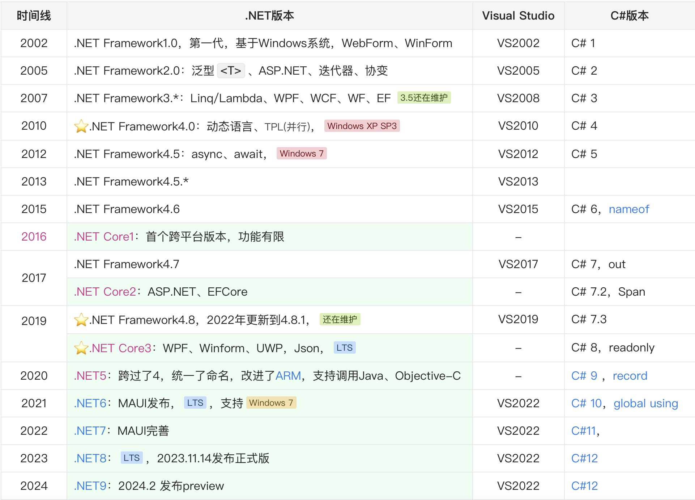
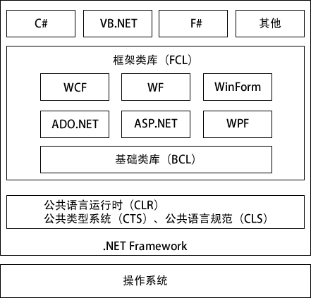
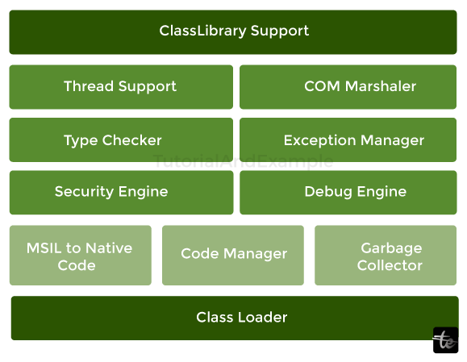
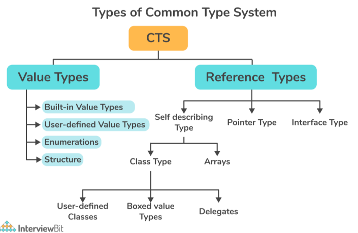
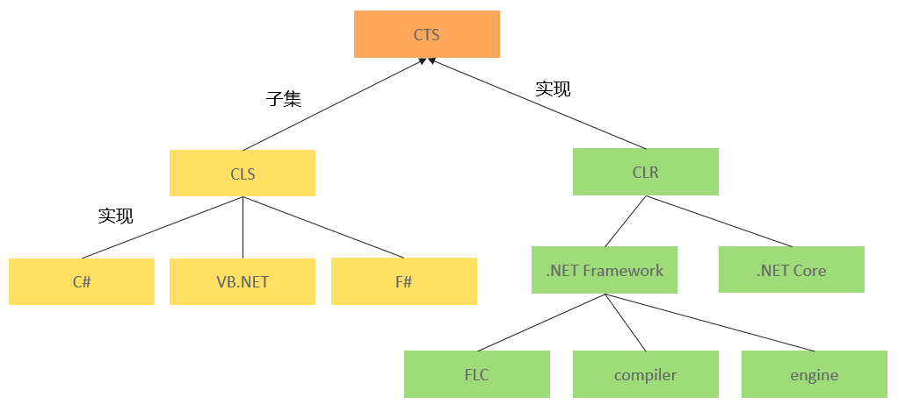
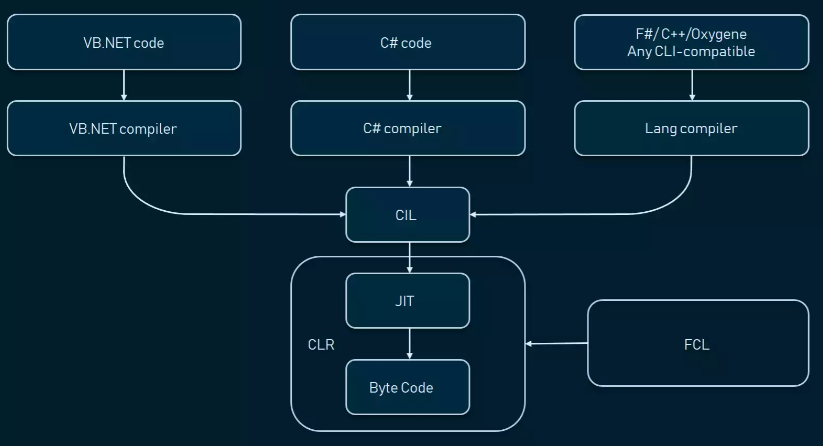
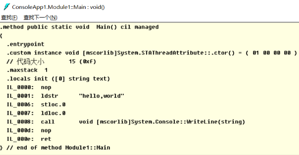
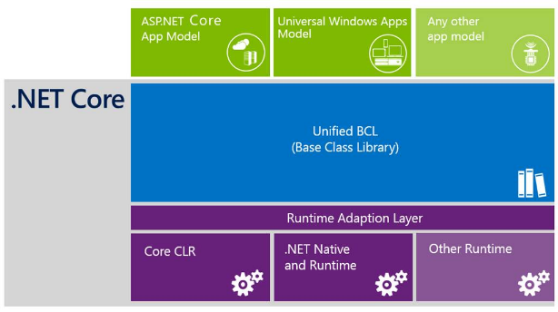
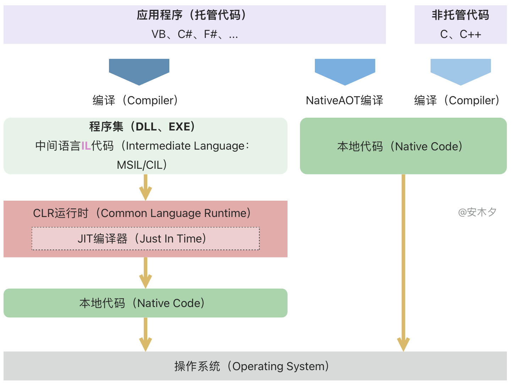

# 概述
C#（读作 "C-Sharp"）是由微软开发的一种现代化、通用、面向对象的编程语言。它是在 2000 年作为 [.NET](#net)平台的一部分发布的，最初的设计是为了与 Java 和 C++ 竞争，并为开发人员提供一种易于使用但功能强大的语言。C# 继承了很多 C、C++ 和 Java 的特性，但也引入了许多改进和创新，旨在提高开发效率、安全性和可维护性。

## .NET
.NET 是由 Microsoft 创建的开发平台，平台包含了语言规范、工具、运行，支持开发各种应用，如Web、移动、桌面等。.NET框架有多个实现，如.NET Framework、.NET Core（及后续的.NET 5+版本），以及社区版本Mono。

### .NET发展历史: Framework ⇒ Core
简单梳理一下.NET框架的发展：

[详细参考](https://time.graphics/embed?v=1&id=593132)

### .NET Framework框架
.NET Framework 是运行在 Windows 系列操作系统上的一个系统应用程序。它是 .NET 的核心部分，提供了建立和运行 .NET 应用程序所需要的编辑、 编译等核心服务。它包括2个重要组成部分：公共语言运行时 (Common Language Runtime，CLR) 和 .NET Framework 类库（Framework Class Library，FCL）。

::: tip 对于Framework：

1. .NET Framework设计之初就是基于Windows系统的，其API与Windows底层接口紧密关联，所以DotNET应用也只能运行在Windows系统上了。同时，.NET Framework也作为Windows操作系统的组件内置在操作系统中。

2. 同一台电脑上可以同时安装多个版本的 .NET Framework 版本。

3. .NET Framework = 运行时CLR + 类库FCL。
:::

#### 运行时（CLR）
公共语言运行时 (Common Language Runtime，CLR)， CLR 本质上就是.NET 虚拟机（类似Java的虚拟机JVM），算是.NET的引擎，用来执行托管.NET代码，确切的说是编译后的IL代码。提供管理内存、线程执行、代码执行、代码安全验证、异常处理、编译、垃圾回收等运行时服务。

其中：
1. 类加载器（Class Loader）：加载程序集的类（包括方法）、元数据，及其他程序所需组件。
2. 即时编译器JIT（Just-In-Time，简称JIT ）：负责将中间代码MSIL翻译成本机执行代码（MSIL to Native Code）。
3. 代码管理器（Code Manager）：管理代码的执行。
4. 垃圾回收器GC（Garbage Collector）：负责整个.NET运行时托管代码的内存分配与释放任务，它通过一定的优化算法选择收集对象和时间，并进行自动的垃圾收集。
5. 安全引擎（Security Engine）：提供基于认证的安全机制，如用户身份。
6. 调试引擎（Debug Engine）：使开发者能调试和跟踪应用程序代码。
7. 类型检查器（Type Checker）：检查并禁止非安全的类型转换以及未初始化的变量的使用。
8. 异常管理器（Exception Manager）：提供结构化的异常处理，与Windows结构化异常处理机制（SHE）集成，改进了错误报告。
9. 线程支持（Thread Support）：提供了多线程编程的类和接口

#### CTS（通用类型系统）
.NET CLR是支持多种语言的，如C#、F#、VB等，这些语言编译后都可以在CLR上执行，还支持不同语言的互操作，比如在C#类继承一个VB写的类，在C#中调用F#写的一个方法等。

实现这种不同语言之间交互的基础就是这些语言都遵循统一的规范和要求 —— CTS（通用类型系统），CTS定义了一套通用的数据类型系统，包括值类型、引用类型的结构。比如C#中int、VB中的Interger都是整形，对应CTS中的Int32。

1. CTS 提供了2种类型：引用类型、值类型。
2. CTS 规范规定，一个类型可以包含零个或多个成员。这些成员包括：字段(Field)、属性(Property)、方法(Method)、事件(Event)。
3. CTS 指定了类型可见性规则以及类型成员的访问规则，private、public 等。
4. CTS 还为类型继承、虚方法、对象生存期等定义了相应的规则。
5. CTS 规定：所有类型最终必须从预定义的 System.Object 类型继承，这里包括值类型也是从Object继承而来的。

#### CLS（通用语言规范）
CLS是CTS的子集，规定了语言编译器必须遵循的一组规则，以便创建在 CLR 中运行的 .NET 应用程序。可以把CTS看做是规范，CLR是对CTS的具体实现。

#### .NET Framework 类库（FCL/BCL）
类库（Framework Class Library，FCL）就是.NET Framework内置的各种组件服务，如ASP.NET、MVC、WCF和WPF等组件，满足不同编程应用场景的需求。

基础类库BCL（Base Class Library）是FCL的一个子集，顾名思义就是一些比较基础、通用的类库，如基本数据类型、集合、线程、安全、字符串操作、网络操作、IO、XML操作等等，大多都包含在System命名空间下，如System.Text、System.IO。其他一些常用的名词，如核心 .NET 库、框架库、运行时库、共享框架，大多都指的是BCL。

#### 语言&运行机制
.NET是为了支持多种语言而设计的，如Microsoft自己发布的VB.NET、Managed C++、C#、J#和JScript.NET，还有其他厂商开发的语言，如Cobol、Smalltalk、Perl和 Eiffel等几十种编程语言。

无论使用哪种语言来编写源代码，都会通过编译器编译成中间代码MSIL（Microsoft Intermediate Language）。语言的集成性主要是公共语言规范（CLS）和通用类型系统（CTS）一起确保了语言的相互操作性。CLS是一个最低标准集，所有面向.NET的编译器都必须支持它，每个语言都符合这个规范，从而满足了语言的互相调用和互操作。

每种语言都有自己的编译器，将源代码编译成中间语言（MSIL，或IL），然后在CLR上运行，主要分为两个阶段：

1. 编译阶段：由MSBuild把源代码编译为中间语言IL代码，编译后就是EXE、DLL格式的文件。
2. 运行阶段：CLR把中间语言CIL代码编译为平台专用的机器代码，最终在CPU上运行的就是机器码（汇编代码）。

::: tip Microsoft中间语言
Microsoft中间语言（MSIL），也称为通用中间语言（CIL/IL：Common Intermediate Language），是一组与平台无关的指令，在CLR中运行时由JIT按需编译为机器码执行。
:::

下图为一个打印hello world的IL代码，通过内置工具ildasm可以查看。

### .NET Core 框架
.NET Core是一个免费、跨平台、开源的开发平台，用于一站式构建不同类型的应用程序。.NET Core 是以.NET Framework 为基础，但是经过重新设计、实现的的新一代框架，实现了原.NET Framework 中的几乎所有功能，核心特点就是开源、跨平台。

#### 运行时.NET Runtime
运行时.NET Runtime 有两种，CoreCLR，功能和.NET Framework的CLR差不多；.NET Native RunTime（CoreRT/NativeAOT）是直接将C#代码编译为机器码的运行时，还只是一个实验性的运行时。

Core CLR 是一个跨平台的运行时，移植了 .NET Framework 的 CLR 的功能，包含核心程序库 mscorlib、JIT 编译器、垃圾收集器 (GC) 以及其他运行 MSIL 所需要的运行期环境。

#### BCL/CoreFX
类库，即 Base Classlibrary 基础类，包含 File、System、Console、XML、ADO.NET、日期时间等类库。Core FX就是.NET Core的BCL。

#### App Model
一站式构建 Web、桌面和移动等应用的模型

#### 编译
通常情况下，我们写的C#代码被编译为中间代码IL，在运行期间由CLR的JIT编译器编译为机器码执行。这样势必造成运行的一些延迟，如果知道目标平台，则可以为该目标平台提前编译为机器码，这就是所谓的提前编译（AOT），它的优点是启动时间更快。

1. JIT（Just In Time Compiler，即时编译），顾名思义，在需要（运行代码）的时候才会被编译为机器码。当然编译好后会被缓存，以便于后续执行，这也是为什么.NET程序预热后执行更快的原因，不过程序关闭就没了。
2. AOT编译（Ahead of Time Compilation，预先编译或静态编译），在构建（发布）时将高级语言编译为本地机器码，让程序更快的启动、运行。可以将.NET Core程序编译成原生（机器）代码，不依赖 .NET 运行时而运行在宿主机器上。

::: tip 托管代码和非托管代码
托管代码（Managed Code）是指在受管理环境中运行的代码，通常指的是.NET语言（C#、VB）开发的代码，在CLR运行时环境中运行。由CLR来负责内存管理、垃圾回收、类型安全性和异常处理等任务，所以我们写（C#）托管代码时，就可以随意申明变量、创建对象，而不用去管内存的分配、管理和回收，使得代码更容易编写、维护和调试。

相对而言，非托管代码（Unmanaged Code）就是没有专门的执行管理环境，通常使用低级编程语言（如C、C++）编写，开发人员需要手动处理内存管理、异常和资源释放等问题。

::: danger 注意
在实际的C#的开发中，我们也会经常用到非托管资源，如IO、文件流操作，就需要注意要手动释放（非托管）资源，避免内存溢出。
:::

::: tip .NET Standard
.NET Standard 是针对多个.NET框架 实现推出的一套正式的 .NET API 规范，目的是在多个.NET 框架间共享代码，如在.NET Framework 、 .NET、Mono间共享代码，提高 .NET 生态系统中的一致性。

.NET Standard 是一组标准化的 API规范，“.NET Standard Library”指的也是这个API标准库，注意只是一组规范，具体实现就是 .NET Framework、NET Core 和 Mono
:::

## Ecma 标准
ECMA（European Computer Manufacturers Association，欧洲计算机制造商协会）是一个国际性的标准化组织，致力于制定和推广信息和通信技术的标准。

.NET体系中的C#语言、公共语言基础（CLI）也是有标准规范的，

详情参考 [Ecma 标准](https://learn.microsoft.com/zh-cn/dotnet/fundamentals/standards)。

::: tip CLI
CLI（Common Language Infrastructure）公共语言基础结构：是一系列规范标准的总称，包括CTS、CLS、CIL、元数据、执行系统等多种规范，.NET、Mono就是他的实现，由国际标准组织ECMA维护。
:::

## 参考文档
1. [C# 指南](https://learn.microsoft.com/zh-cn/dotnet/csharp/)

2. [C#.NET体系图文概述](https://www.yuque.com/kanding/ktech/csharp.net)
