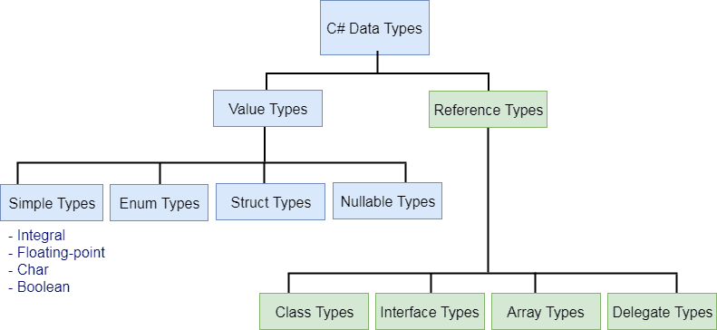
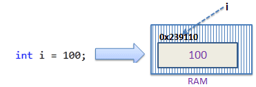
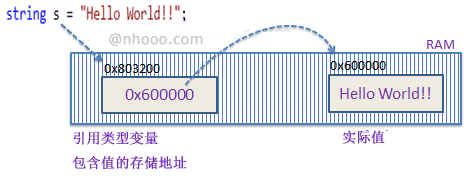

# 类型系统
C#主要将数据类型分为两种：值类型和引用类型。值类型包括简单类型（例如int，float，bool和char），枚举类型，结构类型和Nullable值类型。引用类型包括类类型，接口类型，委托类型和数组类型。


## 值类型
::: tip 什么是值类型？
在C#中，值类型（Value Type）是一种在栈（stack）中直接存储数据的类型，而不是存储对数据的引用。

值类型派生自System.ValueType（派生自 System.Object）

值类型分为两类：struct和enum。

对于值类型，每个变量都具有其自己的数据副本，对一个变量执行的操作不会影响另一个变量（in、ref 和 out 参数变量除外。


:::

::: tip 值类型的特点？
1.直接存储数据：值类型变量直接在栈（stack）内存中分配空间，存储实际的值。

2.内存分配在栈上：值类型通常在栈上分配内存，栈上的内存分配和回收非常高效。

3.自动复制：当你将一个值类型变量赋值给另一个变量时，值会被复制，这意味着两个变量互不影响。

4.没有垃圾回收：栈上的内存不需要垃圾回收，因为它会在方法或作用域结束时自动释放。
:::

::: tip 值类型可以被继承吗？
值类型不能被继承，因为所有值类型最终会编译成终结类(sealed)，但结构体可以实现接口（枚举不可以实现接口）。
:::

### 内置值类型
::: tip 内置值类型有哪些？
| 关键字   | .NET 类型         | 空间   | 数值范围                                      | 默认值  |
| -------- | ----------------- | ---------- | --------------------------------------------- | ------- |
| `bool`   | `System.Boolean`  | 1字节       | `true` 或 `false`                            | `false` |
| `byte`   | `System.Byte`     | 1字节       | 0 到 255                                     | `0`     |
| `sbyte`  | `System.SByte`    | 1字节       | -128 到 127                                  | `0`     |
| `char`   | `System.Char`     | 2字节       | U+0000 到 U+FFFF                              | `'\0'`  |
| `short`  | `System.Int16`    | 2字节       | -32,768 到 32,767                            | `0`     |
| `ushort` | `System.UInt16`   | 2字节       | 0 到 65,535                                  | `0`     |
| `int`    | `System.Int32`    | 4字节       | -2,147,483,648 到 2,147,483,647              | `0`     |
| `uint`   | `System.UInt32`   | 4字节       | 0 到 4,294,967,295                           | `0`     |
| `long`   | `System.Int64`    | 8字节       | -9,223,372,036,854,775,808 到 9,223,372,036,854,775,807 | `0L`    |
| `ulong`  | `System.UInt64`   | 8字节       | 0 到 18,446,744,073,709,551,615              | `0`     |
| `float`  | `System.Single`   | 4字节       | ±1.5 x 10^-45 到 ±3.4 x 10^38                | `0.0f`  |
| `double` | `System.Double`   | 8字节       | ±5.0 x 10^-324 到 ±1.7 x 10^308              | `0.0d`  |
| `decimal`| `System.Decimal`  | 16字节      | ±1.0 x 10^-28 到 ±7.9228 x 10^28             | `0.0m`  |

::: danger 注意
Java 中的byte 对应c#中的sbyte。

Java 中没有ushort。

存在浮点运算时尽量使用decimal避免精度丢失。
:::

::: tip 什么是装箱和取消装箱？
装箱是将值类型转换为 object 类型或由此值类型实现的任何接口类型的过程。

装箱：


取消装箱：

:::

::: tip 什么时候会发生装箱和取消装箱？举个例子？如何避免？
需要将值类型存储在非泛型集合（如ArrayList或Hashtable）中时，由于这些集合只能处理object类型的元素，值类型必须进行装箱。

```C#
ArrayList list = new ArrayList();
list.Add(42); // 装箱操作
int i = (int)list[0]; // 取消装箱操作
```

装箱和取消装箱涉及内存分配（堆上）和类型转换，频繁的装箱和取消装箱操作会导致性能下降，尤其是在大量数据处理或循环中。
尽可能使用泛型避免装箱和取消装箱的开销。
:::

::: tip 介绍一下c#中的数值转换
C# 提供了一组整型和浮点数值类型。 任何两种数值类型之间都可以进行隐式或显式转换。 必须使用强制转换表达式来执行显式转换。

隐式转换是指在不需要显式指定的情况下，C#自动将一个类型转换为另一种兼容类型。通常是较小范围类型转换为较大范围类型。

```C#
int i = 123;
double d = i; // 隐式转换，从int转换为double
```

常见的隐式转换：

int 转换为 long, float, double, decimal

float 转换为 double

char 转换为 int, uint, long, ulong, float, double, decimal


显式转换用于当类型不兼容或可能丢失数据时，需要开发者明确地进行转换。这种转换需要使用强制转换运算符(type)。

```C#
double d = 123.45;
int i = (int)d; // 显式转换，从double转换为int，数据可能丢失
```
详情参考 [内置数值转换](https://learn.microsoft.com/zh-cn/dotnet/csharp/language-reference/builtin-types/numeric-conversions)。

::: danger 使用 Convert/Parse
C#提供了Convert类，该类包含了各种静态方法，可以在不同类型之间进行转换。Convert类比显式转换更安全，因为它还会处理一些特殊情况，例如null值。
```C#
string str = "123";
int i = Convert.ToInt32(str); // 将字符串转换为整数

double d = 123.45;
int j = Convert.ToInt32(d); // 将double转换为int
```

Parse和TryParse方法主要用于将字符串转换为数值类型。Parse方法在转换失败时会抛出异常，而TryParse方法则返回一个布尔值，指示转换是否成功。
```C#
string str = "123";
int i = int.Parse(str); // 将字符串转换为int

bool success = int.TryParse(str, out int result); // 使用TryParse方法
```
:::

::: tip 后缀及科学计数法
使用带有文字的 f 或 F 后缀使其成为浮点型。
```C#
float f1 = 123456.5F;
```

使用带文字的 d 或 D 后缀使其成为双精度型。
```C#
double d1 = 12345678912345.5d;
```

使用带有文字的 m 或 M 后缀使其成为 decimal 类型。
```C#
decimal d1 = 123456789123456789123456789.5m;
```

使用 e 或E 表示10的幂，作为科学记数法的指数部分，使用浮点数、双精度数或小数。
```C#
double d = 0.12e2;
Console.WriteLine(d);  // 12;

float f = 123.45e-2f;
Console.WriteLine(f);  // 1.2345

decimal m = 1.2e6m;
Console.WriteLine(m);// 1200000
```
:::

### struct
::: tip 什么时候需要用struct？
在C#中，struct通常用于表示轻量级的值类型，当你需要定义一个简单的数据结构来存储一组相关的数据时，考虑使用struct。

在 .NET 中，所有基元数据类型（Boolean、Byte、Char、DateTime、Decimal、Double、Int16、Int32、Int64、SByte、Single、UInt16、UInt32 和 UInt64）都定义为结构。

它性能好，赋值时会进行值拷贝，避免装箱和拆箱。

但是当结构体较大、需要继承和多态时不建议使用struct。
:::

::: tip struct和class的区别是什么？
struct是值类型，在栈（stack）中直接存储数据。

class是引用类型，在堆（heap）上存储数据，变量存储的是对象的引用（指针）。当一个对象被赋值给另一个变量时，两个变量都指向同一个对象。
:::

::: tip ref struct
ref struct用于定义只能在栈上分配的结构体类型，适合需要高效内存管理的场景。

典型应用：Span\<T>

Span\<T>是一个非常常见的ref struct，用于表示内存中连续的一块区域。Span\<T>允许高效地操作数组、字符串和其他内存块，而无需进行大量的内存复制或分配。
```C#
public void ProcessSpan(Span<int> span)
{
    for (int i = 0; i < span.Length; i++)
    {
        span[i] *= 2;
    }
}
int[] array = { 1, 2, 3, 4 };
ProcessSpan(array);  // Span<T>可以直接操作数组
Console.WriteLine(string.Join(", ", array));  // 输出: 2, 4, 6, 8
```
:::

### 枚举
::: tip 介绍一下枚举
枚举类型 是由基础整型数值类型的一组命名常量定义的值类型。 

枚举类型具有一个名称、一个必须为某个内置带符号或不带符号的整数类型的基础类型（如 Byte、Int32 或 UInt64）以及一组字段。 

默认情况下，枚举成员的关联常数值为类型 int；它们从零开始，并按定义文本顺序递增 1。 可以显式指定任何其他整数数值类型作为枚举类型的基础类型。 还可以显式指定关联的常数值。

对于枚举还有以下附加限制：

它们不能定义自己的方法。

它们不能实现接口。

它们不能定义属性或事件。

枚举不能是泛型，除非它嵌套在泛型类型中，才能是泛型。 也就是说，枚举不能有自己的类型参数。
```C#
enum ErrorCode : ushort
{
    None = 0,
    Unknown = 1,
    ConnectionLost = 100,
    OutlierReading = 200
}
```

::: danger 注意
Java中枚举可以定义方法、实现接口，但C#中不可以（但c#可以通过扩展方法实现类似的功能）。
:::

::: tip 枚举使用[Flags]属性
枚举用[Flags]属性修饰后，枚举的值可以通过按位或运算符 | 来组合，从而表示多个选项的组合

例子
```C#
[Flags]
enum DaysOfWeek
{
    None = 0,
    Monday = 1,
    Tuesday = 2,
    Wednesday = 4,
    Thursday = 8,
    Friday = 16,
    Saturday = 32,
    Sunday = 64
}
```

有了[Flags]属性，您可以轻松组合多个枚举值：
```C#
DaysOfWeek weekend = DaysOfWeek.Saturday | DaysOfWeek.Sunday;
Console.WriteLine(weekend); // 输出：Saturday, Sunday
```

通过按位与运算符 &，可以检查某个枚举变量是否包含某个特定的标志
```C#
bool isWeekend = (weekend & DaysOfWeek.Saturday) == DaysOfWeek.Saturday;
Console.WriteLine(isWeekend); // 输出：True
```
:::

::: tip 使用枚举实现单例模式
```C#
// 定义枚举类型
public enum Singleton
{
    Instance
}
// 定义扩展方法
public static class SingletonExtensions
{
    public static void DoSomething(this Singleton singleton)
    {
        Console.WriteLine("Doing something...");
    }
}
class Program
{
    static void Main(string[] args)
    {
        Singleton singleton = Singleton.Instance;
        singleton.DoSomething();  // 输出: Doing something...
    }
}
```
使用枚举来实现单例模式有以下几个优点：

线程安全：枚举在初始化时是线程安全的，不需要额外的锁（lock）机制。

序列化安全：使用枚举实现的单例模式天生就是序列化安全的，不需要实现ISerializable接口或防止反序列化生成新的实例。

防止反射攻击：枚举类型在反射攻击时会自动防止创建新的实例。
:::

### 元祖
::: tip 什么时候需要用元祖？
使用元组的场景主要集中在临时需要组合多个数据项，但不需要创建完整的类或结构体的情况。

返回多个值
```C#
public (int Sum, int Product) Calculate(int a, int b)
{
    int sum = a + b;
    int product = a * b;
    return (sum, product);
}
// 调用方法
var result = Calculate(3, 4);
Console.WriteLine($"Sum: {result.Sum}, Product: {result.Product}");
```

使用多个值的组合（元组字段名称）
```C#
var point = (X: 10, Y: 20);
Console.WriteLine($"Point X: {point.X}, Y: {point.Y}");
```

简化LINQ查询
```C#
var people = new[]
{
    new { Name = "Alice", Age = 30 },
    new { Name = "Bob", Age = 25 }
};
var results = people.Select(p => (p.Name, IsAdult: p.Age >= 18)).ToList();
foreach (var result in results)
{
    Console.WriteLine($"{result.Name} is an adult: {result.IsAdult}");
}
```

简化方法签名
```C#
public void DisplayPerson((string FirstName, string LastName, int Age) person)
{
    Console.WriteLine($"{person.FirstName} {person.LastName}, Age: {person.Age}");
}
DisplayPerson(("John", "Doe", 28));
```
:::

::: tip 元组相等
元组类型支持 == 和 != 运算符。 这些运算符按照元组元素的顺序将左侧操作数的成员与相应的右侧操作数的成员进行比较。
```C#
(int a, byte b) left = (5, 10);
(long a, int b) right = (5, 10);
Console.WriteLine(left == right);  // output: True
Console.WriteLine(left != right);  // output: False

var t1 = (A: 5, B: 10);
var t2 = (B: 5, A: 10);
Console.WriteLine(t1 == t2);  // output: True
Console.WriteLine(t1 != t2);  // output: False
```
:::

::: tip 元组作为 out 参数
在某些情况下，out 参数可以是元组类型
```C#
var limitsLookup = new Dictionary<int, (int Min, int Max)>()
{
    [2] = (4, 10),
    [4] = (10, 20),
    [6] = (0, 23)
};
if (limitsLookup.TryGetValue(4, out (int Min, int Max) limits))
{
    Console.WriteLine($"Found limits: min is {limits.Min}, max is {limits.Max}");
}
// Output:
// Found limits: min is 10, max is 20
```
:::

## 引用类型
::: tip 什么是引用类型？
在C#中，引用类型（Reference types）是一种在在堆（heap）上存储数据的类型，变量存储的是对象的引用（指针）。



因此，对一个变量执行的操作会影响另一个变量所引用的对象。

下列关键字用于声明引用类型：
    class，
    interface，
    delegate，
    record，

C# 也提供了下列内置引用类型：
    dynamic，
    object，
    string
:::

### 内置引用类型
::: tip object
object 类型是 System.Object 在 .NET 中的别名。 

在 C# 的统一类型系统中，所有类型都是直接或间接从 System.Object 继承的。 

可以将任何类型的值赋给 object 类型的变量。[装箱和取消装箱](#内置值类型)
:::

::: tip string
string 类型表示零个或多个 Unicode 字符的序列。 string 是 System.String 在 .NET 中的别名。

尽管 string 为引用类型，但是定义相等运算符 == 和 != 是为了比较 string 对象（而不是引用）的值。

字符串是不可变的，即：字符串对象在创建后，其内容不可更改。

例如，编写此代码时，编译器实际上会创建一个新的字符串对象来保存新的字符序列，且该新对象将赋给 b。 已为 b 分配的内存（当它包含字符串“h”时）可用于垃圾回收。
```C#
string b = "h";
b += "ello";
```
:::

::: tip string 常用方法
1.字符串连接
```C#
var firstName = "Seven";
var lastName = "Chen";
//string.Concat
string fullName1 = string.Concat(firstName, " ", lastName)
string[] names = { firstName, lastName };
//string.Join
string fullName2 = string.Join(" ", names);
//插值语法
string fullName3 = $"{firstName} {lastName}";
//格式化
string fullName4 = string.Format("{0} {1}", firstName, lastName);
```

2.字符串拆分
```C#
string fullName = "Seven Chen";
string[] words = sentence.Split(' '); // 拆分字符串
```

3.字符串替换
```C#
string fullName = "Seven Chen";
string modified = fullName.Replace("Seven", "Eleven");
```

4.字符串比较
```C#
string fullName1 = "Seven Chen";
string fullName2 = "seven chen";
bool areEqual = string.Equals(fullName1, fullName2, StringComparison.OrdinalIgnoreCase);
```
StringComparison 枚举参考[StringComparison](https://learn.microsoft.com/zh-cn/dotnet/api/system.stringcomparison?view=net-8.0
)

5.字符串裁剪和修剪
```C#
string padded = "   text   ";
// 去掉字符串前后的空白字符
string trimmed = padded.Trim(); 
// 获取子字符串（从第0位开始4个）
string substring = trimmed.Substring(0, 4); 
```

6.查找
```C#
string text = "Hello, World!";
// 检查字符串是否包含"World"
bool contains = text.Contains("World"); 
// 查找"World"在字符串中的位置，没有返回-1
int index = text.IndexOf("World"); 
//是否以“Hello”开始
bool startFlag = text.StartsWith("Hello"); 
//是否以“World”结束
bool endFlag = text.EndsWith("World"); 
```

7.字符串的转换
```C#
string text = "Hello, World!";
// 转小写
string lower = text.ToLower();
// 转大写
string upper = text.ToUpper();
```

8.多行文本

从C# 11开始，可以使用三重引号（"""）来表示多行字符串
```C#
var str =
 """
 This is a multi-line
     string literal with the second line indented.
 """;
Console.WriteLine(str);
```
:::

::: tip StringBuilder
StringBuilder 是可变的，可以在不创建新对象的情况下修改其内容。

它内部维护一个字符数组，允许在该数组上进行就地修改，减少了内存分配和复制的开销。

StringBuilder 不是线程安全的。如果在多线程环境下使用，可能需要额外的同步机制来保证线程安全。

适合于需要进行大量字符串拼接、修改、或字符串内容的动态构建的场景。例如，生成复杂的文本报告或动态构建查询字符串。

```C#
StringBuilder sb = new StringBuilder("Hello");
sb.Append(" World"); // 直接修改内部字符数组
```

::: danger 注意
c# 中没有StringBuffer，线程安全需要使用string
:::

::: tip 特殊字符
特殊字符之前将转义字符\（反斜杠）包括在字符串中。

```C#
//转义符 \
string text = "This is a \"string\" in C#.";
string str = "xyzdef\\rabc";
string path = "\\\\mypc\\ shared\\project";

//转义序列
string str = @"xyzdef\rabc";
string path = @"\\mypc\shared\project";
string email = @"[email protected]";

//多行字符串
string str = @"this is a \
multi line \
string";
```

::: danger 注意
c# 中没有StringBuffer，线程安全需要使用string
:::

::: tip dynamic（动态类型）
dynamic 类型表示变量的使用和对其成员的引用绕过编译时类型检查。 改为在运行时解析这些操作。 

dynamic 类型只在编译时存在，在运行时则不存在。

```C#
dynamic dyn = 1;
object obj = 1;

System.Console.WriteLine(dyn.GetType());//System.Int32
System.Console.WriteLine(obj.GetType());//System.Int32

dyn = dyn + 3; //正常
obj = obj + 3; //编译错误
```
:::

### class
参考[类](#类)。

### interface
参考[接口](#接口)。

### delegate
参考[委托与事件](#委托与事件)。

### record
::: danger record
从 C# 10 开始，可定义记录结构类型。 记录类型提供用于封装数据的内置功能。
record的引入使得在C#中定义数据传输对象（DTO）和不可变类型变得更加简单和直观。

可简单理解为：

record struct：不可变值类型
```C#
public readonly record struct Point(int X, int Y);
var point1 = new Point(3, 4);
var point2 = new Point(3, 4);
Console.WriteLine(point1);  // 输出: Point { X = 3, Y = 4 }
// 值比较
Console.WriteLine(point1 == point2);  // 输出: True
point1.X = 5;  // 编译错误：无法为只读属性赋值
```

record class：不可变引用类型，但可以比较值而非引用
```C#
public record Point(int X, int Y);
var point1 = new Point(3, 4);
var point2 = new Point(3, 4);
Console.WriteLine(point1);  // 输出: Point { X = 3, Y = 4 }
// 值比较
Console.WriteLine(point1 == point2);  // 输出: True
point1.X = 5;  // 编译错误：无法为只读属性赋值
```

详情参考[record](https://learn.microsoft.com/zh-cn/dotnet/csharp/language-reference/builtin-types/record)。
:::

## 匿名类型
::: tip 匿名类型
值类型不能被继承。

匿名类型提供了一种方便的方法，可用来将一组只读属性封装到单个对象中，而无需首先显式定义一个类型。 类型名由编译器生成，并且不能在源代码级使用。 每个属性的类型由编译器推断。

可结合使用 new 运算符和对象初始值设定项创建匿名类型。常用语查询表达式的 select 子句中。

匿名类型确实会重写 ToString 方法，将用大括号括起来的每个属性的名称和 ToString 输出连接起来。

```C#
var v = new { Title = "Hello", Age = 24 };
Console.WriteLine(v.ToString()); // "{ Title = Hello, Age = 24 }"
```
:::

## 日期和时间
::: tip 日期和时间常用操作
```C#
//创建DateTime对象
DateTime dt = new DateTime(); // 分配默认值 01/01/0001 00:00:00

//设置日期和时间
//分配默认值01/01/0001 00:00:00
DateTime dt1 = new DateTime(); 

//分配年，月，日
DateTime dt2 = new DateTime(2015, 12, 31); 

//分配年，月，日, hour, min, seconds
DateTime dt3 = new DateTime(2015, 12, 31, 5, 10, 20);
 
//分配年，月，日, hour, min, seconds, UTC timezone
DateTime dt4 = new DateTime(2015, 12, 31, 5, 10, 20, DateTimeKind.Utc);

//Ticks
DateTime dt = new DateTime(636370000000000000);

//DateTime 静态字段
DateTime currentDateTime = DateTime.Now;  //返回当前日期和时间
DateTime todaysDate = DateTime.Today; // 返回今天的日期
DateTime currentDateTimeUTC = DateTime.UtcNow;// 返回当前UTC日期和时间

DateTime maxDateTimeValue = DateTime.MaxValue; // 返回DateTime的最大值
DateTime minDateTimeValue = DateTime.MinValue; // 返回DateTime的最小值

//时间跨度(TimeSpan)
DateTime dt = new DateTime(2015, 12, 31);
TimeSpan ts = new TimeSpan(25,20,55);
DateTime newDate = dt.Add(ts);
Console.WriteLine(newDate);//1/1/2016 1:20:55 AM

DateTime dt1 = new DateTime(2015, 12, 31); 
DateTime dt2 = new DateTime(2016, 2, 2);
TimeSpan result = dt2.Subtract(dt1);//33.00:00:00

//运算符
DateTime dt1 = new DateTime(2015, 12, 20);
DateTime dt2 = new DateTime(2016, 12, 31, 5, 10, 20); 
TimeSpan time = new TimeSpan(10, 5, 25, 50);

Console.WriteLine(dt2 + time); // 1/10/2017上午10:36:10
Console.WriteLine(dt2 - dt1); //377.05:10:20
Console.WriteLine(dt1 == dt2); //False
Console.WriteLine(dt1 != dt2); //True
Console.WriteLine(dt1 > dt2); //False
Console.WriteLine(dt1 < dt2); //True
Console.WriteLine(dt1 >= dt2); //False
Console.WriteLine(dt1 <= dt2);//True

//将 DateTime 转换为 String
var dt = DateTime.Now;

Console.WriteLine("Date String Current Culture: " + dt.ToString("d"));
Console.WriteLine("MM/dd/yyyy Format: " + dt.ToString("MM/dd/yyyy"));
Console.WriteLine("dddd, dd MMMM yyyy Format: " + dt.ToString("dddd, dd MMMM yyyy"));
Console.WriteLine("MM/dd/yyyy h:mm tt Format: " + dt.ToString("MM/dd/yyyy h:mm tt"));
Console.WriteLine("MMMM dd Format:" + dt.ToString("MMMM dd"));
Console.WriteLine("HH:mm:ss Format: " + dt.ToString("HH:mm:ss"));
Console.WriteLine("hh:mm tt Format: " + dt.ToString("hh:mm tt"));
Console.WriteLine("Short Date String: " + dt.ToShortDateString());
Console.WriteLine("Long Date String: " + dt.ToLongDateString());
Console.WriteLine("Short Time String: " + dt.ToShortTimeString());
Console.WriteLine("Long Time String: " + dt.ToLongTimeString());

//将字符串转换为DateTime
var str = "5/12/2020";
DateTime dt;
var isValidDate = DateTime.TryParse(str, out dt);

if(isValidDate)
    Console.WriteLine(dt);
else
    Console.WriteLine($"{str} is not a valid date string");

```
:::
