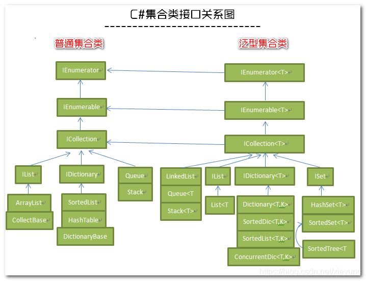

# 集合


推荐使用场景：
| 集合类型                         | 是否顺序排列 | 是否连续存储 | 访问时间复杂度    | 操作时间复杂度           | 直接访问方式 | 使用场景                                                                                     |
|----------------------------------|--------------|--------------|-------------------|--------------------------|--------------|-------------------------------------------------------------------------------------------------|
| `Array`                          | 是           | 是           | O(1)              | 插入/删除: O(n)          | 索引         | 用于已知大小和类型固定的元素集合，性能高，适用于频繁访问和较少修改的场景。                                 |
| `List<T>`                        | 是           | 是           | O(1)              | 插入/删除: O(n)          | 索引         | 动态大小的数组，适用于需要动态调整元素数量的场景，常用于大多数需要顺序访问和偶尔插入/删除的场景。               |
| `SortedList<TKey, TValue>`       | 是           | 是           | O(log n)          | 插入/删除: O(n)          | 键或索引     | 需要按键排序且存储量较小时，适用于需要高效内存使用且偶尔进行查找和修改操作的场景。                               |
| `LinkedList<T>`                  | 是           | 否           | O(n)              | 插入/删除: O(1)          | 不支持索引    | 适用于需要频繁插入/删除操作且不需要随机访问的场景，例如队列或需要保持元素顺序的场景。                        |
| `ImmutableList<T>`               | 是           | 是           | O(1)              | 插入/删除: O(n)          | 索引         | 适用于需要保持集合不变且能安全共享的场景，常用于并发编程或函数式编程。                                     |
| `Dictionary<TKey, TValue>`       | 否           | 否           | O(1)              | 插入/删除: O(1)          | 键           | 用于根据键快速查找值的场景，适用于键值对存储，如映射关系或查找表。                                    |
| `SortedDictionary<TKey, TValue>` | 是           | 否           | O(log n)          | 插入/删除: O(log n)      | 键           | 需要按键排序的键值对集合，适用于需要按顺序存取键值对的场景。                                                 |
| `ConcurrentDictionary<TKey, TValue>` | 否       | 否           | O(1)              | 插入/删除: O(1)          | 键           | 线程安全的键值对集合，适用于多线程环境下需要快速查找和修改键值对的场景。                                      |
| `ImmutableDictionary<TKey, TValue>` | 否        | 否           | O(1)              | 插入/删除: O(log n)      | 键           | 适用于需要不可变且线程安全的键值对集合，常用于并发编程中的共享数据。                                        |
| `HashSet<T>`                     | 否           | 否           | O(1)              | 插入/删除: O(1)          | 不支持索引    | 用于存储不重复元素的集合，适用于需要快速查找和去重操作的场景。                                            |
| `SortedSet<T>`                   | 是           | 否           | O(log n)          | 插入/删除: O(log n)      | 不支持索引    | 适用于需要排序且无重复元素的集合，适合用于需要自然排序且查找、插入效率较高的场景。                          |
| `ConcurrentBag<T>`               | 否           | 否           | O(n)              | 插入: O(1), 删除: O(n)   | 不支持索引    | 线程安全的无序集合，适用于需要在多线程环境中收集和分发元素的场景。                                          |
| `Queue<T>`                       | 是           | 否           | O(n)              | Enqueue: O(1), Dequeue: O(1) | 不支持索引 | 先进先出（FIFO）集合，适用于排队、缓冲、任务调度等场景。                                         |
| `Stack<T>`                       | 是           | 否           | O(n)              | Push: O(1), Pop: O(1)    | 不支持索引    | 后进先出（LIFO）集合，适用于需要后进先出的场景，如撤销操作、表达式求值等。                                   |

## Array（数组）
::: tip 数组的特点
数组的本质是一种引用类型的数据结构，它可以存储一组相同类型的元素，并在内存中以连续的方式分配空间。这些元素可以通过索引来访问，其中索引是基于零的。

数组具有以下属性：

1.数组可以是一维、多维或交错的。

2.声明数组变量时设置维度数。 创建数组实例时，将建立每个维度的长度。 这些值在实例的生存期内无法更改。

3.交错数组是数组数组，每个成员数组的默认值为null。

4.数组从零开始编制索引：包含 n 元素的数组从 0 索引到 n-1。

5.数组元素可以是任何类型，其中包括数组类型。

6.数组类型是从抽象的基类型 Array 派生的引用类型。 所有数组都会实现IList和IEnumerable。 可以使用 foreach 语句循环访问数组。 单维数组还实现了 IList\<T> 和 IEnumerable\<T>。
:::

### 一维数组
::: tip 一维数组的创建
1.指定长度的数组创建
```C#
// 创建一个长度为5的int数组，默认值为0
int[] numbers = new int[5]; 
```

2.直接初始化数组
```C#
// 创建并初始化数组
int[] numbers = new int[] { 1, 2, 3, 4, 5 }; 
// 简化的初始化方法
int[] numbers = { 1, 2, 3, 4, 5 };
```

3.使用Array.CreateInstance方法
在运行时动态创建数组，特别是在不知道数组类型或维数的情况下
```C#
// 创建一个长度为5的int类型数组
Array dynamicArray = Array.CreateInstance(typeof(int), 5); 
// 设置第一个元素的值
dynamicArray.SetValue(42, 0);
// 获取第一个元素的值
int value = (int)dynamicArray.GetValue(0); 
```
:::

::: tip 一维数组的遍历
```C#
int[] numbers = { 1, 2, 3, 4, 5 };
// 使用for循环遍历
for (int i = 0; i < numbers.Length; i++)
{
    Console.WriteLine(numbers[i]);
}

// 使用foreach遍历
foreach (int number in numbers)
{
    Console.WriteLine(number);
}
```
[迭代器](#迭代器)
:::

::: tip 常用方法
多数操作可采用[LINQ](#LINQ)，此处不再列出
```C#
//排序
//正序
Array.Sort(numbers);

//反转数组
Array.Reverse(numbers);

//查找元素
int index = Array.IndexOf(numbers, 3); // 查找值为3的元素的索引

//清空数组
Array.Clear();
Array.Clear(numbers, 0, numbers.Length);
```
:::

### 多维数组
::: tip 多维数组的创建
1.指定长度的数组创建
```C#
// 创建一个3x3的二维数组
int[,] matrix = new int[3, 3]; 
// 创建一个3x3x3的二维数组
int[,,] matrix = new int[3, 3, 3];
```

2.直接初始化数组
```C#
// 创建并初始化数组
int[,] matrix = new int[,] 
{ 
    { 1, 2, 3 }, 
    { 4, 5, 6 }, 
    { 7, 8, 9 } 
};

int[,,] matrix = new int[,,]
{
    {
        {1,2,3},
        {1,2,3},
        {1,2,3}
    },
    {
        {1,2,3},
        {1,2,3},
        {1,2,3}
    },
    {
        {1,2,3},
        {1,2,3},
        {1,2,3}
    },
};
// 简化的初始化方法
int[,] matrix =
{ 
    { 1, 2, 3 }, 
    { 4, 5, 6 }, 
    { 7, 8, 9 } 
};

int[,,] matrix =
{
    {
        {1,2,3},
        {1,2,3},
        {1,2,3}
    },
    {
        {1,2,3},
        {1,2,3},
        {1,2,3}
    },
    {
        {1,2,3},
        {1,2,3},
        {1,2,3}
    },
};
```

3.使用Array.CreateInstance方法
在运行时动态创建数组，特别是在不知道数组类型或维数的情况下
```C#
// 创建一个长度为5x5x5的int类型数组
Array dynamicArray = Array.CreateInstance(typeof(int), 5, 5, 5); 
// 设置第0, 0, 0个元素的值
dynamicArray.SetValue(42, 0, 0, 0);
// 获取第0, 0, 0个元素的值
int value = (int)dynamicArray.GetValue(0, 0 ,0); 
```

::: danger 注意
多维数组的长度(matrix.Length)为：X x Y x Z!!
:::

::: tip 多维数组的遍历
```C#
int[,,] matrix = new int[,,]
{
    {
        {1,2,3},
        {1,2,3},
        {1,2,3}
    },
    {
        {1,2,3},
        {1,2,3},
        {1,2,3}
    },
    {
        {1,2,3},
        {1,2,3},
        {1,2,3}
    },
};
// 使用for循环遍历
for (int i = 0; i < matrix.GetLength(0); i++)
{
    for (int j = 0; j < matrix.GetLength(1); j++)
   {
       for (int k = 0; k < matrix.GetLength(2); k++)
       {
           Console.WriteLine(matrix[i,j,k]);
       }
    }
}

// 使用foreach遍历
foreach (int number in matrix)
{
    Console.WriteLine(number);
}
```
[迭代器](#迭代器)
:::

::: tip 常用方法
```C#
//排序、反转、查找元素等操作只有一维数组可使用
//清空数组
Array.Clear();
Array.Clear(numbers, 0, numbers.Length);
```
:::

### 交错数组
::: tip 交错数组的创建
1.指定长度的数组创建
```C#
int[][] jaggedArray = new int[3][]; // 创建一个有3个子数组的锯齿数组

// 初始化每个子数组
jaggedArray[0] = new int[2]; // 第一个子数组有2个元素
jaggedArray[1] = new int[3]; // 第二个子数组有3个元素
jaggedArray[2] = new int[4]; // 第三个子数组有4个元素

```

2.直接初始化数组
```C#
// 创建并初始化数组
// 不能简化初始方法
int[][] jaggedArray = new int[][]
{
    new int[] { 1, 2 },
    new int[] { 3, 4, 5 },
    new int[] { 6, 7, 8, 9 }
};
```

3.使用Array.CreateInstance方法
在运行时动态创建数组，特别是在不知道数组类型或维数的情况下
```C#
// 创建一个长度为2x3x4的int类型数组
Array dynamicArray = Array.CreateInstance(typeof(int), 2, 3, 4); 
// 设置第0, 0, 0个元素的值
dynamicArray.SetValue(42, 0, 0, 0);
// 获取第0, 0, 0个元素的值
int value = (int)dynamicArray.GetValue(0, 0 ,0); 
```
:::

::: tip 交错数组的遍历与常用操作
与多维数组一致。

参考[多维数组](#多维数组)
:::

## List(列表)
### List(普通列表)
List 表示可由索引访问的强类型对象列表。

List\<T>是一个通用（泛型）集合类，属于System.Collections.Generic命名空间，
List的大小是动态的，当添加或删除元素时，它会自动调整容量。

::: danger 容量
当使用默认构造函数创建一个空的List对象时，初始容量为0。但当第一次添加元素时，List的容量会扩大到足以容纳4个元素。随后，每次添加元素（Add，AddRange）时，如果当前容量不足，List的容量会翻倍增加，即每次增加的容量是原容量的两倍。
:::

::: tip List的常用操作
```C#
//创建和初始化
// 创建一个空的List
List<int> numbers = new List<int>();
// 使用初始值创建List
List<int> numbers = new List<int> { 1, 2, 3, 4, 5 };
// 指定容量创建List
List<int> numbers = new List<int>(10); // 容量为10的空List

//添加元素
// 添加单个元素
numbers.Add(6);
// 添加多个元素
numbers.AddRange(new int[] { 7, 8, 9 });
// 插入元素到指定位置
numbers.Insert(2, 10); // 在索引2处插入10

// 访问元素
// 通过索引访问元素
int firstNumber = numbers[0]; // 获取第一个元素
// 修改指定索引处的元素
numbers[1] = 20; // 将第二个元素改为20

// 移除元素
// 移除指定元素（第一个匹配项）
numbers.Remove(10);
// 根据索引移除元素
numbers.RemoveAt(2);
// 移除指定范围内的元素
numbers.RemoveRange(0, 2); // 移除前两个元素
// 清空List
numbers.Clear(); // 移除所有元素

//查找元素
// 查找元素的索引
int index = numbers.IndexOf(20); // 查找第一个20的索引
// 查找符合条件的第一个元素
int number = numbers.Find(x => x > 5); // 查找第一个大于5的元素
// 查找所有符合条件的元素
List<int> result = numbers.FindAll(x => x > 5);

//遍历List
// 使用for循环遍历
for (int i = 0; i < numbers.Count; i++)
{
    Console.WriteLine(numbers[i]);
}
// 使用foreach遍历
foreach (int number in numbers)
{
    Console.WriteLine(number);
}

// 排序和反转
// 升序排序
numbers.Sort();
// 降序排序
numbers.Sort((a, b) => b.CompareTo(a));
// 反转List顺序
numbers.Reverse();

// 转换为数组
int[] array = numbers.ToArray();

// 获取子列表
List<int> sublist = numbers.GetRange(0, 3); // 获取从索引0开始的3个元素

// 检查是否包含某个元素
bool containsNumber = numbers.Contains(5); // 检查是否包含5

//跳过指定个数元素
numbers.Skip(0);
//取前几个元素
numbers.Take(1);
```

其他用法未依次列出

多数操作可采用[LINQ](#LINQ)，此处也不再列出
:::

### SortedList(排序列表)
SortedList<TKey, TValue> 是 C# 中一个集合类，它既实现了 IDictionary<TKey, TValue> 接口，也实现了 ICollection<KeyValuePair<TKey, TValue>> 接口。它在键值对中按键排序并提供键和索引两种方式来访问元素。

::: tip SortedList的常用操作
基本类型作为Key
```C#
//创建
var sortedList = new SortedList<int, string>();
// 指定初始容量为10
var sortedList = new SortedList<string, int>(10);  
// 不区分大小写的比较器
var sortedList = new SortedList<string, int>(StringComparer.OrdinalIgnoreCase); 

//添加元素
sortedList.Add(1, "One");
sortedList.Add(3, "Three");
sortedList[2] = "Two"; // 使用索引器添加元素

// 访问元素
string value = sortedList[1]; // 通过键访问
string valueByIndex = sortedList.Values[0]; // 通过索引访问值
int keyByIndex = sortedList.Keys[0]; // 通过索引访问键

if (sortedList.TryGetValue(2, out string value))
{
    Console.WriteLine(value);
}

// 更新元素
sortedList[1] = "Uno"; // 更新键为1的值

// 删除元素
sortedList.Remove(1);    // 删除键为1的元素
sortedList.RemoveAt(0);  // 删除索引为0的元素

//遍历 SortedList
foreach (var kvp in sortedList)
{
    Console.WriteLine($"Key: {kvp.Key}, Value: {kvp.Value}");
}
foreach (var key in sortedList.Keys)
{
    Console.WriteLine($"Key: {key}");
}
foreach (var value in sortedList.Values)
{
    Console.WriteLine($"Value: {value}");
}
```

对象作为Key

IComparer 其他实现方式参考[IComparer](#IComparer)
```C#
//创建
//重写IComparer
var sortedList = new SortedList<Person, string>(Comparer<Person>.Create((x, y) => x.Age.CompareTo(y.Age)));
//添加 Key值不能重复
sortedList.Add(new Person
{
    Age = 1,
    Name = "张1"
}, "张1 value");
sortedList.Add(new Person
{
    Age = 2,
    Name = "张2"
}, "张2 value");
sortedList.Add(new Person
{
    Age = 3,
    Name = "张3"
}, "张3 value");
// 访问元素
// 按Key访问，其他属性不影响最终结果
var key = new Person
{
    Age = 1,
    Name = "张法师打发打发1"
};
var value = sortedList[key];
Console.WriteLine(value);//张1 value
string valueByIndex = sortedList.Values[1]; // 通过索引访问值
Console.WriteLine(valueByIndex);//张2 value
var keyByIndex = sortedList.Keys[0]; // 通过索引访问键
Console.WriteLine(keyByIndex);

//// 更新元素
sortedList[key] = "张1 value updated";

//// 删除元素
sortedList.Remove(key);    // 删除键为1的元素
sortedList.RemoveAt(0);  // 删除索引为0的元素

// 遍历 SortedList
foreach (var kvp in sortedList)
{
    Console.WriteLine($"Key: {kvp.Key}, Value: {kvp.Value}");
}
foreach (var k in sortedList.Keys)
{
    Console.WriteLine($"Key: {k}");
}
foreach (var v in sortedList.Values)
{
    Console.WriteLine($"Value: {v}");
}
```
:::

### LinkedList(链表)
LinkedList\<T> 是 C# 中的一个集合类，用于存储双向链表的数据结构。与 List\<T> 等基于数组的集合不同，LinkedList\<T> 使用节点来存储元素，并且每个节点都有指向前一个节点和后一个节点的引用。这使得它在插入和删除操作方面非常高效，但在随机访问元素时性能较低。

::: tip LinkedList的常用操作
```C#
var linkedList = new LinkedList<string>()
// 添加元素
linkedList.AddLast("A");
linkedList.AddLast("B");
linkedList.AddLast("C")
// 在特定位置添加元素
var node = linkedList.Find("B");
linkedList.AddAfter(node, "D");

// 遍历链表
foreach (var value in linkedList)
{
    Console.WriteLine(value);
}

// 删除元素
linkedList.Remove("B");

// 删除第一个元素
linkedList.RemoveFirst();

// 删除最后一个元素
linkedList.RemoveLast();
```
:::

### ImmutableList(不可变列表)
ImmutableList\<T> 是 C# 中的不可变集合类，它属于 System.Collections.Immutable 命名空间。ImmutableList\<T> 提供了一个不可变的列表数据结构，这意味着一旦创建后，它的内容不能被修改。所有修改操作（如添加、删除、更新元素）都会返回一个新的 ImmutableList\<T> 实例，而不会改变原有的实例。

::: tip ImmutableList的常用操作
```C#
var list = ImmutableList<int>.Empty
    .Add(1)
    .Add(2)
    .Add(3);

// 添加元素
// 返回一个新的 ImmutableList\<T> 实例，而不会改变原有的实例
var newList = list.Add(4);

// 删除元素
// 返回一个新的 ImmutableList\<T> 实例，而不会改变原有的实例
var updatedList = newList.Remove(2);

// 插入元素
// 返回一个新的 ImmutableList\<T> 实例，而不会改变原有的实例
var listWithInsert = updatedList.Insert(1, 99);

// 更新元素
// 返回一个新的 ImmutableList\<T> 实例，而不会改变原有的实例
var listWithUpdate = listWithInsert.SetItem(1, 100);

// 遍历
foreach (var item in listWithUpdate)
{
    Console.WriteLine(item); // 输出: 1 100 99 4
}
```
:::

## Dictionary(字典)
### Dictionary(普通字典)
Dictionary 是 C# 中的一个通用集合，用于存储键值对。Dictionary<TKey, TValue> 允许通过键（TKey）来快速查找与之关联的值（TValue）。它是基于[哈希表](https://baike.baidu.com/item/%E5%93%88%E5%B8%8C%E8%A1%A8/5981869?fr=ge_ala)实现的，查找、添加和删除操作的平均时间复杂度为 O(1)。

::: tip Dictionary的常用操作
```C#
// 创建
Dictionary<int, string> dict = new Dictionary<int, string>();
// 创建并添加元素
Dictionary<int, string> dict1 = new Dictionary<int, string>
{
    {11, "11"},
    {12, "12"},
    {13, "13"}
};
// 添加元素
dict.Add(1, "One");
dict.Add(2, "Two");
// 使用索引器添加元素
dict[3] = "Three";

// 访问元素
string value = dict[1];
Console.WriteLine(value); // 输出 "One"

// 使用 TryGetValue 方法可以安全地获取值
if (dict.TryGetValue(3, out string result))
{
    Console.WriteLine(result);
}

// 检查键是否存在
if (dict.ContainsKey(2))
{
    Console.WriteLine("Key 2 exists.");
}

// 使用 foreach 循环遍历 Dictionary 的键值对：
foreach (var kvp in dict)
{
    Console.WriteLine($"Key: {kvp.Key}, Value: {kvp.Value}");
}

// 删除元素
dict.Remove(1);

// 获取元素个数
var count = dict.Count();

// 获取所有键
foreach (var item in dict.Keys)
{

}

// 获取所有值
foreach (var item in dict.Values)
{

}
```
:::

### SortedDictionary(排序字典)
SortedDictionary\<TKey, TValue> 是 C# 中的一种集合类型，它和 Dictionary\<TKey, TValue> 类似，也用于存储键值对，但与 Dictionary 不同的是，SortedDictionary 会自动对键进行排序。因此，在遍历 SortedDictionary 时，键是按升序排列的。

SortedDictionary 的特点
自动排序：键值对根据键自动排序，默认使用键的 IComparable\<T> 接口实现，也可以通过自定义比较器进行排序。

基于平衡二叉树：SortedDictionary 的内部实现基于[红黑树（平衡二叉树）](https://baike.baidu.com/item/%E7%BA%A2%E9%BB%91%E6%A0%91/2413209?fr=ge_ala)，这使得插入、删除和查找操作的时间复杂度为 O(log n)。

键的唯一性：键在 SortedDictionary 中必须是唯一的，不能包含重复的键。

SortedDictionary的用法与Dictionary的基本一致

::: tip 自动排序
基本类型作为Key
```C#
SortedDictionary<int, string> sortedDict = new SortedDictionary<int, string>(new DescendingComparer());
sortedDict.Add(1, "One");
sortedDict.Add(3, "Three");
sortedDict.Add(2, "Two");

foreach (var kvp in sortedDict)
{
    Console.WriteLine($"Key: {kvp.Key}, Value: {kvp.Value}");
    //3 2 1
}
```

对象作为Key

IComparer 其他实现方式参考[IComparer](#IComparer)
```C#
var sortedDict = new SortedDictionary<Person, string>(Comparer<Person>.Create((x, y) => x.Age.CompareTo(y.Age))); // 不区分大小写的比较器
//添加 （Key值不能重复）
sortedDict.Add(new Person
{
    Age = 1,
    Name = "张1"
}, "张1 value");
sortedDict.Add(new Person
{
    Age = 2,
    Name = "张2"
}, "张2 value");
sortedDict.Add(new Person
{
    Age = 3,
    Name = "张3"
}, "张3 value");
// 访问元素
// 按Key访问及排序，其他属性不影响最终结果
var key = new Person
{
    Age = 1,
    Name = "张法师打发打发1"
};
var value = sortedDict[key];

// 遍历
foreach (var kvp in sortedDict)
{
    Console.WriteLine($"Key: {kvp.Key}, Value: {kvp.Value}");
}
foreach (var k in sortedDict.Keys)
{
    Console.WriteLine($"Key: {k}");
}
foreach (var v in sortedDict.Values)
{
    Console.WriteLine($"Value: {v}");
}
```
::: danger 注意
与SortedList相比，SortedDictionary没有list特性，不可按索引访问、删除
:::

### ConcurrentDictionary(线程安全字典)
ConcurrentDictionary\<TKey, TValue> 是 C# 中用于并发编程的一种线程安全的字典。它是 System.Collections.Concurrent 命名空间的一部分，专门设计用于在多线程环境中操作数据而不需要手动管理锁。

ConcurrentDictionary 的特点
线程安全：ConcurrentDictionary 是线程安全的，可以在多个线程中同时进行读写操作，而不需要显式的锁定操作。

高效并发操作：内部使用了分段锁定机制（分区锁定），允许多个线程同时访问不同部分的数据，从而提高了并发性能。

丰富的原子操作：提供了许多原子操作，如 AddOrUpdate、GetOrAdd 等，允许在单个操作中完成检查和修改操作，避免竞争条件。

自动扩展：随着数据的增加，ConcurrentDictionary 会自动扩展以容纳更多的数据，且不会阻塞其他线程的访问。

::: tip 常见用法
```C#
// 创建
ConcurrentDictionary<int, string> concurrentDict = new ConcurrentDictionary<int, string>();
// 使用 TryAdd 方法添加元素
bool added = concurrentDict.TryAdd(1, "One");
if (added)
{
    Console.WriteLine("Element added.");
}
// 使用 GetOrAdd 方法，如果键不存在，则添加新元素；如果键存在，则返回已有的值：
string value = concurrentDict.GetOrAdd(2, "Two");
Console.WriteLine(value); // 输出 "Two"
// 更新元素
// 这个方法会先检查字典中键 1 的当前值是否为 "One"，如果是则将其更新为 "Uno"。
bool updated = concurrentDict.TryUpdate(1, "Uno", "One");
if (updated)
{
    Console.WriteLine("Element updated.");
}
// 使用 AddOrUpdate 方法可以在一个操作中完成添加或更新：
// 如果键 1 不存在，则添加 "One" 作为值。
// 如果键 1 存在，则调用委托 Func<TKey, TValue, TValue> 来更新值。
string updatedValue = concurrentDict.AddOrUpdate(1, "One", (key, oldValue) => oldValue + "!");
Console.WriteLine(updatedValue); // 输出 "One!" 或者更新后的值
// 使用 TryRemove 方法删除元素：
bool removed = concurrentDict.TryRemove(1, out string removedValue);
if (removed)
{
    Console.WriteLine($"Removed value: {removedValue}");
}
// 可以使用 foreach 循环遍历 ConcurrentDictionary，但请注意遍历期间集合可能会发生更改：
foreach (var kvp in concurrentDict)
{
    Console.WriteLine($"Key: {kvp.Key}, Value: {kvp.Value}");
}
// 清空字典中的所有元素
concurrentDict.Clear();
```
:::

### ImmutableDictionary(不可变字典)
ImmutableDictionary<TKey, TValue> 是 C# 中的一种不可变字典，属于 System.Collections.Immutable 命名空间。与 Dictionary<TKey, TValue> 和 ConcurrentDictionary<TKey, TValue> 不同，ImmutableDictionary 在创建后是不可更改的，即一旦创建了一个 ImmutableDictionary，它的内容就无法被修改。任何对其进行的“修改”操作都会返回一个新的 ImmutableDictionary 实例，而不会改变原来的字典。

ImmutableDictionary 的特点
不可变性：一旦创建，ImmutableDictionary 的内容就不会改变，保证了线程安全性。

持久性数据结构：使用共享结构的方式来高效地管理多个版本的字典，而不会完全复制所有数据。每次“修改”时，仅创建变化部分的新副本，并共享未修改的部分。

线程安全：由于不可变性，ImmutableDictionary 在多线程环境中是天然线程安全的，不需要额外的同步机制。

::: tip 常见用法
```C#
// 创建 ImmutableDictionary
ImmutableDictionary<int, string> immutableDict = ImmutableDictionary<int, string>.Empty;
// Create 创建
var immutableDict = ImmutableDictionary.Create<int, string>();
// 通过Dictionary创建
var mutableDict = new Dictionary<int, string>
{
    {1, "One"},
    {2, "Two"}
};
var immutableDict = mutableDict.ToImmutableDictionary();
// builder创建
var builder = ImmutableDictionary.CreateBuilder<int, string>();
builder.Add(1, "One");
builder.Add(2, "Two");
ImmutableDictionary<int, string> immutableDictFromBuilder = builder.ToImmutable();

// 使用 Add 方法添加元素：
// 返回一个新的 ImmutableDictionary 实例 newDict，原来的 immutableDict 不会被修改。
ImmutableDictionary<int, string> newDict = immutableDict.Add(1, "One");

// 使用 SetItem 方法更新元素
// 返回一个新的字典 updatedDict，其中键 1 的值被更新为 "Uno"
ImmutableDictionary<int, string> updatedDict = newDict.SetItem(1, "Uno");

// 使用 Remove 方法删除元素
// 返回的新字典 removedDict 不再包含键 1。
ImmutableDictionary<int, string> removedDict = updatedDict.Remove(1);

// 可以使用 AddRange 方法批量添加元素：
// 返回的新字典 batchAddedDict 
var newItems = new[] 
{
    new KeyValuePair<int, string>(2, "Two"),
    new KeyValuePair<int, string>(3, "Three")
};
ImmutableDictionary<int, string> batchAddedDict = immutableDict.AddRange(newItems);

// 遍历 ImmutableDictionary
foreach (var kvp in immutableDict)
{
    Console.WriteLine($"Key: {kvp.Key}, Value: {kvp.Value}");
}
```
:::

## Set(集合)
### HashSet(Hash集合)
HashSet\<T> 是 C# 中的一种集合类型，位于 System.Collections.Generic 命名空间。它是一个基于哈希表的集合，用于存储不重复的元素，并提供高效的查找、添加和删除操作。

HashSet\<T> 的特点
无重复元素：HashSet\<T> 不允许集合中包含重复的元素。添加一个已经存在的元素不会改变集合，并且不会引发异常。

高效的查找：由于内部使用哈希表，HashSet\<T> 的查找、添加和删除操作的时间复杂度平均为 O(1)。

无序集合：HashSet\<T> 不保证元素的顺序，因此元素在集合中的顺序是不可预测的。如果需要排序功能，可以考虑其他集合类型，如 SortedSet\<T> 或 List\<T>。

集合操作：提供了集合操作方法，如交集、并集和差集等，支持数学集合操作。

::: tip 常用操作
存基础类型
```C#
// 创建 HashSet
HashSet<int> hashSet = new HashSet<int>();
HashSet<int> hashSet = new HashSet<int> { 1, 2, 3};
// 添加元素
bool added = hashSet.Add(1);
bool addedAgain = hashSet.Add(1); // 不会添加，返回 false
// 删除元素
bool removed = hashSet.Remove(1);
// 检查元素是否存在
bool contains = hashSet.Contains(1);
// 遍历 HashSet
foreach (int item in hashSet)
{
    Console.WriteLine(item);
}
// 查询(LINQ实现)
var res = hashSet.Where(r => r == 1);
var res = hashSet.First(r => r == 1);
// 集合操作
// 交集
HashSet<int> setA = new HashSet<int> { 1, 2, 3 };
HashSet<int> setB = new HashSet<int> { 2, 3, 4 };
setA.IntersectWith(setB); // setA 现在包含 { 2, 3 }
// 并集
HashSet<int> setA = new HashSet<int> { 1, 2, 3 };
HashSet<int> setB = new HashSet<int> { 3, 4, 5 };
setA.UnionWith(setB); // setA 现在包含 { 1, 2, 3, 4, 5 }
// 差集
HashSet<int> setA = new HashSet<int> { 1, 2, 3 };
HashSet<int> setB = new HashSet<int> { 2, 3, 4 };
setA.ExceptWith(setB); // setA 现在包含 { 1 }
// 对称差集
HashSet<int> setA = new HashSet<int> { 1, 2, 3 };
HashSet<int> setB = new HashSet<int> { 3, 4, 5 };
setA.SymmetricExceptWith(setB); // setA 现在包含 { 1, 2, 4, 5 }
// 清空集合
hashSet.Clear();
```

存对象
```C#
class Person : IEqualityComparer<Person>
{
    public string Name { get; set; }
    public int ID { get; set; }

    bool IEqualityComparer<Person>.Equals(Person? x, Person? y)
    {
        return x != null && y != null && x.ID == y.ID;
    }

    int IEqualityComparer<Person>.GetHashCode(Person obj)
    {
        return obj.ID.GetHashCode();
    }
}
//使用
//注意 这里一定要把IEqualityComparer的实现类作为参数传递进来
var hashSet = new HashSet<Person>(new Person())
{
    new Person
    {
        ID = 1,
        Name = "Name1"
    },
    //重复被排除
    new Person
    {
        ID = 1,
        Name = "Name11"
    },
    new Person
    {
        ID = 2,
        Name = "Name2"
    }
}
var a = hashSet.First(r => r.ID == 1);//Name1
//所有操作基于IEqualityComparer
bool contains = hashSet.Contains(new Person
{
    ID = 1,
    Name = "uo to you"
});
```
:::

### SortedSet(排序集合)

### ConcurrentBag(线程安全无序集合)

## Queue

## Stack

## BlockingCollection

## 非泛型集合(不推荐)

## 比较器
