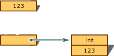
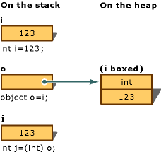

# C#语言

::: info 
文档参考 [c# 指南](https://learn.microsoft.com/zh-cn/dotnet/csharp/)
:::

## 语言特点
### 1.面向对象
C# 支持类、对象、继承、多态等面向对象的编程概念，使开发者能够编写模块化、可重用的代码。

### 2.强类型语言
C# 是一种强类型语言，意味着每个变量和表达式的类型在编译时就已经确定，有助于减少运行时错误。

### 3.跨平台
借助 .NET Core 和 .NET 5/6 等框架，C# 现在可以在 Windows、Linux 和 macOS 等多个平台上运行。
::: tip 
在 2016 年 .NET Core 发布之前，C# 的主要开发平台是 Windows，依赖于 .NET Framework。虽然也有第三方的跨平台实现（如 Mono 和 Xamarin），但官方支持的跨平台能力是在 .NET Core 出现之后才开始正式广泛应用。
:::

### 4.内存管理
C# 提供垃圾回收机制，自动管理内存分配和回收，减轻开发者的负担。

### 5.事件驱动
C# 支持事件驱动的编程模型，可以用于开发 Windows、WPF、异步编程等多种场景。

### 6.异步编程
C# 的异步编程提供了一种简洁、高效的方式来处理耗时操作，避免阻塞线程，尤其是在 I/O 密集型任务中。async 和 await 关键字的引入大大简化了异步代码的编写，使得异步操作的可读性和可维护性得到了显著提升。

### 7.语言集成查询 (LINQ)
语言集成查询 (LINQ) 是一系列直接将查询功能集成到 C# 语言的技术统称。

对于编写查询的开发者来说，LINQ 最明显的“语言集成”部分就是查询表达式。 查询表达式采用声明性查询语法编写而成。 使用查询语法，可以用最少的代码对数据源执行筛选、排序和分组操作。 可使用相同的基本查询表达式模式来查询和转换 SQL 数据库、ADO .NET 数据集、XML 文档和流以及 .NET 集合中的数据。

### ……

## 与Java对比
::: warning 注意
以下仅代表个人观点，并不全面，请谨慎区分与选择.
:::

### Java独有的一些特性

#### 1.匿名内部类
Java 支持匿名内部类，即使得可以在代码中声明和使用没有名字的类。C# 虽然也支持匿名类型和局部函数，但没有完全相同的匿名内部类特性。

匿名内部类通常用于简化代码和实现临时的接口或抽象类的子类。

举个简单的例子，在java中匿名内部类可用于实现回调机制。
```Java
public class CallbackExample {
    interface Callback {
        void onComplete(String result);
    }
    public void performAction(Callback callback) {
        String result = "Task Completed";
        callback.onComplete(result);
    }
    public static void main(String[] args) {
        CallbackExample example = new CallbackExample();
        example.performAction(new Callback() {
            @Override
            public void onComplete(String result) {
                System.out.println("Callback received with result: " + result);
            }
        });
    }
}
```

而在c#中一般需要使用事件来实现，在一定程度上可能增加了代码的分散性，不易阅读。
```C#
using System;
class Program
{
    public static event Action<string> OnTaskCompleted;
    public static void PerformAction()
    {
        string result = "Task Completed";
        OnTaskCompleted?.Invoke(result);
    }
    static void Main()
    {
        OnTaskCompleted += result => Console.WriteLine("Event received with result:" + result);
        PerformAction();
    }
}
```

#### 2.已检查异常
在 Java 中，异常分为两大类：已检查异常（Checked Exception）和未检查异常（Unchecked Exception）。已检查异常是指在编译时被检查的异常，必须要么通过 try-catch 块处理，要么通过方法签名中的 throws 子句声明。

典型代表：常见的已检查异常包括 IOException、SQLException、ClassNotFoundException 等。

在 C# 中，理论上任何方法都可能引发任何异常。

#### 3.已检查的数组协变
Java 中的数组协变指的是数组类型具有协变关系，也就是说，如果类型 B 是类型 A 的子类，那么类型 B[] 也是类型 A[] 的子类型。这种设计允许我们在使用父类型数组的地方替换为子类型数组。但是，数组的协变在运行时可能引发 ArrayStoreException。

在 C# 中，数组不是安全协变的。 如果需要协变结构，则应使用泛型集合类和接口。

### C#独有的一些特性
#### 1.模式匹配
模式匹配可以根据复杂数据结构的形状提供简洁的条件语句和表达式。

比如：
is 语句可以用于类型检查和条件匹配，并且可以在匹配成功时直接声明和初始化一个新变量。
```C#
object obj = "Hello, World!";
if (obj is string s)
{
    Console.WriteLine($"The string length is {s.Length}");
}
```
在这个例子中，is string s 不仅检查 obj 是否是 string 类型，还会将其转换并赋值给 s 变量

switch 语句自 C# 7.0 起支持模式匹配，可以基于类型和条件进行分支。
```C#
object obj = 42;
switch (obj)
{
    case int i:
        Console.WriteLine($"Integer: {i}");
        break;
    case string s:
        Console.WriteLine($"String: {s}");
        break;
    case null:
        Console.WriteLine("Null object");
        break;
    default:
        Console.WriteLine("Other type");
        break;
}
```

#### 2.字符串插值
字符串插值使你能够在字符串中插入已评估的表达式，而不是使用位置标识符。

#### 3.可以为 null 的类型和不可为 null 的类型
C# 通过向类型附加 ? 后缀来支持可以为 null 的值类型和可以为 null 的引用类型。 对于可以为 null 的类型，如果在取消引用表达式之前不检查是否有 null，编译器会发出警告。 对于不可为 null 的类型，如果向该变量分配 null 值，编译器会发出警告。 不可为 null 的引用类型可最大程度减少引发 System.NullReferenceException 的编程错误。

#### 4.扩展方法
在 C# 中，可以创建扩展类或接口的方法。 扩展方法可扩展库中某个类型的行为或实现给定接口的所有类型的行为。

#### 5.LINQ
语言集成查询 (LINQ) 提供了一种通用语法来查询和转换数据，无论其存储方式如何。

#### 6.事件和委托
语言集成查询 (LINQ) 提供了一种通用语法来查询和转换数据，无论其存储方式如何。

#### ……

### 常见差异

#### 1.类型系统
C#: 支持值类型和引用类型，提供了更丰富的类型系统，包括结构体（struct）、枚举（enum）以及自定义值类型。C# 中的 ref 和 out 参数允许引用传递。

Java: 主要使用引用类型，不支持值类型。Java 通过封装类（如 Integer、Double）实现原始类型的包装。

#### 2.属性和方法
C#: 支持属性（properties），这是一种简化字段访问的方法。C# 的属性允许直接读取和写入字段，背后实际上使用了 getter 和 setter 方法。

Java: 不直接支持属性概念，通常通过 getter 和 setter 方法来实现字段访问。

#### 3.方法重载
C#: 支持方法重载、运算符重载、和具名参数。

Java: 支持方法重载，但不支持运算符重载，也没有具名参数。

#### 4.编译和运行
C#: 使用 csc 编译器，将代码编译成中间语言（IL），然后在运行时由 CLR 解释或编译为本地代码。

Java: 使用 javac 编译器，将代码编译成字节码（bytecode），然后由 JVM 执行。

#### ……

### 如何选择
c#相对java多了很多功能及特性，而Java相对于在web领域c#具有更强大的生态。

在我看来，如果您想实现一个稳定的大规模企业系统、大数据处理或分布式系统时，最好选择Java。

如果您需要开发的事企业应用与内部系统、IO密集型系统、计算密集型系统或者Windows平台的软件，最好选择c#。

::: tip 
要根据需求来选择合适的语言：

在Windows上运行的测试工具、调试工具，完全可以使用winform/WPF开发，节约时间便与维护。

小型系统如线边库的管理系统、单台机器人的控制系统。完全可以配置台PC部署。

工厂内的系统并发量和访问量都很少，使用两台服务器做双机热备完全可以处理。没有必要硬上分布式、中间件、CI/DI……
:::

::: danger 
语言没有优劣之分，大多数情况下Java和C#都能满足开发需求，只是实现方式不同而已。
不要觉得用某种语言就有优越感！！！

不可否认Java主导的互联网、电商、虚拟货币等给生活带来了巨大的便利。但工业生产始终是一个国家的底气。

希望同志们多关注企业信息化系统、自动化系统、工业软件。这些我们还有很大的差距！！！
:::


## 标准规范
C# 语言规范是 C# 语言的权威来源。 该规范由 ECMA C# 标准委员会 (TC49-TG2) 制定。 委员会目前正在制定该标准的第 8 版。 此处发布的草稿包括部分但并非所有 C# 8 功能。 委员会使用 Microsoft 规范和语言设计会议 (LDM) 笔记来制定该规范。

详情参考 [c# 标准规范](https://learn.microsoft.com/zh-cn/dotnet/csharp/specification/overview)。

## 类型系统

### 值类型
::: tip 什么是值类型？
在C#中，值类型（Value Type）是一种在栈（stack）中直接存储数据的类型，而不是存储对数据的引用。

值类型派生自System.ValueType（派生自 System.Object）

值类型分为两类：struct和enum。
:::

::: tip struct和class的区别是什么？
struct是值类型，在栈（stack）中直接存储数据。

class是引用类型，在堆（heap）上存储数据，变量存储的是对象的引用（指针）。当一个对象被赋值给另一个变量时，两个变量都指向同一个对象。

::: danger record
从 C# 10 开始，可定义记录结构类型。 记录类型提供用于封装数据的内置功能。
record的引入使得在C#中定义数据传输对象（DTO）和不可变类型变得更加简单和直观。

可简单理解为：

record struct：不可变值类型
```C#
public readonly record struct Point(int X, int Y);
var point1 = new Point(3, 4);
var point2 = new Point(3, 4);
Console.WriteLine(point1);  // 输出: Point { X = 3, Y = 4 }
// 值比较
Console.WriteLine(point1 == point2);  // 输出: True
point1.X = 5;  // 编译错误：无法为只读属性赋值
```

record class：不可变引用类型，但可以比较值而非引用
```C#
public record Point(int X, int Y);
var point1 = new Point(3, 4);
var point2 = new Point(3, 4);
Console.WriteLine(point1);  // 输出: Point { X = 3, Y = 4 }
// 值比较
Console.WriteLine(point1 == point2);  // 输出: True
point1.X = 5;  // 编译错误：无法为只读属性赋值
```

详情参考[record](https://learn.microsoft.com/zh-cn/dotnet/csharp/language-reference/builtin-types/record)。
:::

::: tip ref struct
ref struct用于定义只能在栈上分配的结构体类型，适合需要高效内存管理的场景。

典型应用：Span< T>

Span< T>是一个非常常见的ref struct，用于表示内存中连续的一块区域。Span<\T>允许高效地操作数组、字符串和其他内存块，而无需进行大量的内存复制或分配。
```C#
public void ProcessSpan(Span<int> span)
{
    for (int i = 0; i < span.Length; i++)
    {
        span[i] *= 2;
    }
}
int[] array = { 1, 2, 3, 4 };
ProcessSpan(array);  // Span<T>可以直接操作数组
Console.WriteLine(string.Join(", ", array));  // 输出: 2, 4, 6, 8
```
:::


::: tip 值类型的特点？
1.直接存储数据：值类型变量直接在栈（stack）内存中分配空间，存储实际的值。

2.内存分配在栈上：值类型通常在栈上分配内存，栈上的内存分配和回收非常高效。

3.自动复制：当你将一个值类型变量赋值给另一个变量时，值会被复制，这意味着两个变量互不影响。

4.没有垃圾回收：栈上的内存不需要垃圾回收，因为它会在方法或作用域结束时自动释放。
:::

::: tip 值类型可以被继承吗？
值类型不能被继承。
:::

::: tip 内置值类型有哪些？
| 关键字   | .NET 类型         | 空间   | 数值范围                                      | 默认值  |
| -------- | ----------------- | ---------- | --------------------------------------------- | ------- |
| `bool`   | `System.Boolean`  | 1字节       | `true` 或 `false`                            | `false` |
| `byte`   | `System.Byte`     | 1字节       | 0 到 255                                     | `0`     |
| `sbyte`  | `System.SByte`    | 1字节       | -128 到 127                                  | `0`     |
| `char`   | `System.Char`     | 2字节       | U+0000 到 U+FFFF                              | `'\0'`  |
| `short`  | `System.Int16`    | 2字节       | -32,768 到 32,767                            | `0`     |
| `ushort` | `System.UInt16`   | 2字节       | 0 到 65,535                                  | `0`     |
| `int`    | `System.Int32`    | 4字节       | -2,147,483,648 到 2,147,483,647              | `0`     |
| `uint`   | `System.UInt32`   | 4字节       | 0 到 4,294,967,295                           | `0`     |
| `long`   | `System.Int64`    | 8字节       | -9,223,372,036,854,775,808 到 9,223,372,036,854,775,807 | `0L`    |
| `ulong`  | `System.UInt64`   | 8字节       | 0 到 18,446,744,073,709,551,615              | `0`     |
| `float`  | `System.Single`   | 4字节       | ±1.5 x 10^-45 到 ±3.4 x 10^38                | `0.0f`  |
| `double` | `System.Double`   | 8字节       | ±5.0 x 10^-324 到 ±1.7 x 10^308              | `0.0d`  |
| `decimal`| `System.Decimal`  | 16字节      | ±1.0 x 10^-28 到 ±7.9228 x 10^28             | `0.0m`  |

::: danger 注意
Java 中的byte 对应c#中的sbyte。

Java 中没有ushort。
:::

::: tip 什么是装箱和取消装箱？
装箱是将值类型转换为 object 类型或由此值类型实现的任何接口类型的过程。

装箱：


取消装箱：

:::

::: tip 什么时候会发生装箱和取消装箱？举个例子？如何避免？
需要将值类型存储在非泛型集合（如ArrayList或Hashtable）中时，由于这些集合只能处理object类型的元素，值类型必须进行装箱。

```C#
ArrayList list = new ArrayList();
list.Add(42); // 装箱操作
int i = (int)list[0]; // 取消装箱操作
```

装箱和取消装箱涉及内存分配（堆上）和类型转换，频繁的装箱和取消装箱操作会导致性能下降，尤其是在大量数据处理或循环中。
尽可能使用泛型避免装箱和取消装箱的开销。
:::

::: tip 介绍一下c#中的数值转换
C# 提供了一组整型和浮点数值类型。 任何两种数值类型之间都可以进行隐式或显式转换。 必须使用强制转换表达式来执行显式转换。

隐式转换是指在不需要显式指定的情况下，C#自动将一个类型转换为另一种兼容类型。通常是较小范围类型转换为较大范围类型。

```C#
int i = 123;
double d = i; // 隐式转换，从int转换为double
```

常见的隐式转换：

int 转换为 long, float, double, decimal

float 转换为 double

char 转换为 int, uint, long, ulong, float, double, decimal


显式转换用于当类型不兼容或可能丢失数据时，需要开发者明确地进行转换。这种转换需要使用强制转换运算符(type)。

```C#
double d = 123.45;
int i = (int)d; // 显式转换，从double转换为int，数据可能丢失
```
详情参考 [内置数值转换](https://learn.microsoft.com/zh-cn/dotnet/csharp/language-reference/builtin-types/numeric-conversions)。

::: danger 使用 Convert/Parse
C#提供了Convert类，该类包含了各种静态方法，可以在不同类型之间进行转换。Convert类比显式转换更安全，因为它还会处理一些特殊情况，例如null值。
```C#
string str = "123";
int i = Convert.ToInt32(str); // 将字符串转换为整数

double d = 123.45;
int j = Convert.ToInt32(d); // 将double转换为int
```

Parse和TryParse方法主要用于将字符串转换为数值类型。Parse方法在转换失败时会抛出异常，而TryParse方法则返回一个布尔值，指示转换是否成功。
```C#
string str = "123";
int i = int.Parse(str); // 将字符串转换为int

bool success = int.TryParse(str, out int result); // 使用TryParse方法
```
:::

::: tip 介绍一下枚举
枚举类型 是由基础整型数值类型的一组命名常量定义的值类型。 

默认情况下，枚举成员的关联常数值为类型 int；它们从零开始，并按定义文本顺序递增 1。 可以显式指定任何其他整数数值类型作为枚举类型的基础类型。 还可以显式指定关联的常数值。
```C#
enum ErrorCode : ushort
{
    None = 0,
    Unknown = 1,
    ConnectionLost = 100,
    OutlierReading = 200
}
```

::: danger 注意
Java中枚举可以定义方法，但C#中不可以（但c#可以通过扩展方法实现类似的功能）。
:::

::: tip 枚举使用[Flags]属性
枚举用[Flags]属性修饰后，枚举的值可以通过按位或运算符 | 来组合，从而表示多个选项的组合

例子
```C#
[Flags]
enum DaysOfWeek
{
    None = 0,
    Monday = 1,
    Tuesday = 2,
    Wednesday = 4,
    Thursday = 8,
    Friday = 16,
    Saturday = 32,
    Sunday = 64
}
```

有了[Flags]属性，您可以轻松组合多个枚举值：
```C#
DaysOfWeek weekend = DaysOfWeek.Saturday | DaysOfWeek.Sunday;
Console.WriteLine(weekend); // 输出：Saturday, Sunday
```

通过按位与运算符 &，可以检查某个枚举变量是否包含某个特定的标志
```C#
bool isWeekend = (weekend & DaysOfWeek.Saturday) == DaysOfWeek.Saturday;
Console.WriteLine(isWeekend); // 输出：True
```
:::

::: tip 使用枚举实现单例模式
```C#
// 定义枚举类型
public enum Singleton
{
    Instance
}
// 定义扩展方法
public static class SingletonExtensions
{
    public static void DoSomething(this Singleton singleton)
    {
        Console.WriteLine("Doing something...");
    }
}
class Program
{
    static void Main(string[] args)
    {
        Singleton singleton = Singleton.Instance;
        singleton.DoSomething();  // 输出: Doing something...
    }
}
```
使用枚举来实现单例模式有以下几个优点：

线程安全：枚举在初始化时是线程安全的，不需要额外的锁（lock）机制。

序列化安全：使用枚举实现的单例模式天生就是序列化安全的，不需要实现ISerializable接口或防止反序列化生成新的实例。

防止反射攻击：枚举类型在反射攻击时会自动防止创建新的实例。
:::

### 内置引用类型
| 关键字    | .NET 类型         |
| --------- | ----------------- |
| `string`  | `System.String`   |
| `object`  | `System.Object`   |
| `dynamic` | `System.Dynamic.DynamicObject` |


### 自定义类型