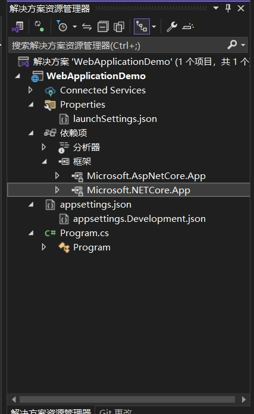

# 代码结构与基本功能

## 准备条件

- 带有 ASP.NET 和 Web 开发的 Visual Studio。


## 创建第一个项目

为了保证能够更清晰的了解代码结构，我们这里选择创建“ASP.NET Core 空”模板


## 代码结构

- 解决方案
  - 项目
    - 属性
    - 依赖项 
    - appsettings.json (配置文件)
    - Program.cs (项目入口)



## 基本功能

### 项目入口(Program.cs)
``` C#
namespace WebApplicationDemo
{
    public class Program
    {
        public static void Main(string[] args)
        {
            var builder = WebApplication.CreateBuilder(args);
            var app = builder.Build();

            app.MapGet("/", () => "Hello World!");

            app.Run();
        }
    }
}
```
Program.cs 是 .NET Core 应用程序的入口点。程序的加载顺序从 Program.cs 文件中的 Main 方法开始。

空模板的Main方法中有以下操作：

1. 使用`WebApplication.CreateBuilder(args)`（.net 5之前使用`Host.CreateDefaultBuilder(args)`）创建一个 WebApplicationBuilder 实例（用于配置服务、添加配置源和日志等）。
2. 使用`var app = builder.Build();`创建一个WebApplication 实例（运行时的应用程序—）。
3. `app.MapGet("/", () => "Hello World!");`在 ASP.NET Core 应用中映射一个 GET 请求的路由，并返回 "Hello World!" 响应。
4. `app.Run()`启动应用程序，开始监听 HTTP 请求。

#### Startup

在.net 5以前 可以使用 Startup 类来配置应用程序的服务和请求管道。

在 .NET 6 及之后版本中，Startup 类的使用已经被简化， WebApplication API 提供了更简洁的配置方式。

1. 注册服务
``` C#
var builder = WebApplication.CreateBuilder(args);
// 注册服务
builder.Services.AddControllers(); // 添加 MVC 控制器服务
```

2. 请求管道配置
``` C#
//配置异常页面
if (app.Environment.IsDevelopment())
{
    app.UseDeveloperExceptionPage();
}
else
{
    app.UseExceptionHandler("/Home/Error");
}
//启用授权
app.UseAuthentication();
//设置应用程序路由，以便路由中间件将请求转发到控制器
//不使用应用程序无法识别和处理来自控制器的请求。
app.MapControllers();

```

如果习惯使用Startup，可以新建Startup并使用以下方法
``` C#
var builder = WebApplication.CreateBuilder(args);
// 使用 Startup 类的配置
var startup = new Startup();
startup.ConfigureServices(builder.Services);
startup.Configure(app, app.Environment);
```

#### 常用配置

##### 固定端口
调试时，为避免端口的频繁分配，一般我们需要固定绑定端口。

``` C#
var builder = WebApplication.CreateBuilder(args);
builder.WebHost.UseUrls("http://*:9001");
```

##### UseIIS 

UseIIS 是在 ASP.NET Core 应用程序中用来启用 IIS（Internet Information Services）集成的配置方法。

这种集成可以让你的 ASP.NET Core 应用运行在 IIS 上，同时享受 IIS 提供的功能，如负载均衡、请求处理和安全性。

在 .NET Core 和 .NET 5 中，你通常会使用 UseIISIntegration 方法来实现这个集成，

而在 .NET 6 和之后的版本中，WebApplication API 默认启用 IIS 集成，简化了配置过程。

##### MaxRequestBodySize

配置 Kestrel 的最大请求体大小（MaxRequestBodySize）可以帮助你控制单个请求的大小，以保护服务器免受过大的请求体可能带来的风险。

在 .NET Core 3.1、.NET 5 及之前版本中，你可以使用 UseKestrel 方法来配置 Kestrel 服务器的选项。

而在 .NET 6 及之后的版本中，你可以通过 ConfigureKestrel 方法进行配置。

``` C#
var builder = WebApplication.CreateBuilder(args);
// 配置 Kestrel 服务器
builder.WebHost.ConfigureKestrel(options =>
{
    // 配置最大请求体大小(允许任意大小的请求体可以设置为null)
    options.Limits.MaxRequestBodySize = 10 * 1024 * 1024; // 10 MB

});
```
其他请求限制配置：MaxRequestHeadersTotalSize(最大请求头大小)、MaxRequestHeadersCount(最大请求头数量)等。

其中Kestrel 是 ASP.NET Core 的默认 Web 服务器，适用于处理生产环境中的 HTTP 请求。

它设计为高性能、低延迟，并且支持跨平台操作。

Kestrel 通常用于直接托管应用程序，但也可以与 IIS、Nginx 或 Apache 等反向代理服务器一起使用，以提供额外的功能和安全性。

### Native AOT(Ahead-of-Time Compilation)
Native AOT（Ahead-of-Time Compilation）是 .NET 6 引入的一种新特性，

旨在将 .NET 应用程序编译为本机代码（native code），以提高启动速度和运行时性能。

这一特性尤其适合于需要快速启动和低内存占用的应用场景，如微服务、命令行工具和服务器应用。

#### 主要特点

- **提前编译：**

Native AOT 允许将应用程序的所有代码在构建时编译为本机代码，而不是在运行时使用 JIT（Just-In-Time）编译。这可以显著提高应用的启动速度。

- **减少内存占用：**

由于省去了运行时所需的 JIT 编译和其他相关开销，Native AOT 应用程序的内存占用通常会更低。

- **独立于运行时：**

Native AOT 编译的应用程序可以在没有完整 .NET 运行时的环境中运行，这使得在某些限制条件下（如嵌入式设备或容器）更加灵活。

- **快速启动时间：**

由于应用程序已被编译为本机代码，启动时间显著减少，适合用于微服务架构和云原生应用。

- **安全性：**

由于代码在编译时已经被转换为本机代码，攻击面相对较小，减少了某些类型的运行时攻击（如 JIT 相关的攻击）。

#### 使用 Native AOT
要使用 Native AOT 编译 .NET 应用程序，可以在MSBuild property中启用相关设置。


### 主机(Host)

### 配置文件(Configuration)

#### 加载

在 .NET Core 应用程序中，appsettings.json 文件是一个常用的配置文件，用来存储应用程序的各种配置信息，比如数据库连接字符串、日志设置、环境变量等。

应用程序在启动时会自动加载并解析 appsettings.json 文件的内容，然后通过配置系统（IConfiguration）来访问这些数据。

在 ASP.NET Core 6.0+ 的最简化启动模式中，appsettings.json 是通过 WebApplicationBuilder 进行加载的。

WebApplicationBuilder 在创建时（`WebApplication.CreateBuilder(args)`）默认会加载配置文件，并将配置存储在 IConfiguration 接口中。

#### 访问

可以通过 builder.Configuration 来访问配置。

比如，空项目模板中有以下配置
```
{
  "Logging": {
    "LogLevel": {
      "Default": "Information",
      "Microsoft.AspNetCore": "Warning"
    }
  },
  "AllowedHosts": "*"
}
```

可以使用以下代码来读取：
``` C#
var builder = WebApplication.CreateBuilder(args);

var configuration = builder.Configuration;
var logLevel = configuration["Logging:LogLevel:Default"]; // 获取嵌套属性

Console.WriteLine($"Default Log Level: {logLevel}");// 在启动的控制台输出：Default Log Level: Information

```

#### 加载自定义配置文件
你可以手动添加其他配置文件，或者覆盖默认的 appsettings.json 文件。

然后使用 `builder.Configuration.AddJsonFile()`方法可以加载自定义的配置文件。

``` C#
var builder = WebApplication.CreateBuilder(args);

// 手动添加其他配置文件
builder.Configuration.AddJsonFile("customsettings.json", optional: true, reloadOnChange: true);

```

- optional: true 表示如果 customsettings.json 文件不存在，不会抛出异常。
- reloadOnChange: true 表示当文件发生更改时，会自动重新加载配置。

#### 不同环境的配置
.NET Core 支持按环境加载不同的配置文件。你可以根据运行环境（如开发、测试或生产）定义不同的配置。

常见的环境有：
- Development（开发环境）
- Production（生产环境）
例如，在开发环境中，appsettings.Development.json 文件会被加载，用来覆盖 appsettings.json 中的配置。

使用命令行参数`dotnet run --environment "Development"`可以指定环境。

加载的优先级顺序通常是：
1. appsettings.json（基础配置）
2. appsettings.{Environment}.json（根据环境覆盖配置）
3. UserSecrets
4. 环境变量
5. 命令行参数

### 路由与控制器(Routing)
参考[路由与控制器](2.路由与控制器.md)

### 生命周期(Lifecycle)
参考[生命周期](3.生命周期.md)

### 中间件(Middleware)
参考[中间件](4.中间件.md)

### 依赖注入(Dependency injection)
参考[依赖注入](5.依赖注入.md)

### 日志(Logging)

### 监控(Monitor)

### 异常处理(Handle errors)

### 测试(Test)

### Http 请求(Make Http Request)

### 静态文件(Static files)

### Swagger