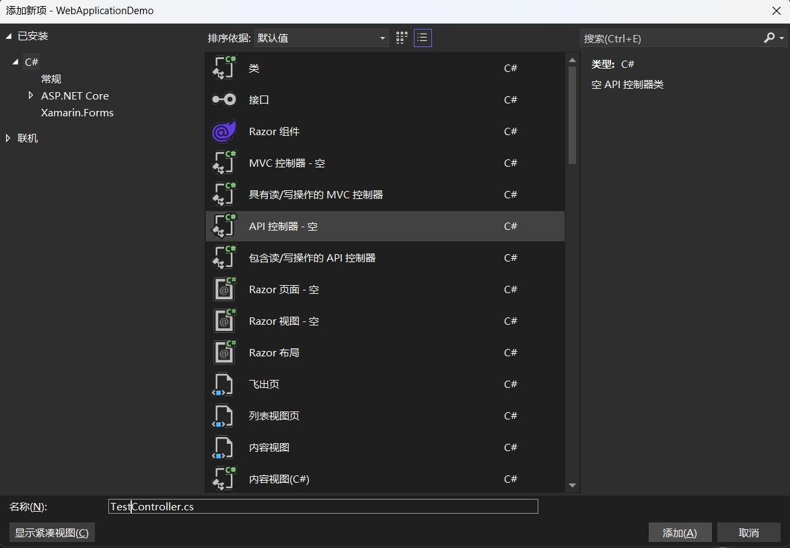
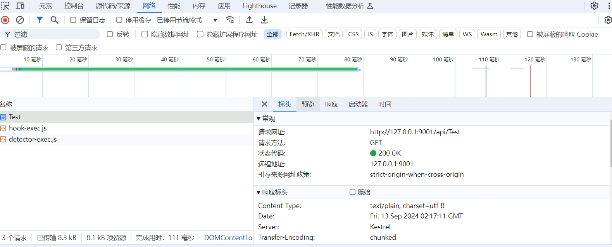
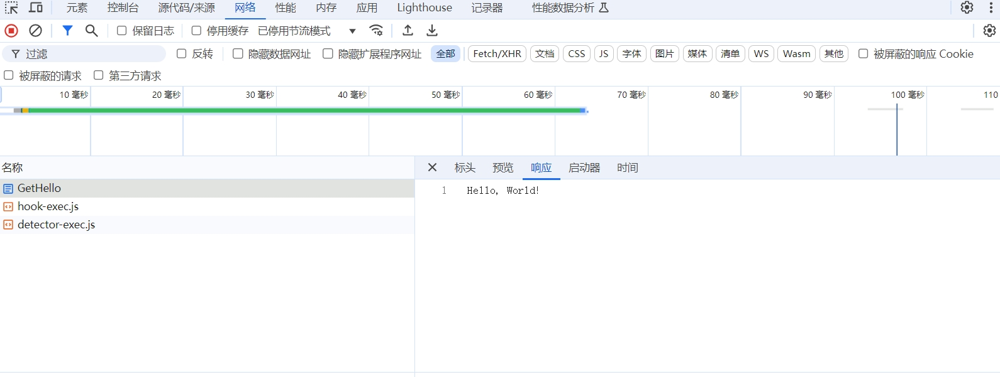

# Controller
在 ASP.NET Core 中，控制器（Controller）是处理 HTTP 请求的核心部分。

根据应用的类型和需求，ASP.NET Core 提供了几种常见的控制器类型，主要用于 Web API 和 MVC（Model-View-Controller）模式。

以下是 ASP.NET Core 中常见的控制器类型：

- API 控制器（Web API Controllers）
- MVC 控制器（MVC Controllers）
- Razor Pages 控制器

## API 控制器（Web API Controllers） 

API 控制器主要用于处理 Web API 请求，适合构建 RESTful API 或者其他 HTTP 服务。

通常，API 控制器继承自 ControllerBase 类，并使用 [ApiController] 特性来启用一些自动化的行为（如自动模型验证、错误处理等）。

关键特点:
- 继承自 ControllerBase 类。
- 返回 JSON 或其他类型的对象响应。
- 使用 [ApiController] 特性来简化 API 开发。

### 创建Controller并调用
在文件夹中右击，新建项，选择API控制器：


默认为我们添加了以下代码：
``` C#
using Microsoft.AspNetCore.Http;
using Microsoft.AspNetCore.Mvc;

namespace WebApplicationDemo.Controllers
{
    [Route("api/[controller]")]
    [ApiController]
    public class TestController : ControllerBase
    {

    }
}
```

我们再在此基础上添加方法：
``` C#
using Microsoft.AspNetCore.Http;
using Microsoft.AspNetCore.Mvc;

namespace WebApplicationDemo.Controllers
{
    [Route("api/[controller]")]
    [ApiController]
    public class TestController : ControllerBase
    {
        [HttpGet]
        public IActionResult GetTest()
        {
            return Ok("Get Test!");
        }
    }
}
```

启动程序。浏览器输入`http://127.0.0.1:9001/api/Test`





### ControllerBase 基类
ControllerBase 类的主要功能是支持返回数据的 API 控制器。

它不提供视图的呈现能力，这与 Controller 类不同，后者可以处理视图和 API 两种类型的响应。

ControllerBase 专注于返回 JSON、XML 等格式的数据响应，适合构建纯 API 服务。

#### 常用属性

##### HttpContext
HttpContext 是 ASP.NET Core 中用于封装 HTTP 请求和响应信息的对象，ControllerBase 类通过 HttpContext 属性提供对该对象的访问。

通过 HttpContext，你可以获取当前请求的各种上下文信息，比如请求头、请求体、查询参数、用户身份、会话等，进行更高级的操作。

- HttpContext.Request

示例
``` C#
//Headers: 获取请求头。
var userAgent = HttpContext.Request.Headers["User-Agent"].ToString();
// Query: 获取查询参数。
var queryParam = HttpContext.Request.Query["id"].ToString();
// Path: 获取请求的路径。
var path = HttpContext.Request.Path;
// Method: 获取 HTTP 请求方法（如 GET, POST 等）。
var method = HttpContext.Request.Method;
// Body: 访问请求体数据，通常用于读取 JSON、XML 等格式的数据。
using (var reader = new StreamReader(HttpContext.Request.Body))
{
    var body = await reader.ReadToEndAsync();
}
```

- HttpContext.Response

示例
``` C#
// StatusCode: 设置或获取 HTTP 响应的状态码。
HttpContext.Response.StatusCode = 404;
// Headers: 设置响应头。
HttpContext.Response.Headers["Custom-Header"] = "Value";
// Body: 写入响应体。
await HttpContext.Response.WriteAsync("Hello, world!");
```

- HttpContext.User 

HttpContext.User 用于访问经过身份验证的用户信息。它包含用户的身份、角色和声明。

示例
``` C#
// Identity: 获取当前用户的身份。
var userName = HttpContext.User.Identity.Name;
// IsAuthenticated: 检查用户是否经过身份验证。
bool isAuthenticated = HttpContext.User.Identity.IsAuthenticated;
// 获取用户的声明信息。
var claims = HttpContext.User.Claims;
foreach (var claim in claims)
{
    var type = claim.Type;
    var value = claim.Value;
}

```

- HttpContext.Session

HttpContext.Session 用于在不同的请求之间存储和读取会话数据。

示例
``` C#
// SetString: 设置会话数据。
HttpContext.Session.SetString("SessionKey", "SessionValue");
// GetString: 读取会话数据。
var sessionValue = HttpContext.Session.GetString("SessionKey");
// Remove: 删除会话数据。
HttpContext.Session.Remove("SessionKey");

```

- HttpContext.Items

Items 是一个 IDictionary 对象，存储请求期间可用的数据，

通常用于在中间件或控制器之间传递信息（服务端 => 服务端 一次请求的生命周期内存储和共享数据的字典）。

示例
``` C#
HttpContext.Items["MyKey"] = "SomeValue";
var value = HttpContext.Items["MyKey"];
```

- HttpContext.Connection

Connection 提供与客户端连接的详细信息，例如 IP 地址和端口号。

示例
``` C#
// RemoteIpAddress: 获取客户端 IP 地址。
var clientIp = HttpContext.Connection.RemoteIpAddress.ToString();
// LocalIpAddress: 获取服务器 IP 地址。
var serverIp = HttpContext.Connection.LocalIpAddress.ToString();

```

##### ModelState(数据模型验证)
ModelState 是 ASP.NET Core MVC 中用于管理数据模型验证的机制，

它会在请求数据绑定到模型时自动验证模型，并将验证结果存储在 ModelStateDictionary 中。

ModelState 在控制器中广泛用于检查传入的数据是否符合模型的验证规则，并决定是否继续处理请求。

它包含两个主要信息：

绑定的模型值：从请求中提取并绑定到模型的值。
验证状态：表示绑定的模型是否通过了验证（如 Required、StringLength 等数据注解的验证规则）。

工作机制:

当数据从客户端发送到服务器时，ASP.NET Core 会尝试将请求中的数据绑定到模型对象上。

例如，POST 请求的 JSON 数据可以绑定到一个 C# 模型中。

在绑定过程中，ASP.NET Core 会根据模型上的数据注解或自定义验证规则进行验证，并将验证结果存储在 ModelState 中。

- 自动验证
ModelState 通常与模型上的数据注解结合使用，以实现自动验证。ASP.NET Core 提供了多个内置的验证属性，例如：

    - [Required]: 确保字段不能为空。
    - [StringLength]: 限制字符串的长度。
    - [Range]: 确保数值在特定范围内。
    - [EmailAddress]: 验证邮箱地址格式。

示例
``` C#
public class Product
{
    [Required(ErrorMessage = "Name is required")]
    public string Name { get; set; }

    [Range(0.01, 1000.00, ErrorMessage = "Price must be between 0.01 and 1000.00")]
    public decimal Price { get; set; }

    [EmailAddress(ErrorMessage = "Invalid email format")]
    public string ContactEmail { get; set; }
}

```

在上述代码中，如果 Name 字段为空或者 Price 超出了指定范围，ModelState 会将这些验证错误记录下来。

通常，ModelState 验证失败时，你会返回错误信息给客户端。ASP.NET Core 默认会将 ModelState 中的错误序列化为 JSON 格式，并包含在响应中。

``` json
{
  "Name": ["The Name field is required."],
  "Price": ["The field Price must be between 0.01 and 1000.00."]
}
```

- 自定义验证逻辑

除了使用数据注解，您还可以在控制器或服务层中手动添加自定义验证逻辑，并将错误信息添加到 ModelState 中。例如：

``` C#
[HttpPost]
public IActionResult Create([FromBody] Product model)
{
    if (model.Price < 0)
    {
        ModelState.AddModelError("Price", "Price cannot be negative.");
    }

    if (!ModelState.IsValid)
    {
        return BadRequest(ModelState);
    }
    
    // 继续处理请求
    return Ok();
}

```

- 手动验证模型

``` C#
public IActionResult Update([FromBody] Product model)
{
    if (!TryValidateModel(model))
    {
        return BadRequest(ModelState);
    }

    // 继续处理请求
    return Ok();
}
```

TryValidateModel 会根据模型上的数据注解或者自定义验证逻辑，对模型进行验证并更新 ModelState。


##### Url

ControllerBase 类中的 Url 属性是 ASP.NET Core 中用于生成 URL 的实用程序，

它提供了对 IUrlHelper 的访问，可以帮助你在控制器或视图中生成相对或绝对 URL。

通过 Url，你可以动态生成链接、操作地址、路由和其他资源地址，

通常用于重定向、导航和生成 API 端点。

Url 提供了一系列用于生成 URL 的方法，比如：
- Action: 生成操作方法的 URL。
- RouteUrl: 生成基于路由的 URL。
- Content: 将虚拟路径转换为应用程序的绝对路径。
- Link: 生成带有指定协议和主机的完整绝对 URL。

这些方法适用于生成指向控制器操作、静态资源或基于路由的 URL，尤其是在 MVC 或 API 开发中非常有用。

示例：

``` C# 
// 生成相对 URL
// 生成 /[Controller]/[Action]id?=5
string url = Url.Action("Details", "Products", new { id = 5 });

// 生成带协议的绝对 URL
// 生成 https://your-domain//[Controller]/[Action]id?=5
string absoluteUrl = Url.Action("Details", "Products", new { id = 5 }, protocol: "https");

// Url.RouteUrl 用于基于特定路由配置生成 URL。
// 不同于 Action，RouteUrl 依赖于路由名称，而不是控制器和操作方法。
// 类似于 /[Controller]/[Action]/5
string url = Url.RouteUrl("default", new { controller = "Products", action = "Details", id = 5 });

// 将相对路径或虚拟路径转换为应用程序中的绝对路径
// 生成指向静态文件（如图片、CSS、JS）的路径。
string imageUrl = Url.Content("~/images/logo.png");

// 生成带有协议和主机的绝对 URL
// 生成类似于 https://your-domain/Products/Details/5 的完整 URL。
string link = Url.Link("default", new { controller = "Products", action = "Details", id = 5 });

// 使用 Redirect 重定向到指定的 URL
return Redirect(Url.Action("Details", "Products", new { id = 5 }));

// 使用 RedirectToAction 重定向到操作方法（基于当前Controller）
return RedirectToAction("Details", new { id = 5 });
```
::: danger 注意
1. Url.Action 匹配不到方法时，按默认路由模板返回。若没有默认路由模板则返回空。
2. Url.RouteUrl和Url.Link 匹配不到路由时（优先使用命名路由，然后路由模板），返回空。当没有controller/action参数时取当前controller/action。

比如路由模板设置：

programs.cs 
``` C# 
app.UseRouting();

app.MapControllerRoute(
     name: "default",
     pattern: "api/{controller}/{action}/{id?}");

// 弃用写法
// app.UseEndpoints(endpoints =>
//     {
//         endpoints.MapControllerRoute(
//             name: "default",
//             pattern: "{controller=Home}/{action=Index}/{id?}");
//     });
``` 

使用上述模板时，`Url.RouteUrl("default", new { controller = "Products", action = "Details", id = 5 });`
会生成`/[Controller]/[Action]/5`
:::

::: tip 使用建议
- 如果你只需要生成相对路径的 URL，并且明确知道控制器和动作方法，使用 Url.Action。
- 如果你的项目中有复杂的路由配置，或者你依赖路由名称而不是控制器/动作来生成 URL，使用 Url.RouteUrl。
- 如果你需要生成包含协议和主机的完整绝对 URL，尤其是跨域请求或 API 开发中，使用 Url.Link。
::: 

#### 常用方法

##### HTTP响应


### [ApiController]属性

### [Route]属性

### Http请求

## MVC 控制器（MVC Controllers）
MVC 控制器适用于带有视图（如 HTML、Razor 页面）的传统 Web 应用程序。

它通常继承自 Controller 类，并支持返回视图（View()）和处理表单数据。

关键特点:
- 继承自 Controller 类。
- 能够返回视图（View()）或其他类型的结果（如 JsonResult、RedirectResult 等）。
- 适用于传统的服务器端渲染 Web 应用程序。

## Razor Pages 控制器

Razor Pages 是 ASP.NET Core 中的一种简化开发模式，它不依赖传统的控制器，而是使用页面模型（Page Model）来处理请求。

每个 Razor 页面都有一个对应的页面模型，它类似于控制器，但与视图紧密结合，适合轻量级的页面处理。

关键特点:
- 使用页面模型 (PageModel) 而不是传统的控制器。
- Razor Pages 更加轻量化，适合页面逻辑简单的应用。
- 不需要显式定义路由，路由与页面自动关联。