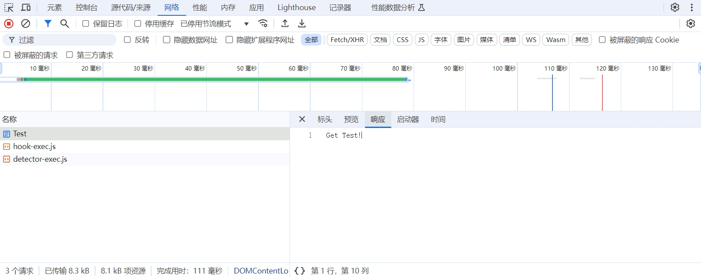

# Controller

## 创建Controller并调用
控制器类通常放在 Controllers 文件夹中。你可以手动创建这个文件夹，并在其中创建控制器类。

在文件夹中右击，新建项，选择API控制器：


默认为我们添加了以下代码：
``` C#
using Microsoft.AspNetCore.Http;
using Microsoft.AspNetCore.Mvc;

namespace WebApplicationDemo.Controllers
{
    [Route("api/[controller]")]
    [ApiController]
    public class TestController : ControllerBase
    {

    }
}
```

我们再在此基础上添加方法：
``` C#
using Microsoft.AspNetCore.Http;
using Microsoft.AspNetCore.Mvc;

namespace WebApplicationDemo.Controllers
{
    [Route("api/[controller]")]
    [ApiController]
    public class TestController : ControllerBase
    {
        [HttpGet]
        public IActionResult GetHello()
        {
            return Ok("Hello, World!");
        }
    }
}
```

启动程序。浏览器输入`http://127.0.0.1:9001/api/Test/GetHello`




## ControllerBase 

## ApiController属性

## Route属性

## Http请求方式

### Http请求类型

### 参数验证

## 异步接口
