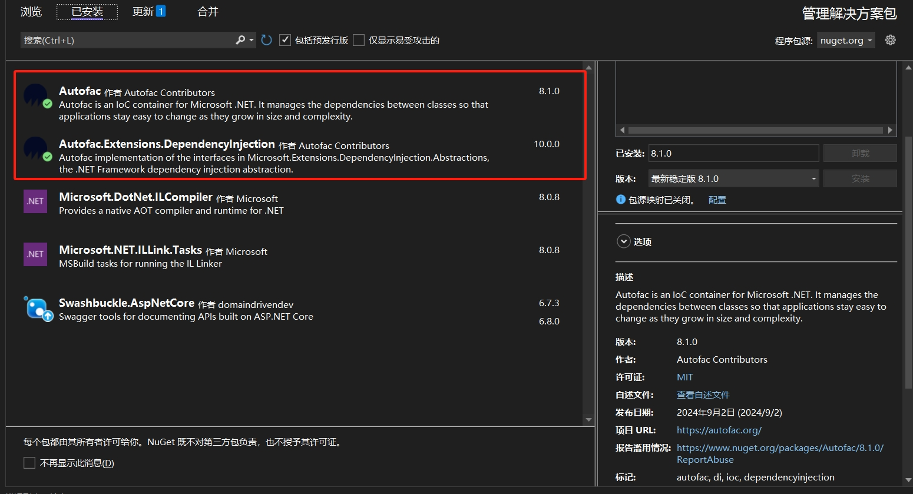

# 依赖注入(Dependency injection)

::: tip 参考文档
[Dependency injection in ASP.NET Core](https://learn.microsoft.com/en-us/aspnet/core/fundamentals/dependency-injection?view=aspnetcore-8.0)
::: 

ASP. NET Core支持依赖注入(DI)软件设计模式，这是一种在类及其依赖项之间实现控制反转(IoC)的技术。

## 基本概念

1. 依赖：一个类中需要使用的对象或服务。
2. 注入：通过外部提供（而不是类内部自己创建）的方式将依赖传递给类。

## 原生DI 

### 依赖注入方式
1. 构造函数注入：最常见的一种方式，依赖通过类的构造函数传递。
2. IServiceProvider注入：通过IServiceProvider注入依赖。(不推荐)
3. `[FromServices]`实现属性注入及方法注入：

示例：
``` C#

using Microsoft.AspNetCore.Mvc;

namespace WebApplicationDemo.DependencyInjection.DefultDI.Basic
{
    public interface IDIInjectionService
    {
        string PerformTask();
    }

    public class DIInjectionService : IDIInjectionService
    {
        public string PerformTask()
        {
            return "Executing DIInjectionService";
        }
    }

    [Route("api/[controller]")]
    [ApiController]
    public class DefultDIInjectionController : ControllerBase
    {
        private IDIInjectionService _myBasicService1;

        /// <summary>
        /// 属性注入
        /// </summary>
        [FromServices]
        public IDIInjectionService? MyBasicService2 { set; get; }

        /// <summary>
        /// 构造器注入
        /// </summary>
        /// <param name="myBasicService"></param>
        public DefultDIInjectionController(IDIInjectionService myBasicService)
        {
            _myBasicService1 = myBasicService;
        }

        [Route("GetBasicService1")]
        [HttpGet]
        public IActionResult GetBasicService1()
        {
            var res = _myBasicService1.PerformTask();
            return Content($"GetBasicService1: {res}");
        }

        [Route("GetBasicService2")]
        [HttpGet]
        public IActionResult GetBasicService2()
        {
            var res = MyBasicService2?.PerformTask();
            return Content($"GetBasicService2: {res}");
        }

        [Route("GetBasicService3")]
        [HttpGet]
        public IActionResult GetBasicService3([FromServices] IDIInjectionService myBasicService)
        {
            var res = myBasicService?.PerformTask();
            return Content($"GetBasicService3: {res}");
        }

        [Route("GetBasicService4")]
        [HttpGet]
        public IActionResult GetBasicService4(IServiceProvider serviceProvide)
        {
            var myBasicService = serviceProvide.GetService<IDIInjectionService>();
            var res = myBasicService?.PerformTask();
            return Content($"GetBasicService4: {res}");
        }
    }
}
```


### 注册与生命周期
.NET 提供了三种常见的依赖生命周期：

1. `Transient`(瞬时)：每次请求都会创建新的实例。适合短暂性操作或轻量服务。

``` C#
builder.Services.AddTransient<IMyService, MyService>();
```

2. `Scoped`(作用域)：每个请求（如 HTTP 请求）创建一个实例，在整个请求过程中共享该实例。适合需要在同一请求内复用的场景。

``` C#
builder.Services.AddScoped<IMyService, MyService>();
```

3. `Singleton`(单例)：整个应用程序生命周期内创建一个实例，所有请求都共享该实例。适合需要全局状态的服务。

``` C#
builder.Services.AddScoped<IMyService, MyService>();
```

以生成Guid 为例来说明各个使用方法及生命周期。

#### Transient(瞬时)
``` C#
using Microsoft.AspNetCore.Http;
using Microsoft.AspNetCore.Mvc;

namespace WebApplicationDemo.DependencyInjection.Transient
{
    public interface ITransientService
    {
        Guid GetOperationId();
    }

    public class TransientService : ITransientService
    {
        private readonly Guid _operationId;

        public TransientService()
        {
            _operationId = Guid.NewGuid();  // 每次实例化时生成一个新的 GUID
        }

        public Guid GetOperationId()
        {
            return _operationId;
        }
    }


    [Route("api/[controller]")]
    [ApiController]
    public class TransientDIController : ControllerBase
    {
        private readonly ITransientService _transientService1;
        private readonly ITransientService _transientService2;

        public TransientDIController(ITransientService transientService1, ITransientService transientService2)
        {
            _transientService1 = transientService1;
            _transientService2 = transientService2;
        }

        [HttpGet]
        public IActionResult Get()
        {
            var id1 = _transientService1.GetOperationId();  // 每次生成新的 ID
            var id2 = _transientService2.GetOperationId();  // 即使在同一请求中，ID 也是不同的
            return Content($"Transient 1: {id1},\r\nTransient 2: {id2}");
        }
    }
}

```

注册
``` C#
builder.Services.AddTransient<ITransientService, TransientService>();
// .net 6之前(Startup中的设置)
// services.AddTransient<ITransientService, TransientService>();
```

测试结果
```
Transient 1: 841f1976-1153-4f4b-acb9-6509def3c622, 
Transient 2: 1ddead9c-3fc5-45e8-ac3e-93934107a4c0
```

可以看出 **每次获取 ITransientService 的实例时，都会得到不同的对象实例。**

#### Scoped(作用域)

这里使用了`IServiceProvider`注入，项目中不推荐。

``` C#
using Microsoft.AspNetCore.Http;
using Microsoft.AspNetCore.Mvc;

namespace WebApplicationDemo.DependencyInjection.Scoped
{
    public interface IScopedService
    {
        Guid GetOperationId();
    }

    public class ScopedService : IScopedService
    {
        private readonly Guid _operationId;

        public ScopedService()
        {
            _operationId = Guid.NewGuid();
        }

        public Guid GetOperationId()
        {
            return _operationId;
        }
    }


    [Route("api/[controller]")]
    [ApiController]
    public class ScopedDIController : ControllerBase
    {
        private readonly IServiceProvider _serviceProvider;
        public IScopedService? ScopedService1 { get; set; }
        public IScopedService? ScopedService2 { get; set; }

        public ScopedDIController(IServiceProvider serviceProvide)
        {
            _serviceProvider = serviceProvide;
        }

        [HttpGet]
        public IActionResult Get()
        {
            ScopedService1 = _serviceProvider.GetService<IScopedService>();
            ScopedService2 = _serviceProvider.GetService<IScopedService>();
            var id1 = ScopedService1?.GetOperationId();  // 在同一请求中，ID 相同
            var id2 = ScopedService2?.GetOperationId();  // 在同一请求中，ID 相同
            return Content($"Scoped 1: {id1},\r\nScoped 2: {id2}");
        }
    }
}
```

注册
``` C#
builder.Services.AddScoped<IScopedService, ScopedService>();
// .net 6之前(Startup中的设置)
// services.AddScoped<IScopedService, ScopedService>();
```

测试结果
```
Scoped 1: 6dff7142-111c-4200-acd6-3bc86edebcdb,
Scoped 2: 6dff7142-111c-4200-acd6-3bc86edebcdb
```

可以看出 **在同一个 HTTP 请求内，_scopedService1 和 _scopedService2 引用的是同一个 IScopedService 实例，因此它们的 OperationId 是相同的。**

#### Singleton(单例)
``` C#
using Microsoft.AspNetCore.Http;
using Microsoft.AspNetCore.Mvc;

namespace WebApplicationDemo.DependencyInjection.Singleton
{
    public interface ISingletonService
    {
        Guid GetOperationId();
    }

    public class SingletonService : ISingletonService
    {
        private readonly Guid _operationId;

        public SingletonService()
        {
            _operationId = Guid.NewGuid();
        }

        public Guid GetOperationId()
        {
            return _operationId;
        }
    }


    [Route("api/[controller]")]
    [ApiController]
    public class SingletonDIController : ControllerBase
    {
        private readonly ISingletonService _singletonService1;
        private readonly ISingletonService _singletonService2;

        public SingletonDIController(ISingletonService singletonService1, ISingletonService singletonService2)
        {
            _singletonService1 = singletonService1;
            _singletonService2 = singletonService2;
        }

        [Route("GetOperationId1")]
        [HttpGet]
        public IActionResult GetOperationId1()
        {
            var id1 = _singletonService1.GetOperationId();  // 永远相同的 ID
            return Content($"Singleton 1: {id1}");
        }

        [Route("GetOperationId2")]
        [HttpGet]
        public IActionResult GetOperationId2()
        {
            var id2 = _singletonService2.GetOperationId();  // 永远相同的 ID
            return Content($"Singleton 2: {id2}");
        }
    }
}
```

注册
``` C#
builder.Services.AddScoped<IScopedService, ScopedService>();
// .net 6之前(Startup中的设置)
// services.AddScoped<IScopedService, ScopedService>();
```

GetOperationId1测试结果
```
Singleton 1: 2b62277e-bc39-4c02-a6a2-a0874d92d05b
```

GetOperationId2测试结果
```
Singleton 2: 2b62277e-bc39-4c02-a6a2-a0874d92d05b
```

可以看出 **无论在哪个 HTTP 请求中，_singletonService1 和 _singletonService2 始终是同一个实例，因此 OperationId 永远相同。**


### 循环依赖
注册时如果出现A 依赖 B， B又依赖A类似的循环依赖，调用时会抛出`Circular component dependency detected:`错误

此时可以使用Lazy/Function延时加载解决这个问题。

示例：
``` C#
using Microsoft.AspNetCore.Mvc;

namespace WebApplicationDemo.DependencyInjection.DefaultDI.Registration
{
    public class DIRegistrationServiceA
    {
        private Func<DIRegistrationServiceB> _registrationServiceB;
        
        public DIRegistrationServiceA(Func<DIRegistrationServiceB> registrationServiceB)
        {
            _registrationServiceB = registrationServiceB;
        }

        public string GetStr()
        {
            return "Executing DIInjectionServiceA";
        }

        public string PerformTask()
        {
            return _registrationServiceB.Invoke().GetStr();
        }
    }

    public class DIRegistrationServiceB
    {
        private Func<DIRegistrationServiceA> _registrationServiceA;

        public DIRegistrationServiceB(Func<DIRegistrationServiceA> registrationServiceA)
        {
            _registrationServiceA = registrationServiceA;
        }

        public string GetStr()
        {
            return "Executing DIInjectionServiceB";
        }

        public string PerformTask()
        {
            return _registrationServiceA.Invoke().GetStr();
        }


    }

    [Route("api/[controller]")]
    [ApiController]
    public class DefaultDIRegistratierController : ControllerBase
    {
        [Route("GetServiceA")]
        [HttpGet]
        public IActionResult GetServiceA([FromServices] DIRegistrationServiceA myService)
        {
            var res = myService?.PerformTask();
            return Content($"GetServiceA: {res}");
        }

        [Route("GetServiceB")]
        [HttpGet]
        public IActionResult GetServiceB([FromServices] DIRegistrationServiceB myService)
        {
            var res = myService?.PerformTask();
            return Content($"GetServiceB: {res}");
        }
    }
}

```

### 多实现接口处理
通过接口注册时如果接口有多个实现，默认只会采用最后一次注册的实现。

如果想要注入不同的实现可以采用下面的方式

``` C#
using Microsoft.AspNetCore.Mvc;

namespace WebApplicationDemo.DependencyInjection.DefultDI.MulImpInterface
{
    public interface IDIMulImpIService
    {
        string PerformTask();
    }

    public class DIMulImpIServiceA : IDIMulImpIService
    {
        public string PerformTask()
        {
            return "Executing DIMulImpIServiceA";
        }
    }

    public class DIMulImpIServiceB : IDIMulImpIService
    {
        public string PerformTask()
        {
            return "Executing DIMulImpIServiceB";
        }
    }


    [Route("api/[controller]")]
    [ApiController]
    public class DefaultDIMulImpInterfaceController : ControllerBase
    {
        private IDIMulImpIService _myServiceA;
        private IDIMulImpIService _myServiceB;

        private int _servicesCount;

        public DefaultDIMulImpInterfaceController(IEnumerable<IDIMulImpIService> myServices)
        {
            _servicesCount = myServices.Count();
            _myServiceA = myServices.First();
            _myServiceB = myServices.Last();
        }

        [Route("GetServiceA")]
        [HttpGet]
        public IActionResult GetServiceA()
        {
            var res = _myServiceA.PerformTask();
            // GetServiceA: Executing DIMulImpIServiceA in 2 services
            return Content($"GetServiceA: {res} in {_servicesCount} services");
        }

        [Route("GetServiceB")]
        [HttpGet]
        public IActionResult GetServiceB()
        {
            var res = _myServiceB.PerformTask();
            // GetServiceB: Executing GetServiceB in 2 services
            return Content($"GetServiceB: {res} in {_servicesCount} services");
        }
    }
}
```


## Autofac 

Autofac 是一个功能强大的依赖注入（DI）框架。

它扩展了 .NET 默认的 DI 容器，提供了一些高级功能和灵活性，尤其适用于复杂的场景。

Autofac 的设计目标是简单、灵活和易于扩展，使得开发者能够更轻松地处理依赖关系的管理和注入。

项目地址：https://autofac.org/

### 安装
安装 NuGet 包：
- Autofac
- Autofac.Extensions.DependencyInjection



### 依赖注入方式
1. 构造函数注入：最常见的一种方式，依赖通过类的构造函数传递。
2. ILifetimeScope注入：通过ILifetimeScope注入依赖。(不推荐)
3. Autofac兼容原生DI，也支持`[FromServices]`实现属性注入及方法注入。

示例：
``` C# 
using Autofac;
using Microsoft.AspNetCore.Mvc;

namespace WebApplicationDemo.DependencyInjection.AutofacDI.Basic
{
    public interface IAutofacInjectionService
    {
        string PerformTask();
    }

    public class AutofacInjectionService : IAutofacInjectionService
    {
        public string PerformTask()
        {
            return "Executing AutofacInjectionService";
        }
    }

    [Route("api/[controller]")]
    [ApiController]
    public class AutofacInjectionController : ControllerBase
    {
        private IAutofacInjectionService _myBasicService1;

        [FromServices]
        public IAutofacInjectionService? MyBasicService2 { set; get; }

        public AutofacInjectionController(IAutofacInjectionService myBasicService)
        {
            _myBasicService1 = myBasicService;
        }

        [Route("GetBasicService1")]
        [HttpGet]
        public IActionResult GetBasicService1()
        {
            var res = _myBasicService1.PerformTask();
            return Content($"GetBasicService1: {res}");
        }

        [Route("GetBasicService2")]
        [HttpGet]
        public IActionResult GetBasicService2()
        {
            var res = MyBasicService2?.PerformTask();
            return Content($"GetBasicService2: {res}");
        }

        [Route("GetBasicService3")]
        [HttpGet]
        public IActionResult GetBasicService3([FromServices] IAutofacInjectionService myBasicService)
        {
            var res = myBasicService?.PerformTask();
            return Content($"GetBasicService3: {res}");
        }

        [Route("GetBasicService4")]
        [HttpGet]
        public IActionResult GetBasicService4(ILifetimeScope lifetimeScope)
        {
            var myBasicService = lifetimeScope.Resolve<IAutofacInjectionService>();
            var res = myBasicService?.PerformTask();
            return Content($"GetBasicService4: {res}");
        }
    }
}

```

### 注册与生命周期

::: tip 
本文仅列举了部分常用注册方式

详细用法请参考官方文档

[集成](https://autofac.readthedocs.io/en/latest/integration/aspnetcore.html)

[注册](https://autofac.readthedocs.io/en/latest/register/registration.html)
:::

#### 集成
.net core 6+

``` C# 
// Program.cs
var builder = WebApplication.CreateBuilder(args);
builder.Host.UseServiceProviderFactory(new AutofacServiceProviderFactory());
builder.Host.ConfigureContainer<ContainerBuilder>(containerBuilder =>
{
    //推荐使用拓展方法将注册集中处理
    containerBuilder.RegisterBusinessContainers();
});

//AutofacContainerExtension.cs
public static class AutofacContainerExtension
{
    public static void RegisterBusinessContainers(this ContainerBuilder containerBuilder)
    {
        //注册
    }
}
``` 

.net core 6以前，使用Startup集成

``` C#
public class Startup
{
    // 用于配置 Autofac 容器
    public void ConfigureContainer(ContainerBuilder builder)
    {
        // 配置 Autofac
        builder..RegisterBusinessContainers();
    }
}

//AutofacContainerExtension.cs
public static class AutofacContainerExtension
{
    public static void RegisterBusinessContainers(this ContainerBuilder containerBuilder)
    {
        //注册
    }
}

// 在 Program.cs 中使用 Startup 类
var builder = WebApplication.CreateBuilder(args);

// 使用 Autofac 作为 DI 容器
builder.Host.UseServiceProviderFactory(new AutofacServiceProviderFactory());

// 使用 Startup 类来配置服务和管道
builder.Host.ConfigureWebHostDefaults(webBuilder =>
{
    webBuilder.UseStartup<Startup>();
});

var app = builder.Build();
app.Run();
```

#### 注册

相对于原生DI，Autofac提供十分丰富的注册方式可以满足各种需求

``` C#
// 接口注册
builder.RegisterType<ConsoleLogger>().As<ILogger>();

// 指定构造方法
// 如果组件内存在属被注册，作为构造方法参数可以自动注入
builder.RegisterType<MyComponent>()
       .UsingConstructor(typeof(ILogger), typeof(IConfigReader));

// 如果组件内存在属被注册，也可以使用PropertiesAutowired自动注入
builder.RegisterType<AutofacRegistrationServiceB>().PropertiesAutowired();

// 实例注册
var output = new StringWriter();
builder.RegisterInstance(output).As<TextWriter>();

// Lambda 表达式注册
builder.Register(c => new ConfigReader("mysection")).As<IConfigReader>();

// 复杂参数
builder.Register(c => new UserSession(DateTime.Now.AddMinutes(25)));

// 按参数选择实现
builder.Register<CreditCard>(
  (c, p) =>
    {
      var accountId = p.Named<string>("accountId");
      if (accountId.StartsWith("9"))
      {
        return new GoldCard(accountId);
      }
      else
      {
        return new StandardCard(accountId);
      }
    });

// 扫描并注册程序集中的类型
builder.RegisterAssemblyTypes(typeof(SomeTypeInAssembly).Assembly)
       .Where(t => t.Name.EndsWith("Service"))  // 筛选出符合条件的类（如名称以"Service"结尾的）
       .AsImplementedInterfaces();              // 将这些类注册为它们实现的接口
```

#### 生命周期
Autofac 的 作用域（Scope） 管理是通过 InstancePerLifetimeScope() 方法实现的。

在 ASP.NET Core 中，Autofac 的作用域与 ASP.NET Core 的生命周期管理（如 请求作用域）结合得非常紧密，

特别是在每个 HTTP 请求中创建服务实例并在请求结束时释放它们。

这通过将 ASP.NET Core 的 Scoped 生命周期映射到 Autofac 的 InstancePerLifetimeScope() 来实现。

ASP.NET Core 与 Autofac 作用域的对应：
|ASP.NET Core 生命周期|	Autofac 生命周期|	说明|
|----|----|----|
|Singleton|	SingleInstance()|	全局共享一个实例，整个应用程序期间只创建一次。|
|Scoped|	InstancePerLifetimeScope() 或 InstancePerRequest()	在每个请求范围内创建一次实例（Autofac 使用“生命周期范围”）。|
|Transient|	InstancePerDependency()	每次依赖解析时创建新的实例。|
|N/A	|InstancePerMatchingLifetimeScope("scopeName")	|在命名的生命周期范围内共享实例，通常用于自定义的范围。
|N/A	|ExternallyOwned()	|Autofac 不会管理实例的生命周期，外部组件负责销毁实例。|

**生命周期对应详细说明**
1. Singleton / SingleInstance()

- ASP.NET Core DI: 在应用启动时创建，整个应用程序中只有一个实例。适用于全局状态、全局缓存等场景。
- Autofac: SingleInstance() 实现了类似功能。整个应用程序生命周期中，所有组件或请求都会共享一个实例。
示例（Autofac）：

``` C#
builder.RegisterType<MySingletonService>().As<IMyService>().SingleInstance();
```

2. Scoped / InstancePerLifetimeScope()

- ASP.NET Core DI: 在每个 HTTP 请求范围内创建一个实例，所有服务在请求生命周期内共享同一个实例，请求结束时释放。

- Autofac: InstancePerLifetimeScope() 创建的实例在每个生命周期范围（通常是每个 HTTP 请求）内是唯一的，并在生命周期结束时自动释放。
Autofac 中的 InstancePerRequest() 是 InstancePerLifetimeScope() 的别名，专门用于 Web 请求的场景。

示例（Autofac）：

``` C#
builder.RegisterType<MyScopedService>().As<IMyService>().InstancePerLifetimeScope();
```

3. Transient / InstancePerDependency()

- ASP.NET Core DI: 每次请求或每次依赖解析时创建一个新的实例。适用于无状态对象、短生命周期对象。

- Autofac: InstancePerDependency() 在每次解析依赖时都会创建一个新实例，确保每次注入的对象都是独立的。

示例（Autofac）：

``` C#
builder.RegisterType<MyTransientService>().As<IMyService>().InstancePerDependency();
```

4. InstancePerMatchingLifetimeScope("scopeName")（自定义作用域）

使用命名的生命周期范围来共享实例。它允许你根据需要创建自定义的生命周期管理范围，而不是直接绑定到 HTTP 请求。

适用于更复杂的场景，比如后台任务、队列处理等需要自定义作用域的场景。

示例：

``` C#
builder.RegisterType<MyService>().As<IMyService>().InstancePerMatchingLifetimeScope("customScope");
```

5. ExternallyOwned()

该生命周期指定由外部代码管理对象的生命周期，而不是 Autofac。

当你不希望 Autofac 管理实例的销毁时使用（例如实例是由外部代码创建的）。

示例：
``` C#
builder.RegisterInstance(myObject).ExternallyOwned();
```

### 循环依赖
Autofac同样可以采用Lazy/Function延时加载解决循环依赖.

示例：

``` C#
using Microsoft.AspNetCore.Http;
using Microsoft.AspNetCore.Mvc;
using WebApplicationDemo.DependencyInjection.DefultDI.Basic;

namespace WebApplicationDemo.DependencyInjection.DefaultDI.Registration
{
    public class AutofacRegistrationServiceA
    {
        public Lazy<AutofacRegistrationServiceB>? RegistrationServiceB{ set; get; }
        
        public string GetStr()
        {
            return "Executing AutofacRegistrationServiceA";
        }

        public string PerformTask()
        {
            return RegistrationServiceB?.Value.GetStr() ?? "";
        }
    }

    public class AutofacRegistrationServiceB
    {
        public Lazy<AutofacRegistrationServiceA>? RegistrationServiceA { set; get; }

        public string GetStr()
        {
            return "Executing AutofacRegistrationServiceB";
        }

        public string PerformTask()
        {
            return RegistrationServiceA?.Value.GetStr()??"";
        }


    }

    [Route("api/[controller]")]
    [ApiController]
    public class AutofacRegistratierController : ControllerBase
    {
        [Route("GetServiceA")]
        [HttpGet]
        public IActionResult GetServiceA([FromServices] AutofacRegistrationServiceA myService)
        {
            var res = myService?.PerformTask();
            return Content($"GetServiceA: {res}");
        }

        [Route("GetServiceB")]
        [HttpGet]
        public IActionResult GetServiceB([FromServices] AutofacRegistrationServiceB myService)
        {
            var res = myService?.PerformTask();
            return Content($"GetServiceB: {res}");
        }
    }
}
```

### 多实现接口处理
相对于原生DI，Autofac可以使用更多方式处理多实现接口的指定实现注入。

示例：

``` C#
using Autofac.Core;
using Autofac.Features.AttributeFilters;
using Microsoft.AspNetCore.Mvc;

namespace WebApplicationDemo.DependencyInjection.AutofacDI.MulImpInterface
{
    public interface IAutofacMulImplService
    {
        string PerformTask();
    }

    public class AutofacMulImplServiceA : IAutofacMulImplService
    {
        public string PerformTask()
        {
            return "Executing AutofacMulImplServiceA";
        }
    }

    public class AutofacMulImplServiceB : IAutofacMulImplService
    {
        public string PerformTask()
        {
            return "Executing AutofacMulImplServiceB";
        }
    }


    [Route("api/[controller]")]
    [ApiController]
    public class AutofacMulImpInterfaceController : ControllerBase
    {
        private IAutofacMulImplService _myServiceA;
        private IAutofacMulImplService _myServiceB;

        private int _servicesCount;

        public AutofacMulImpInterfaceController(IEnumerable<IAutofacMulImplService> myServices)
        {
            _servicesCount = myServices.Count();
            _myServiceA = myServices.First();
            _myServiceB = myServices.Last();
        }

        [Route("GetServiceA1")]
        [HttpGet]
        public IActionResult GetServiceA1()
        {
            var res = _myServiceA.PerformTask();
            return Content($"GetServiceA: {res} in {_servicesCount} services");
        }

        [Route("GetServiceB1")]
        [HttpGet]
        public IActionResult GetServiceB1()
        {
            var res = _myServiceB.PerformTask();
            return Content($"GetServiceB: {res}  in {_servicesCount} services");
        }

        [Route("GetServiceA2")]
        [HttpGet]
        public IActionResult GetServiceA2([KeyFilter("ServiceA")] IAutofacMulImplService myServiceA)
        {
            var res = myServiceA.PerformTask();
            return Content($"GetServiceA: {res}");
        }

        [Route("GetServiceB2")]
        [HttpGet]
        public IActionResult GetServiceB2([KeyFilter("ServiceB")] IAutofacMulImplService myServiceB)
        {
            var res = myServiceB.PerformTask();
            return Content($"GetServiceB: {res}");
        }
    }
}

```


## AOP支持


## Options模式
