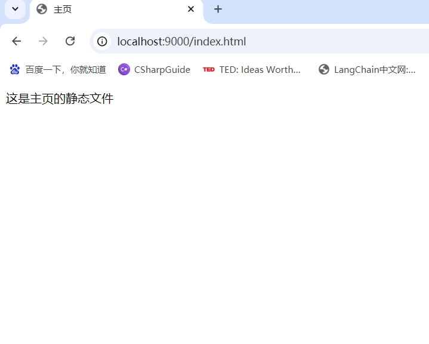
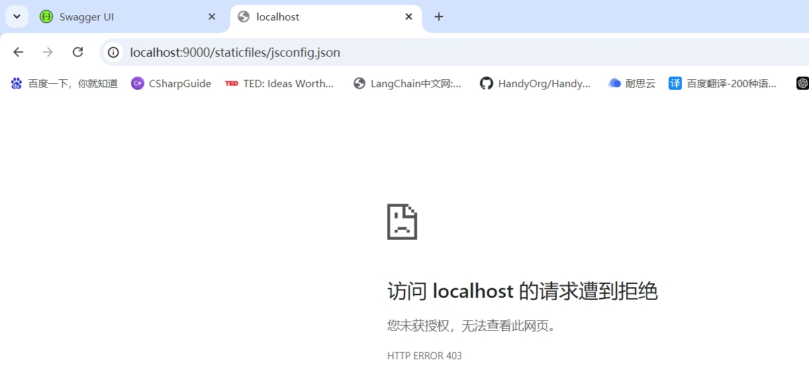
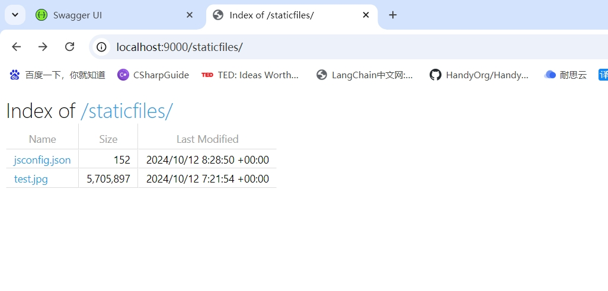
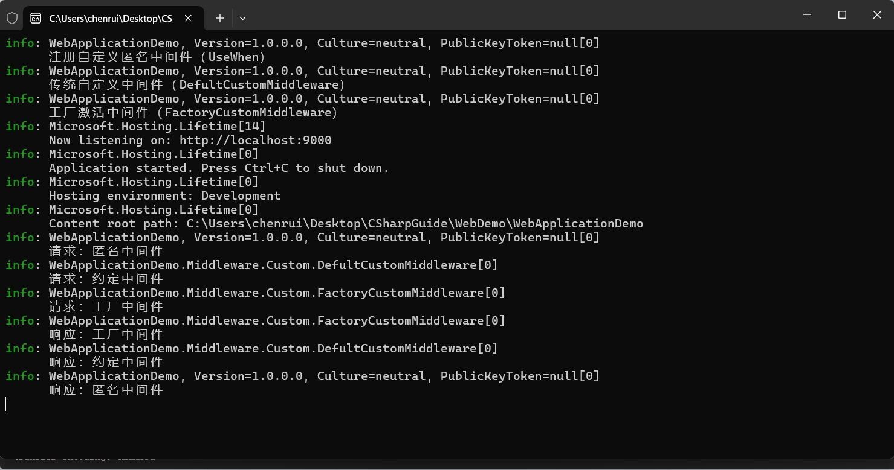

# 中间件(Middleware)
::: tip 参考文档
- [ASP.NET Core Middleware](https://learn.microsoft.com/en-us/aspnet/core/fundamentals/middleware/?view=aspnetcore-8.0)
::: 

在 .NET Core 中，中间件（Middleware）是构建应用程序管道的核心组件，它决定了请求如何被处理以及响应如何生成。

每个中间件组件负责处理请求和响应，并且可以选择将请求传递给管道中的下一个中间件。

**中间件按顺序执行，因此添加的顺序至关重要。**

在 ASP.NET Core 中，HTTP 请求从客户端发出，经过中间件管道中的各个中间件，最后由应用程序生成响应。

每个中间件都可以执行以下操作：

1. **处理请求**：直接生成响应，而不传递给下一个中间件。
2. **传递请求**：将请求传递给下一个中间件。
3. **处理响应**：在接收到下一个中间件或应用程序的响应后对其进行处理。

示例：
.net 6 及之后版本
``` C#
var app = builder.Build();
app.UseXXX();
```

.net 6 之前版本
``` C#
public class Startup
{
    public void Configure(IApplicationBuilder app)
    {
        app.UseXXX();
    }
}
```

## 内置的中间件
WebApplication会根据特定条件自动在Minimal API应用中添加以下中间件：

### UseStaticFiles

app.UseStaticFiles() 是 ASP.NET Core 中的一个中间件，用于处理静态文件的请求。

静态文件通常是指无需服务器端处理即可直接发送到客户端的文件，如 HTML、CSS、JavaScript、图像、字体等资源。

该中间件允许直接从文件系统中提供这些资源。

#### 处理静态文件
通过 app.UseStaticFiles() 中间件，任何位于项目的 wwwroot 目录中的文件都可以被访问。

Program.cs
``` C#
app.UseStaticFiles();
```

例如，如果你在 wwwroot 目录中有一个名为 index.html 的文件，可以通过 http://localhost:[your port]/index.html 来访问它。

index.html
``` html
<!DOCTYPE html>
<html>
<head>
    <meta charset="utf-8" />
    <title>主页</title>
</head>
<body>
    这是主页的静态文件
</body>
</html>
```

效果：


#### 自定义静态文件目录
如果你希望将静态文件放在 wwwroot 目录之外的其他目录中，可以通过配置 StaticFileOptions 来实现。
``` C#
app.UseStaticFiles(new StaticFileOptions
{
    FileProvider = new PhysicalFileProvider(Path.Combine(Directory.GetCurrentDirectory(), "staticfiles")),
    RequestPath = "/staticfiles"
});
```

要访问该文件夹中的文件，URL 必须包含 /StaticFiles 作为请求路径前缀。

例如，如果 MyStaticFiles 文件夹中有一个名为 test.jpg 的文件，

它将通过 http://localhost:[your port]/staticfiles/test.jpg 来访问

效果：


#### 禁用或限制访问
可以通过配置 StaticFileOptions 来限制对某些文件或文件夹的访问。以下示例演示了如何禁止访问 .config 文件
``` C#
app.UseStaticFiles(new StaticFileOptions
{
    FileProvider = new PhysicalFileProvider(Path.Combine(Directory.GetCurrentDirectory(), "staticfiles")),
    RequestPath = "/staticfiles",
    //禁用文件
    OnPrepareResponse = ctx =>
    {
        if (ctx.File.Name.EndsWith(".json"))
        {
            ctx.Context.Response.StatusCode = 403;
            ctx.Context.Response.ContentLength = 0;
            ctx.Context.Response.Body = Stream.Null;
            //缓存时间
            ctx.Context.Response.Headers.Append("Cache-Control", "public,max-age=600");
        }
    }
});
```

效果：



#### 启用文件浏览
默认情况下，UseStaticFiles() 不支持目录浏览。如果用户请求一个文件夹，服务器不会返回文件列表。

若想启用目录浏览功能，可以使用 UseDirectoryBrowser() 中间件：

``` C#
app.UseDirectoryBrowser(new DirectoryBrowserOptions
{
    FileProvider = new PhysicalFileProvider(Path.Combine(Directory.GetCurrentDirectory(), "staticfiles")),
    RequestPath = "/staticfiles"
});
```

效果：


### UseRouting 和 UseEndpoints
UseRouting 和 UseEndpoints 是核心中间件，用于构建和处理 HTTP 请求的路由逻辑。

这两者配合使用，分别负责解析路由和执行终结点，是 ASP.NET Core 请求处理管道的重要部分。

#### UseRouting
UseRouting 是 ASP.NET Core 中的一个中间件，主要负责将传入的 HTTP 请求与定义的路由规则进行匹配并将控制交给下一个中间件（如 UseEndpoints）来执行相应的终结点。

它会分析请求的 URL 路径、HTTP 方法等信息，并查找对应的路由，**但它本身不执行路由匹配到的终结点处理。**

作用：
1. **解析请求**：UseRouting 根据 URL 和 HTTP 方法，匹配应用程序中定义的路由。
2. **收集路由数据**：当请求与某个路由匹配时，UseRouting 会收集相关的路由数据，比如控制器名称、动作方法、参数等，这些数据稍后会由 UseEndpoints 使用。
3. **支持多种路由**：它支持 MVC 控制器、Razor Pages、Web API 以及自定义路由。

#### UseEndpoints
UseEndpoints 是 ASP.NET Core 中另一个重要的中间件。

UseRouting 负责解析请求的路由，而 UseEndpoints 则根据路由匹配结果执行终结点（控制器、Razor Pages 或自定义处理程序）的具体逻辑。

作用：
1. **终结点定义**：通过 UseEndpoints，你可以定义控制器路由、Razor Pages 路由、自定义路由等不同类型的终结点。
2. **终结点配置**：你可以在 UseEndpoints 中指定不同类型的终结点（如 MVC、Razor Pages 或自定义 HTTP 请求处理程序），并为它们定义处理逻辑。
3. **终结点执行**：UseEndpoints 将请求与最终的处理程序关联，例如控制器、Razor Pages 或静态文件。

#### UseRouting 和 UseEndpoints 的关系

**UseRouting 负责解析请求的路由**：它根据应用程序中定义的路由表，解析传入的 HTTP 请求，并查找匹配的路由。UseRouting 不会处理请求，只负责确定请求应路由到哪里。

**UseEndpoints 负责处理匹配的路由**：在 UseRouting 确定请求应该由哪个终结点处理后，UseEndpoints 调用相应的终结点（如控制器、Razor Pages、自定义处理程序）来生成响应。

它们的执行顺序必须正确：

1. UseRouting 在前，用于解析路由。
2. UseEndpoints 在后，用于执行路由匹配到的终结点处理逻辑。

示例：
Program.cs
``` C#
// 使用路由匹配中间件
app.UseRouting();
// 使用身份验证中间件）
app.UseAuthentication();
// 使用授权中间件
app.UseAuthorization();  
app.UseEndpoints(endpoints =>  // 执行终结点
{
    endpoints.MapControllers();   // 启用控制器路由,
    endpoints.MapControllerRoute(
        name: "default",
        pattern: "api/{controller}/{action}/{id?}");
});
```

::: tip 备注
.Net 6 之后推荐使用顶级语句替换UseEndpoints.
``` C#
app.MapControllers();

app.MapControllerRoute(
    name: "default",
    pattern: "api/{controller}/{action}/{id?}");
```
::: 

### UseAuthorization 和 UseAuthorization

#### UseAuthentication
UseAuthentication 用于执行身份验证逻辑。

它会检查传入的请求是否包含有效的身份验证凭据，并在成功时将用户信息附加到请求上下文中。

作用
- **验证用户身份**：检查传入请求中的身份验证凭据（如 JWT 令牌、Cookie、OAuth 令牌等），并验证用户的身份。
- **附加用户身份信息**：如果身份验证成功，会将验证后的用户信息（如 ClaimsPrincipal）附加到 HttpContext.User，以便在应用程序的后续处理中使用。
- **支持多种身份验证方案**：ASP.NET Core 支持多种身份验证机制，比如 **Cookie**、**Bearer Token**、**OpenID Connect** 等，开发者可以配置一个或多个身份验证方案。

工作流程
1. UseAuthentication 检查 HTTP 请求头中是否存在身份验证凭据。
2. 如果凭据存在且有效，中间件会验证它并将用户身份附加到 HttpContext.User。
3. 如果凭据无效，用户身份将不会被设置，后续的授权检查可能会失败。

#### UseAuthorization
UseAuthorization用于在用户身份验证后检查该用户是否有权访问特定资源。

**它在请求管道中确保只有授权的用户才能执行特定操作。**

作用
- **执行授权检查**：在 UseAuthentication 验证用户身份后，UseAuthorization 会检查该用户是否具有访问特定资源的权限。例如，是否具有访问某个控制器或动作方法的权限。
- **基于角色和策略的授权**：ASP.NET Core 支持基于角色和基于策略的授权。开发者可以定义不同的角色（如管理员、普通用户）或授权策略，UseAuthorization 根据这些配置进行权限检查。
- **结合身份验证结果**：UseAuthorization 依赖 UseAuthentication 提供的用户身份信息（如用户的角色、声明等），并根据这些信息执行授权检查。

工作流程
1. UseAuthorization 从 HttpContext.User 中获取用户身份信息（**由 UseAuthentication 设置**）。
2. 根据用户的角色或声明，检查用户是否具有访问请求资源的权限。
3. 如果用户没有权限，返回 403 Forbidden 响应。
4. 如果用户通过了授权检查，允许继续处理请求。

#### 中间件顺序
调用顺序必须正确：

1. UseRouting：匹配路由。
2. UseAuthentication：验证用户身份。
3. UseAuthorization：检查用户的权限。
4. UseEndpoints：执行终结点处理。

详细用法参考[认证与授权](9.认证与授权.md)

### UseCors

UseCors 是一个中间件，用于启用**跨域资源共享（CORS, Cross-Origin Resource Sharing）**。

通过 UseCors 中间件，开发者可以灵活地配置和管理跨域访问策略，以保护应用程序的安全，同时允许合法的跨域请求。

[**CORS**](https://baike.baidu.com/item/%E8%B7%A8%E6%9D%A5%E6%BA%90%E8%B5%84%E6%BA%90%E5%85%B1%E4%BA%AB/22911772?fr=ge_ala) 是一种机制，用来允许服务器控制哪些域名能够访问它的资源。

默认情况下，浏览器会阻止来自不同域的请求，这就限制了 Web 应用程序从其他域加载资源。

CORS 允许服务器通过设置 HTTP 响应头，指示浏览器允许特定的域名访问资源。

例如，如果你的前端应用程序运行在 http://example.com 域下，但需要从 http://api.example.com 获取数据，CORS 允许你通过特定配置来实现这种跨域请求。

功能:
- **允许跨域请求**：根据 CORS 策略允许或拒绝来自不同域的请求。
- **配置跨域规则**：你可以定义哪些域、HTTP 方法、请求头等允许跨域访问。
- **保护资源安全**：通过设置合适的 CORS 策略，可以保护服务器资源不被恶意网站滥用。

#### 全局启用 CORS
如果你想对整个应用程序启用某个 CORS 策略，可以在 Services 中定义策略，并使用 UseCors中间件：

Program.cs
``` C#
//添加Cors
builder.Services.AddCors(options =>
{
    options.AddDefaultPolicy(builder =>
    {
        builder.WithOrigins("https://example.com")  // 允许的跨域请求来源
               .AllowAnyHeader()                    // 允许所有请求头
               .AllowAnyMethod();                   // 允许所有 HTTP 方法
    });
});

var app = builder.Build();
//使用 UseCors中间件
app.UseCors();
app.Run();
```

#### 基于策略的 CORS 配置

``` C#
builder.Services.AddCors(options =>
{
    options.AddPolicy("AllowSpecificOrigin", builder =>
    {
        builder.WithOrigins("https://example.com")
               .AllowAnyMethod()
               .AllowAnyHeader();
    });
});
var app = builder.Build();
//使用 UseCors中间件
app.UseCors("AllowSpecificOrigin");
app.Run();
```

#### 为特定控制器或动作方法启用 CORS
如果你只想为某个控制器或特定动作方法启用 CORS，可以使用 `[EnableCors]` 特性进行配置：
``` C#
[ApiController]
[Route("api/[controller]")]
public class MyController : ControllerBase
{
    [HttpGet]
    [EnableCors("AllowSpecificOrigin")]  // 为该方法启用特定 CORS 策略
    public IActionResult GetData()
    {
        return Ok("Data from API");
    }

    [HttpPost]
    [DisableCors]  // 禁用 CORS
    public IActionResult PostData()
    {
        return Ok("Data posted");
    }
}
```

#### 允许的 CORS 配置选项
1. `WithOrigins`：指定允许的来源（域名）。

``` C#
builder.WithOrigins("https://example.com", "https://anotherdomain.com");
```

2. `AllowAnyOrigin`：允许所有域名的请求（不推荐，因为可能导致安全问题）。

``` C#
builder.AllowAnyOrigin();
```

3. `WithMethods`：指定允许的 HTTP 方法。

``` C#
builder.WithMethods("GET", "POST");
```

4. `AllowAnyMethod`：允许所有 HTTP 方法。

``` C#
builder.AllowAnyMethod();
```

5. `WithHeaders`：指定允许的请求头。

``` C#
builder.WithHeaders("Content-Type", "Authorization");
```

6. `AllowAnyHeader`：允许所有请求头。

``` C#
builder.AllowAnyHeader();
```

7. `AllowCredentials`：允许跨域请求发送凭据（如 Cookie 或 Authorization 头）。注意，使用 AllowCredentials 时不能使用 AllowAnyOrigin，必须指定具体的来源。

``` C#
builder.AllowCredentials();
```

8. `SetPreflightMaxAge`：设置浏览器可以缓存预检请求的结果的时间，以减少浏览器对同一请求的频繁预检请求。

``` C#
builder.SetPreflightMaxAge(TimeSpan.FromMinutes(10));
```

::: danger 注意
在 ASP.NET Core 的请求管道中，UseCors 的调用顺序至关重要。

通常，CORS 中间件应在路由匹配（UseRouting）之前，终结点处理（UseEndpoints）之前调用：
:::

### UseExceptionHandler
`UseExceptionHandler` 是 ASP.NET Core 中用于处理全局异常的中间件。

它允许你捕获应用程序中的未处理异常，并根据需要提供自定义的错误响应，

避免将详细的错误信息暴露给客户端，同时保持应用程序的稳定性。

功能:
- **全局异常处理**：`UseExceptionHandler` 能捕获应用程序中发生的所有未处理的异常，无论是来自控制器、服务层还是中间件管道中的其他部分。
- **自定义错误处理逻辑**：你可以定义一个异常处理路径或逻辑来返回用户友好的错误页面、JSON 响应或其他适当的处理方式。
- **提高安全性**：通过 `UseExceptionHandler`，你可以避免在生产环境中将详细的错误堆栈信息暴露给最终用户，减少潜在的安全风险。

详细用法参考[异常处理](6.其他基本功能.md)

### UseRateLimiter
`UseRateLimiter` 是 ASP.NET Core 中用于实现请求限流（Rate Limiting）的中间件，它限制客户端在特定时间窗口内可以发送到服务器的请求数量。

通过 `UseRateLimiter`，你可以防止过多的请求对你的应用程序造成压力或拒绝服务攻击（DDoS），从而确保服务器性能和响应能力。

功能：
- **请求速率限制：**限制每个客户端在给定时间窗口内发送的请求数量。
- **自定义限流策略：**支持自定义速率限制策略，例如基于客户端 IP 地址、路径或其他条件。
- **响应处理：**当请求超过速率限制时，返回标准的 429 Too Many Requests 响应，可以自定义响应格式。

常见限流策略：
1. **Fixed Window Limiting（固定窗口限流）**：

在固定的时间窗口内（如 10 秒），限制特定数量的请求。
一旦时间窗口结束，速率限制器将重置。

2. **Sliding Window Limiting（滑动窗口限流）**：

在滑动时间窗口内平滑地限制请求数量，相比固定窗口，它更灵活，减少了临界点问题。

3. **Token Bucket Limiting（令牌桶限流）**：

基于令牌桶算法，按照设定的速率生成令牌，客户端请求需要消耗令牌。
这种算法适合平稳的流量控制。

4. **Concurrency Limiting（并发限制）**：

限制同时处理的请求数量，适合保护服务器资源不被耗尽。

示例：

Program.cs
``` C#
// 添加速率限制器服务
builder.Services.AddRateLimiter(options =>
{
    options.GlobalLimiter = PartitionedRateLimiter.Create<HttpContext, string>(httpContext =>
        RateLimitPartition.GetFixedWindowLimiter(
            partitionKey: httpContext.Connection.RemoteIpAddress?.ToString() ?? "unknown",
            factory: partition => new FixedWindowRateLimiterOptions
            {
                AutoReplenishment = true,
                PermitLimit = 5,  // 最大请求数
                Window = TimeSpan.FromSeconds(10),  // 时间窗口
                QueueProcessingOrder = QueueProcessingOrder.OldestFirst,
                QueueLimit = 0,  // 请求队列长度
            }));
    // 当请求超过限制时，服务器会返回 429 Too Many Requests 状态码。你可以通过 options.OnRejected 自定义超出限流时的响应，
    options.OnRejected = (context, token) =>
    {
        context.HttpContext.Response.StatusCode = StatusCodes.Status429TooManyRequests;
        context.HttpContext.Response.WriteAsync("Too many requests. Please try again later.");

        return new ValueTask();
    };

});

// 使用授权中间件
app.UseAuthorization();
```

::: danger 注意
1. **推荐的 UseRateLimiter 位置**

- **在路由之前：**`UseRateLimiter` 应该位于 `UseRouting` 之前，因为请求在被路由处理之前就需要进行限流，这样可以确保所有的请求都受到限流的保护。
- **在认证和授权之前：**为了避免认证或授权等操作的资源开销（如数据库查找、身份验证等），速率限制应在这些操作之前执行，限制不合规的请求数量。
- **在其他中间件之前：**`UseRateLimiter` 应尽可能靠前，因为它的目的是限制和保护系统资源，所以应该在其他需要大量资源的中间件之前生效。

示例：

Program.cs
``` C#
//启用静态文件访问
app.UseStaticFiles();

//启用文件浏览
app.UseDirectoryBrowser(new DirectoryBrowserOptions
{
    FileProvider = new PhysicalFileProvider(Path.Combine(Directory.GetCurrentDirectory(), "staticfiles")),
    RequestPath = "/staticfiles"
});
// 启用速率限制器
app.UseRateLimiter();
// 使用路由匹配中间件
app.UseRouting();
// 使用身份验证中间件）
app.UseAuthentication();
// 使用授权中间件
app.UseAuthorization();
// 使用名为 "AllowSpecificOrigin" 的策略
app.UseCors("AllowSpecificOrigin");  
// 启用控制器路由
app.MapControllers();
app.Run();
```

2. **限流时的响应仅在请求队列长度QueueLimit = 0时超出范围会触发，否则默认阻塞等待。**

3. **ASP.NET Core 提供了 `EnableRateLimiting` 和 `DisableRateLimiting` 特性来对特定的控制器或操作应用或跳过速率限制规则。**

这两个特性允许你灵活地在全局速率限制的基础上，细粒度地管理不同的 API 端点的请求限制。

示例：
``` CSharp
[EnableRateLimiting("CustomPolicy")]
[ApiController]
[Route("api/[controller]")]
public class ProductsController : ControllerBase
{
    [HttpGet]
    public IActionResult GetProducts()
    {
        return Ok(new[] { "Product 1", "Product 2" });
    }
}
```

详情参考[EnableRateLimiting and DisableRateLimiting attributes](https://learn.microsoft.com/en-us/aspnet/core/performance/rate-limit?view=aspnetcore-8.0)
:::

### UseResponseCaching

`UseResponseCaching` 是 ASP.NET Core 中间件的一部分，主要用于启用响应缓存，以提高应用程序的性能和效率。

它通过缓存服务器端生成的 HTTP 响应，减少处理重复请求的开销，从而加快响应速度。

**作用**
`UseResponseCaching` 会根据 HTTP 响应中的 Cache-Control 头来缓存并返回缓存的响应。客户端可以通过设置合适的缓存头来控制缓存的行为，如设置缓存的时长、是否允许缓存等。

响应缓存主要适用于 GET 请求和类似的安全方法，不会影响需要用户身份验证的敏感数据。

**使用场景**
- 当某个请求的响应在一段时间内不会频繁变化时，启用响应缓存能够避免每次都从头生成响应。
- 它非常适合静态内容、API 数据（非个性化）、公共页面等。

**`ResponseCache` 特性**

`ResponseCache` 特性提供了多种选项来控制缓存行为：

- `Duration`: 响应缓存的时间（以秒为单位）。例如，Duration = 60 表示缓存 60 秒。
- `Location`: 指定缓存的位置。可以是 Any、Client 或 None。Any 表示可以在服务器端和客户端缓存，Client 表示仅在客户端缓存，None 表示不缓存。
- `NoStore`: 禁用缓存，不允许存储响应（即使是临时的）。适用于敏感数据的场景。
- `VaryByQueryKeys`: 指定哪些查询参数会影响缓存。如果不同的查询参数值对应不同的缓存版本，可以使用此选项。

示例：

Program.cs
``` C#
// 启用速率限制器
app.UseRateLimiter();
// 使用路由匹配中间件
app.UseRouting();

// 启用响应缓存中间件
app.UseResponseCaching();

// 使用身份验证中间件）
app.UseAuthentication();
// 使用授权中间件
app.UseAuthorization();
```

Controller:
``` C#
[HttpGet]
[ResponseCache(Duration = 60, VaryByQueryKeys = new[] { "category" })]
public IActionResult GetProducts(string category)
{
    var products = new[] { "Product 1", "Product 2", "Product 3" };
    return Ok(products);
}
```

**响应缓存的限制**

- **仅支持安全方法**：UseResponseCaching 只支持缓存 GET 和 HEAD 请求，POST、PUT、DELETE 等会修改服务器状态的方法不支持。
- **不适用于身份验证的请求**：如果响应包含用户特定的数据或需要身份验证，通常不会缓存。这种情况下，您应该使用 `VaryByHeader` 或通过其他方式确保缓存的响应是安全的。
- **不缓存大文件**：默认情况下，响应缓存不缓存较大的文件。你可以配置缓存的大小限制。
- **不缓存带有 `Set-Cookie` 的响应**：带有 `Set-Cookie` 头的响应不会被缓存，因为这类响应通常包含用户会话信息。

## 自定义中间件
在 ASP.NET Core 中间件是处理 HTTP 请求和响应管道的组件。

每个中间件都可以决定是否将请求传递给下一个中间件，或直接对请求进行处理并生成响应。

通过自定义中间件，你可以实现自己的逻辑，如日志记录、身份验证、异常处理等。

自定义中间件通常有以下实现方式：

1. **自定义匿名中间件**

可以通过use和run来自定义匿名中间件：

示例：

Program.cs
``` C#
//自定义匿名中间件
app.Use(async (context, next) =>
{
    app.Logger.LogInformation("请求：匿名中间件");
    await next();
    app.Logger.LogInformation("响应：匿名中间件");
});
```

可以使用UseWhen过滤请求：

Program.cs
``` C#
//自定义匿名中间件
app.UseWhen(context => context.Request.Path.StartsWithSegments("/get"), 
    builder => {
        builder.Use(async (context, next) => {
            app.Logger.LogInformation("UseWhen(get)请求：匿名中间件");
            await next();
            app.Logger.LogInformation("UseWhen(get)响应：匿名中间件");
        }); 
    });
```

2. **传统自定义中间件(约定)**
主要通过`RequestDelegate`来实现管道传递:

示例：
``` C#
namespace WebApplicationDemo.Middleware.Custom
{
    public class DefultCustomMiddleware
    {
        private readonly RequestDelegate _next;
        private readonly ILogger _logger;
        // 通过构造函数注入 RequestDelegate，代表下一个中间件
        public DefultCustomMiddleware(ILogger<DefultCustomMiddleware> logger, RequestDelegate next)
        {
            _logger = logger;
            _next = next;
        }

        // Invoke 方法定义了该中间件的逻辑
        public async Task InvokeAsync(HttpContext context)
        {
            // 请求前的操作，例如记录日志
            _logger.LogInformation("请求：约定中间件");

            //处理context.Request

            // 调用下一个中间件
            await _next(context);

            //处理context.Response

            // 请求后的操作，例如修改响应
            _logger.LogInformation("响应：约定中间件");
        }
    }
}
```

Program.cs
``` C#
//传统自定义中间件
app.Logger.LogInformation("传统自定义中间件（DefultCustomMiddleware）");
app.UseMiddleware<DefultCustomMiddleware>();
```

3. **工厂激活中间件**
基于工厂中间件需要通过IMiddleware接口实现，然后在通过UseMiddleware注册后在Program.cs文件中依赖注入。

示例：

``` C#
namespace WebApplicationDemo.Middleware.Custom
{
    public class FactoryCustomMiddleware : IMiddleware
    {
        private readonly ILogger _logger;
        //这里可以注册自定义服务
        public FactoryCustomMiddleware(ILogger<FactoryCustomMiddleware> logger)
        {
            _logger = logger;
        }
        public async Task InvokeAsync(HttpContext context, RequestDelegate next)
        {
            // 请求前的操作，例如记录日志
            _logger.LogInformation("请求：工厂中间件");

            //处理context.Request

            // 调用下一个中间件
            await next(context);

            //处理context.Response

            // 请求后的操作，例如修改响应
            _logger.LogInformation("响应：工厂中间件");
        }
    }
}
```

Program.cs
``` C#
//工厂激活中间件
app.Logger.LogInformation("工厂激活中间件（FactoryCustomMiddleware）");
app.UseMiddleware<FactoryCustomMiddleware>();
```

运行调用结果如下：
