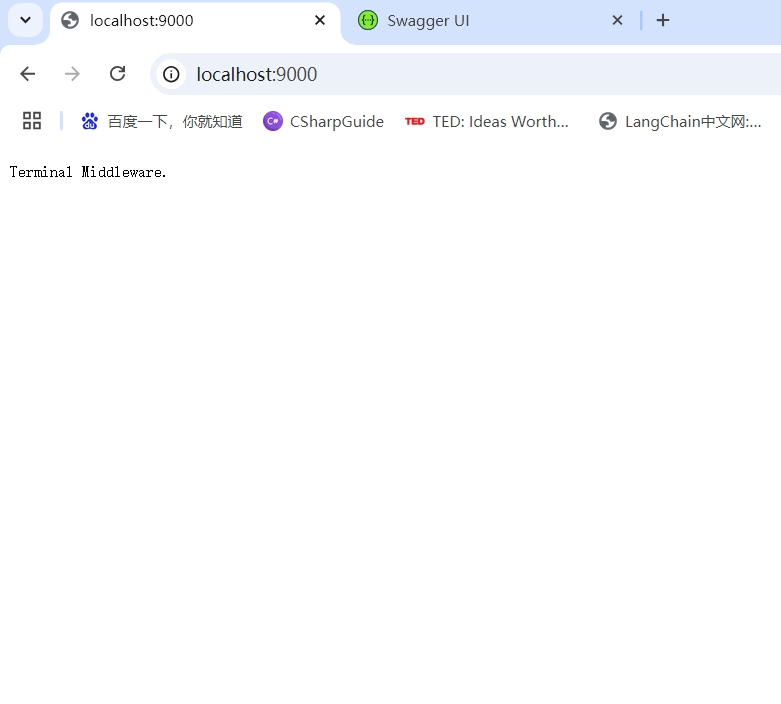
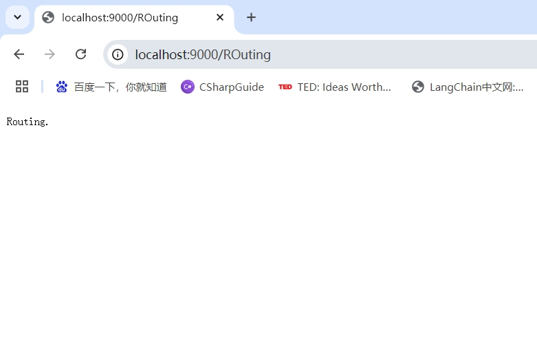
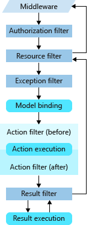

# 路由(Routing)
::: tip 参考文档
- [Routing in ASP.NET Core](https://learn.microsoft.com/en-us/aspnet/core/fundamentals/routing?view=aspnetcore-8.0)
::: 

## 路由概念

1. **.Net Core 中由`UseRouting`和`UseEndpoints`中间件实现路由。**

2. **路由(`Routing`)负责匹配传入的HTTP请求，并将这些请求分派到应用程序的可执行端点(`Endpoints`)。**

3. **端点(`Endpoints`)是应用程序的可执行请求处理代码单元。**

4. **端点(`Endpoints`)在应用中定义，并在应用启动时进行配置。**

5. **端点(`Endpoints`)匹配过程可以从请求的URL中提取值，并为请求处理提供这些值。**

6. **除此之外，路由(`Routing`)还能够生成映射到端点的url。**

### 具体实现

如果不使用`UseRouting`中间件，我们也能实现处理Http请求的功能。

示例：
Program.cs
``` C#
app.Use(async (context, next) =>
{
    if (context.Request.Path == "/")
    {
        await context.Response.WriteAsync("Terminal Middleware.");
        return;
    }

    await next(context);
});
```

运行结果如下：



由于该方法始终会中断请求，所以称之为`terminal middleware`。

而使用了`UseRouting`中间件，我们就可以：

示例：
Program.cs
``` C#
app.UseRouting();

// Approach 2: Routing.
app.MapGet("/Routing", () => "Routing.");

```

运行结果如下：



::: tip 备注
**简化写法** 

其中`app.MapGet`是 ASP.NET Core 6.0 及更高版本中用于`Minimal APIs `的方法之一，用于定义一个 GET 请求的端点。

不需要再显式调用 `UseEndpoints`，因为 `MapGet` 已经隐式地完成了端点的映射和注册工作。

而在`Controller base API`、`MVC`等其他需要`Controller`的应用程序中，

通常需要使用`MapControllers` / `MapControllerRoute`将所有符合条件的控制器动作自动添加到路由表中，启用属性路由支持，完成路由注册。

传统写法：
``` C#
app.UseRouting();

app.UseEndpoints(endpoints =>
{
    endpoints.MapControllers(); // 映射控制器端点
});

```
:::

### 涉及路由的项目

- **Minimal APIs:**

主要使用基于约定的路由。即`MapGet`、`MapPut`、`MapPost`、`MapDelete`等方式.

- **Web API:**

主要使用属性路由。即`[ApiController]` 和 HTTP 动词特性（如 `[HttpGet]`）定义路由

- **MVC:**

主要使用传统路由和属性路由。其中传统路由通过 `MapControllerRoute` 定义，路由通过名称默认确定。

- **Blazor:**

使用 `@page` 指令在 `Razor` 组件中定义路由。

## 路由匹配

### 路由模板
路由模板是 `ASP.NET Core` 中用于定义和匹配 `URL` 的规则。

通过路由模板，开发者可以灵活地控制应用程序的 `URL` 结构，

使得不同的请求能够映射到特定的处理程序（如控制器方法或 `Razor` 页面）。

#### **定义**

路由模板是一个字符串，包含静态文本和参数占位符，参数占位符用 `{}` 括起来。路由系统会根据模板与请求的 `URL` 进行匹配。

#### **组成部分**

- **静态部分**

  路由模板中的静态文本部分，例如 /products，表示固定的 URL 片段。

- **参数占位符**

  通过 {} 定义的动态参数，例如 {id}、{year:int}，表示可以接受不同值的部分。

- **可选参数**

  使用问号 ? 标记的参数，例如 {id?}，表示这个参数是可选的。

#### **使用场景**

- **`Minimal APIs`中的使用**

在不使用`Controller`的简单程序中，可以通过`MapGet`、`MapPut`、`MapPost`、`MapDelete`等方式使用路由模板定义路由。

示例：

Program.cs
``` C#
app.MapGet("/Hello", (HttpContext context) =>
{
    return "Hello World!";
});

app.MapPut("/Hello", (HttpContext context) =>
{
    return "Hello World!";
});

app.MapPost("/Hello", (HttpContext context) =>
{
    return "Hello World!";
});

app.MapDelete("/Hello", (HttpContext context) =>
{
    return "Hello World!";
});
```

- **`Web API` 及 `MVC`中使用**

在使用`MapControllers` / `MapControllerRoute`后，

当在控制器或动作方法上使用属性路由（如 `[Route]` 特性）时，路由模板立即生效。

这使得开发者能够灵活地指定每个 `API` 端点的路径。

示例：

``` C#
[Route("products")]
public class ProductsController : Controller
{
    [HttpGet("{id:int}")]
    public IActionResult GetProduct(int id)
    {
        // 处理逻辑
        return Ok();
    }
}
```

#### **全局路由配置**

- **路由模式**

在`Program.cs`或其他扩展方法中使用`app.MapControllerRoute`等方法时(.net 6 之前在`Startup.cs`的`Configure`方法中)，可以管理整个应用程序的路由规则。

示例：

``` C#
app.MapControllerRoute(
    name: "default",
    pattern: "{controller=Home}/{action=Index}/{id?}");
```

::: danger 注意
`MapControllerRoute` 是在基于 `Controller` 的 `MVC 控制器`中使用的传统路由机制，主要用于生成基于控制器名称和动作名称的 `URL`。

这个路由机制更常用于 `MVC` 应用，而不是专门为 `Web Api` 设计的场景。

因此在`Web Api中` 一般仅作为生成 `URL`的模板。
:::

- **路由前缀与路由版本控制**

1. **使用基类控制：**

示例：
``` C#
using Microsoft.AspNetCore.Mvc;

namespace WebApplicationDemo.Routing.Matching.Prefix
{
    [Route("prefix/api/v1/[controller]")]
    [ApiController]
    public abstract class BasicController_V1 : ControllerBase
    {
    }

    [Route("prefix/api/v2/[controller]")]
    [ApiController]
    public abstract class BasicController_V2 : ControllerBase
    {
    }
}
```

``` C#
using Microsoft.AspNetCore.Mvc;

// For more information on enabling Web API for empty projects, visit https://go.microsoft.com/fwlink/?LinkID=397860

namespace WebApplicationDemo.Routing.Matching.Prefix
{
    public class PrefixDemoV1Controller : BasicController_V1
    {
        // GET: api/<ValuesController>
        [HttpGet]
        public IEnumerable<string> Get()
        {
            return new string[] { "value1", "value2" };
        }

        // GET api/<ValuesController>/5
        [HttpGet("{id}")]
        public string Get(int id)
        {
            return "value";
        }

        // POST api/<ValuesController>
        [HttpPost]
        public void Post([FromBody] string value)
        {
        }

        // PUT api/<ValuesController>/5
        [HttpPut("{id}")]
        public void Put(int id, [FromBody] string value)
        {
        }

        // DELETE api/<ValuesController>/5
        [HttpDelete("{id}")]
        public void Delete(int id)
        {
        }
    }
}
```

``` C#
using Microsoft.AspNetCore.Mvc;

// For more information on enabling Web API for empty projects, visit https://go.microsoft.com/fwlink/?LinkID=397860

namespace WebApplicationDemo.Routing.Matching.Prefix
{
    public class PrefixDemoV2Controller : BasicController_V2
    {
        // GET: api/<ValuesController>
        [HttpGet]
        public IEnumerable<string> Get()
        {
            return new string[] { "value1", "value2" };
        }

        // GET api/<ValuesController>/5
        [HttpGet("{id}")]
        public string Get(int id)
        {
            return "value";
        }

        // POST api/<ValuesController>
        [HttpPost]
        public void Post([FromBody] string value)
        {
        }

        // PUT api/<ValuesController>/5
        [HttpPut("{id}")]
        public void Put(int id, [FromBody] string value)
        {
        }

        // DELETE api/<ValuesController>/5
        [HttpDelete("{id}")]
        public void Delete(int id)
        {
        }
    }
}
```

2. **使用IApplicationModelConvention添加：**
``` C#
using Microsoft.AspNetCore.Mvc;
using Microsoft.AspNetCore.Mvc.ApplicationModels;

namespace WebApplicationDemo.Routing.Matching.Prefix
{
    public class RoutePrefixConvention : IApplicationModelConvention
    {
        private readonly AttributeRouteModel _routePrefix;

        public RoutePrefixConvention(string routePrefix)
        {
            _routePrefix = new AttributeRouteModel(new RouteAttribute(routePrefix));
        }

        public void Apply(ApplicationModel application)
        {
            foreach (var controller in application.Controllers)
            {
                foreach (var selector in controller.Selectors)
                {
                    if (selector.AttributeRouteModel == null || selector.AttributeRouteModel.Template == null)
                    {
                        continue;
                    }
                    if (!selector.AttributeRouteModel.Template.StartsWith("api"))
                    {
                        continue;
                    }
                    selector.AttributeRouteModel = AttributeRouteModel.CombineAttributeRouteModel(_routePrefix, selector.AttributeRouteModel);
                }
            }
        }
    }
}
```

Program.cs

``` C#
builder.Services.AddControllers(options =>
{
    options.Conventions.Add(new RoutePrefixConvention("v1"));
});
```

::: tip Swagger 分组
开发多版本的api时一般需要在Swagger中根据版本或其他信息分组。

这里我们采用自定义特性的方式实现：

1. 添加特性：

``` C#
using Microsoft.AspNetCore.Mvc.ApiExplorer;

namespace WebApplicationDemo.Routing.Matching.Prefix
{
    public class ApiDescriptionAttribute : Attribute, IApiDescriptionGroupNameProvider
    {
        public ApiDescriptionAttribute(string title, string? version = null, string? desc = null, int position = int.MaxValue)
        {
            GroupName = version != null ? $"{title}-{version}" : title;
            Title = title;
            Version = version;
            Description = desc;
            Position = position;
        }

        /// <summary>
        /// 分组名称
        /// </summary>
        public string? GroupName { get; set; }
        /// <summary>
        /// Swagger 标题
        /// </summary>
        public string? Title { get; set; }
        /// <summary>
        /// 版本号
        /// </summary>
        public string? Version { get; set; }
        /// <summary>
        /// 描述
        /// </summary>
        public string? Description { get; set; }
        /// <summary>
        /// 分组顺序
        /// </summary>
        public int Position { get; set; }
    }
}
```

2. 添加Swagger文档:

Program.cs

``` C#
builder.Services.AddSwaggerGen(options =>
{
    // 根据模块和版本生成多个文档
    var apiAssembly = Assembly.GetExecutingAssembly();
    var apiDescriptions = apiAssembly.GetTypes()
        .Where(t => t.GetCustomAttributes<ApiDescriptionAttribute>().Any())
        .Select(t => t.GetCustomAttribute<ApiDescriptionAttribute>())
        .Distinct();

    foreach (var desc in apiDescriptions)
    {
        if (desc != null)
        {
            if (string.IsNullOrEmpty(desc.Version))
            {
                options.SwaggerDoc($"{desc.Title}", new OpenApiInfo { Title = $"{desc.Title} API", Version = desc.Version, Description = desc.Description, });
            }
            else
            {
                options.SwaggerDoc($"{desc.Title}-{desc.Version}", new OpenApiInfo
                {
                    Title = $"{desc.Title} API",
                    Version = desc.Version,
                    Description = desc.Description,
                });
            }
        }
    }
    //没有加特性的分到这个NoGroup上
    options.SwaggerDoc("NoGroup", new OpenApiInfo
    {
        Title = "无分组"
    });
    //判断接口归于哪个分组
    options.DocInclusionPredicate((docName, apiDescription) =>
    {
        if (docName == "NoGroup")
        {
            //当分组为NoGroup时，只要没加特性的都属于这个组
            return string.IsNullOrEmpty(apiDescription.GroupName);
        }
        else
        {
            return apiDescription.GroupName == docName;
        }
    });
});
```

3. 注册`SwaggerEndpoint`:

Program.cs

``` C#
app.UseSwagger();
app.UseSwaggerUI(options =>
{
    // 根据模块和版本生成多个文档
    var apiAssembly = Assembly.GetExecutingAssembly();
    var apiDescriptions = apiAssembly.GetTypes()
        .Where(t => t.GetCustomAttributes<ApiDescriptionAttribute>().Any())
        .Select(t => t.GetCustomAttribute<ApiDescriptionAttribute>())
        .OrderBy(t => t?.Position ?? int.MaxValue).ThenBy(t => t?.Title).ThenBy(t => t?.Version)
        .Distinct();

    foreach (var desc in apiDescriptions)
    {
        if (desc != null)
        {
            if (string.IsNullOrEmpty(desc.Version))
            {
                options.SwaggerEndpoint($"/swagger/{desc.Title}/swagger.json", $"{desc.Title} API");
            }
            else
            {
                options.SwaggerEndpoint($"/swagger/{desc.Title}-{desc.Version}/swagger.json", $"{desc.Title} API {desc.Version}");
            }
        }
    }

    options.SwaggerEndpoint("/swagger/NoGroup/swagger.json", "无分组");
});
```

4. 在基类或其他`Controller`中使用:

``` C#
using Microsoft.AspNetCore.Mvc;

namespace WebApplicationDemo.Routing.Matching.Prefix
{
    [Route("api/v1/[controller]")]
    [ApiController]
    [ApiDescription("ModuleA", "v1", "A模组测试")]
    public abstract class BasicController_V1 : ControllerBase
    {
    }

    [Route("api/v2/[controller]")]
    [ApiController]
    [ApiDescription("ModuleA", "v2", "A模组测试")]
    public abstract class BasicController_V2 : ControllerBase
    {
    }
}
```
:::

#### **使用示例**
1. Minimal APIs中的使用
``` C#
// 静态路由
app.MapGet("/hello", () => "Hello, World!");
// 动态参数
app.MapGet("/products/{id}", (int id) => $"Product ID: {id}");
// 可选参数
app.MapGet("/products/{id?}", (int? id) => id.HasValue ? $"Product ID: {id}" : "Product ID not provided.");
// 使用约束
app.MapGet("/orders/{orderId:int}", (int orderId) => $"Order ID: {orderId}");
// 组合路由
app.MapGet("/users/{userId}/orders/{orderId}", (string userId, string orderId) => $"User ID: {userId}, Order ID: {orderId}");
```

2. `Web API` 及 `MVC`中使用
``` C#
using Microsoft.AspNetCore.Http;
using Microsoft.AspNetCore.Mvc;

namespace WebApplicationDemo.Routing.Matching.Template
{
    [Route("api/[controller]")]
    [ApiController]
    public class ApiTemplateController : ControllerBase
    {
        /// <summary>
        /// 简单路由
        /// </summary>
        /// <returns></returns>
        [HttpGet]
        [Route("products")]
        public IActionResult GetProducts()
        {
            // 处理逻辑
            return Ok();
        }

        /// <summary>
        /// 带参数的路由
        /// </summary>
        /// <param name="id"></param>
        /// <returns></returns>
        [HttpGet]
        [Route("products/{id?}")]
        public IActionResult GetProduct(int id)
        {
            // 根据 id 处理逻辑
            return Ok(id);
        }

        /// <summary>
        /// 带约束的路由
        /// </summary>
        /// <param name="year"></param>
        /// <param name="month"></param>
        /// <param name="day"></param>
        /// <returns></returns>
        [HttpGet]
        [Route("blog/{year:int}/{month:int}/{day:int}")]
        public IActionResult Archive(int year, int month, int day)
        {
            // 处理逻辑
            return Ok($"{year}-{month}-{day}");
        }
    }
}
```

### 路由约束

当传入URL出现匹配并且URL路径被标记为路由值时，执行路由约束。

路由约束通常检查通过路由模板关联的路由值，并对该值是否可接受做出真或假的决定。

一些路由约束使用路由值之外的数据来考虑请求是否可以被路由。

#### 内置约束

.NET Core 提供了一些内置的路由约束：

示例：

``` C#
app.MapGet("/GetUserById/{id:int:min(1)}", (int id) => id);
```

``` C#
[Route("users/{id:int:min(1)}")]
public User GetUserById(int id) { }
```

对应表：

|约束|	示例|	范围|
|----|------|-------|
|`int`	|`{id:int}`	|123456789, -123456789	Matches any integer|
|`bool`	|`{active:bool}`	|true, FALSE	Matches true or false. Case-insensitive|
|`datetime`	|`{dob:datetime}`	|2016-12-31, 2016-12-31 7:32pm	Matches a valid DateTime value in the invariant culture. See preceding warning.|
|`decimal`	|`{price:decimal}`	|49.99, -1,000.01	Matches a valid decimal value in the invariant culture. See preceding warning.|
|`double`	|`{weight:double}`	|1.234, -1,001.01e8	Matches a valid double value in the invariant culture. See preceding warning.|
|`float`	|`{weight:float}`	|1.234, -1,001.01e8	Matches a valid float value in the invariant culture. See preceding warning.|
|`guid`	|`{id:guid}`	|CD2C1638-1638-72D5-1638-DEADBEEF1638	Matches a valid Guid value|
|`long`	|`{ticks:long}`	|123456789, -123456789	Matches a valid long value|
|`minlength(value)`	|`{username:minlength(4)}`	|Rick	String must be at least 4 characters|
|`maxlength(value)`	|`{filename:maxlength(8)}`	|MyFile	String must be no more than 8 characters|
|`length(length)`	|`{filename:length(12)}`	|somefile.txt	String must be exactly 12 characters long|
|`length(min,max)`	|`{filename:length(8,16)}`	|somefile.txt	String must be at least 8 and no more than 16 characters long|
|`min(value)`	|`{age:min(18)}`	|19	Integer value must be at least 18|
|`max(value)`	|`{age:max(120)}`	|91	Integer value must be no more than 120|
|`range(min,max)`	|`{age:range(18,120)}`	|91	Integer value must be at least 18 but no more than 120|
|`alpha`	|`{name:alpha}`	|Rick	String must consist of one or more alphabetical characters, a-z and case-insensitive.|
|`required`	|`{name:required}`	|Rick	Used to enforce that a non-parameter value is present during URL generation|

#### 正则约束
正则表达式可以使用`regex(…)`路由约束指定为内联约束。
``` C# 
app.MapGet("{message:regex(^\\d{{3}}-\\d{{2}}-\\d{{4}}$)}",
    () => "Inline Regex Constraint Matched");
```

``` C#
[HttpGet]
[Route("message/{message:regex(^\\d{{3}}-\\d{{2}}-\\d{{4}}$)}")]
public IActionResult Message(string message)
{
    // 处理逻辑
    return Ok(message);
}
```

``` C#
app.MapControllerRoute(
    name: "people",
    pattern: "people/{ssn}",
    constraints: new { ssn = "^\\d{3}-\\d{2}-\\d{4}$", },
    defaults: new { controller = "People", action = "List" });
```

正则表达式参考[Regular Expression Language - Quick Reference](https://learn.microsoft.com/en-us/dotnet/standard/base-types/regular-expression-language-quick-reference)

#### 自定义约束

自定义路由约束可以通过实现`irouteconstrint`接口来创建。`irouteconstrint`接口包含`Match`，如果满足约束则返回`true`，否则返回`false`。

微软不推荐自定义路由约束。在实现自定义路由约束之前，请考虑备选方案，比如模型绑定。

``` C#

using System.Globalization;
using System.Text.RegularExpressions;

namespace WebApplicationDemo.Routing.Matching.Constraints
{
    public class NoZeroesRouteConstraint : IRouteConstraint
    {
        private static readonly Regex _regex = new(
        @"^[1-9]*$",
        RegexOptions.CultureInvariant | RegexOptions.IgnoreCase,
        TimeSpan.FromMilliseconds(100));

        public bool Match(
            HttpContext? httpContext, IRouter? route, string routeKey,
            RouteValueDictionary values, RouteDirection routeDirection)
        {
            if (!values.TryGetValue(routeKey, out var routeValue))
            {
                return false;
            }

            var routeValueString = Convert.ToString(routeValue, CultureInfo.InvariantCulture);

            if (routeValueString is null)
            {
                return false;
            }

            return _regex.IsMatch(routeValueString);
        }
    }
}
```

Program.cs

``` C#
builder.Services.AddRouting(options =>
        options.ConstraintMap.Add("noZeroes", typeof(NoZeroesRouteConstraint)));
```

使用

``` C#
[HttpGet("usersid/{id:noZeroes}")]
public IActionResult GetId(string id) => Content(id);
```

### 路由优先级

端点列表按以下顺序排序：

- RouteEndpoint.Order
- route template precedence

1. RouteEndpoint.Order用法：

在某些情况下，不同的路由规则可能会冲突，通过设置Order属性设置优先级，可以解决这些冲突，确保正确的路由被调用。

``` C#
using Microsoft.AspNetCore.Mvc;

namespace WebApplicationDemo.Routing.Matching.Prioritize
{
    [Route("api/[controller]")]
    [ApiController]
    public class RoytePrioritizeController : ControllerBase
    {
        // 优先级较高的路由，冲突时优先调用
        [HttpGet("{id:int}", Order = 1)]
        public IActionResult GetRoytePrioritizeById(int id)
        {
            return Ok($"RoytePrioritize id {id}");
        }

        // 优先级较低的路由
        [HttpGet("{name:regex(^\\d{{3}}$)}", Order = 2)]
        public IActionResult GetRoytePrioritizeByName(string name)
        {
            return Ok($"RoytePrioritize name {name}");
        }
    }
}

```

假设你有如下请求：

/RoytePrioritize/123 

在没有设置优先级的情况下，会匹配到两个终结点，将会报错。`The request matched multiple endpoints.`

但是设置了优先级则会调用优先级高的那个`GetRoytePrioritizeById`。

2. route template precedence

路由模板优先级是一个系统，它根据路由模板的具体程度为每个路由模板分配一个值。

例如，`/Products/List`和`/Products/{id}`。

`/Products/List`比`/Products/{id}`更具体。

注意：Order属性优先级在具体性优先级之前。

### 路由生成

`ASP.NET Core` 中可以使用 `ControllerBase` 类中的 `Url` 属性是 用于生成 `URL` 的实用程序，

它提供了对 `IUrlHelper` 的访问，可以帮助你在控制器或视图中生成相对或绝对 `URL`。

通过 `Url`，你可以动态生成链接、操作地址、路由和其他资源地址，

通常用于重定向、导航和生成 `API` 端点。

`Url` 提供了一系列用于生成 `URL` 的方法，比如：
- `Action`: 生成操作方法的 `URL`。
- `RouteUrl`: 生成基于路由的 `URL`。
- `Content`: 将虚拟路径转换为应用程序的绝对路径。
- `Link`: 生成带有指定协议和主机的完整绝对 `URL`。

这些方法适用于生成指向控制器操作、静态资源或基于路由的`URL`，尤其是在 `MVC` 或 `Web API` 项目开发中非常有用。

示例：

``` C# 
// 生成相对 URL
// 生成 /[Controller]/[Action]id?=5
string url = Url.Action("Details", "Products", new { id = 5 });

// 生成带协议的绝对 URL
// 生成 https://your-domain//[Controller]/[Action]id?=5
string absoluteUrl = Url.Action("Details", "Products", new { id = 5 }, protocol: "https");

// Url.RouteUrl 用于基于特定路由配置生成 URL。
// 不同于 Action，RouteUrl 依赖于路由名称，而不是控制器和操作方法。
// 类似于 /[Controller]/[Action]/5
string url = Url.RouteUrl("default", new { controller = "Products", action = "Details", id = 5 });

// 将相对路径或虚拟路径转换为应用程序中的绝对路径
// 生成指向静态文件（如图片、CSS、JS）的路径。
string imageUrl = Url.Content("~/images/logo.png");

// 生成带有协议和主机的绝对 URL
// 生成类似于 https://your-domain/Products/Details/5 的完整 URL。
string link = Url.Link("default", new { controller = "Products", action = "Details", id = 5 });

// 使用 Redirect 重定向到指定的 URL
return Redirect(Url.Action("Details", "Products", new { id = 5 }));

// 使用 RedirectToAction 重定向到操作方法（基于当前Controller）
return RedirectToAction("Details", new { id = 5 });
```
::: danger 注意
1. `Url.Action` 匹配不到方法时，按默认路由模板返回。若没有默认路由模板则返回空。
2. `Url.RouteUrl`和 `Url.Link` 匹配不到路由时（优先使用命名路由，然后路由模板），返回空。当没有`controller/action`参数时取当前`controller/action`。

比如路由模板设置：

programs.cs 
``` C# 
app.UseRouting();

app.MapControllerRoute(
     name: "default",
     pattern: "api/{controller}/{action}/{id?}");

// .net 5及以前 
// app.UseEndpoints(endpoints =>
//     {
//         endpoints.MapControllerRoute(
//             name: "default",
//             pattern: "{controller=Home}/{action=Index}/{id?}");
//     });
``` 

使用上述模板时，`Url.RouteUrl("default", new { controller = "Products", action = "Details", id = 5 });`
会生成`/[Controller]/[Action]/5`
:::

::: tip 使用建议
- 如果你只需要生成相对路径的 URL，并且明确知道控制器和动作方法，使用 Url.Action。
- 如果你的项目中有复杂的路由配置，或者你依赖路由名称而不是控制器/动作来生成 URL，使用 Url.RouteUrl。
- 如果你需要生成包含协议和主机的完整绝对 URL，尤其是跨域请求或 API 开发中，使用 Url.Link。
::: 

## 参数传递

### 传递方式
在 .NET Core 中，路由参数传递有多种方式，包括路径参数、查询字符串参数、请求体参数等。不同的参数传递方式适合不同的应用场景。

1. **路径参数**
路径参数是将参数直接嵌入在 URL 路径中，例如 `/api/products/5`。路径参数通常用于 `RESTful API`，因为它有助于创建清晰、简洁的 `URL`。

``` C#
[Route("api/[controller]")]
[ApiController]
public class ProductsController : ControllerBase
{
    [HttpGet("{id}")]
    public IActionResult GetProductById(int id)
    {
        // 根据 id 获取产品信息
        return Ok(new { ProductId = id });
    }
}
```

在此示例中，`{id}` 是一个路径参数，它会接收 `URL` 中 `/api/products/5` 的 `5`，并将其传递给 `GetProductById` 方法的 `id` 参数。

2. **查询字符串参数**
查询字符串参数使用 `?` 和 `&` 在 `URL` 中传递键值对，例如 `/api/products?id=5&name=phone`。查询字符串通常用于可选参数或过滤条件。

``` C#
[HttpGet]
public IActionResult GetProductByQuery([FromQuery] int id, [FromQuery] string name)
{
    // 处理查询字符串参数 id 和 name
    return Ok(new { ProductId = id, ProductName = name });
}
```

在此例中，`/api/products?id=5&name=phone` 会传递 `id` 和 `name` 参数到方法中。

3. **表单数据参数**
表单数据参数适用于 `POST` 请求，并且常用于传递表单提交的数据。可以通过 `[FromForm]` 指定接收表单数据。

示例代码
``` C#
[HttpPost]
public IActionResult CreateProduct([FromForm] ProductModel product)
{
    // 处理表单数据中的 product 对象
    return Ok(product);
}
```
此代码中，客户端可以通过 `application/x-www-form-urlencoded` 或 `multipart/form-data` 格式提交表单数据。

4. **请求体参数**
对于需要传递 JSON、XML 等格式的数据，可以使用 `[FromBody]` 标记参数以从请求体中解析数据。这种方式常用于 `POST`、`PUT` 等方法，尤其适合传递复杂对象。

示例代码
``` C#
[HttpPost]
public IActionResult CreateProduct([FromBody] ProductModel product)
{
    // 处理请求体中的 product 对象
    return Ok(product);
}
```
在这里，客户端可以发送 JSON 格式的请求体，如 `{ "id": 5, "name": "phone" }`，并将其解析到 product 对象。

::: tip  Content-type
在 HTTP 协议中，客户端和服务器之间通过请求和响应进行通信。

在这个过程中，传输的数据有各种不同的格式类型，为了确保双方能够正确理解和处理数据，`Content-Type`头部字段就显得尤为重要。

**常见的 `Content-Type` 类型**

1.`text/html`
`text/html` 是最常见的 `Content-Type` 类型之一，表示该内容是 `HTML` 文档。

示例：

``` text
GET /index.html HTTP/1.1
Host: example.com
Content-Type: text/html
```

2. `application/json`
`application/json` 表示内容是 `JSON (JavaScript Object Notation)` 格式。`JSON` 是一种轻量级的数据交换格式，广泛用于 `API` 的请求和响应中。

示例：

``` text
POST /api/users HTTP/1.1
Host: example.com
Content-Type: application/json

{
  "name": "Jane Smith",
  "age": 30,
  "email": "jane@example.com"
}
```

3. `application/x-www-form-urlencoded`
`application/x-www-form-urlencoded` 是 `HTML` 表单默认的 `Content-Type` 类型，表示数据以键值对形式进行编码。

示例：

``` text
POST /login HTTP/1.1
Host: example.com
Content-Type: `application/x-www-form-urlencoded`

username=johndoe&password=123456
```

这种编码方式也广泛用于 `GET` 请求的查询字符串。

4. `multipart/form-data`

`multipart/form-data` 通常用于表单数据中包含文件上传的情景。

在这种类型中，数据被拆分成多个部分，每个部分包含自己独立的头部信息。

``` text
POST /upload HTTP/1.1
Host: example.com
Content-Type: multipart/form-data; boundary=----WebKitFormBoundary7MA4YWxkTrZu0gW

------WebKitFormBoundary7MA4YWxkTrZu0gW
Content-Disposition: form-data; name="file"; filename="example.txt"
Content-Type: text/plain

...file content here...
------WebKitFormBoundary7MA4YWxkTrZu0gW--
```

5. `text/plain`
`text/plain` 表示内容是纯文本，不包含格式化信息。通常用于简单的文本内容，没有特殊的意义标记。


``` text
POST /text HTTP/1.1
Host: example.com
Content-Type: text/plain

Hello, World!

```

6. `application/xml`
`application/xml` 表示内容是 `XML (eXtensible Markup Language)` 文档。`XML` 是一种标记语言，被广泛应用于数据传输和配置文件中。


``` text
POST /api/users HTTP/1.1
Host: example.com
Content-Type: application/xml

<user>
  <name>John Doe</name>
  <email>john@example.com</email>
</user>
```

**如何选择合适的 `Content-Type`**
- **`HTML` 内容**：如果 `API` 或网站需要渲染 `HTML` 页面，使用 `text/html`。
- **`JSON` 数据**：对于 `RESTful APIs`，`JSON` 通常是首选格式，使用 `application/json`。
- **文件上传**：当需要上传文件时，使用 `multipart/form-data`。
- **表单提交**：简单的表单数据提交通常使用 `application/x-www-form-urlencoded`。
- **纯文本**：如果只需要发送简单的文本信息，使用 `text/plain`。

:::

### 参数校验

1. **数据注解(属性级别校验)**
数据注解是最常用的校验方式，通过为模型属性添加注解来自动校验输入值。

例如，`[Required]`、`[Range]` 等注解可以用来校验字段是否为空、是否在指定范围内等。

若需要自定义注解，也可通过`ValidationAttribute`实现

示例：

``` C#
 public class NotEmptyOrWhiteSpaceAttribute : ValidationAttribute
 {
     private string _errorMessage;

     public NotEmptyOrWhiteSpaceAttribute(string errorMessage = "")
     {
         _errorMessage = errorMessage;
     }

     protected override ValidationResult? IsValid(object? value, ValidationContext validationContext)
     {
         if (value is string str && string.IsNullOrWhiteSpace(str))
         {
             return new ValidationResult(_errorMessage);
         }
         return ValidationResult.Success;
     }
 }

public class ParamsVerificationModelRequest
 {
     [Range(10, 19, ErrorMessage = "Id must be a positive number.")]
     public int Id { get; set; }

     [StringLength(100, ErrorMessage = "Name length can't exceed 100 characters.")]
     public string? Name { get; set; }

     [NotEmptyOrWhiteSpace(ErrorMessage = "Label can't be null.")]
     public string? Label { get; set; }

     public override string? ToString()
     {
         return $"Id:{Id};Name:{Name};Label:{Label};";
     }
 }

[Route("api/[controller]")]
[ApiController]
public class ParamsVerificationController : ControllerBase
{
    [HttpPost("GetValueByFormRequest")]
    public IActionResult GetValueByFormRequest([FromForm] ParamsVerificationModelRequest request)
    {
        return Ok(request);
    }

    [HttpPost("GetValueByBodyRequest")]
    public IActionResult GetValueByBodyRequest([FromBody] ParamsVerificationModelRequest request)
    {
        return Ok(request);
    }
}
```

以下是一些内置验证特性：

- `[CreditCard]`：验证属性是否具有信用卡格式。
- `[Compare]`：验证模型中的两个属性是否匹配。
- `[EmailAddress]`：验证属性是否具有电子邮件格式。
- `[Phone]`：验证属性是否具有电话号码格式。
- `[Range]`：验证属性值是否在指定的范围内。
- `[RegularExpression]`：验证属性值是否与指定的正则表达式匹配。
- `[Required]`：验证字段是否不为 null。 有关此属性的行为的详细信息。
- `[StringLength]`：验证字符串属性值是否不超过指定长度限制。
- `[Url]`：验证属性是否具有 URL 格式。
- `[Remote]`：通过在服务器上调用操作方法来验证客户端上的输入。

2. **`IValidatableObject`(模型级别校验)**
如果需要基于多个字段的关联进行校验，可以通过实现 `IValidatableObject` 接口的 `Validate` 方法，实现模型级别的校验逻辑。

示例：

``` C#
public class ParamsVerificationModelRequest1 : IValidatableObject
{
    public decimal Price { get; set; }
    public decimal Discount { get; set; }
    public decimal Price1 { get; set; }
    public decimal Discount1 { get; set; }
    public IEnumerable<ValidationResult> Validate(ValidationContext validationContext)
    {
        if (Discount > Price)
        {
            yield return new ValidationResult("Discount cannot be greater than Price.", new [] { "Discount" });
        }
        if (Discount1 > Price1)
        {
            yield return new ValidationResult("Discount1 cannot be greater than Price1.", new[] { "Discount1" });
        }
    }
}

[Route("api/[controller]")]
[ApiController]
public class ParamsVerificationController : ControllerBase
{
    [HttpPost("GetValueByBodyRequest1")]
    public IActionResult GetValueByBodyRequest1([FromBody] ParamsVerificationModelRequest1 request)
    {
        return Ok(request);
    }
}
```


3. **FluentValidation 校验库(复杂的校验逻辑)**

对于复杂的校验逻辑，`FluentValidation` 提供了更灵活的校验方式。它允许使用流式 API 编写验证规则。

示例：

``` C#
public class ParamsVerificationFluentRequest
{
    public int Id { get; set; }
    public string? Name { get; set; }
    public decimal Price { get; set; }
    public int StockQuantity { get; set; }
}

public class ParamsVerificationFluentRequestValidator : AbstractValidator<ParamsVerificationFluentRequest>
{
    public ParamsVerificationFluentRequestValidator()
    {
        RuleFor(x => x.Id)
            .GreaterThan(0).WithMessage("Id must be greater than 0.")
            .NotEmpty().WithMessage("Id is required.");

        RuleFor(x => x.Name)
            .NotEmpty().WithMessage("Name is required.")
            .Length(2, 50).WithMessage("Name length must be between 2 and 50 characters.");

        RuleFor(x => x.Price)
            .GreaterThan(0).WithMessage("Price must be greater than 0.");

        RuleFor(x => x.StockQuantity)
            .GreaterThan(10)
            .When(x => x.Price > 100)
            .WithMessage("If the price is greater than 100, stock quantity must be above 10.");
    }
}

public class ParamsVerificationFluentRequestList
{
    public List<ParamsVerificationFluentRequest>? ParamsVerificationFluents { get; set; }
}

public class ParamsVerificationsValidator : AbstractValidator<ParamsVerificationFluentRequestList>
{
    public ParamsVerificationsValidator()
    {
        RuleForEach(x => x.ParamsVerificationFluents).SetValidator(new ParamsVerificationFluentRequestValidator());
    }
}

[Route("api/[controller]")]
[ApiController]
public class ParamsVerificationController : ControllerBase
{
    [HttpPost("GetValueByFluentRequest")]
    public IActionResult GetValueByFluentRequest([FromBody] ParamsVerificationFluentRequest request)
    {
        return Ok(request);
    }

    [HttpPost("GetValueByFluentListRequest")]
    public IActionResult GetValueByFluentListRequest([FromBody] ParamsVerificationFluentRequestList request)
    {
        return Ok(request);
    }
}

```

::: danger 注意
1. **传统MVC框架下需要手动触发模型验证**

示例：

``` C#
public IActionResult GetValueByQueryRequestId([FromQuery] ParamsVerificationQueryRequest request)
{
    if (!ModelState.IsValid)
    {
        return BadRequest(ModelState);
    }
    return Ok(new { request.Id });
}
```

2. **路径参数和查询字符串传参**

路径参数和查询字符串传参可以在参数前添加数据校验：

示例：

``` C#
[HttpGet("GetValueByRouteId/{id}")]
public IActionResult GetValueByRouteId([FromRoute, Range(0, 9)] int id)
{
    return Ok(new { Id = id });
}

[HttpGet("GetValueByQueryId")]
public IActionResult GetValueById([FromQuery, Range(21, 29)] int id)
{
    return Ok(new { Id = id });
}
```

也可以自定义模型，然后通过上述方法校验：

示例：

``` C#
public class ParamsVerificationQueryRequest
{
    [Range(10, 19, ErrorMessage = "Id must be a positive number.")]
    public int Id { get; set; }
}

[Route("api/[controller]")]
[ApiController]
public class ParamsVerificationController : ControllerBase
{
    [HttpGet("GetValueByRouteId/{id}")]
    public IActionResult GetValueByRouteId([FromRoute, Range(0, 9)] int id)
    {
        return Ok(new { Id = id });
    }

    [HttpGet("GetValueByQueryId")]
    public IActionResult GetValueById([FromQuery, Range(21, 29)] int id)
    {
        return Ok(new { Id = id });
    }
}
```
:::

## 路由终结点

路由终结点是处理请求的最终目标，可以是控制器的操作方法、Razor 页面或其他处理逻辑。

每个终结点都与一个特定的 URL 路径和 HTTP 方法（如 GET、POST）相关联。

路由终结点的类型主要有以下几种：

1. 简单终结点：通过 `MapGet`、`MapPost` 等方法定义的简单终结点。
2. 中间件终结点：在中间件中自定义逻辑处理的终结点。
3. 控制器终结点：通过 `MVC` 或 `Web API` 控制器创建的终结点，通常与控制器的方法相关联。

### 简单终结点
简单终结点（`Simple Endpoints`）是在 `.NET Core` 中通过直接在 `Program.cs`(或`Startup.cs` 的 `Configure`) 方法中使用 `MapGet`、`MapPost` 等方法定义的路由终结点。

这种方式非常直观且适合处理简单的 HTTP 请求，而无需创建完整的控制器。

示例：

``` C#
app.UseEndpoints(endpoints =>
{
    endpoints.MapGet("/api/hello", async context =>
    {
        await context.Response.WriteAsync("Hello, World!");
    });

    endpoints.MapPost("/api/data", async context =>
    {
        var data = await new StreamReader(context.Request.Body).ReadToEndAsync();
        // 处理接收到的数据
        await context.Response.WriteAsync($"Received: {data}");
    });
});

```

::: tip HTTP 动词（`HTTP Methods`）
HTTP 动词（`HTTP Methods`）是指在 HTTP 请求中指示所需操作的操作符。

每个动词对应着不同的操作，主要用于对服务器上的资源进行 `CRUD`（创建、读取、更新、删除）操作。

以下是一些常见的 HTTP 动词及其用途：

1. GET
描述：请求指定资源的信息。
用途：用于获取数据，通常不应修改服务器上的任何资源。
示例：GET /api/users 获取用户列表。

2. POST
描述：向服务器提交数据，通常用于创建新资源。
用途：用于将数据发送到服务器并可能导致服务器状态的变化。
示例：POST /api/users 创建一个新用户。

3. PUT
描述：更新指定资源的信息。
用途：用于替换资源的全部内容或创建一个新资源（如果资源不存在）。
示例：PUT /api/users/1 更新 ID 为 1 的用户信息。

4. PATCH
描述：部分更新指定资源的信息。
用途：用于对资源的部分字段进行修改，而不是替换整个资源。
示例：PATCH /api/users/1 仅更新 ID 为 1 的用户的某些字段。

5. DELETE
描述：请求删除指定的资源。
用途：用于删除服务器上的资源。
示例：DELETE /api/users/1 删除 ID 为 1 的用户。

6. HEAD
描述：类似于 GET 请求，但服务器只返回响应头，不返回响应体。
用途：用于获取资源的元数据，例如内容类型和内容长度。
示例：HEAD /api/users 获取用户列表的元数据。

7. OPTIONS
描述：请求服务器支持的 HTTP 方法。
用途：用于获取服务器支持的请求方法和其他相关信息，通常用于 CORS（跨源资源共享）。
示例：OPTIONS /api/users 获取关于用户列表的允许方法。

8. TRACE
描述：用于回显服务器收到的请求，主要用于诊断目的。
用途：可用于调试和测试请求在网络中的传递。
示例：TRACE /api/users 回显请求。

在 `.NET Core` 中，提供 Get(`MapGet`,`[HttpGet]`)、Post(`MapPost`, `[HttpPost]`)、Put(`MapPut`,`[HttpPut]` ) 和 Delete(`MapDelete`, `[HttpDelete]`) 等方法来处理HTTP请求简化和优化路由终结点的定义。
:::

### 中间件终结点

中间件终结点（Middleware Endpoints）是在 .NET Core 中使用中间件处理 HTTP 请求的一种方式。

中间件是一个处理请求和响应的组件，可以在请求管道中进行各种操作，例如身份验证、日志记录、异常处理等。

中间件终结点通常与其他终结点结合使用，以便在请求到达终结点之前或之后执行特定逻辑。

详情参考[中间件与管道](4.中间件与管道.md)。

### 控制器终结点

在 `ASP.NET Core 中`，控制器（Controller）是处理 HTTP 请求的核心部分。

根据应用的类型和需求，`ASP.NET Core` 提供了几种常见的控制器类型，主要用于 `Web API` 和` MVC（Model-View-Controller`项目。

- API 控制器（Web API Controllers）
- MVC 控制器（MVC Controllers）
- Razor Pages 控制器

#### API 控制器（Web API Controllers） 

API 控制器是 ASP.NET Core 中处理 HTTP 请求并返回响应的主要组件，特别用于构建 RESTful API。

它们提供了组织和管理 API 逻辑的方式，使得开发、维护和扩展 API 更加高效。

示例（具有读写操作的API控制器）：

``` C#
using Microsoft.AspNetCore.Mvc;

// For more information on enabling Web API for empty projects, visit https://go.microsoft.com/fwlink/?LinkID=397860

namespace WebApplicationDemo.Routing.Templates
{
    [Route("api/[controller]")]
    [ApiController]
    public class ApiEndpointsController : ControllerBase
    {
        // GET: api/<ValuesController>
        [HttpGet]
        public IEnumerable<string> Get()
        {
            return new string[] { "value1", "value2" };
        }

        // GET api/<ValuesController>/5
        [HttpGet("{id}")]
        public string Get(int id)
        {
            return "value";
        }

        // POST api/<ValuesController>
        [HttpPost]
        public void Post([FromBody] string value)
        {
        }

        // PUT api/<ValuesController>/5
        [HttpPut("{id}")]
        public void Put(int id, [FromBody] string value)
        {
        }

        // DELETE api/<ValuesController>/5
        [HttpDelete("{id}")]
        public void Delete(int id)
        {
        }
    }
}
```

**常用属性**

1. **HttpContext**

HttpContext 是 ASP.NET Core 中用于封装 HTTP 请求和响应信息的对象，ControllerBase 类通过 HttpContext 属性提供对该对象的访问。

通过 HttpContext，你可以获取当前请求的各种上下文信息，比如请求头、请求体、查询参数、用户身份、会话等，进行更高级的操作。

- **HttpContext.Request**

示例
``` C#
//Headers: 获取请求头。
var userAgent = HttpContext.Request.Headers["User-Agent"].ToString();
// Query: 获取查询参数。
var queryParam = HttpContext.Request.Query["id"].ToString();
// Path: 获取请求的路径。
var path = HttpContext.Request.Path;
// Method: 获取 HTTP 请求方法（如 GET, POST 等）。
var method = HttpContext.Request.Method;
// Body: 访问请求体数据，通常用于读取 JSON、XML 等格式的数据。
using (var reader = new StreamReader(HttpContext.Request.Body))
{
    var body = await reader.ReadToEndAsync();
}
```

- **HttpContext.Response**

示例
``` C#
// StatusCode: 设置或获取 HTTP 响应的状态码。
HttpContext.Response.StatusCode = 404;
// Headers: 设置响应头。
HttpContext.Response.Headers["Custom-Header"] = "Value";
// Body: 写入响应体。
await HttpContext.Response.WriteAsync("Hello, world!");
```

- **HttpContext.User**

HttpContext.User 用于访问经过身份验证的用户信息。它包含用户的身份、角色和声明。

示例
``` C#
// Identity: 获取当前用户的身份。
var userName = HttpContext.User.Identity.Name;
// IsAuthenticated: 检查用户是否经过身份验证。
bool isAuthenticated = HttpContext.User.Identity.IsAuthenticated;
// 获取用户的声明信息。
var claims = HttpContext.User.Claims;
foreach (var claim in claims)
{
    var type = claim.Type;
    var value = claim.Value;
}

```

- **HttpContext.Session**

HttpContext.Session 用于在不同的请求之间存储和读取会话数据。

示例
``` C#
// SetString: 设置会话数据。
HttpContext.Session.SetString("SessionKey", "SessionValue");
// GetString: 读取会话数据。
var sessionValue = HttpContext.Session.GetString("SessionKey");
// Remove: 删除会话数据。
HttpContext.Session.Remove("SessionKey");

```

- **HttpContext.Items**

Items 是一个 IDictionary 对象，存储请求期间可用的数据，

通常用于在中间件或控制器之间传递信息（服务端 => 服务端 一次请求的生命周期内存储和共享数据的字典）。

示例
``` C#
HttpContext.Items["MyKey"] = "SomeValue";
var value = HttpContext.Items["MyKey"];
```

- **HttpContext.Connection**

Connection 提供与客户端连接的详细信息，例如 IP 地址和端口号。

示例
``` C#
// RemoteIpAddress: 获取客户端 IP 地址。
var clientIp = HttpContext.Connection.RemoteIpAddress.ToString();
// LocalIpAddress: 获取服务器 IP 地址。
var serverIp = HttpContext.Connection.LocalIpAddress.ToString();

```

2. **返回值类型**

- **`IActionResult`**：

通用的返回类型，允许返回多种不同的响应类型。

示例：

``` C#
public IActionResult GetProduct(int id)
{
    if (id <= 0) return BadRequest(); // 400 Bad Request
    var product = _productService.GetProductById(id);
    if (product == null) return NotFound(); // 404 Not Found
    return Ok(product); // 200 OK
}
```

2. **`ActionResult<T>`**

强类型的返回类型，表示返回的内容类型为 T，同时也支持返回 IActionResult。

示例：

``` C#
public ActionResult<Product> GetProduct(int id)
{
    var product = _productService.GetProductById(id);
    if (product == null) return NotFound(); // 404 Not Found
    return Ok(product); // 200 OK
}
```

3. **`ObjectResult`**

包含数据的响应对象，支持设置状态码和内容类型。

示例：

``` C#
public IActionResult GetProducts()
{
    var products = _productService.GetAllProducts();
    return new ObjectResult(products) { StatusCode = 200 }; // 200 OK
}
```

4. **`ContentResult`**

用于返回纯文本内容的响应。

示例：

``` C#
public ContentResult GetText()
{
    return Content("Hello, World!", "text/plain");
}
```

5. **`JsonResult`**

用于返回 JSON 格式的响应。

示例：

``` C#
public JsonResult GetJson()
{
    var data = new { Name = "Sample", Value = 42 };
    return new JsonResult(data); // 返回 JSON
}
```

6. **状态码方法**

直接返回相应状态码的结果。

示例：

``` C#
public IActionResult CreateProduct(Product product)
{
    if (!ModelState.IsValid) return BadRequest(ModelState); // 400 Bad Request
    _productService.CreateProduct(product);
    return CreatedAtAction(nameof(GetProduct), new { id = product.Id }, product); // 201 Created
}
```

::: tip 场景状态码方法
- `Ok()`：返回 200 OK 响应，可以不带参数（表示成功）或带有序列化的数据。
- `NotFound()`：返回 404 Not Found 响应，通常用于表示请求的资源不存在。
- `BadRequest()`：返回 400 Bad Request 响应，通常用于请求数据无效时。
- `Unauthorized()`：返回 401 Unauthorized 响应，表示请求未通过身份验证。
- `Forbid()`：返回 403 Forbidden 响应，表示服务器理解请求但拒绝处理。
- `NoContent()`：返回 204 No Content 响应，表示请求成功但没有内容返回。
- `CreatedAtAction()`：返回 201 Created 响应，通常用于资源创建成功时，并且可以指定新资源的路径。
- `Created()`：类似于 CreatedAtAction()，返回 201 Created 响应，通常用于指定新资源的 URI。
- `Conflict()`：返回 409 Conflict 响应，表示请求与服务器当前状态冲突。
:::

7. **文件结果**

可以返回文件内容，使用 FileResult 类型。

示例：

``` C#
public IActionResult DownloadFile()
{
    var filePath = "path/to/file.txt";
    return PhysicalFile(filePath, "text/plain", "downloadedFile.txt"); // 返回文件下载
}
```

其他方法如特性路由、参数校验、等均在上文中介绍。

#### MVC 控制器（MVC Controllers）
MVC 控制器是 ASP.NET Core MVC 中的核心组件之一，负责处理 HTTP 请求并返回响应。

它是 MVC（模型-视图-控制器）设计模式的一部分，旨在分离应用程序的逻辑、用户界面和数据模型。

示例（具有读写操作的 MVC控制器）：

``` C#
using Microsoft.AspNetCore.Http;
using Microsoft.AspNetCore.Mvc;

namespace WebApplicationDemo.Routing.Templates
{
    public class MvcEndpointsController : Controller
    {
        // GET: MvcTemplateController
        public ActionResult Index()
        {
            return View();
        }

        // GET: MvcTemplateController/Details/5
        public ActionResult Details(int id)
        {
            return View();
        }

        // GET: MvcTemplateController/Create
        public ActionResult Create()
        {
            return View();
        }

        // POST: MvcTemplateController/Create
        [HttpPost]
        [ValidateAntiForgeryToken]
        public ActionResult Create(IFormCollection collection)
        {
            try
            {
                return RedirectToAction(nameof(Index));
            }
            catch
            {
                return View();
            }
        }

        // GET: MvcTemplateController/Edit/5
        public ActionResult Edit(int id)
        {
            return View();
        }

        // POST: MvcTemplateController/Edit/5
        [HttpPost]
        [ValidateAntiForgeryToken]
        public ActionResult Edit(int id, IFormCollection collection)
        {
            try
            {
                return RedirectToAction(nameof(Index));
            }
            catch
            {
                return View();
            }
        }

        // GET: MvcTemplateController/Delete/5
        public ActionResult Delete(int id)
        {
            return View();
        }

        // POST: MvcTemplateController/Delete/5
        [HttpPost]
        [ValidateAntiForgeryToken]
        public ActionResult Delete(int id, IFormCollection collection)
        {
            try
            {
                return RedirectToAction(nameof(Index));
            }
            catch
            {
                return View();
            }
        }
    }
}
```

其用法基本与API控制器相同，不同的是：

1. **基类**

**MVC 控制器**：通常继承自 Controller 类，适用于返回视图（HTML）。

**API 控制器**：通常继承自 ControllerBase 类，适用于返回数据（如 JSON 或 XML），不处理视图。

2. **返回类型**

**MVC 控制器**：可以返回视图、重定向、文件等。典型的返回方法包括 View(), Redirect(), Content()。

**API 控制器**：专注于返回数据对象。典型的返回方法包括 Ok(), NotFound(), BadRequest()。

3. **状态码处理**

**MVC 控制器**：通过返回视图和重定向来处理状态码，通常不直接返回状态码。

**API 控制器**：明确返回状态码，以反映请求的结果，使用 Ok(), NotFound(), BadRequest() 等。

#### Razor Pages 控制器

Razor Pages 是 ASP.NET Core 中的一种简化开发模式，它不依赖传统的控制器，而是使用页面模型（Page Model）来处理请求。

每个 Razor 页面都有一个对应的页面模型，它类似于控制器，但与视图紧密结合，适合轻量级的页面处理。

**待补充...**

## 过滤器

.NET Core中的过滤器允许代码在请求处理管道的特定阶段之前或之后运行。

### 执行顺序

**中间件内执行顺序：**


**过滤器执行顺序：**



### 授权过滤器(Authorization Filter)

授权过滤器（Authorization Filters）是用于控制用户访问权限的重要机制，通常用于实现基于角色、声明或策略的访问控制。

授权过滤器可帮助开发者在应用程序的不同部分保护资源，确保只有经过身份验证并具有适当权限的用户才能访问。

授权过滤器位于请求处理管道的早期阶段。在 ASP.NET Core 中，当请求到达时，授权过滤器会检查用户的身份验证状态和授权信息。

如果用户不满足授权条件，则请求会被拦截并返回 403 或 401 状态码，表示用户未授权或未认证。

**适用场景**

1. **身份验证和登录**：授权过滤器可以用于验证用户是否已经通过身份验证，并且只有已登录的用户才能够访问受保护的资源。
2. **用户角色和权限管理**：授权过滤器可以用于检查用户所属的角色或权限，以决定是否允许用户访问某些特定的功能或资源。
3. **访问级别控制**：授权过滤器可以根据用户的访问级别（如管理员、普通用户等）来限制对某些敏感操作或敏感数据的访问。
4. **API 接口访问控制**：对于 Web API，授权过滤器可以用于验证调用 API 的客户端身份，并基于验证结果决定是否允许客户端访问 API 中的资源。
5. **多租户应用程序**：对于分布式或多租户的应用程序，授权过滤器可以用于验证用户所属的租户，并根据租户的许可或设置限制用户对资源的访问。

需要注意的是，授权过滤器只是整个授权机制的一部分。它通常与身份验证机制（如 Cookie、JWT 等）和角色/权限管理系统配合使用，以实现完整的资源访问控制。

::: tip 
示例仅实现基础功能，完整方案参考[认证与授权](9.认证与授权.md)
:::

#### 通过`Authorize`特性使用授权过滤器

1. `Program.cs`

``` C#
using Microsoft.AspNetCore.Authentication.JwtBearer;
using Microsoft.IdentityModel.Tokens;
using Microsoft.AspNetCore.Builder;
using Microsoft.Extensions.DependencyInjection;
using System.Text;

var builder = WebApplication.CreateBuilder(args);

// 配置身份验证
// 使用JwtBearer需要安装Microsoft.AspNetCore.Authentication.JwtBearer
 builder.Services.AddAuthentication("Bearer")
     .AddJwtBearer("Bearer", options =>
     {
         options.TokenValidationParameters = new TokenValidationParameters
         {
             ValidateIssuer = true,
             ValidateAudience = true,
             ValidateLifetime = true,
             ValidateIssuerSigningKey = true,
             ValidIssuer = "DemoIssuer",
             ValidAudience = "DemoAudience",
             IssuerSigningKey = new SymmetricSecurityKey(Encoding.UTF8.GetBytes("MyNewSuperSecretKey@01234567890123456789"))
         };
     });

 builder.Services.AddAuthorization(options =>
 {
     options.AddPolicy("RequireAdministratorRole", policy =>
          policy.RequireRole("Admin"));
 });

// 注册控制器
builder.Services.AddControllers();

var app = builder.Build();

// 使用身份验证和授权
app.UseAuthentication();
app.UseAuthorization();

app.MapControllers();

app.Run();

```

2. **Controller**:

``` C#
using Microsoft.AspNetCore.Authorization;
using Microsoft.AspNetCore.Http;
using Microsoft.AspNetCore.Mvc;
using Microsoft.IdentityModel.Tokens;
using System.ComponentModel.DataAnnotations;
using System.IdentityModel.Tokens.Jwt;
using System.Security.Claims;
using System.Text;
using WebApplicationDemo.Routing.Matching.Prefix;

namespace WebApplicationDemo.Routing.Filters.AuthorizeFilter
{
    public class UserLogin
    {
        [Required]
        public string? Username { get; set; }
        [Required]
        public string? Password { get; set; }
    }

    [Route("api/v1/[controller]")]
    [ApiController]
    [ApiDescription("AuthorizationSimple", "v1", "权限测试：admin, password")]
    public abstract class AuthorizeBasicController : ControllerBase
    {
    }

    [Route("api/[controller]")]
    [ApiController]
    public class AuthorizeLoginController : AuthorizeBasicController
    {
        [HttpPost("login")]
        public IActionResult Login([FromBody] UserLogin login)
        {
            // 在这里，您可以验证用户的凭据
            if (login.Username == "admin" && login.Password == "password") // 简单的模拟
            {
                var claims = new List<Claim>
                {
                    new Claim(ClaimTypes.Name, login.Username),
                    new Claim(ClaimTypes.Role, "Admin")
                };

                var key = new SymmetricSecurityKey(Encoding.UTF8.GetBytes("MyNewSuperSecretKey@01234567890123456789"));
                var creds = new SigningCredentials(key, SecurityAlgorithms.HmacSha256);

                var token = new JwtSecurityToken(
                    issuer: "DemoIssuer",
                    audience: "DemoAudience",
                    claims: claims,
                    expires: DateTime.Now.AddMinutes(6),
                    signingCredentials: creds);

                return Ok(new { token = new JwtSecurityTokenHandler().WriteToken(token) });
            }

            return Unauthorized();
        }
    }


    [Route("api/[controller]")]
    [ApiController]
    [Authorize]
    public class AuthorizeFilterController : AuthorizeBasicController
    {
        [Authorize]
        [HttpGet("AuthorizeOnlyAction")]
        public IActionResult AuthorizeOnlyAction()
        {
            // 所有角色都可以访问
            return Ok("AuthorizeOnlyAction");
        }


        [Authorize(Roles = "Admin")]
        [HttpGet("AdminOnlyAction")]
        public IActionResult AdminOnlyAction()
        {
            // 基于角色（仅 Admin 角色可以访问）
            return Ok("AdminOnlyAction"); 
        }

        [Authorize(Policy = "RequireAdministratorRole")]
        [HttpGet("AdminAction")]
        public IActionResult AdminAction()
        {
            // 基于策略（根据策略进行访问控制）
            return Ok("RequireAdministratorRole"); 
        }
    }
}
```

#### 自定义授权过滤器

以自动刷新Token为例：

1. **新建`CustomAuthorizationFilter`** :

``` C#
using Microsoft.AspNetCore.Mvc;
using Microsoft.AspNetCore.Mvc.Filters;
using System.IdentityModel.Tokens.Jwt;

namespace WebApplicationDemo.Routing.Filters.AuthorizeFilter
{
    public class CustomAuthorizationFilter : IAuthorizationFilter
    {
        private readonly ILogger<CustomAuthorizationFilter> _logger;

        public CustomAuthorizationFilter(ILogger<CustomAuthorizationFilter> logger)
        {
            _logger = logger;
        }
        public void OnAuthorization(AuthorizationFilterContext context)
        {
            try
            {
                if (context.HttpContext.User.Identity == null)
                {
                    return;
                }

                if (!context.HttpContext.User.Identity.IsAuthenticated)
                { 
                    // 返回 401 Unauthorized
                    // 设置result会导致短路
                    // context.Result = new UnauthorizedResult();
                    return;
                }

                var expTimeStampStr = context.HttpContext.User.Claims
                    .Where(r => r.Type == JwtRegisteredClaimNames.Exp)
                    .Select(x => x.Value).FirstOrDefault();

                if (!string.IsNullOrEmpty(expTimeStampStr))
                {
                    var expTimeStamp = Convert.ToInt64(expTimeStampStr);
                    DateTime expTime = new DateTime(1970, 1, 1).AddSeconds(expTimeStamp);

                    var expTimeSeconds = (expTime - DateTime.UtcNow).TotalSeconds;
                    //小于5分钟，标注自动刷新，客户端拿到自动刷新
                    if (expTimeSeconds < 300)
                    {
                        context.HttpContext.Response.Headers.Append("ExpFlag", "1");
                        _logger.LogInformation($"{expTimeSeconds}s后过期, 自动刷新......");
                        return;
                    }
                    _logger.LogInformation($"{expTimeSeconds}s后过期, 无需自动刷新......");
                }
            }
            catch(Exception e)
            {
                _logger.LogError(e.Message + "\r\n" + e.StackTrace);
            }
        }
    }
}
```

2. **Program.cs 注册服务**：

``` C#
builder.Services.AddControllers(options =>
{
    //全局过滤器作用于全局，每个Controller都会执行
    // 注册为全局过滤器
    options.Filters.Add<CustomAuthorizationFilter>();
    // 注册为全局资源过滤器
});
```

### 资源过滤器(Resource Filter)

资源过滤器（Resource Filter）是 ASP.NET Core 中一种用于在请求处理期间对资源进行前置或后置处理的过滤器类型。

资源过滤器允许您在请求处理的不同阶段对资源进行拦截、修改或替换，以实现一些通用的处理逻辑或功能增强。

`ASP.NET Core` 提供了两个内置的资源过滤器接口：

- **`IResourceFilter`**：定义了 `BeforeResourceExecution` 和 `AfterResourceExecution` 方法，分别在请求处理前和请求处理后被调用。
- **`IAsyncResourceFilter`**：与 `IResourceFilter` 类似，但支持异步操作。

**适用场景:**

- **认证和授权**：资源过滤器可以用于实现认证和授权逻辑。通过在资源过滤器中进行身份验证和权限检查，您可以确保只有经过身份验证且具有足够权限的用户才能访问受保护的资源。这对于保护敏感信息和限制访问权限非常重要。
- **输入验证和数据转换**：资源过滤器可以用于验证和转换输入数据。通过在资源过滤器中对请求参数进行验证和处理，您可以确保输入数据的合法性和一致性。这有助于防止潜在的安全漏洞和数据不一致性问题。
- **缓存和结果缓存**：资源过滤器可以用于实现缓存和结果缓存逻辑。通过在资源过滤器中检查缓存并返回缓存的结果，您可以提高应用程序的性能和响应速度。对于一些计算密集型或重复性的操作，结果缓存是一种非常有效的优化策略。
- **日志记录和跟踪**：资源过滤器可以用于实现日志记录和跟踪功能。通过在资源过滤器中添加日志记录逻辑，您可以记录请求和响应的详细信息，以便后续的故障排查和分析。这有助于了解应用程序的行为和性能，并提供更好的运维支持。
- **异常处理和错误处理**：资源过滤器可以用于实现异常处理和错误处理逻辑。通过在资源过滤器中捕获和处理异常，您可以统一处理应用程序中发生的异常情况，并返回合适的错误响应。这有助于提供更友好和一致的用户体验。
- **性能监控和统计**：资源过滤器可以用于实现性能监控和统计功能。通过在资源过滤器中检测和统计请求的处理时间、资源使用情况等指标，您可以了解应用程序的性能状况，并采取相应的优化措施。这对于保证应用程序的稳定性和可靠性非常重要。

**示例：**

1. **CustomResourceFilter.cs**

``` C#
using Microsoft.AspNetCore.Mvc.Filters;

namespace WebApplicationDemo.Routing.Filters.ResourceFilter
{
    public class CustomResourceFilter : IResourceFilter
    {
        private readonly ILogger<CustomResourceFilter> _logger;

        public CustomResourceFilter(ILogger<CustomResourceFilter> logger)
        {
            _logger = logger;
        }

        public void OnResourceExecuted(ResourceExecutedContext context)
        {
            // 在资源执行之前执行
            _logger.LogInformation("Before executing resource.");
        }

        public void OnResourceExecuting(ResourceExecutingContext context)
        {
            // 在资源执行之后执行
            _logger.LogInformation("After executing resource.");
        }
    }

    public class AsyncCustomResourceFilter : IAsyncResourceFilter
    {
        private readonly ILogger<AsyncCustomResourceFilter> _logger;

        public AsyncCustomResourceFilter(ILogger<AsyncCustomResourceFilter> logger)
        {
            _logger = logger;
        }

        public async Task OnResourceExecutionAsync(ResourceExecutingContext context, ResourceExecutionDelegate next)
        {
            _logger.LogInformation("Before executing async resource.");

            // 执行下一个过滤器或操作
            var resultContext = await next();

            _logger.LogInformation("After executing async resource.");
        }
    }
}
```

2. **Program.cs 注册服务**：

``` C#
builder.Services.AddControllers(options =>
{
    // 注册为全局资源过滤器
    options.Filters.Add<CustomResourceFilter>();

    options.Filters.Add<AsyncCustomResourceFilter>();
});
```

### 异常过滤器(Exception Filter)
异常过滤器（Exception Filter）是 ASP.NET Core 中一种用于处理异常的过滤器类型。异常过滤器提供了一种在请求处理管道中对发生的异常进行拦截、处理和转换的机制，以便于统一错误处理和异常日志记录。

`ASP.NET Core` 提供了多个内置的异常过滤器接口，包括：

- **`IExceptionFilter`**：定义了 `OnException` 方法，用于在发生异常时进行拦截和处理。
- **`IAsyncExceptionFilter`**：与 `IExceptionFilter` 类似，但支持异步操作。

**适用场景:**

- **统一错误处理**：异常过滤器可以用于捕获和处理应用程序中发生的异常。通过在异常过滤器中定义统一的错误处理逻辑，您可以将异常转换为合适的错误响应，以提供更友好和一致的用户体验。例如，您可以返回自定义的错误页面或 JSON 格式的错误信息。
- **异常日志记录**：异常过滤器可以用于记录应用程序中发生的异常。通过在异常过滤器中添加日志记录逻辑，您可以将异常信息记录到日志文件或其他日志存储系统中，以便后续的故障排查和分析。这有助于快速定位和解决应用程序中的问题。
- **异常转换和处理**：异常过滤器可以用于对异常进行转换和处理。通过在异常过滤器中捕获异常并根据需求进行处理，您可以根据具体的业务逻辑将异常转换为不同的结果或执行特定的操作。例如，您可以将某些特定类型的异常转换为特定的错误代码或执行特定的补救操作。
- **异常监视和报警**：异常过滤器可以用于监视应用程序中的异常情况，并触发相应的报警机制。通过在异常过滤器中检测和统计异常出现的频率和数量，您可以及时获得应用程序的异常状态，并通知相关人员或系统进行处理。这有助于保证应用程序的稳定性和可靠性。
- **异常处理优先级控制**：异常过滤器可以用于控制异常处理的优先级和顺序。通过在异常过滤器中定义多个过滤器，并按照优先级顺序进行注册，您可以灵活地控制异常处理逻辑的执行顺序。这对于不同类型的异常需要不同的处理方式或特定的处理顺序时非常有用。

**示例：**

1. **CustomExceptionFilter.cs**

``` C#
using Microsoft.AspNetCore.Mvc.Filters;
using Microsoft.AspNetCore.Mvc;
using WebApplicationDemo.Routing.Filters.ResourceFilter;

namespace WebApplicationDemo.Routing.Filters.ExceptionFilter
{
    public class CustomExceptionFilter : IExceptionFilter
    {
        private readonly ILogger<CustomExceptionFilter> _logger;

        public CustomExceptionFilter(ILogger<CustomExceptionFilter> logger)
        {
            _logger = logger;
        }

        public void OnException(ExceptionContext context)
        {
            // 记录异常日志（可选）
            _logger.LogError($"Exception caught: {context.Exception.Message}");

            // 自定义响应内容
            context.Result = new ObjectResult(new
            {
                Message = "An unexpected error occurred.",
                Detail = context.Exception.Message // 根据需要控制是否返回详细信息
            })
            {
                StatusCode = 500 // HTTP 状态码
            };

            // 标记异常已处理
            context.ExceptionHandled = true;
        }
    }

    public class AsyncCustomExceptionFilter : IAsyncExceptionFilter
    {
        private readonly ILogger<CustomExceptionFilter> _logger;

        public AsyncCustomExceptionFilter(ILogger<CustomExceptionFilter> logger)
        {
            _logger = logger;
        }

        public async Task OnExceptionAsync(ExceptionContext context)
        {
            // 记录异常日志（可选）
            _logger.LogError($"Exception caught: {context.Exception.Message}");

            // 自定义响应内容
            context.Result = new ObjectResult(new
            {
                Message = "An unexpected error occurred.",
                Detail = context.Exception.Message // 根据需要控制是否返回详细信息
            })
            {
                StatusCode = 500 // HTTP 状态码
            };

            // 标记异常已处理
            context.ExceptionHandled = true;

            // 模拟异步操作
            await Task.CompletedTask;
        }
    }
}
```

2. **Program.cs 注册服务**：

``` C#
builder.Services.AddControllers(options =>
{
    // 注册为全局异常过滤器
    options.Filters.Add<CustomExceptionFilter>();

    options.Filters.Add<AsyncCustomExceptionFilter>();
});
```

### 操作过滤器(Action Filter)
操作过滤器（Action Filter）是 `ASP.NET Core` 中的一种过滤器类型，用于在控制器操作方法的执行前后，以及结果返回前后进行拦截和处理。

操作过滤器提供了一种在请求处理管道中对操作方法进行预处理和后处理的机制，可以用于实现一些通用的功能，如日志记录、异常处理、性能计时等。

`ASP.NET Core` 提供了多个内置的操作过滤器接口，包括：

- **`IActionFilter`**：定义了 BeforeAction 和 AfterAction 方法，用于在操作方法执行前后进行拦截和处理。
- **`IAsyncActionFilter`**：与 IActionFilter 类似，但支持异步操作方法。

**适用场景**:

- **认证和授权**：操作过滤器可以用于进行身份验证和权限检查。通过在操作过滤器中实现适当的逻辑，您可以在操作方法执行之前拦截请求并验证用户的身份或权限。这样可以确保只有经过授权的用户才能访问受保护的操作。
- **日志记录和审计**：操作过滤器可以用于记录请求和响应的详细日志信息。通过在操作过滤器中添加日志记录逻辑，您可以在操作方法执行前后记录请求的相关信息，如请求路径、请求参数、执行时间等。这有助于对系统进行故障排查、性能优化和安全审计。
- **异常处理**：操作过滤器可以用于处理操作方法抛出的异常。通过在操作过滤器中捕获和处理异常，您可以选择性地修改操作结果或返回自定义的错误页面。这样可以改善用户体验，并提供更加友好的错误信息。
- **缓存和性能优化**：操作过滤器可以用于缓存操作结果以提高性能。通过在操作过滤器中检查缓存并根据缓存策略- 返回结果，可以避免重复执行相同的操作。这对于频繁访问的操作或需要长时间计算的操作特别有用。
- **数据转换和格式化**：操作过滤器可以用于对请求和响应数据进行转换和格式化。通过在操作过滤器中修改请求参数或对响应进行格式化，您可以将数据从一种格式转换为另一种格式，以满足特定的需求。

**示例：**

1. **CustomActionFilter.cs**

``` C#
using Microsoft.AspNetCore.Mvc.Filters;

namespace WebApplicationDemo.Routing.Filters.ActionFilter
{
    public class CustomActionFilter : IActionFilter
    {
        private readonly ILogger<CustomActionFilter> _logger;

        public CustomActionFilter(ILogger<CustomActionFilter> logger)
        {
            _logger = logger;
        }

        // 在操作执行之前调用
        public void OnActionExecuting(ActionExecutingContext context)
        {
            _logger.LogInformation("Before the action executes.");
        }

        // 在操作执行之后调用
        public void OnActionExecuted(ActionExecutedContext context)
        {
            _logger.LogInformation("After the action executes.");
        }
    }

    public class AsyncCustomActionFilter : IAsyncActionFilter
    {
        private readonly ILogger<AsyncCustomActionFilter> _logger;

        public AsyncCustomActionFilter(ILogger<AsyncCustomActionFilter> logger)
        {
            _logger = logger;
        }

        public async Task OnActionExecutionAsync(ActionExecutingContext context, ActionExecutionDelegate next)
        {
            _logger.LogInformation("Before the action executes(AsyncCustomActionFilter).");

            await next();

            _logger.LogInformation("After the action executes(AsyncCustomActionFilter.");
        }
    }
}
```

2. **Program.cs 注册服务**：

``` C#
builder.Services.AddControllers(options =>
{
    // 注册为全局操作过滤器
    options.Filters.Add<CustomActionFilter>();

    options.Filters.Add<AsyncCustomActionFilter>();
});
```

### 结果过滤器(Result Filter)

结果过滤器（Result Filter）是 ASP.NET Core 中的一种过滤器类型，用于在控制器操作方法执行完毕后，对操作结果进行拦截和处理。

结果过滤器提供了一种在请求处理管道中对操作结果进行预处理和后处理的机制，可以用于实现一些通用的功能，如日志记录、数据转换、缓存等。

ASP.NET Core 提供了多个内置的结果过滤器接口，包括：

- **`IResultFilter`**：定义了 `BeforeResult` 和 `AfterResult` 方法，用于在结果返回前后进行拦截和处理。
- **`IAsyncResultFilter`**：与 `IResultFilter` 类似，但支持异步结果。

**适用场景:**

- **日志记录和审计**：结果过滤器可以用于记录请求的操作结果和相关信息。通过在结果过滤器中添加日志记录逻辑，您可以在操作结果返回前后记录详细的日志信息，如请求路径、响应状态码、执行时间等。这有助于对系统进行故障排查、性能优化和安全审计。
- **数据转换和格式化**：结果过滤器可以用于对操作结果进行转换和格式化。通过在结果过滤器中修改操作结果或对其进行格式化，您可以将数据从一种格式转换为另一种格式，以满足特定的需求。例如，您可以将操作结果转换为 JSON 或 XML 格式，或者对结果进行加密或解密等处理。
- **缓存和性能优化**：结果过滤器可以用于缓存操作结果以提高性能。通过在结果过滤器中检查缓存并根据缓存策略返回结果，可以避免重复执行相同的操作。这对于频繁访问的操作或需要长时间计算的操作特别有用。
- **统一错误处理**：结果过滤器可以用于处理操作结果中的异常情况。通过在结果过滤器中捕获和处理异常，您可以选择性地修改操作结果或返回自定义的错误页面。这样可以改善用户体验，并提供更加友好和一致的错误信息。
- **控制权限和访问控制**：结果过滤器可以用于对操作结果进行权限验证和访问控制。通过在结果过滤器中检查用户的身份和权限，您可以决定是否允许访问操作结果，或者对结果进行相应的修改。这有助于实现细粒度的访问控制和安全性要求。

**示例：**

1. **CustomResultFilter.cs**

``` C#
using Microsoft.AspNetCore.Mvc.Filters;
using Microsoft.AspNetCore.Mvc;
using WebApplicationDemo.Routing.Filters.ResourceFilter;

namespace WebApplicationDemo.Routing.Filters.ResultFilter
{
    public class CustomResultFilter : IResultFilter
    {
        private readonly ILogger<CustomResultFilter> _logger;
        public CustomResultFilter(ILogger<CustomResultFilter> logger)
        {
            _logger = logger;
        }

        public void OnResultExecuting(ResultExecutingContext context)
        {
            // 结果生成前执行的逻辑
            _logger.LogInformation("Before result execution");

            // 可以在这里对 context.Result 进行修改
            if (context.Result is ObjectResult objectResult)
            {
                objectResult.Value = new
                {
                    Data = objectResult.Value,
                    Message = "Processed by CustomResultFilter"
                };
            }
        }

        public void OnResultExecuted(ResultExecutedContext context)
        {
            // 结果生成后执行的逻辑
            _logger.LogInformation("After result execution");
        }
    }

    public class AsyncCustomResultFilter : IAsyncResultFilter
    {
        private readonly ILogger<CustomResultFilter> _logger;
        public AsyncCustomResultFilter(ILogger<CustomResultFilter> logger)
        {
            _logger = logger;
        }

        public async Task OnResultExecutionAsync(ResultExecutingContext context, ResultExecutionDelegate next)
        {
            var startTime = DateTime.UtcNow;

            // 执行结果生成和返回
            await next();

            var endTime = DateTime.UtcNow;
            var processingTime = endTime - startTime;

            _logger.LogInformation("Request processed in {Time} ms", processingTime.TotalMilliseconds);
        }
    }
}
```

2. **Program.cs 注册服务**：

``` C#
builder.Services.AddControllers(options =>
{
    // 注册为全局结果过滤器
    options.Filters.Add<CustomResultFilter>();

    options.Filters.Add<AsyncCustomResultFilter>();
});
```

### 局部应用Filter

在 .NET Core 中，可以将过滤器应用于特定的控制器或操作方法，以便它们只在局部范围内生效，而不是全局应用于所有控制器和操作方法。

局部应用过滤器可以使用 `[ServiceFilter]` 或 `[TypeFilter]` 特性，或者直接在方法上指定。

#### 使用 `[ServiceFilter]` 应用局部过滤器
`[ServiceFilter]` 特性会将过滤器注册到依赖注入容器中，然后将其应用到特定控制器或操作方法。这种方式适用于过滤器依赖于依赖注入提供的服务的情况。

1. 首先在 `Program.cs` 中注册过滤器(注意不要注册全局过滤器)：

``` C#
 builder.Services.AddScoped<CustomResultFilter>(); // 注册过滤器为 Scoped 服务
```

2. 然后在控制器或操作方法上应用该过滤器：

``` C#
using Microsoft.AspNetCore.Mvc;
using WebApplicationDemo.Routing.Filters.ResultFilter;

// For more information on enabling Web API for empty projects, visit https://go.microsoft.com/fwlink/?LinkID=397860

namespace WebApplicationDemo.Routing.Filters.ServiceFilter
{
    [Route("api/[controller]")]
    [ApiController]
    [ServiceFilter(typeof(CustomResultFilter))]
    public class CustomServiceFilterController : ControllerBase
    {
        // GET: api/<ValuesController>
        [HttpGet]
        public IEnumerable<string> Get()
        {
            return new string[] { "value1", "value2" };
        }

        // GET api/<ValuesController>/5
        [HttpGet("{id}")]
        public string Get(int id)
        {
            return "value";
        }

        // POST api/<ValuesController>
        [HttpPost]
        public void Post([FromBody] string value)
        {
        }

        // PUT api/<ValuesController>/5
        [HttpPut("{id}")]
        public void Put(int id, [FromBody] string value)
        {
        }

        // DELETE api/<ValuesController>/5
        [HttpDelete("{id}")]
        public void Delete(int id)
        {
        }
    }
}
```

此时的`ResultFilter`只会作用在`CustomServiceFilterController`上。


#### 使用 `[TypeFilter]` 应用局部过滤器
`[TypeFilter]` 特性和 `[ServiceFilter]` 类似，但它直接通过类型来实例化过滤器，不需要先在依赖注入容器中注册。

它允许在过滤器构造函数中传递参数。`[TypeFilter]` 在某些需要构造函数参数的场景下非常有用。

示例：

``` C#
using Microsoft.AspNetCore.Mvc;
using Microsoft.AspNetCore.Mvc.Filters;

namespace WebApplicationDemo.Routing.Filters.ServiceFilter
{
    public class CustomMessageFilter : IActionFilter
    {
        private readonly string _message;

        public CustomMessageFilter(string message)
        {
            _message = message;
        }

        public void OnActionExecuting(ActionExecutingContext context)
        {
            Console.WriteLine($"Message: {_message}");
        }

        public void OnActionExecuted(ActionExecutedContext context)
        {
            // 处理逻辑
        }
    }

    [TypeFilter(typeof(CustomMessageFilter), Arguments = new object[] { "Hello from TypeFilter!" })]
    public class SampleController : Controller
    {
        public IActionResult Test()
        {
            return Ok(new { Message = "Testing TypeFilter with CustomMessageFilter" });
        }
    }
}
```