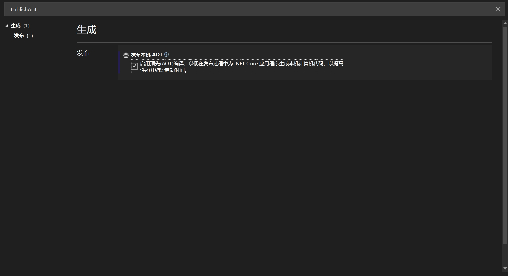

# 其他基本功能

## launchSettings.json

## Native AOT(Ahead-of-Time Compilation)
Native AOT（Ahead-of-Time Compilation）是 .NET 6 引入的一种新特性，

旨在将 .NET 应用程序编译为本机代码（native code），以提高启动速度和运行时性能。

这一特性尤其适合于需要快速启动和低内存占用的应用场景，如微服务、命令行工具和服务器应用。

### 主要特点

- **提前编译：**

Native AOT 允许将应用程序的所有代码在构建时编译为本机代码，而不是在运行时使用 JIT（Just-In-Time）编译。这可以显著提高应用的启动速度。

- **减少内存占用：**

由于省去了运行时所需的 JIT 编译和其他相关开销，Native AOT 应用程序的内存占用通常会更低。

- **独立于运行时：**

Native AOT 编译的应用程序可以在没有完整 .NET 运行时的环境中运行，这使得在某些限制条件下（如嵌入式设备或容器）更加灵活。

- **快速启动时间：**

由于应用程序已被编译为本机代码，启动时间显著减少，适合用于微服务架构和云原生应用。

- **安全性：**

由于代码在编译时已经被转换为本机代码，攻击面相对较小，减少了某些类型的运行时攻击（如 JIT 相关的攻击）。

### 使用 Native AOT
要使用 Native AOT 编译 .NET 应用程序，可以在MSBuild property中启用相关设置。

## 日志(Logging)

## 监控(Monitor)

## 异常处理(Handle errors)

## 测试(Test)

## Http 请求(Make Http Request)

## Swagger
