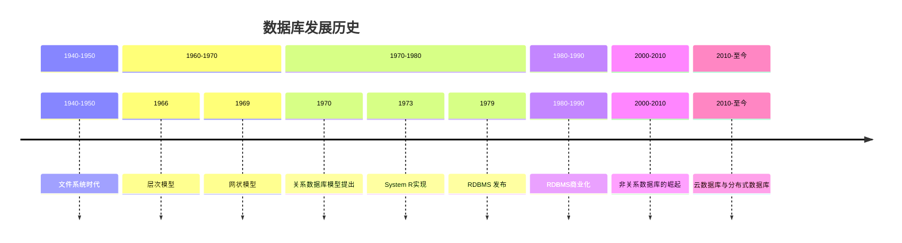
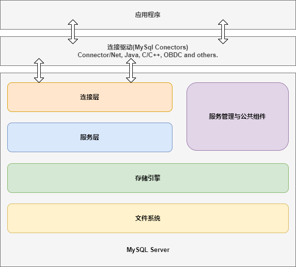
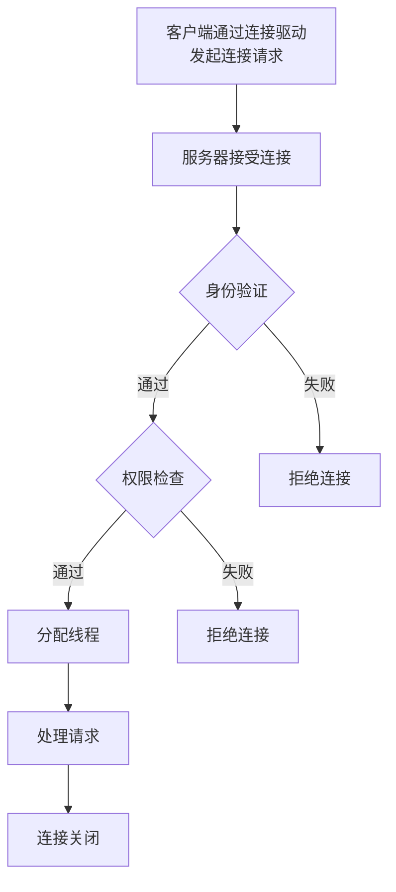
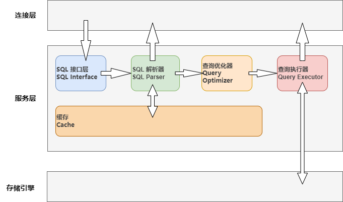
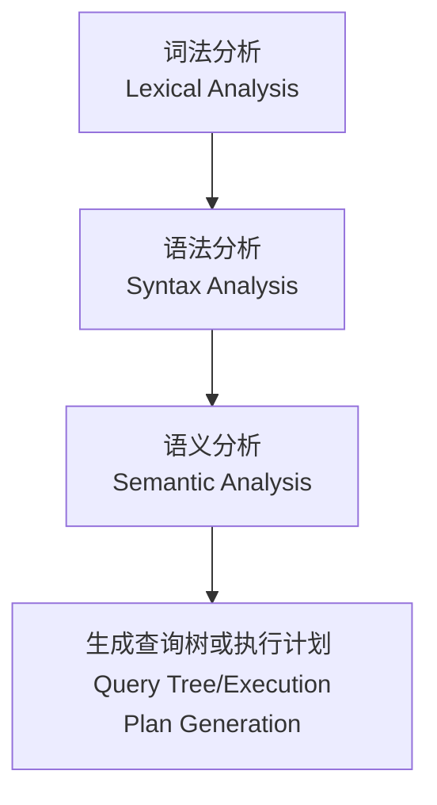
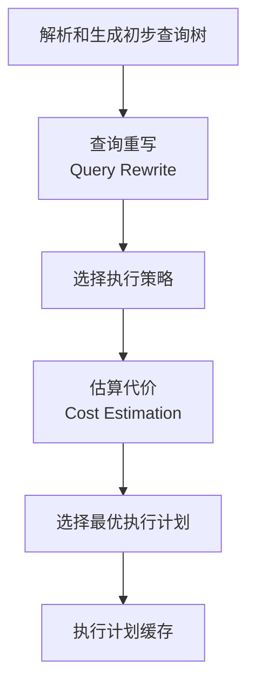
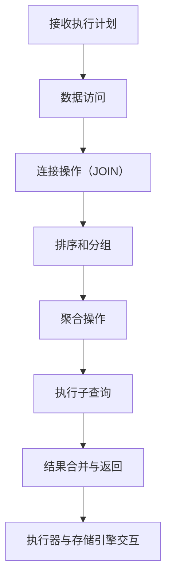

# 数据库概述及运行原理

::: tip 视频推荐
[Mysql是什么？架构是怎么样的？](https://www.bilibili.com/video/BV1p5qhYsE4f?vd_source=6d754390d2ed90e7a4f72fbe5f9f9658)

[5分钟精通MySql的系统框架](https://www.bilibili.com/video/BV1ve411F794?vd_source=6d754390d2ed90e7a4f72fbe5f9f9658)
:::


## 数据库的产生及发展历史


数据库的产生可以追溯到计算机科学的早期，随着计算需求的增加和数据管理的复杂性，数据库逐渐发展演变成今天的成熟系统。


<div class="mermaid-container-database">



</div>

<style>
.mermaid-container-database{
  width: 100%;
  overflow: auto;
}

.mermaid-container-database .mermaid {
  width: 1350px;
}
</style>

**1. 文件系统时代（1940-1950年）**

在计算机刚刚出现时，数据主要是通过简单的文件系统来管理。
这些文件是线性的、平面的，没有明确的数据结构和关联，查找和更新数据时通常比较低效。
数据存储大多依赖于磁带或磁盘驱动器，数据的访问和管理比较原始。

**2. 早期的数据库模型（1960-1970年）**

随着计算机应用的逐渐普及，数据量不断增长，传统的文件系统开始显得不足以满足需求。
在这一时期，出现了两种早期的数据库模型：

- **层次模型（Hierarchical Model）：**
由IBM的IMS（Information Management System）于1966年推出，数据通过树形结构存储，父节点和子节点之间的关系是一对多。
虽然层次模型提供了比平面文件更高效的数据访问，但它在表示复杂数据关系时显得局限。

- **网状模型（Network Model）：**
由CODASYL（Conference on Data Systems Languages）于1969年提出，改进了层次模型的限制，支持多对多关系。
网状模型在当时为复杂的业务需求提供了更多灵活性，但依然有一定的设计复杂度。

**3. 关系模型的提出（1970-1980年）**

- **关系数据库模型提出：**
1970年，Edgar F. Codd提出了关系数据库模型，这一理论为后来的数据库系统奠定了基础。
关系模型基于数学中的集合理论，将数据组织成表格（关系），每一行代表一个记录，每一列代表一个属性。
关系模型的关键优点是数据结构简单、灵活且支持通过SQL（结构化查询语言）进行查询和操作。

- **System R实现：**
1973年，IBM的System R是第一个实现关系模型的数据库系统，尽管它主要用于学术研究，但它为后来的商业化数据库系统提供了参考。

- **RDBMS 发布：**
1979年，Oracle发布了第一版关系数据库管理系统（RDBMS），随后其他公司也开始开发关系型数据库，
如IBM DB2和Microsoft SQL Server。

**4. 数据库管理系统的商业化（1980-1990年）**

随着关系数据库模型的普及，RDBMS逐渐走向商业化，并成为主流。
数据库系统不仅支持数据存储和管理，还开始集成事务处理、并发控制、数据恢复等功能，极大地提高了企业对数据的管理能力。

在这一时期，数据库管理系统（DBMS）成为企业信息系统的核心组成部分。
SQL语言成为标准查询语言，广泛应用于各种关系型数据库中。

**5. 非关系数据库的崛起（2000年-2010年）**

随着互联网的发展和大数据的出现，传统的关系型数据库在处理大规模非结构化数据时遇到了一些瓶颈，如性能、扩展性和灵活性等问题。
于是，NoSQL数据库应运而生，它能够更好地处理大数据环境中的高并发、大规模数据存储和快速读写需求。

2000年代初期，一些主流的NoSQL数据库开始流行，如MongoDB（文档型数据库）、Cassandra（列族型数据库）、Redis（键值对数据库）等。
这些NoSQL数据库通常不使用传统的表格结构，而是采用灵活的键值对、文档或图形结构来存储数据。

**6. 云数据库与分布式数据库（2010年代至今）**

进入21世纪后，云计算的兴起催生了云数据库的出现。
云数据库可以动态地扩展计算和存储资源，并提供更强的高可用性、容错性和安全性。
分布式数据库和微服务架构逐渐成为现代企业应用的核心。

- **分布式数据库：** 通过将数据分布在多个物理节点上，分布式数据库系统解决了传统单机数据库在处理大数据量和高并发情况下的瓶颈。

- **云服务：** 如Amazon RDS、Google Cloud Spanner、Azure SQL Database等，使得数据库管理变得更加灵活和高效。

## 数据库的类型

常见的数据库类型：

### **关系型数据库（RDBMS）**

关系型数据库（Relational Database Management System，RDBMS）是基于关系模型的数据库管理系统。
关系型数据库使用表格（称为“关系”）来组织数据，通过表格中的行和列存储数据，行代表数据记录，列代表数据字段。
数据表之间通过外键建立关系，从而支持复杂的查询和数据管理。
关系型数据库是最常用的数据库类型之一。

常用的关系型数据库：

- `MySQL`：开源、免费的关系型数据库，广泛应用于 Web 开发和小型到中型企业。
- `PostgreSQL`：开源、高度兼容 SQL 标准，适用于要求高一致性和复杂查询的场景。
- `Microsoft SQL Server`：由微软开发，广泛应用于企业级应用，支持高可用性和分布式架构。
- `Oracle Database`：功能强大的商业数据库，广泛用于大型企业和高并发应用。

### **非关系型数据库（NoSQL）**

非关系型数据库（NoSQL，Not Only SQL）是一类不使用传统关系模型（如表格和行列）的数据库。
与关系型数据库（RDBMS）不同，NoSQL 数据库没有严格的模式（Schema-less），
而是设计为适应大规模的分布式数据存储、灵活的数据模型、以及对高并发读写操作的高效支持。
它们特别适用于存储非结构化或半结构化的数据，
广泛应用于大数据、实时分析、社交网络、物联网等领域。

常用的非关系型数据库的类型：

#### **键值存储（Key-Value Stores）**

将数据以键值对（Key-Value）的形式存储。每个键都有一个对应的值，值可以是简单的字符串、数字或复杂的对象。

例子:

  - `Redis`：开源的高性能键值存储数据库，广泛用于缓存、消息队列等应用。
  - `DynamoDB`：亚马逊提供的分布式键值存储服务，用于构建高性能、高可扩展性的应用。
  - `Riak`：一个分布式键值数据库，提供高可用性和扩展性。

#### **文档存储（Document Stores）**

将数据存储为文档，通常是 JSON、BSON 或 XML 格式的结构化数据。每个文档都可以有不同的字段和结构，支持存储复杂的数据。

例子：

  - `MongoDB`：最流行的开源文档数据库，支持存储 JSON 格式的文档，广泛用于 Web 应用、实时分析等。
  - `CouchDB`：使用 JSON 格式存储数据，支持强大的复制和分布式功能。

### **其他常见数据库**

#### **图数据库**

图数据库（Graph Database）是一种专门用于存储和查询图形结构数据的数据库，
它通过节点（Node）、边（Edge）和属性（Property）来表示和存储数据。
这种结构非常适合用来处理复杂的关系和连接。
与传统的关系型数据库不同，图数据库没有严格的表格结构，而是通过图形的方式直观地表示实体及其之间的关系。

常见的图数据库：

- `Neo4j`:提供了强大的图数据库功能和查询语言（Cypher）。它被广泛应用于社交网络、推荐系统、知识图谱等领域。
- `Amazon Neptune`: AWS 提供的图数据库服务，支持 Property Graph 和 RDF 两种图模型，适用于构建社交网络、知识图谱等应用。
- `ArangoDB`:一个多模型数据库，支持图、文档和键值存储，可以非常方便地处理复杂的关系数据。
- `OrientDB`:一个开源的多模型数据库，支持图、文档、键值存储等多种数据模型，适合大规模的数据存储和查询。
- `JanusGraph`:一个分布式图数据库，支持大规模图数据的存储和分析，适合用于大数据和实时数据处理。

::: danger 应用
除了常见的社交网络上的应用，可以考虑应用在`WCS`寻路算法中！！！

`Neo4j` 提供了图算法库，可以直接使用图数据库来执行各种图算法，例如最短路径、社区检测等。

如`Google Maps`使用图数据库技术来计算最短路径。
:::

#### **时间序列数据库（TSDB）**

时间序列数据库（Time Series Database，TSDB）是一类专门设计来存储、查询和处理时间序列数据的数据库。
时间序列数据是随时间按顺序记录的数据，每个数据点通常包括时间戳和相应的值。
TSDB 广泛应用于实时监控、物联网（IoT）、金融市场分析、日志记录等需要处理高频率和大规模数据的场景。

常见的时间序列数据库（TSDB）:
- `InfluxDB`: 一个开源的高性能时间序列数据库，专门设计用于存储、查询和分析时间序列数据。它具有强大的写入性能，适合用于物联网、监控系统、实时分析等领域。
- `Prometheus`: 一个开源的时间序列数据库，专门用于系统监控、指标收集和实时分析。它原本用于云原生应用监控，特别适用于容器化环境，如 Kubernetes。
- `TimescaleDB`: 一个开源的扩展 PostgreSQL 数据库，专门用于处理时间序列数据。它结合了 PostgreSQL 的强大功能和 TSDB 的性能优化。
- `OpenTSDB`: 一个开源的分布式时间序列数据库，基于 HBase 构建，能够处理大量时间序列数据。
- `Graphite`: 一个开源的时间序列数据库，主要用于监控数据存储和可视化。它通常与 Grafana 配合使用来展示图表。

::: danger 应用
可以考虑应用在`SCADA`中！！！
:::

#### 对象数据库（ODBMS）
对象数据库管理系统（Object Database Management System，ODBMS）是一种数据库管理系统，
用于存储和管理对象，而不是传统的关系型数据库中的表格和记录。
ODBMS 是面向对象编程（OOP）思想的一部分，它能够直接存储对象、类及其关系，支持面向对象的编程语言中的类结构和方法。

常见的对象数据库:
- `ObjectDB`: 一个高性能的 Java 和 JDO（Java Data Objects）兼容的对象数据库，支持持久化存储 Java 对象。它用于存储 Java 类和它们的实例，提供了一个简单而强大的 API 来访问对象数据。
- `db4o`: 一个开源的对象数据库，支持 C# 和 Java，能够直接存储对象模型。它提供了一个简单的 API 来将对象存储到数据库中，适合嵌入式应用和小型企业级应用。
- `Versant`: 一个面向企业级应用的对象数据库，支持复杂的对象关系、事务、并发控制等功能。它广泛应用于金融、通信、电子商务等领域。
- `Matisse`: 一个基于对象的数据库，主要应用于构建与对象模型紧密集成的系统。它支持 Java 和 C#，允许直接在数据库中存储和管理对象

::: danger 应用
存储结构简单，但目前不成熟，成熟后考虑替代关系型数据库。
::: 

## 数据库的运行原理

### 关系型数据库运行原理

#### 架构

以MySql为例，通常关系型数据库架构如下：



#### 连接层

MySQL 的连接层（Connection Layer）是 MySQL 系统架构中的重要组成部分，
负责处理客户端与 MySQL 服务器之间的连接、身份验证、会话管理、查询分配等操作。
连接层确保数据库与客户端之间的通信和资源分配高效、安全。

##### 工作流程



<br/>

##### 相关配置

``` sql
-- 最大连接数
SET GLOBAL max_connections = 500;
-- 单个用户的最大并发连接数
SET GLOBAL max_user_connections = 100;
-- 非交互式客户端连接的空闲超时时间（单位：秒）
SET GLOBAL wait_timeout = 600;
-- 交互式客户端连接的空闲超时时间（单位：秒）
SET GLOBAL interactive_timeout = 600;
-- 客户端连接服务器的超时时间（单位：秒）
SET GLOBAL connect_timeout = 20;
-- 缓存线程的数量
SET GLOBAL thread_cache_size = 100;
-- 等待连接的请求队列大小
SET GLOBAL back_log = 100;
-- 禁用 DNS 解析，加快连接速度
SET GLOBAL skip_name_resolve = ON;
-- 设置客户端与服务器之间传输的最大数据包大小
SET GLOBAL max_allowed_packet = 128M;
-- 查看连接相关的状态变量
SHOW STATUS LIKE 'Threads_connected';  -- 当前连接数
SHOW STATUS LIKE 'Threads_created';   -- 已创建的线程数
SHOW STATUS LIKE 'Threads_running';   -- 正在运行的线程数
SHOW STATUS LIKE 'Aborted_connects';  -- 失败的连接尝试次数
-- 查看当前所有连接的详细信息
SHOW PROCESSLIST;
-- 监控连接性能
SELECT * FROM performance_schema.events_statements_summary_by_thread_by_event_name;
```

::: tip
也可以通过修改`my.ini`的方式修改配置，一般`my.ini`在安装目录下。
:::

----

#### 服务层
服务层负责处理客户端的请求、解析`SQL`语句、优化查询、执行查询并返回结果。

##### 核心组件



----

##### SQL接口层（SQL Interface）

接收客户端请求，解析SQL语句。
将SQL语句传递给SQL解析器。

----

##### SQL解析器（SQL Parser）

对SQL语句进行词法分析和语法分析。
生成解析树（Parse Tree）。

**解析过程**



1. **词法分析（Lexical Analysis）**

将 SQL 语句的字符流拆分为一系列有意义的符号（即 Token）。
每个 token 都表示一个 SQL 语句中的基本单元，如关键词、标识符、运算符、数据类型、常量等。

例如:

SQL：`SELECT id, name FROM users WHERE age > 30`

拆分后：
- SELECT（关键字）
- id（列名）
- ,（分隔符）
- name（列名）
- FROM（关键字）
- users（表名）
- WHERE（关键字）
- age（列名）
- `>`（运算符）
- 30（常量）

2. **语法分析（Syntax Analysis）**

使用一个语法分析器（Parser）来解析标记（tokens）并构建出一个 抽象语法树（AST）。
抽象语法树是 SQL 查询的内部表示，体现了查询的结构和关系。

分析过程：

- 匹配关键词和表达式：根据 SQL 的文法规则，解析器会逐个匹配 SQL 查询中的关键词、标识符、操作符等，确定各个部分的关系。
- 构建抽象语法树：根据语法分析的结果，解析器会生成一棵抽象语法树。这棵树的每个节点代表 SQL 语句中的一个元素（如表名、列名、运算符等），并根据 SQL 的结构进行组织。

例如，SQL 查询 `SELECT id, name FROM users WHERE age > 30` 的语法树可能长这样：

``` sql
SELECT
 ├── Columns
 │   ├── id
 │   └── name
 ├── FROM
 │   └── users
 └── WHERE
     └── age > 30
```

3. **语义分析（Semantic Analysis）**
语义分析的目标是检查 SQL 查询的逻辑正确性，确保查询语法正确且符合数据库的规则。这个阶段主要做的是：

- 验证表、列、别名等存在性：解析器检查 SQL 查询中的表和列名是否存在，是否拼写正确。例如，SELECT abc FROM users 会检查 abc 是否是 users 表的有效列。
- 数据类型验证：检查查询中的数据类型是否匹配，例如比较操作符两边的数据类型是否兼容。
- 别名处理：如果查询中使用了别名，解析器会处理并确保别名的使用符合 SQL 规范。
- 如果语义分析发现问题（比如列名不存在、数据类型不匹配等），解析器会抛出相应的错误。

4. **生成查询树或执行计划（Query Tree / Execution Plan Generation）**
在 SQL 语法树构建完成后，解析器会将其转化为 查询树（Query Tree）或直接交给优化器生成 执行计划。

- 查询树（Query Tree）：查询树是 SQL 查询的进一步结构化表示，它表现了 SQL 中各个操作的顺序。
例如，SELECT 操作可能依赖于 FROM 操作的结果，WHERE 过滤条件可能依赖于查询结果等。

查询树通常由 SQL 接口层（Parser 层）提供给查询优化器，查询优化器会根据查询树生成最优的执行计划。

- 执行计划：执行计划是一个优化后的查询执行方案，包含如何扫描表、使用哪些索引、表连接的顺序、如何应用过滤条件等信息。执行计划生成通常发生在 SQL 优化阶段，但在某些情况下，SQL 解析器会直接生成基本的执行计划（特别是在没有复杂优化的情况下）。

----


##### 查询优化器（Query Optimizer）

分析解析树，生成最优的执行计划。
选择索引、优化连接顺序等。

**优化过程**



1. **解析和生成初步查询树**

查询优化器通常在 SQL 解析器 生成 抽象语法树（AST）之后开始工作。
在解析阶段，SQL 查询被转化为一种内部的、结构化的表示。
查询优化器接收到这个结构化表示（通常是查询树或逻辑查询计划），并开始对其进行优化。

2. **查询重写（Query Rewrite）**

查询重写是查询优化过程的第一步，优化器通过对查询进行各种转换来优化 SQL 查询结构。常见的查询重写操作包括：

  - 常量折叠（Constant Folding）：将查询中包含的常量表达式计算出来，避免在执行时反复计算。例如，SELECT * FROM users WHERE age + 5 > 10 可以重写为 SELECT * FROM users WHERE age > 5。
  - 谓词下推（Predicate Pushdown）：将查询中的过滤条件（WHERE 子句）尽量推到数据扫描阶段之前。这样可以减少扫描的数据量，提高查询效率。例如，如果查询中包含了 WHERE age > 30，优化器会尽量让这个条件早早地应用于表扫描。
  - 子查询转换：对于某些类型的子查询（如 IN 子查询），优化器可能将其转换为联接操作，或者将子查询转化为更高效的操作。
  - 冗余条件移除：去除不必要的条件，例如冗余的 WHERE 子句。
  - 查询重写的目标是使 SQL 查询变得更简单、更高效，减少不必要的计算和数据访问。

3. **选择执行策略**

选择执行策略是查询优化器的核心任务之一。查询优化器会根据多种因素（如表结构、索引、数据分布等）评估查询的执行代价，并选择代价最低的执行策略。
优化器会尝试以下几种操作来决定查询如何执行：

3.1 **选择索引**

索引选择是查询优化的一个关键点。优化器会考虑查询中涉及的表和列，选择合适的索引来加速查询。常见的索引选择策略包括：

- 使用唯一索引：对于基于唯一键的查询，优化器会优先选择唯一索引来加速查找。
- 覆盖索引（Covering Index）：如果查询的列完全被索引包含，优化器会选择使用覆盖索引而不是回表查找。覆盖索引可以减少磁盘 I/O，提高查询效率。
- 联合索引的选择：如果查询涉及多个列，优化器会考虑是否使用联合索引（多列索引），并选择最佳的索引组合。

3.2 **选择连接顺序（Join Order）**

当查询涉及多个表时，优化器会决定它们连接的顺序。连接顺序会影响查询的执行效率。优化器会尝试各种连接顺序，选择执行成本最低的顺序。常见的连接顺序选择策略包括：

- 嵌套循环连接（Nested Loop Join）：适用于小表和大表之间的连接，通常会选择从小表开始扫描。
- 合并连接（Merge Join）：适用于两个已经排序的表之间的连接。
- 哈希连接（Hash Join）：适用于连接大表，尤其是没有索引的情况。

3.3 **选择连接类型**

在 SQL 查询中，连接操作（如 INNER JOIN、LEFT JOIN、RIGHT JOIN）会影响执行计划。优化器会根据查询的性质和表的数据分布，选择最合适的连接类型。

- 嵌套循环连接（Nested-Loop Join）：通过对内外表进行多次扫描，适用于小数据量的表。
- 合并连接（Merge Join）：适用于已经排序的表。
- 哈希连接（Hash Join）：适用于大表连接，且不需要预先排序。

4. **估算代价（Cost Estimation）**

查询优化器的一个重要任务是估算不同执行计划的代价。代价通常是通过一个代价模型来计算的，
模型会评估不同查询路径所需的 CPU 时间、I/O 操作次数、内存消耗等资源开销。

代价估算模型通常包含以下内容：

- 表扫描代价：读取整个表所需的代价，包括磁盘 I/O 和 CPU 时间。
- 索引访问代价：访问索引的代价，包括磁盘 I/O 和 CPU 时间。
- 连接代价：计算不同连接类型的代价，例如嵌套循环连接、合并连接等。
- 排序代价：对查询结果进行排序的代价，通常与数据量和排序算法有关。
- 内存和磁盘 I/O：根据查询处理中的内存使用和磁盘读取估算代价。
- 优化器会为每个执行计划计算代价，代价最低的执行计划会被选择为最终的执行路径。

5. **选择最优执行计划**

查询优化器通过对不同的执行路径进行代价评估，选择代价最低的执行计划。
这个过程是查询优化的核心部分，它会考虑查询的复杂度、数据分布、表的大小、索引的选择等因素，生成一个代价最小的执行计划。执行计划通常包括以下内容：

- 扫描表的方式：全表扫描、索引扫描等。
- 连接顺序：多个表的连接顺序。
- 选择的索引：是否使用索引以及如何使用。
- 排序和聚合操作：如何进行数据排序或聚合。

一旦选择了最优执行计划，优化器会将其交给 执行引擎 来实际执行查询。

6. **执行计划缓存**

MySQL 会缓存已生成的执行计划，这样对于相同的查询，优化器就不需要每次都重新生成执行计划，可以直接复用之前的执行计划。
执行计划缓存有助于提高性能，避免重复的计算开销。

----

##### 查询执行器（Query Executor）

调用存储引擎接口，执行查询计划。
处理查询结果（如排序、分组、聚合等）。



1. **接收执行计划**

查询执行器接收到由优化器生成的执行计划，该计划包含了优化器选择的查询执行路径、访问方法（如索引扫描、全表扫描等）、连接顺序、连接类型等信息。
执行计划通常是一个物理查询计划，指明了查询将如何在 MySQL 中被执行。

2. **数据访问**

根据执行计划中指示的访问方法，执行器将访问数据。

常见的数据访问方式包括：

- 全表扫描（Full Table Scan）：如果没有合适的索引，执行器将扫描整个表来查找符合条件的行。
- 索引扫描（Index Scan）：如果查询使用了索引，执行器将根据索引来定位满足条件的数据。
- 范围扫描（Range Scan）：对于范围条件（如 BETWEEN、>, < 等），执行器会通过索引来查找符合条件的行。
- 覆盖索引（Covering Index）：如果索引包含了查询的所有列，执行器可以直接从索引中获取数据，避免回表操作。

3. **连接操作（JOIN）**

如果查询涉及多个表，查询执行器需要处理连接操作。

连接操作通常有几种方式，具体的连接方式由查询优化器选择，但执行器负责根据优化器的选择执行：

- 嵌套循环连接（Nested Loop Join）：在这个方法中，执行器会遍历一个表（通常是内层表），并对每一行在另一个表中查找匹配项。
- 合并连接（Merge Join）：对于已经排序的表，执行器会依次扫描两张表，按顺序将它们的行配对。
- 哈希连接（Hash Join）：对于没有索引的表，执行器会构建一个哈希表，将一个表的数据放入内存中，然后在另一个表中进行查找。

4. **排序和分组**

在查询执行过程中，如果涉及到 ORDER BY、GROUP BY、DISTINCT 等操作，执行器需要对数据进行排序和分组。

- 排序：如果查询要求对数据进行排序（如 ORDER BY），执行器可能会使用 内存排序（In-memory Sorting）或 磁盘排序（Disk-based Sorting），根据内存缓存大小和数据量来选择合适的排序方式。
- 分组：在执行 GROUP BY 操作时，执行器会对数据进行分组，并根据分组条件计算聚合函数（如 COUNT、SUM、AVG 等）。

5. **聚合操作**

当查询中有聚合函数（如 COUNT、AVG、SUM 等）时，执行器会在数据扫描的过程中或排序之后执行聚合计算。
聚合操作有两种常见的执行方式：

- 单阶段聚合：数据在扫描时直接进行聚合计算。
- 双阶段聚合：在第一阶段进行局部聚合（每个分片或每个数据块内聚合），然后在第二阶段进行全局聚合。

6. **执行子查询**

如果查询包含子查询，执行器需要根据优化器选择的执行方式来执行子查询。子查询有几种常见的执行策略：

- 非相关子查询：在外部查询每一行中，执行器会执行一次子查询并使用返回的结果。
- 相关子查询：对于涉及外部查询列的子查询，执行器会对每一行外部查询进行子查询执行。

7. **结果合并与返回**

查询执行器在完成数据检索、排序、分组、连接和聚合等操作后，会将结果整合并准备返回给客户端。具体的结果返回可以包括：

- 行结果集：执行器会将结果集返回给客户端或应用程序。
- 分页处理：如果查询涉及分页，执行器会根据查询的限制条件（如 LIMIT 和 OFFSET）返回相应的行数。
- SQL函数计算结果：如果查询涉及 SQL 函数（如 CONCAT、NOW 等），执行器会计算这些函数的结果，并在最终返回的结果集中包含这些计算值。

8. **执行器与存储引擎交互**

查询执行器通过存储引擎接口（如 InnoDB、MyISAM 等）与数据库存储进行交互。
具体而言，执行器执行查询时，依赖存储引擎提供的数据访问操作（如检索行、插入数据、删除数据等）。
存储引擎根据查询类型和请求内容返回数据，执行器在处理过程中根据查询的复杂性和数据量来优化执行路径。

----

##### 缓存管理器（Cache）

查询缓存是 MySQL 最初的缓存机制之一，
它的作用是缓存 SELECT 查询的结果。
当一个相同的查询再次执行时，MySQL 可以直接从缓存中获取结果，而无需再次访问数据库表或执行查询。

查询缓存的工作原理:

- 缓存存储：查询缓存会缓存完整的查询结果集。如果查询结果没有改变，它就会被缓存到内存中。
- 查询匹配：当一个新的查询请求到来时，MySQL 会检查是否有相同的查询在缓存中，如果有，直接返回缓存的结果。
- 失效机制：如果某个表的数据发生变化（例如执行了 INSERT、UPDATE、DELETE 等操作），相关的查询缓存会被失效，避免返回过时的结果。

::: danger 查询缓存的移除（MySQL 8.0）
在 MySQL 8.0 版本中，查询缓存已被完全移除，不再支持此功能。这一改变的主要原因是：

- 查询缓存会导致性能瓶颈，尤其是在高并发的环境中，频繁的写操作使得查询缓存的命中率降低。
- 现代的硬件和数据库优化技术（如 InnoDB 缓冲池 和 索引优化）使得查询缓存不再是必需的。
- 从 MySQL 8.0 开始，查询缓存的相关配置被删除，且不再支持 query_cache_* 相关的参数。
::: 

----


#### 存储引擎

#### 文件系统

#### 服务管理与公共组件

#### 性能调优

##### 连接层性能优化

- **使用连接池**：

连接池通过预创建一定数量的连接并在多个客户端请求中复用这些连接，来显著提高系统的性能，特别是在高并发的场景下。

::: tip
1. 连接池内置在MySql Conectors(MySQL Connector/NET, MySQL Connector/J)中，可以安装时需要勾选。也可以使用第三方连接池库.
2. 使用MySql Conectors中的连接池时，可以在连接字符串中使用以下配置：

``` C#
string connectionString = "Server=localhost;Database=mydatabase;Uid=myusername;Pwd=mypassword;Pooling=true;MinPoolSize=5;MaxPoolSize=50;ConnectionTimeout=30;";
```

其中：
- `Pooling=true`：启用连接池。
- `MinPoolSize`：连接池中最小的连接数，通常在高负载的情况下可以提高性能。
- `MaxPoolSize`：连接池中的最大连接数。超过这个数目后，新请求将会等待连接池中有空闲连接。
::: 

- **调整最大连接数**：通过 max_connections 参数调整 MySQL 服务器支持的最大连接数。

``` sql
SET GLOBAL max_connections = 500;
```

- **减少连接延迟**：优化网络配置。
- **监控连接状态**：通过 SHOW PROCESSLIST 或性能模式（Performance Schema）监控连接状态，及时发现异常连接。

``` sql
SHOW PROCESSLIST;
SELECT * FROM performance_schema.events_statements_summary_by_thread_by_event_name;
```
