# 数据库概述及运行原理

::: tip 视频推荐
[Mysql是什么？架构是怎么样的？](https://www.bilibili.com/video/BV1p5qhYsE4f?vd_source=6d754390d2ed90e7a4f72fbe5f9f9658)

[5分钟精通MySql的系统框架](https://www.bilibili.com/video/BV1ve411F794?vd_source=6d754390d2ed90e7a4f72fbe5f9f9658)
:::


## 数据库的产生及发展历史


数据库的产生可以追溯到计算机科学的早期，随着计算需求的增加和数据管理的复杂性，数据库逐渐发展演变成今天的成熟系统。


<div class="mermaid-container-database">


</div>

<style>
.mermaid-container-database{
  width: 100%;
  overflow: auto;
}

.mermaid-container-database .mermaid {
  width: 1350px;
}
</style>

**1. 文件系统时代（1940-1950年）**

在计算机刚刚出现时，数据主要是通过简单的文件系统来管理。
这些文件是线性的、平面的，没有明确的数据结构和关联，查找和更新数据时通常比较低效。
数据存储大多依赖于磁带或磁盘驱动器，数据的访问和管理比较原始。

**2. 早期的数据库模型（1960-1970年）**

随着计算机应用的逐渐普及，数据量不断增长，传统的文件系统开始显得不足以满足需求。
在这一时期，出现了两种早期的数据库模型：

- **层次模型（Hierarchical Model）：**
由IBM的IMS（Information Management System）于1966年推出，数据通过树形结构存储，父节点和子节点之间的关系是一对多。
虽然层次模型提供了比平面文件更高效的数据访问，但它在表示复杂数据关系时显得局限。

- **网状模型（Network Model）：**
由CODASYL（Conference on Data Systems Languages）于1969年提出，改进了层次模型的限制，支持多对多关系。
网状模型在当时为复杂的业务需求提供了更多灵活性，但依然有一定的设计复杂度。

**3. 关系模型的提出（1970-1980年）**

- **关系数据库模型提出：**
1970年，Edgar F. Codd提出了关系数据库模型，这一理论为后来的数据库系统奠定了基础。
关系模型基于数学中的集合理论，将数据组织成表格（关系），每一行代表一个记录，每一列代表一个属性。
关系模型的关键优点是数据结构简单、灵活且支持通过SQL（结构化查询语言）进行查询和操作。

- **System R实现：**
1973年，IBM的System R是第一个实现关系模型的数据库系统，尽管它主要用于学术研究，但它为后来的商业化数据库系统提供了参考。

- **RDBMS 发布：**
1979年，Oracle发布了第一版关系数据库管理系统（RDBMS），随后其他公司也开始开发关系型数据库，
如IBM DB2和Microsoft SQL Server。

**4. 数据库管理系统的商业化（1980-1990年）**

随着关系数据库模型的普及，RDBMS逐渐走向商业化，并成为主流。
数据库系统不仅支持数据存储和管理，还开始集成事务处理、并发控制、数据恢复等功能，极大地提高了企业对数据的管理能力。

在这一时期，数据库管理系统（DBMS）成为企业信息系统的核心组成部分。
SQL语言成为标准查询语言，广泛应用于各种关系型数据库中。

**5. 非关系数据库的崛起（2000年-2010年）**

随着互联网的发展和大数据的出现，传统的关系型数据库在处理大规模非结构化数据时遇到了一些瓶颈，如性能、扩展性和灵活性等问题。
于是，NoSQL数据库应运而生，它能够更好地处理大数据环境中的高并发、大规模数据存储和快速读写需求。

2000年代初期，一些主流的NoSQL数据库开始流行，如MongoDB（文档型数据库）、Cassandra（列族型数据库）、Redis（键值对数据库）等。
这些NoSQL数据库通常不使用传统的表格结构，而是采用灵活的键值对、文档或图形结构来存储数据。

**6. 云数据库与分布式数据库（2010年代至今）**

进入21世纪后，云计算的兴起催生了云数据库的出现。
云数据库可以动态地扩展计算和存储资源，并提供更强的高可用性、容错性和安全性。
分布式数据库和微服务架构逐渐成为现代企业应用的核心。

- **分布式数据库：** 通过将数据分布在多个物理节点上，分布式数据库系统解决了传统单机数据库在处理大数据量和高并发情况下的瓶颈。

- **云服务：** 如Amazon RDS、Google Cloud Spanner、Azure SQL Database等，使得数据库管理变得更加灵活和高效。

## 数据库的类型

常见的数据库类型：

### **关系型数据库（RDBMS）**

关系型数据库（Relational Database Management System，RDBMS）是基于关系模型的数据库管理系统。
关系型数据库使用表格（称为“关系”）来组织数据，通过表格中的行和列存储数据，行代表数据记录，列代表数据字段。
数据表之间通过外键建立关系，从而支持复杂的查询和数据管理。
关系型数据库是最常用的数据库类型之一。

常用的关系型数据库：

- `MySQL`：开源、免费的关系型数据库，广泛应用于 Web 开发和小型到中型企业。
- `PostgreSQL`：开源、高度兼容 SQL 标准，适用于要求高一致性和复杂查询的场景。
- `Microsoft SQL Server`：由微软开发，广泛应用于企业级应用，支持高可用性和分布式架构。
- `Oracle Database`：功能强大的商业数据库，广泛用于大型企业和高并发应用。

### **非关系型数据库（NoSQL）**

非关系型数据库（NoSQL，Not Only SQL）是一类不使用传统关系模型（如表格和行列）的数据库。
与关系型数据库（RDBMS）不同，NoSQL 数据库没有严格的模式（Schema-less），
而是设计为适应大规模的分布式数据存储、灵活的数据模型、以及对高并发读写操作的高效支持。
它们特别适用于存储非结构化或半结构化的数据，
广泛应用于大数据、实时分析、社交网络、物联网等领域。

常用的非关系型数据库的类型：

#### **键值存储（Key-Value Stores）**

将数据以键值对（Key-Value）的形式存储。每个键都有一个对应的值，值可以是简单的字符串、数字或复杂的对象。

例子:

  - `Redis`：开源的高性能键值存储数据库，广泛用于缓存、消息队列等应用。
  - `DynamoDB`：亚马逊提供的分布式键值存储服务，用于构建高性能、高可扩展性的应用。
  - `Riak`：一个分布式键值数据库，提供高可用性和扩展性。

#### **文档存储（Document Stores）**

将数据存储为文档，通常是 JSON、BSON 或 XML 格式的结构化数据。每个文档都可以有不同的字段和结构，支持存储复杂的数据。

例子：

  - `MongoDB`：最流行的开源文档数据库，支持存储 JSON 格式的文档，广泛用于 Web 应用、实时分析等。
  - `CouchDB`：使用 JSON 格式存储数据，支持强大的复制和分布式功能。

### **其他常见数据库**

#### **图数据库**

图数据库（Graph Database）是一种专门用于存储和查询图形结构数据的数据库，
它通过节点（Node）、边（Edge）和属性（Property）来表示和存储数据。
这种结构非常适合用来处理复杂的关系和连接。
与传统的关系型数据库不同，图数据库没有严格的表格结构，而是通过图形的方式直观地表示实体及其之间的关系。

常见的图数据库：

- `Neo4j`:提供了强大的图数据库功能和查询语言（Cypher）。它被广泛应用于社交网络、推荐系统、知识图谱等领域。
- `Amazon Neptune`: AWS 提供的图数据库服务，支持 Property Graph 和 RDF 两种图模型，适用于构建社交网络、知识图谱等应用。
- `ArangoDB`:一个多模型数据库，支持图、文档和键值存储，可以非常方便地处理复杂的关系数据。
- `OrientDB`:一个开源的多模型数据库，支持图、文档、键值存储等多种数据模型，适合大规模的数据存储和查询。
- `JanusGraph`:一个分布式图数据库，支持大规模图数据的存储和分析，适合用于大数据和实时数据处理。

::: danger 应用
除了常见的社交网络上的应用，可以考虑应用在`WCS`寻路算法中！！！

`Neo4j` 提供了图算法库，可以直接使用图数据库来执行各种图算法，例如最短路径、社区检测等。

如`Google Maps`使用图数据库技术来计算最短路径。
:::

#### **时间序列数据库（TSDB）**

时间序列数据库（Time Series Database，TSDB）是一类专门设计来存储、查询和处理时间序列数据的数据库。
时间序列数据是随时间按顺序记录的数据，每个数据点通常包括时间戳和相应的值。
TSDB 广泛应用于实时监控、物联网（IoT）、金融市场分析、日志记录等需要处理高频率和大规模数据的场景。

常见的时间序列数据库（TSDB）:
- `InfluxDB`: 一个开源的高性能时间序列数据库，专门设计用于存储、查询和分析时间序列数据。它具有强大的写入性能，适合用于物联网、监控系统、实时分析等领域。
- `Prometheus`: 一个开源的时间序列数据库，专门用于系统监控、指标收集和实时分析。它原本用于云原生应用监控，特别适用于容器化环境，如 Kubernetes。
- `TimescaleDB`: 一个开源的扩展 PostgreSQL 数据库，专门用于处理时间序列数据。它结合了 PostgreSQL 的强大功能和 TSDB 的性能优化。
- `OpenTSDB`: 一个开源的分布式时间序列数据库，基于 HBase 构建，能够处理大量时间序列数据。
- `Graphite`: 一个开源的时间序列数据库，主要用于监控数据存储和可视化。它通常与 Grafana 配合使用来展示图表。

::: danger 应用
可以考虑应用在`SCADA`中！！！
:::

#### 对象数据库（ODBMS）
对象数据库管理系统（Object Database Management System，ODBMS）是一种数据库管理系统，
用于存储和管理对象，而不是传统的关系型数据库中的表格和记录。
ODBMS 是面向对象编程（OOP）思想的一部分，它能够直接存储对象、类及其关系，支持面向对象的编程语言中的类结构和方法。

常见的对象数据库:
- `ObjectDB`: 一个高性能的 Java 和 JDO（Java Data Objects）兼容的对象数据库，支持持久化存储 Java 对象。它用于存储 Java 类和它们的实例，提供了一个简单而强大的 API 来访问对象数据。
- `db4o`: 一个开源的对象数据库，支持 C# 和 Java，能够直接存储对象模型。它提供了一个简单的 API 来将对象存储到数据库中，适合嵌入式应用和小型企业级应用。
- `Versant`: 一个面向企业级应用的对象数据库，支持复杂的对象关系、事务、并发控制等功能。它广泛应用于金融、通信、电子商务等领域。
- `Matisse`: 一个基于对象的数据库，主要应用于构建与对象模型紧密集成的系统。它支持 Java 和 C#，允许直接在数据库中存储和管理对象

::: danger 应用
存储结构简单，但目前不成熟，成熟后考虑替代关系型数据库。
::: 

## 数据库的运行原理

### 关系型数据库运行原理

#### 架构

以MySql为例，通常关系型数据库架构如下：


#### 连接层 

MySQL 的连接层（Connection Layer）是 MySQL 系统架构中的重要组成部分，
负责处理客户端与 MySQL 服务器之间的连接、身份验证、会话管理、查询分配等操作。
连接层确保数据库与客户端之间的通信和资源分配高效、安全。

##### 工作流程


<br/>

##### 相关配置

``` sql
-- 最大连接数
SET GLOBAL max_connections = 500;
-- 单个用户的最大并发连接数
SET GLOBAL max_user_connections = 100;
-- 非交互式客户端连接的空闲超时时间（单位：秒）
SET GLOBAL wait_timeout = 600;
-- 交互式客户端连接的空闲超时时间（单位：秒）
SET GLOBAL interactive_timeout = 600;
-- 客户端连接服务器的超时时间（单位：秒）
SET GLOBAL connect_timeout = 20;
-- 缓存线程的数量
SET GLOBAL thread_cache_size = 100;
-- 等待连接的请求队列大小
SET GLOBAL back_log = 100;
-- 禁用 DNS 解析，加快连接速度
SET GLOBAL skip_name_resolve = ON;
-- 设置客户端与服务器之间传输的最大数据包大小
SET GLOBAL max_allowed_packet = 128M;
-- 查看连接相关的状态变量
SHOW STATUS LIKE 'Threads_connected';  -- 当前连接数
SHOW STATUS LIKE 'Threads_created';   -- 已创建的线程数
SHOW STATUS LIKE 'Threads_running';   -- 正在运行的线程数
SHOW STATUS LIKE 'Aborted_connects';  -- 失败的连接尝试次数
-- 查看当前所有连接的详细信息
SHOW PROCESSLIST;
-- 监控连接性能
SELECT * FROM performance_schema.events_statements_summary_by_thread_by_event_name;
```

::: tip
也可以通过修改`my.ini`的方式修改配置，一般`my.ini`在安装目录下。
:::

----

#### 服务层
服务层负责处理客户端的请求、解析`SQL`语句、优化查询、执行查询并返回结果。

##### 核心组件


----

##### SQL接口层（SQL Interface）

接收客户端请求，解析SQL语句。
将SQL语句传递给SQL解析器。

----

##### SQL解析器（SQL Parser）

对SQL语句进行词法分析和语法分析。
生成解析树（Parse Tree）。

**解析过程**


1. **词法分析（Lexical Analysis）**

将 SQL 语句的字符流拆分为一系列有意义的符号（即 Token）。
每个 token 都表示一个 SQL 语句中的基本单元，如关键词、标识符、运算符、数据类型、常量等。

例如:

SQL：`SELECT id, name FROM users WHERE age > 30`

拆分后：
- SELECT（关键字）
- id（列名）
- ,（分隔符）
- name（列名）
- FROM（关键字）
- users（表名）
- WHERE（关键字）
- age（列名）
- `>`（运算符）
- 30（常量）

2. **语法分析（Syntax Analysis）**

使用一个语法分析器（Parser）来解析标记（tokens）并构建出一个 抽象语法树（AST）。
抽象语法树是 SQL 查询的内部表示，体现了查询的结构和关系。

分析过程：

- 匹配关键词和表达式：根据 SQL 的文法规则，解析器会逐个匹配 SQL 查询中的关键词、标识符、操作符等，确定各个部分的关系。
- 构建抽象语法树：根据语法分析的结果，解析器会生成一棵抽象语法树。这棵树的每个节点代表 SQL 语句中的一个元素（如表名、列名、运算符等），并根据 SQL 的结构进行组织。

例如，SQL 查询 `SELECT id, name FROM users WHERE age > 30` 的语法树可能长这样：

``` sql
SELECT
 ├── Columns
 │   ├── id
 │   └── name
 ├── FROM
 │   └── users
 └── WHERE
     └── age > 30
```

3. **语义分析（Semantic Analysis）**
语义分析的目标是检查 SQL 查询的逻辑正确性，确保查询语法正确且符合数据库的规则。这个阶段主要做的是：

- 验证表、列、别名等存在性：解析器检查 SQL 查询中的表和列名是否存在，是否拼写正确。例如，SELECT abc FROM users 会检查 abc 是否是 users 表的有效列。
- 数据类型验证：检查查询中的数据类型是否匹配，例如比较操作符两边的数据类型是否兼容。
- 别名处理：如果查询中使用了别名，解析器会处理并确保别名的使用符合 SQL 规范。
- 如果语义分析发现问题（比如列名不存在、数据类型不匹配等），解析器会抛出相应的错误。

4. **生成查询树或执行计划（Query Tree / Execution Plan Generation）**
在 SQL 语法树构建完成后，解析器会将其转化为 查询树（Query Tree）或直接交给优化器生成 执行计划。

- 查询树（Query Tree）：查询树是 SQL 查询的进一步结构化表示，它表现了 SQL 中各个操作的顺序。
例如，SELECT 操作可能依赖于 FROM 操作的结果，WHERE 过滤条件可能依赖于查询结果等。

查询树通常由 SQL 接口层（Parser 层）提供给查询优化器，查询优化器会根据查询树生成最优的执行计划。

- 执行计划：执行计划是一个优化后的查询执行方案，包含如何扫描表、使用哪些索引、表连接的顺序、如何应用过滤条件等信息。执行计划生成通常发生在 SQL 优化阶段，但在某些情况下，SQL 解析器会直接生成基本的执行计划（特别是在没有复杂优化的情况下）。

----


##### 查询优化器（Query Optimizer）

分析解析树，生成最优的执行计划。
选择索引、优化连接顺序等。

**优化过程**


1. **解析和生成初步查询树**

查询优化器通常在 SQL 解析器 生成 抽象语法树（AST）之后开始工作。
在解析阶段，SQL 查询被转化为一种内部的、结构化的表示。
查询优化器接收到这个结构化表示（通常是查询树或逻辑查询计划），并开始对其进行优化。

2. **查询重写（Query Rewrite）**

查询重写是查询优化过程的第一步，优化器通过对查询进行各种转换来优化 SQL 查询结构。常见的查询重写操作包括：

  - 常量折叠（Constant Folding）：将查询中包含的常量表达式计算出来，避免在执行时反复计算。例如，SELECT * FROM users WHERE age + 5 > 10 可以重写为 SELECT * FROM users WHERE age > 5。
  - 谓词下推（Predicate Pushdown）：将查询中的过滤条件（WHERE 子句）尽量推到数据扫描阶段之前。这样可以减少扫描的数据量，提高查询效率。例如，如果查询中包含了 WHERE age > 30，优化器会尽量让这个条件早早地应用于表扫描。
  - 子查询转换：对于某些类型的子查询（如 IN 子查询），优化器可能将其转换为联接操作，或者将子查询转化为更高效的操作。
  - 冗余条件移除：去除不必要的条件，例如冗余的 WHERE 子句。
  - 查询重写的目标是使 SQL 查询变得更简单、更高效，减少不必要的计算和数据访问。

3. **选择执行策略**

选择执行策略是查询优化器的核心任务之一。查询优化器会根据多种因素（如表结构、索引、数据分布等）评估查询的执行代价，并选择代价最低的执行策略。
优化器会尝试以下几种操作来决定查询如何执行：

3.1 **选择索引**

索引选择是查询优化的一个关键点。优化器会考虑查询中涉及的表和列，选择合适的索引来加速查询。常见的索引选择策略包括：

- 使用唯一索引：对于基于唯一键的查询，优化器会优先选择唯一索引来加速查找。
- 覆盖索引（Covering Index）：如果查询的列完全被索引包含，优化器会选择使用覆盖索引而不是回表查找。覆盖索引可以减少磁盘 I/O，提高查询效率。
- 联合索引的选择：如果查询涉及多个列，优化器会考虑是否使用联合索引（多列索引），并选择最佳的索引组合。

3.2 **选择连接顺序（Join Order）**

当查询涉及多个表时，优化器会决定它们连接的顺序。连接顺序会影响查询的执行效率。优化器会尝试各种连接顺序，选择执行成本最低的顺序。常见的连接顺序选择策略包括：

- 嵌套循环连接（Nested Loop Join）：适用于小表和大表之间的连接，通常会选择从小表开始扫描。
- 合并连接（Merge Join）：适用于两个已经排序的表之间的连接。
- 哈希连接（Hash Join）：适用于连接大表，尤其是没有索引的情况。

3.3 **选择连接类型**

在 SQL 查询中，连接操作（如 INNER JOIN、LEFT JOIN、RIGHT JOIN）会影响执行计划。优化器会根据查询的性质和表的数据分布，选择最合适的连接类型。

- 嵌套循环连接（Nested-Loop Join）：通过对内外表进行多次扫描，适用于小数据量的表。
- 合并连接（Merge Join）：适用于已经排序的表。
- 哈希连接（Hash Join）：适用于大表连接，且不需要预先排序。

4. **估算代价（Cost Estimation）**

查询优化器的一个重要任务是估算不同执行计划的代价。代价通常是通过一个代价模型来计算的，
模型会评估不同查询路径所需的 CPU 时间、I/O 操作次数、内存消耗等资源开销。

代价估算模型通常包含以下内容：

- 表扫描代价：读取整个表所需的代价，包括磁盘 I/O 和 CPU 时间。
- 索引访问代价：访问索引的代价，包括磁盘 I/O 和 CPU 时间。
- 连接代价：计算不同连接类型的代价，例如嵌套循环连接、合并连接等。
- 排序代价：对查询结果进行排序的代价，通常与数据量和排序算法有关。
- 内存和磁盘 I/O：根据查询处理中的内存使用和磁盘读取估算代价。
- 优化器会为每个执行计划计算代价，代价最低的执行计划会被选择为最终的执行路径。

5. **选择最优执行计划**

查询优化器通过对不同的执行路径进行代价评估，选择代价最低的执行计划。
这个过程是查询优化的核心部分，它会考虑查询的复杂度、数据分布、表的大小、索引的选择等因素，生成一个代价最小的执行计划。执行计划通常包括以下内容：

- 扫描表的方式：全表扫描、索引扫描等。
- 连接顺序：多个表的连接顺序。
- 选择的索引：是否使用索引以及如何使用。
- 排序和聚合操作：如何进行数据排序或聚合。

一旦选择了最优执行计划，优化器会将其交给 执行引擎 来实际执行查询。

6. **执行计划缓存**

MySQL 会缓存已生成的执行计划，这样对于相同的查询，优化器就不需要每次都重新生成执行计划，可以直接复用之前的执行计划。
执行计划缓存有助于提高性能，避免重复的计算开销。

----

##### 查询执行器（Query Executor）

调用存储引擎接口，执行查询计划。
处理查询结果（如排序、分组、聚合等）。


1. **接收执行计划**

查询执行器接收到由优化器生成的执行计划，该计划包含了优化器选择的查询执行路径、访问方法（如索引扫描、全表扫描等）、连接顺序、连接类型等信息。
执行计划通常是一个物理查询计划，指明了查询将如何在 MySQL 中被执行。

2. **数据访问**

根据执行计划中指示的访问方法，执行器将访问数据。

常见的数据访问方式包括：

- 全表扫描（Full Table Scan）：如果没有合适的索引，执行器将扫描整个表来查找符合条件的行。
- 索引扫描（Index Scan）：如果查询使用了索引，执行器将根据索引来定位满足条件的数据。
- 范围扫描（Range Scan）：对于范围条件（如 BETWEEN、>, < 等），执行器会通过索引来查找符合条件的行。
- 覆盖索引（Covering Index）：如果索引包含了查询的所有列，执行器可以直接从索引中获取数据，避免回表操作。

3. **连接操作（JOIN）**

如果查询涉及多个表，查询执行器需要处理连接操作。

连接操作通常有几种方式，具体的连接方式由查询优化器选择，但执行器负责根据优化器的选择执行：

- 嵌套循环连接（Nested Loop Join）：在这个方法中，执行器会遍历一个表（通常是内层表），并对每一行在另一个表中查找匹配项。
- 合并连接（Merge Join）：对于已经排序的表，执行器会依次扫描两张表，按顺序将它们的行配对。
- 哈希连接（Hash Join）：对于没有索引的表，执行器会构建一个哈希表，将一个表的数据放入内存中，然后在另一个表中进行查找。

4. **排序和分组**

在查询执行过程中，如果涉及到 ORDER BY、GROUP BY、DISTINCT 等操作，执行器需要对数据进行排序和分组。

- 排序：如果查询要求对数据进行排序（如 ORDER BY），执行器可能会使用 内存排序（In-memory Sorting）或 磁盘排序（Disk-based Sorting），根据内存缓存大小和数据量来选择合适的排序方式。
- 分组：在执行 GROUP BY 操作时，执行器会对数据进行分组，并根据分组条件计算聚合函数（如 COUNT、SUM、AVG 等）。

5. **聚合操作**

当查询中有聚合函数（如 COUNT、AVG、SUM 等）时，执行器会在数据扫描的过程中或排序之后执行聚合计算。
聚合操作有两种常见的执行方式：

- 单阶段聚合：数据在扫描时直接进行聚合计算。
- 双阶段聚合：在第一阶段进行局部聚合（每个分片或每个数据块内聚合），然后在第二阶段进行全局聚合。

6. **执行子查询**

如果查询包含子查询，执行器需要根据优化器选择的执行方式来执行子查询。子查询有几种常见的执行策略：

- 非相关子查询：在外部查询每一行中，执行器会执行一次子查询并使用返回的结果。
- 相关子查询：对于涉及外部查询列的子查询，执行器会对每一行外部查询进行子查询执行。

7. **结果合并与返回**

查询执行器在完成数据检索、排序、分组、连接和聚合等操作后，会将结果整合并准备返回给客户端。具体的结果返回可以包括：

- 行结果集：执行器会将结果集返回给客户端或应用程序。
- 分页处理：如果查询涉及分页，执行器会根据查询的限制条件（如 LIMIT 和 OFFSET）返回相应的行数。
- SQL函数计算结果：如果查询涉及 SQL 函数（如 CONCAT、NOW 等），执行器会计算这些函数的结果，并在最终返回的结果集中包含这些计算值。

8. **执行器与存储引擎交互**

查询执行器通过存储引擎接口（如 InnoDB、MyISAM 等）与数据库存储进行交互。
具体而言，执行器执行查询时，依赖存储引擎提供的数据访问操作（如检索行、插入数据、删除数据等）。
存储引擎根据查询类型和请求内容返回数据，执行器在处理过程中根据查询的复杂性和数据量来优化执行路径。

----

##### 缓存管理器（Cache）

查询缓存是 MySQL 最初的缓存机制之一，
它的作用是缓存 SELECT 查询的结果。
当一个相同的查询再次执行时，MySQL 可以直接从缓存中获取结果，而无需再次访问数据库表或执行查询。

查询缓存的工作原理:

- 缓存存储：查询缓存会缓存完整的查询结果集。如果查询结果没有改变，它就会被缓存到内存中。
- 查询匹配：当一个新的查询请求到来时，MySQL 会检查是否有相同的查询在缓存中，如果有，直接返回缓存的结果。
- 失效机制：如果某个表的数据发生变化（例如执行了 INSERT、UPDATE、DELETE 等操作），相关的查询缓存会被失效，避免返回过时的结果。

::: danger 查询缓存的移除（MySQL 8.0）
在 MySQL 8.0 版本中，查询缓存已被完全移除，不再支持此功能。这一改变的主要原因是：

- 查询缓存会导致性能瓶颈，尤其是在高并发的环境中，频繁的写操作使得查询缓存的命中率降低。
- 现代的硬件和数据库优化技术（如 InnoDB 缓冲池 和 索引优化）使得查询缓存不再是必需的。
- 从 MySQL 8.0 开始，查询缓存的相关配置被删除，且不再支持 query_cache_* 相关的参数。
::: 

----


#### 存储引擎（InnoDB）与文件系统

InnoDB 是 MySQL 的一个存储引擎，它支持事务、行级锁定、外键约束等功能，是 MySQL 中最常用的存储引擎之一。

InnoDB的基本结构如下。

<div class="mermaid-container-innodb">

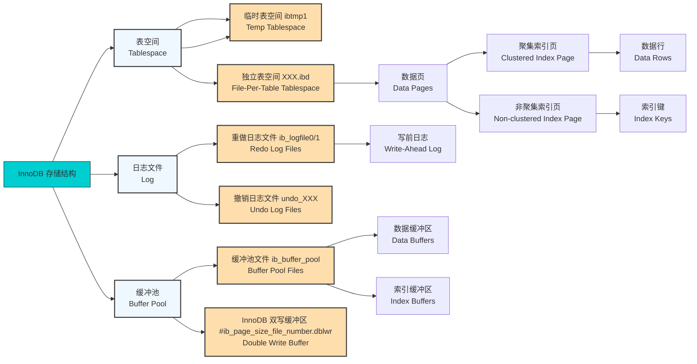

</div>

<style>

.mermaid-container-innodb{
  width: 100%;
  overflow: auto;
}

.mermaid-container-innodb .mermaid {
  width: 1000px;
}

</style>

::: warning 关于日志
除 `InnoDB` 的日志外，属于服务层的 `BinLog`(binlog.XXXXXX) 也同样重要。其用法将在下文介绍。

推荐参考 [MySQL系列（二）：日志篇](https://zhuanlan.zhihu.com/p/652252941)
:::

通过上述结构，InnoDB实现了事务支持 (ACID)、MVCC（多版本并发控制）等特性。

---

##### 执行原理

**查询**

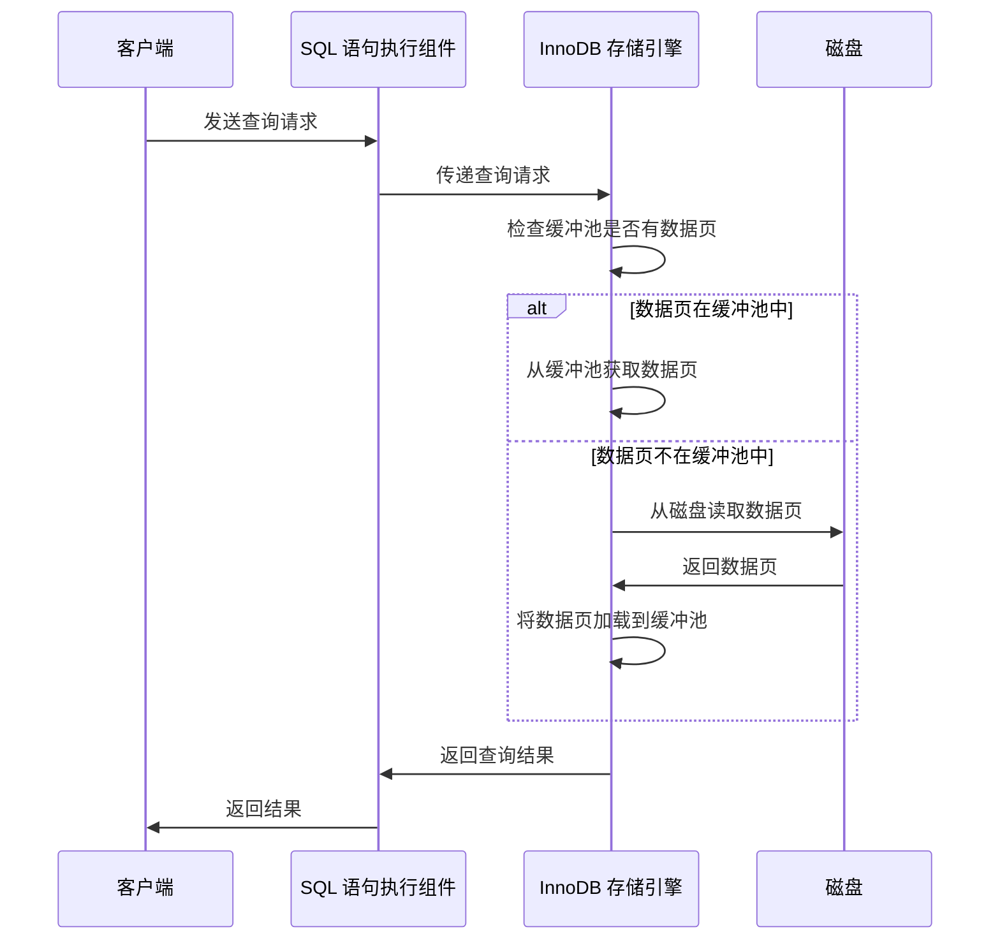

**新增/更新/删除**

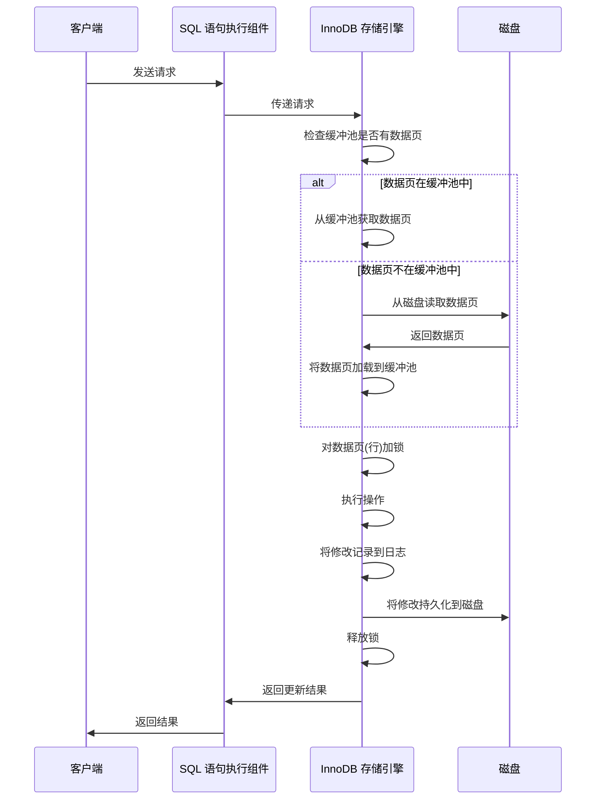

##### 事务实现

::: warning 事务特性
实现事务需要满足以下特性：

- **原子性 (Atomicity)**：事务中的所有操作要么全部执行，要么全部不执行。
- **一致性 (Consistency)**：事务完成后，数据库应该从一个一致的状态转变到另一个一致的状态。
- **隔离性 (Isolation)**：事务执行时，其他事务无法看到其中间状态。InnoDB 支持多种隔离级别，如读未提交、读已提交、可重复读和串行化。
- **持久性 (Durability)**：一旦事务提交，其结果会永久保存，即使发生系统崩溃。

最终目标都是为了保证 **一致性 (Consistency)**。
:::

::: tip 事务使用

muSql中可以使用以下语句实现事务：

``` sql
-- 开启事务： 
start transaction;/begin;

-- 提交事务：
commit; 
-- 回滚事务：
rollback;

-- 查看当前事务的状态	
SHOW ENGINE INNODB STATUS; 

-- 设置事务的隔离级别
SET TRANSACTION ISOLATION LEVEL READ COMMITTED;
SET TRANSACTION ISOLATION LEVEL REPEATABLE READ;
SET TRANSACTION ISOLATION LEVEL SERIALIZABLE;
SET TRANSACTION ISOLATION LEVEL READ UNCOMMITTED;
```
:::

::: warning 隔离级别
SQL 标准定义了四种事务隔离级别，按从低到高的顺序分别是：

1. **读未提交（Read Uncommitted）：**

- **定义**：在此级别，事务可以读取其他事务尚未提交的数据。
- **问题**：可能导致 ***脏读*** ，即读取到其他事务未提交的数据，这些数据可能会被回滚，导致读取到无效数据。
- **适用场景**适：用于对数据一致性要求不高的场景，但通常不推荐使用。

2. **读已提交（Read Committed）：**

- **定义**：在此级别，事务只能读取其他已提交事务的数据。
- **问题**：解决了 ***脏读*** 问题，但可能导致 ***不可重复读***，即在同一事务中多次读取同一数据时，结果可能不同，因为其他事务可能已修改该数据并提交。
- **适用场景**：适用于对数据一致性要求较高的场景，但仍可能出现不可重复读问题。

3. **可重复读（Repeatable Read）：**

- **定义**：在此级别，事务在其生命周期内多次读取同一数据时，结果始终相同，即使其他事务已提交修改。
- **问题**：解决了 ***脏读*** 和 ***不可重复读问题*** ，但可能导致 ***幻读***，即在同一事务中多次查询结果集时，结果集的行数可能不同，因为其他事务可能已插入或删除数据。
- **适用场景**：适用于对数据一致性要求高的场景，MySQL 的默认隔离级别即为此。

4. **串行化（Serializable）：**

- **定义**：在此级别，事务以串行方式执行，即每次只有一个事务可以执行，其他事务必须等待。
- **问题**：解决了 ***脏读***、***不可重复读*** 和 ***幻读*** 问题，但性能开销最大，可能导致系统吞吐量降低。
- **适用场景**：适用于对数据一致性要求极高的场景，但通常不推荐使用，除非绝对必要。

在 MySQL 的 InnoDB 存储引擎中，默认的事务隔离级别是 **可重复读（Repeatable Read）**。
:::

::: tip 事务实现

- 通过 ***撤销日志（Undo Log）*** 来实现**原子性**。 

当事务对数据进行修改时，InnoDB 会生成相应的撤销日志。
如果事务执行失败或调用了回滚（ROLLBACK），InnoDB 会利用撤销日志中的信息，
将数据恢复到修改之前的状态。

- 通过 ***重做日志（Redo Log）*** 来实现**一致性**。 

在事务提交时，InnoDB 会将事务的所有日志写入到重做日志文件中，确保即使发生崩溃，已提交的事务也不会丢失。

- 通过 ***多版本并发控制（MVCC）*** 和 ***锁机制*** 来实现**隔离性**。 

MVCC 允许事务读取数据的不同版本，避免了读取未提交数据的问题。
同时，InnoDB 使用行级锁和表级锁来控制并发访问，防止事务之间的干扰。

- 通过 ***重做日志（Redo Log）*** 和 ***双写缓冲区（Doublewrite Buffer）*** 来实现**持久性**。 

在事务提交时，InnoDB 会将重做日志写入磁盘，确保即使发生崩溃，已提交的事务也不会丢失。 
此外，双写缓冲区机制确保了数据页的完整性，即使在写入过程中发生崩溃，也能通过双写缓冲区恢复数据。

**事务流程**：

<div class="mermaid-container-transactions">

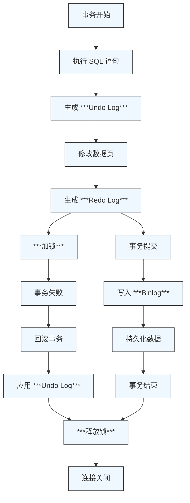

</div>

<style>

.mermaid-container-transactions{
  width: 100%;
  overflow: auto;
}

.mermaid-container-transactions .mermaid {
  width: 280px;
}

</style>


:::

::: tip 加锁机制

锁是保存在Buffer Pool中的数据结构，用于实现事务的隔离性。

<hr/>

**锁的基本属性**：

- 上锁的事务信息
- 被锁的索引信息
- 锁的 ***模式(lock_mode)*** 、 ***类型(lock_type)*** 和  ***行子类型(rec_lock_type)***

<hr/>

**模式(lock_mode)**：

1. **共享锁（S 锁）和排他锁（X 锁）**

- **共享锁（S 锁）**：允许多个事务同时读取同一数据行（加共享锁），但阻止其他事务对该行进行写操作（加排它锁）。
- **排他锁（X 锁）**：阻止其他事务对该数据行进行任何读写操作（加共享锁和排它锁）。

2. **意向锁（Intention Lock）**：

意向锁是表级锁，用于支持表级锁和行级锁的兼容性。

用于指示事务对某些行加锁的意图，分为**意向共享锁（IS）** 和 **意向排他锁（IX）**。 

在其他事务加锁时无需遍历，只需要差表的意向锁。

**锁兼容性**：

- **IS 和 IS**：多个事务可以在同一表上加意向共享锁（IS），它们之间没有冲突。
- **IX 和 IX**：多个事务可以在同一表上加意向排他锁（IX），它们之间也没有冲突。
- **IS 和 IX**：如果一个事务已经加了意向共享锁（IS），另一个事务可以加意向排他锁（IX），但加了 IX 锁的事务不能对行加共享锁。
- **表级排他锁和意向锁的冲突**：如果一个事务打算对表加排他锁（X 锁），它会首先检测表上是否存在任何意向锁（IS 或 IX），如果存在冲突的意向锁，事务将等待直到这些锁被释放。

3. **自增锁（Lock_Auto_Inc）**

插入数据时，先加自增锁，再生成自增值，再释放自增锁。避免自增值重复。

自增值已生成即使事务回滚也不会回滚。

<hr/>

**类型(lock_type)**：

1. **表锁（Table Lock）**
2. **行锁（Record Lock）**

<hr/>

**行子类型(rec_lock_type)**：

1. **精确行锁（Lock_Rec_Not_Gap）**

用于锁定精准的行。

2. **间隙锁（Gap Lock）**：

用于锁定索引中的间隙，即两个索引值之间的范围，防止其他事务在该范围内插入新记录，从而避免“幻读”现象。

3. **临键锁（Next-Key Lock）**：

记录锁和间隙锁的组合，锁定一个范围，包括实际的记录和其前后的间隙。 

这种锁定方式用于防止幻读，确保在事务期间其他事务无法在该范围内插入新记录。

<hr/>

**上锁过程**

在 InnoDB 中，增删改查操作会根据事务的隔离级别、操作的类型以及表的结构等因素，使用不同类型的锁：

1. **查询（SELECT）操作**
- **不加锁（普通 SELECT）：** 如果查询只是读取数据，不涉及修改，***默认***情况下不会加任何锁(使用 ***MVCC***)，其他事务可以并发地进行插入、更新、删除等操作。
- **共享锁（SELECT ... FOR SHARE）：** 加共享锁，允许多个事务读取相同的数据行，但不允许其他事务修改该数据行。
- **排他锁（SELECT ... FOR UPDATE）：** 加排他锁，阻止其他事务对查询的行进行任何修改。这种锁通常用于查询并修改某些行的场景。
2. **插入（INSERT）操作**
- **记录锁（Record Lock）：** 对于插入的记录，InnoDB 会加排他锁，阻止其他事务插入相同的记录。
- **间隙锁（Gap Lock）：** 如果是插入新记录，InnoDB 会在插入的间隙上加锁，防止其他事务插入记录，避免幻读。比如插入时，如果某个索引值不存在，InnoDB 会加上间隙锁来锁定该间隙。
- **插入意向锁（Insert Intention Lock）：** 用于在插入记录之前，在间隙上加锁，表示将会在该位置插入新记录。
3. **更新（UPDATE）操作**
- **记录锁（Record Lock）：** 当更新数据时，InnoDB 会对修改的记录加排他锁，阻止其他事务修改该行数据。
- **间隙锁（Gap Lock）：** 如果更新操作涉及到范围查询（如更新某一范围内的记录），InnoDB 会在该范围内加间隙锁，防止其他事务插入新记录。
- **临键锁（Next-Key Lock）：** 如果更新操作涉及范围扫描（比如更新符合某条件的多行数据），InnoDB 会在记录和间隙之间加临键锁。它锁定了记录本身以及该记录前后的间隙，防止“幻读”现象。
4. **删除（DELETE）操作**
- **记录锁（Record Lock）：** 删除操作会对待删除的记录加排他锁，防止其他事务在同一时间修改或删除该记录。
- **间隙锁（Gap Lock）：** 如果删除操作是基于范围的（如删除某个范围内的记录），InnoDB 会在该范围的间隙上加锁，避免其他事务插入数据。
- **临键锁（Next-Key Lock）：** 与更新操作相似，删除操作可能会加临键锁，锁定记录和记录间隙，防止幻读。

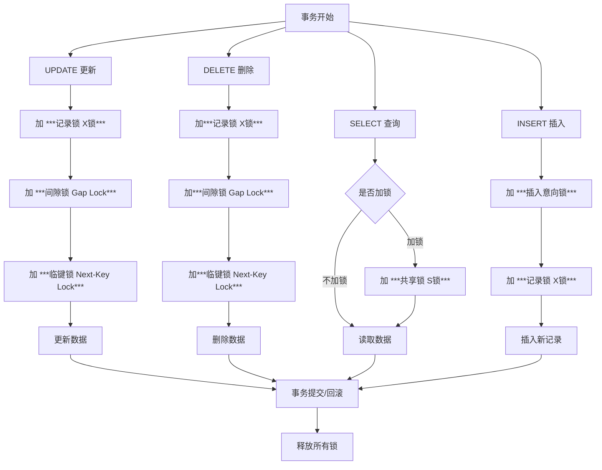
:::

::: tip MVCC
多版本并发控制（MVCC，Multi-Version Concurrency Control） 是一种用于提高数据库并发性能的机制。
它通过为每行数据维护多个版本，使读操作无需加锁即可进行，从而减少读写冲突，提升系统性能。

**工作原理**：

1. **版本控制**： 每行记录包含多个版本，每个版本对应一个特定的事务。当事务对数据进行修改时，会生成新的数据版本，而旧版本会被保留，以供其他并发事务读取。
2. **隐藏字段**： InnoDB 为每行记录维护两个隐藏字段：
- **创建版本号（trx_id）**： 记录插入或更新该行数据的事务 ID。
- **删除版本号（roll_pointer）**： 指向 undo log，用于记录删除操作。
3. **Undo Log**： 用于存储数据的历史版本。当事务对数据进行修改时，InnoDB 会将旧版本的数据保存到 undo log 中，以便在需要时恢复或供其他事务读取。
4. **Read View**： 在可重复读（Repeatable Read）隔离级别下，事务在启动时会创建一个一致性视图（Read View），用于确定可见的数据版本。

**工作机制**：

当一个事务读取数据时，它会检查数据的当前版本与自己的事务版本之间的关系：

- 如果数据项的创建版本早于事务的开始版本，并且删除版本晚于或等于事务的开始版本，那么这个事务可以看到这个数据项。
- 否则，这个事务将看不到这个数据项（即认为它不存在）。

详细参考[MVCC](https://cloud.tencent.com/developer/article/2378614)
:::

---

##### 索引实现

InnoDB 存储引擎主要通过 B+ 树结构来实现索引，分为**聚簇索引**和**非聚集索引**两种类型。

::: tip B+ 树可视化网站
[B+ Trees](https://www.cs.usfca.edu/~galles/visualization/BPlusTree.html)
:::

::: tip B树
结构：

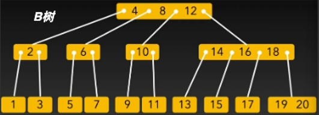

缺点:

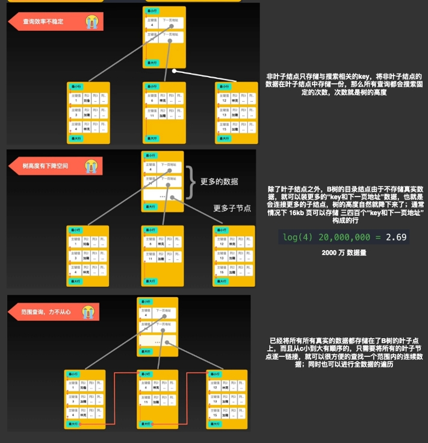

:::

::: tip B+树
结构：

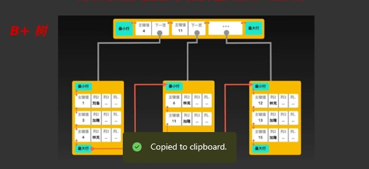

B+树与B树的区别:

1. B树的每个结点都存储了key和data，B+树的data存储在叶子节点上。

节点不存储data，这样一个节点就可以存储更多的key。可以使得树更矮，所以IO操作次数更少。

2. 树的所有叶结点构成一个有序链表，可以按照关键码排序的次序遍历全部记录

由于数据顺序排列并且相连，所以便于区间查找和搜索。而B树则需要进行每一层的递归遍历。
相邻的元素可能在内存中不相邻，所以缓存命中性没有B+树好。
:::

::: tip 磁盘预读
由于存储介质的特性，磁盘本身存取就比主存慢很多，再加上机械运动耗费，磁盘的存取速度往往是主存的几百分之一，因此为了提高效率，要尽量减少磁盘I/O。

为了达到这个目的，磁盘往往不是严格按需读取，而是每次都会预读，即使只需要一个字节，磁盘也会从这个位置开始，顺序向后读取一定长度的数据放入内存。

这样做的理论依据是:

***局部性原理***：**当一个数据被用到时，其附近的数据也通常会马上被使用。程序运行期间所需要的数据通常比较集中。**
::: 

::: tip **聚簇索引**和**非聚集索引**

1. **聚簇索引**

每个InnoDB表都有一个特殊的索引，称为聚集索引。

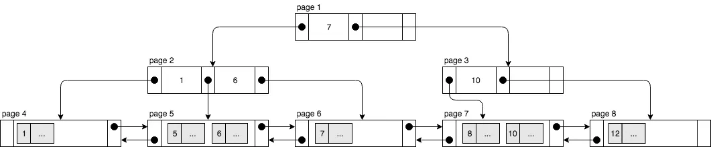

一个表最多只能有一个聚集索引:

- 当有主键时，则将主键用作聚集索引
- 当没有主键时，使用第一个NOT NULL UNIQUE索引作为聚集索引。
- 如果以上都没有，InnoDB会在包含行ID值的合成列上生成一个名为GEN_CLUST_INDEX的隐藏聚集索引

聚集索引按 key 也就是主键值顺序存储记录，父节点的 key 会在子节点复制一份，并且每个叶节点连接到其相邻的叶节点。

这有以下几个好处：

- 双向链表允许在页之间快速移动，便于在不同页之间进行导航。这对于遍历和访问数据时非常高效，因为可以在链表中向前和向后移动。
- 在处理行插入和删除时，双向链表可以快速找到需要更新的页。这对于页的合并、分裂和重用都非常有利。
- 执行范围查询不需要扫描整个树。它所需要做的就是找到包含最小值的叶节点，然后加载下一个叶节点，以此类推，直到到达包含最大值的叶结点。


2. **非聚集索引**

非聚集索引不在叶子节点中存储数据行，而只存储辅助索引的索引 key 和聚集索引的 key （通常是主键）来查找记录（***回表***）：

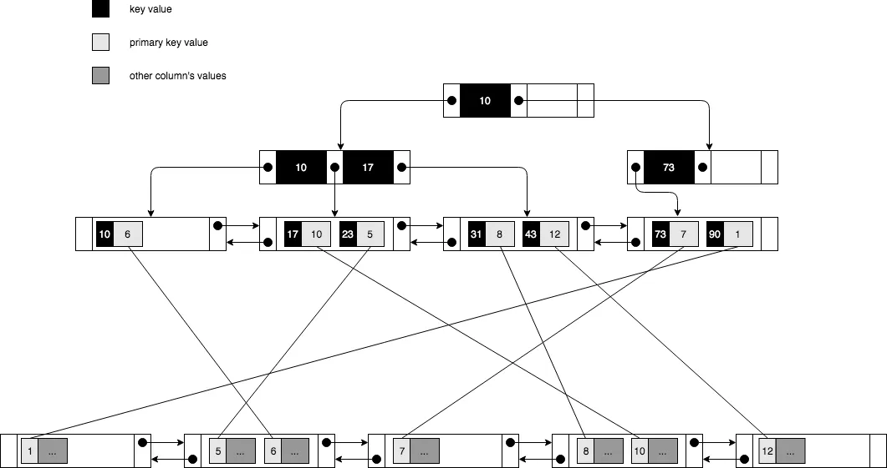

:::

::: tip 基数和选择性
1. **基数**

在数据库中，某一列的唯一键（distinct Keys）的数量叫作基数。

比如性别列，该列有F、M、FM三种，所以这一列基数是 3。

``` sql
SELECT count(DISTINCT column_name) FROM table_name;  -- 结果 = 3
```

2. **选择性**

列的基数与表中总行数的比值再乘以100%就是某个列的选择性，公式为：选择性= (基数/ 总行数) * 100%。 

``` sql
SELECT CONCAT((count(DISTINCT column_name) / count(*)) * 100, '%') FROM table_name;

```

3. **为什么要关注列的选择性**

列的选择性是衡量一个列或一组列对于过滤数据的有效程度。我们知道索引最重要的目的之一是尽可能地缩小匹配行的初始候选值，从而减少IO，提升查询性能。

选择性高表示该列的值在整个表中分布得比较均匀。通常来说**索引列的选择性越高则查询效率越高**，因为选择性高的索引可以让数据库在查找时通过该列筛选数据可以过滤掉更多的行，这对于索引的设计和查询性能至关重要。

- 创建复合索引：在建立复合索引时，一般我们要把**选择性更高的列放在前面，以尽可能地缩小匹配行的初始候选值。**
- 创建前缀索引：比如在mysql中，建立前缀索引的意义在于相对于整列建立索引，前缀索引仅仅是选择该列的部分字符作为索引，减少索引的字符可以节约索引空间，从而提高索引效率，但这样也会降低索引的选择性。建立合理前缀索引的诀窍在于要选择足够长的前缀以保证较高的选择性，同时又不能太长（以便节约空间）

:::

---

#### 性能优化

##### 连接优化

- **使用连接池**：

连接池通过预创建一定数量的连接并在多个客户端请求中复用这些连接，来显著提高系统的性能，特别是在高并发的场景下。

::: tip
1. 连接池内置在MySql Conectors(MySQL Connector/NET, MySQL Connector/J)中，可以安装时需要勾选。也可以使用第三方连接池库.
2. 使用MySql Conectors中的连接池时，可以在连接字符串中使用以下配置：

``` C#
string connectionString = "Server=localhost;Database=mydatabase;Uid=myusername;Pwd=mypassword;Pooling=true;MinPoolSize=5;MaxPoolSize=50;ConnectionTimeout=30;";
```

其中：
- `Pooling=true`：启用连接池。
- `MinPoolSize`：连接池中最小的连接数，通常在高负载的情况下可以提高性能。
- `MaxPoolSize`：连接池中的最大连接数。超过这个数目后，新请求将会等待连接池中有空闲连接。
::: 

- **调整最大连接数**：通过 max_connections 参数调整 MySQL 服务器支持的最大连接数。

``` sql
SET GLOBAL max_connections = 500;
```

- **减少连接延迟**：优化网络配置。
- **监控连接状态**：通过 SHOW PROCESSLIST 或性能模式（Performance Schema）监控连接状态，及时发现异常连接。

``` sql
SHOW PROCESSLIST;
SELECT * FROM performance_schema.events_statements_summary_by_thread_by_event_name;
```

---

##### 索引优化

**使用 EXPLAIN 分析索引是否生效**

如何使用EXPLAIN：

比如：

``` sql
EXPLAIN SELECT * FROM test WHERE id = 1;
```

结果：

|id	|select_type	|table	|partitions	|type	|possible_keys	|key	|key_len	|ref	|rows	|filtered	|Extra|
|----|----|----|----|----|----|----|----|----|----|----|----|
|1	|SIMPLE	|test|		|const	|PRIMARY	|PRIMARY	|4	|const	|1	|100.00	|

其中各字段含义如下;
|字段名	|含义	|关注重点|
|----|----|----|
|id	|查询的标识 ID（编号）|表示查询的执行顺序	一般 ID 值越大，优先执行|
|select_type	|查询类型，如 SIMPLE、PRIMARY、SUBQUERY	|关注是否是 DEPENDENT SUBQUERY（依赖子查询）|
|table	|访问的表名	|查询涉及的表|
|partitions	|使用的分区（仅适用于分区表）	|如果使用了分区表，需要关注|
|**type**	|**访问类型，如 ALL、index、range、ref、const 等**	|**ALL（全表扫描）要优化，const 最优**|
|possible_keys	|可能使用的索引	|如果是 NULL，表示没有索引可用，需要优化|
|key	|实际使用的索引	|如果为 NULL，说明索引未生效|
|key_len	|使用的索引长度（字节）	|越短越好，避免过长的索引占用资源|
|ref	|索引比较的值，如 const、func、NULL	|是否合理利用索引进行查询|
|rows	|预计需要扫描的行数	|行数越多，查询越慢，应尽量减少|
|filtered	|过滤率，表示返回的行数占比	|越高越好，100% 表示索引精准匹配|
|extra	|额外信息，如 Using index、Using filesort	|避免 Using filesort 和 Using temporary|

重点关注：

|type |	说明	| 性能 |	备注|
|----|----|----|----|
|system	|只有一行数据的表	|✅ 最优	|通常出现在 system 表或 dual 表|
|const	|通过 主键或唯一索引 查询单行数据	|✅ 最优	|适用于 WHERE id = 1 这样的主键查询|
|eq_ref	|通过索引关联查询，每次查询最多返回一行数据	|✅ 很高	适用于 |多表关联（JOIN） 且被关联列有主键或唯一索引|
|ref	|通过 非唯一索引 或 前缀索引 进行查找	|✅ 较优	|适用于 非唯一索引或复合索引 的查询|
|range	|通过 索引范围扫描 查找数据	|⚠️ 一般	|适用于 BETWEEN、>、<、IN 等查询|
|index	|全索引扫描，遍历索引但不扫描表数据	|⚠️ 一般	|类似于 ALL，但只扫描索引|
|ALL	|全表扫描，查询性能最差	|❌ 最差	|适用于没有索引的查询，查询数据量大时性能低|

<!-- 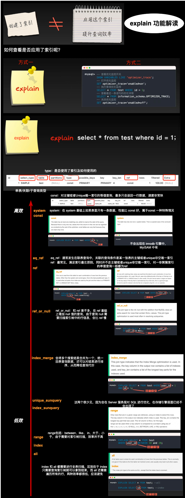 -->

**索引失效的场景**

索引失效的原因一般有以下几种：

1. **B+ 树索引按照有序方式存储，无法进行高效的范围查找**

比如：

::: tip  使用 LIKE 模糊匹配
使用 LIKE 模糊匹配, 前导 % 使得 B+ 树索引无法进行范围查找。

解决方案：

- 避免前导 %，如 LIKE 'abc%' 可以使用索引。
- 使用全文索引（FULLTEXT） 代替 LIKE '%xxx%'
```sql
ALTER TABLE articles ADD FULLTEXT INDEX idx_content (content);
SELECT * FROM articles WHERE MATCH(content) AGAINST('abc');
```
:::

::: tip 组合索引未按“最左前缀”原则使用
如果在查询时，没有按照组合索引的最左前缀规则使用，索引可能不会生效。

比如：创建一个（a,b）的联合索引，那么它的索引树就是：

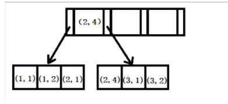

Mysql会在第一个字段的排序基础上，然后在对第二个字段进行排序。所以b=2这种查询条件没有办法利用索引。

所以，假设有 组合索引 (a, b, c)：

``` sql
CREATE INDEX idx_abc ON test(a, b, c);
```

|查询	|是否使用索引|
|----|----|
|WHERE a = 1	|✅ 使用索引|
|WHERE a = 1 AND b = 2	|✅ 使用索引|
|WHERE a = 1 AND b = 2 AND c = 3	|✅ 使用索引|
|WHERE b = 2	|❌ 索引失效|
|WHERE c = 3	|❌ 索引失效|
:::

::: tip  使用 `!=`、`<>` 或 `NOT IN`

当 WHERE 使用 `!=`、`<>` 或 `NOT IN` 时，索引不会生效。

B+ 树索引按照有序方式存储，`!=` 使得 MySQL 需要全表扫描数据，而不是利用索引。

解决方案：

使用 `BETWEEN`、`IN`、`>=`、`<=` 代替：

``` sql
-- ❌ 索引失效
SELECT * FROM users WHERE age != 30;

-- ✅ 索引生效
SELECT * FROM users WHERE age > 30 OR age < 30;
```
:::

::: tip  使用 `OR` 连接多个条件

如果 OR 连接的字段中，其中一个字段没有索引，整个查询都不会走索引。

解决方案：

改用 `UNION ALL` 先使用索引，再取并集。

``` sql
SELECT * FROM users WHERE name = 'Seven'
UNION ALL
SELECT * FROM users WHERE email = 'Seven@example.com';
```

:::

2. **索引列的数据基数过小，MySQL 认为扫描整个表比使用索引更快**

比如：

::: tip 如 sex 只有 M 和 F 两种值， 数据基数过小索引失效
解决方案：

强制使用索引：

``` sql
SELECT * FROM users FORCE INDEX(sex) WHERE sex = 'F';

```
::: 

3. **在索引列上进行函数计算**

比如：

::: tip 在 WHERE 条件中对索引列使用了函数

MySQL 需要计算每一行的值，无法使用索引进行查找。

解决方案：

直接使用索引列，而不是对索引列做运算：

``` sql
-- ❌ 索引失效
SELECT * FROM users WHERE YEAR(create_time) = 2023;

-- ✅ 索引生效
SELECT * FROM users WHERE create_time BETWEEN '2023-01-01' AND '2023-12-31';

```
::: 

---

##### 查询语句优化

::: tip 避免 `SELECT *`
使用 `SELECT *`会导致：

1. **增加磁盘开销**

数据库本质上是将记录存储在磁盘上，查询的字段越多，读取的内容也就越多，对IO磁盘的开销也就会增大，

2. **加重网络时延**

3. **无法使用覆盖索引**
覆盖索引（Covering Index） 允许 MySQL 直接从 索引 读取数据，避免访问主表（**回表**）。

比如：

``` sql
CREATE INDEX idx_name ON users(name, phone);
SELECT phone FROM users WHERE name = 'Seven';  -- 仅查询索引，无需访问表数据
SELECT * FROM users WHERE name = 'Seven'; -- 需要回表
``` 
:::

::: tip 使用 `JOIN` 替代子查询
比如：

子查询：

``` sql
SELECT * FROM orders 
WHERE user_id IN (SELECT id FROM users WHERE status = 'active');
```

JOIN:

``` sql
SELECT orders.* FROM orders
JOIN users ON orders.user_id = users.id
WHERE users.status = 'active';
```

- JOIN 允许 MySQL 先优化 users 表的筛选，然后通过索引匹配 orders，减少查询范围。
- 子查询可能导致重复执行（MySQL 5.6 之前不会缓存子查询结果，每次都重新执行）。
:::

::: tip 使用 `EXISTS` 代替 `IN`
- `EXISTS` 不会返回全部匹配数据，一旦找到匹配项就立刻返回 TRUE，查询提前终止，提高性能。
- `IN` 可能会扫描整个子查询结果，而 `EXISTS` 只检查是否存在匹配项，避免不必要的计算。
:::

::: tip 使用 `ORDER BY` 时结合索引
索引有序，减少排序开销。
:::

::: tip 分页优化

低效（LIMIT 100000, 10 可能导致大量数据扫描）：

``` sql
SELECT * FROM users ORDER BY id LIMIT 100000, 10;
```

优化（使用索引加条件）：

```sql
SELECT * FROM users WHERE id > 100000 ORDER BY id LIMIT 10;
```

:::

---

##### 分库分表和读写分离

**分库分表** 和 **读写分离** 是两种常见的数据库架构优化方案，主要用于提升性能、提高并发处理能力。

.net core的分库分表和读写分离开源框架推荐：
- [ShardingCore](https://github.com/xuejmnet/ShardingCore)
- [EFCore.Sharding](https://github.com/dotnetcore/EFCore.Sharding)
- [ShardingSphere](https://shardingsphere.apache.org/)

---

##### 监控和日志分析

开源监控和日志工具推荐：
- [Netdata](https://github.com/netdata/netdata)

Netdata是一个开源的数据库、系统、容器和应用程序监控项目，能够收集指标，并将信息美观地呈现在仪表盘中。它可以运行在物理机、虚拟服务器、云平台、Kubernetes集群或者边缘设备上。它支持多种数据库引擎、虚拟机、应用程序指标。

- [Prometheus](https://github.com/prometheus/prometheus)

Prometheus只提供了一个非常基本的可视化层。因此，它通常需要与Grafana一起使用，Grafana是一种用于创建图表和指标的可视化工具。

……