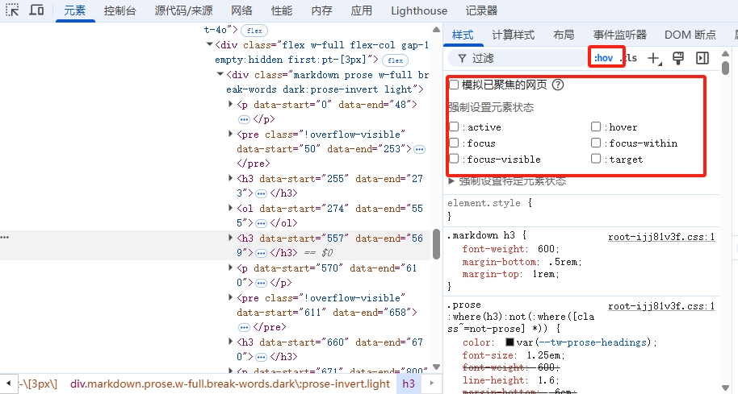
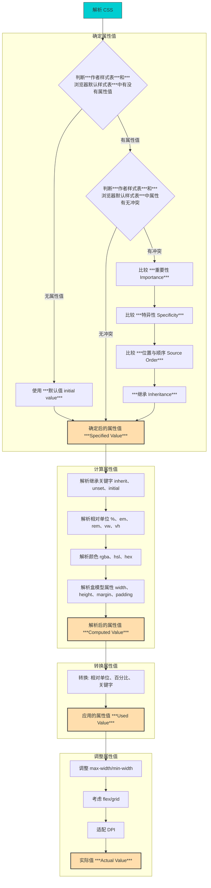

# HTML&CSS

## HTML

超文本标记语言（HyperText Markup Language）。是构建网页内容的标准标记语言，定义了网页的结构，如文本、图像、链接、表格等。

### 语义化
HTML的语义化是指在编写HTML代码时，使用具有明确含义的标签来描述**内容的结构和意义**，而不仅仅关注其呈现效果。

这种方法强调内容的语义，使网页在结构上更加清晰，有助于搜索引擎的索引和抓取，也有利于在不同设备上保持一致的显示效果。

### 元素

::: warning html5元素周期表
https://www.xuanfengge.com/funny/html5/element/
:::


HTML 元素的基本结构如下：

HTML 元素是网页的构建块，每个元素通常由标签、内容和可选的属性组成。HTML 元素定义了网页的结构和内容。HTML 元素的基本结构如下：

```html
<元素名 属性1="值1" 属性2="值2">内容</元素名>
```

### 常见 HTML 元素介绍

1. **`<html>`**：定义整个 HTML 文档的根元素。
   - 示例：
     ```html
     <html lang="en">
     </html>
     ```

2. **`<head>`**：包含页面的元数据，如字符集、网页标题、外部样式表和脚本。
   - 示例：
     ```html
     <head>
         <meta charset="UTF-8">
         <title>网页标题</title>
         <link rel="stylesheet" href="styles.css">
     </head>
     ```

3. **`<body>`**：包含网页的可视内容，如文本、图像、按钮等。
   - 示例：
     ```html
     <body>
         <h1>欢迎来到我的网站</h1>
         <p>这是网页的内容。</p>
     </body>
     ```

4. **`<h1> ~ <h6>`**：表示标题，`<h1>` 为最高级别的标题，`<h6>` 为最低级别的标题。
   - 示例：
     ```html
     <h1>这是一级标题</h1>
     <h2>这是二级标题</h2>
     ```

5. **`<p>`**：定义段落，用于包裹文本内容。
   - 示例：
     ```html
     <p>这是一个段落。</p>
     ```

6. **`<a>`**：定义超链接，用于在网页之间进行跳转。常用的属性是 `href`，指定链接的目标地址。
   - 示例：
     ```html
     <a href="https://www.example.com">点击访问示例网站</a>
     ```

7. **``**：定义图像，使用 `src` 属性指定图像的路径，`alt` 属性提供替代文本。
   - 示例：
     ```html
     
     ```

8. **`<ul>`**：定义无序列表，通常与 `<li>` 元素一起使用，每个 `<li>` 表示列表项。
   - 示例：
     ```html
     <ul>
         <li>苹果</li>
         <li>香蕉</li>
     </ul>
     ```

9. **`<ol>`**：定义有序列表，也与 `<li>` 一起使用，但列表项会按顺序编号。
   - 示例：
     ```html
     <ol>
         <li>第一项</li>
         <li>第二项</li>
     </ol>
     ```

10. **`<li>`**：定义列表项，通常用于 `<ul>` 或 `<ol>` 中。
    - 示例：
      ```html
      <ul>
          <li>苹果</li>
      </ul>
      ```

11. **`<div>`**：定义一个区块元素，用于布局和分隔内容。它本身不提供任何视觉效果，但常用于组织页面结构。
    - 示例：
      ```html
      <div>
          <p>这是一个块级元素。</p>
      </div>
      ```

12. **`<span>`**：定义一个内联元素，通常用于文档中对部分文本或元素进行样式修改。
    - 示例：
      ```html
      <span style="color: red;">这是红色的文本。</span>
      ```

13. **`<form>`**：定义表单，用于收集用户输入。通常包含 `<input>`、`<select>`、`<textarea>` 等表单控件。
    - 示例：
      ```html
      <form action="/submit" method="post">
          <label for="name">姓名：</label>
          <input type="text" id="name" name="name">
          <input type="submit" value="提交">
      </form>
      ```

14. **`<input>`**：定义一个输入控件，允许用户输入数据。常用的类型包括 `text`、`password`、`email` 等。
    - 示例：
      ```html
      <input type="text" placeholder="请输入用户名">
      ```

15. **`<button>`**：定义一个按钮，通常用于触发操作或提交表单。
    - 示例：
      ```html
      <button>点击我</button>
      ```

16. **`<table>`**：定义表格，用于组织数据。通常与 `<tr>`（行）、`<td>`（单元格）和 `<th>`（表头）一起使用。
    - 示例：
      ```html
      <table>
          <tr>
              <th>姓名</th>
              <th>年龄</th>
          </tr>
          <tr>
              <td>张三</td>
              <td>25</td>
          </tr>
      </table>
      ```

17. **`<tr>`**：定义表格行，通常位于 `<table>` 中。
    - 示例：
      ```html
      <tr>
          <td>张三</td>
          <td>25</td>
      </tr>
      ```

18. **`<td>`**：定义表格单元格，用于存放数据，通常位于 `<tr>` 中。
    - 示例：
      ```html
      <td>张三</td>
      ```

19. **`<th>`**：定义表格的表头单元格，通常用于列标题。
    - 示例：
      ```html
      <th>姓名</th>
      ```

20. **`<iframe>`**：定义一个内联框架，允许在网页中嵌入其他网页或媒体。
    - 示例：
      ```html
      <iframe src="https://www.example.com" width="600" height="400"></iframe>
      ```

## CSS

CSS（Cascading Style Sheets，层叠样式表）是一种用于描述 HTML 或 XML（包括 XHTML）文档外观和格式的样式表语言。

CSS 负责定义网页的布局、颜色、字体等，使网页具有良好的视觉效果和用户体验。

CSS 规则由 选择器 和 声明块 组成，声明块中包含 属性 和 属性值。

``` css
选择器 {
    属性: 属性值;
}
```

示例：

``` css
p {
    color: red; /* 文字颜色为红色 */
    font-size: 16px; /* 字体大小16px */
}
```

### 引入方式

#### 行内样式（Inline CSS）

直接在 `HTML` 元素的 `style` 属性中定义 `CSS` 样式，适用于简单的样式调整，但不推荐大规模使用。

``` html
<p style="color: blue; font-size: 18px;">这是一个带有行内样式的段落。</p>
```

#### 内部样式表（Internal CSS）

在 HTML 文档的 `<style>` 标签内定义样式，适用于单个 `HTML` 文件的样

``` html
<head>
    <style>
        p {
            color: green;
            font-size: 20px;
        }
    </style>
</head>
```

#### 外部样式表（External CSS）

将 `CSS` 代码写在独立的 `.css` 文件中，并在 HTML 中通过 `<link>` 标签引入，是推荐的方式。

``` html
<head>
    <link rel="stylesheet" href="styles.css">
</head>
```

``` css
p {
    color: black;
    font-size: 22px;
}
```

---

### 选择器

CSS 选择器用于选择 HTML 元素，并应用相应的样式。

选择器分为 ***基本选择器***、***组合选择器***、***伪类选择器***、***伪元素选择器***和 ***属性选择器***


#### 基本选择器（Basic Selectors）

##### 通配选择器（`*`）
- 选择页面中的所有元素。
- 示例：
  ```css
  * {
      margin: 0;
      padding: 0;
  }
  ```
  > **作用**：通常用于清除默认的 margin 和 padding。

##### 元素选择器（标签选择器）
- 直接选取 HTML 标签，如 `p`、`h1`、`div` 等。
- 示例：
  ```css
  p {
      color: red;
  }
  ```
  > **作用**：所有 `<p>` 标签的文本颜色变为红色。

##### 类选择器（`.class`）
- 选取具有特定 `class` 的所有元素。
- 示例：
  ```css
  .highlight {
      background-color: yellow;
  }
  ```
  ```html
  <p class="highlight">高亮文本</p>
  ```

##### ID 选择器（`#id`）
- 选取具有特定 `id` 的唯一元素。
- 示例：
  ```css
  #main {
      width: 80%;
  }
  ```
  ```html
  <div id="main">主要内容</div>
  ```
  > **注意**：`id` 选择器用于唯一元素，不推荐多次使用相同 `id`。

---

#### 组合选择器（Combinators）

##### 后代选择器（`A B`）
- 选择 `A` 元素内的所有 `B` 元素（不限层级）。
- 示例：
  ```css
  div p {
      color: blue;
  }
  ```
  ```html
  <div>
      <p>我是蓝色的文本</p>
  </div>
  ```

##### 子元素选择器（`A > B`）
- 仅选择 `A` 的直接子元素 `B`（不包括嵌套更深的 `B`）。
- 示例：
  ```css
  div > p {
      color: green;
  }
  ```
  ```html
  <div>
      <p>直接子元素</p>
      <span><p>非直接子元素</p></span>
  </div>
  ```
  > **结果**：只有**直接子元素**的 `<p>` 变为绿色。

##### 相邻兄弟选择器（`A + B`）
- 选取**紧跟在** `A` 之后的 `B` 兄弟元素。
- 示例：
  ```css
  h1 + p {
      color: orange;
  }
  ```
  ```html
  <h1>标题</h1>
  <p>这个段落会变成橙色</p>
  <p>这个段落不受影响</p>
  ```

##### 通用兄弟选择器（`A ~ B`）
- 选取**所有在 `A` 之后的 `B`** 兄弟元素（不限距离）。
- 示例：
  ```css
  h1 ~ p {
      color: purple;
  }
  ```
  ```html
  <h1>标题</h1>
  <p>第一个段落</p>
  <p>第二个段落</p>
  ```
  > **结果**：`h1` 后的所有 `<p>` 变成紫色。

---

#### 伪类选择器（Pseudo-Classes）

伪类用于选取**特定状态**的元素，如鼠标悬停、选中、首个子元素等。

##### 动作伪类（交互状态）


- `:link`：超链接未访问
- `:visited`：超链接已访问
- `:hover`：鼠标悬停时
- `:focus`：获得焦点时
- `:active`：鼠标点击时

```css
a:hover {
    color: red;
}
input:focus {
    border: 2px solid blue;
}
button:active {
    background-color: gray;
}
```

::: danger 书写顺序
这几个伪类选择器在 CSS 书写时，推荐遵循“LVHA（LoVe HAte）”顺序，即：

📌 顺序：:link → :visited → :hover → :focus → :active
⚠️ :hover 必须放在 :visited 之后，:active 必须放在 :hover 之后！

为什么要按这个顺序？
- `:link`（未访问）：超链接的默认状态，应该先定义。
- `:visited`（已访问）：防止已访问链接样式被后面的 :link 覆盖。
- `:hover`（悬停）：用于交互效果，但必须放在 :link 和 :visited 之后，否则 :hover 可能不会生效。
- `:focus`（焦点）：让键盘导航也能获得样式变化，通常和 :hover 一起使用。
- `:active`（点击）：如果 :hover 放在 :active 之后，:active 可能无法生效。
:::

##### 结构伪类（位置选择）
- `:first-child`：选取父元素的第一个子元素。
- `:last-child`：选取父元素的最后一个子元素。
- `:nth-child(n)`：选取**第 n 个**子元素（n 可为数字、公式）。
- `:nth-of-type(n)`：选取相同类型的第 n 个元素。

```css
p:first-child {
    font-weight: bold;
}
li:nth-child(odd) {
    background-color: lightgray; /* 选择奇数行 */
}
li:nth-child(2n) {
    background-color: lightblue; /* 选择偶数行 */
}
```

---

#### 伪元素选择器（Pseudo-Elements）

伪元素用于**选取元素的某个部分**。

##### `::before` 和 `::after`
- 在元素内容**前**或**后**插入内容。
- 示例：
  ```css
  p::before {
      content: "🔥 ";
      color: red;
  }
  p::after {
      content: " ✅";
      color: green;
  }
  ```
  ```html
  <p>CSS 选择器</p>
  ```
  > **结果**：显示 `"🔥 CSS 选择器 ✅"`

##### `::first-letter` 和 `::first-line`
- `::first-letter`：选取**第一字母**。
- `::first-line`：选取**第一行**。

```css
p::first-letter {
    font-size: 24px;
    font-weight: bold;
}
p::first-line {
    color: blue;
}
```

---

#### 属性选择器（Attribute Selectors）

##### `[attr]` 选择器
- 选取**含有该属性**的元素：
  ```css
  [disabled] {
      background-color: gray;
  }
  ```

##### `[attr="value"]` 精确匹配
- 选取**属性值等于 "value"** 的元素：
  ```css
  input[type="text"] {
      border: 1px solid blue;
  }
  ```

##### `[attr~="value"]` 词匹配
- 选取属性值**包含 value（独立单词）** 的元素：
  ```css
  [title~="tooltip"] {
      color: green;
  }
  ```

##### `[attr^="value"]` 开头匹配
- 选取属性值**以 value 开头**的元素：
  ```css
  a[href^="https://"] {
      color: blue;
  }
  ```

##### `[attr$="value"]` 结尾匹配
- 选取属性值**以 value 结尾**的元素：
  ```css
  img[src$=".jpg"] {
      border-radius: 10px;
  }
  ```

##### `[attr*="value"]` 包含匹配
- 选取属性值**包含 value（任意位置）** 的元素：
  ```css
  a[href*="example"] {
      color: red;
  }
  ```

---

### 层叠（Cascade）

在 CSS（层叠样式表）中，**层叠**（Cascade）指的是当多个规则作用于同一个元素时，浏览器会根据一系列规则来决定**哪个样式生效**。主要依据以下几个原则：

---

#### **1. 重要性（Importance）**
**优先级最高**的是 `!important` 规则：
```css
p {
    color: red !important;
}
p {
    color: blue;
}
```
🔹 **最终生效：红色（`red`），因为 `!important` 最高优先级**。

📌 **优先级顺序（从高到低）：**
1. **开发者定义的 `!important` 规则**
2. **开发者定义的普通样式**
3. **浏览器默认样式**

---

#### **2. 特异性（Specificity）**
当多个规则冲突时，**选择器的特异性（Specificity）** 决定哪个生效。

**特异性计算规则**
| 选择器类型 | 计算值 |
|-----------|------|
| **内联样式（`style=""`）** | `1000` |
| **ID 选择器（`#id`）** | `100` |
| **类、伪类、属性选择器（`.class`，`:hover`，`[attr]`）** | `10` |
| **元素、伪元素选择器（`div`，`p`，`::before`）** | `1` |
| **通配符、继承（`*`，`inherit`）** | `0` |

**示例**
```css
p { color: blue; }          /* specificity = 1 */
.class { color: red; }      /* specificity = 10 */
#id { color: green; }       /* specificity = 100 */
```
🔹 **最终生效：绿色（`#id`），因为 ID 选择器的特异性最高（100 > 10 > 1）**

::: tip 总体规则
- **比较特异性时，总是数值大的优先！**
- **选择器选择的越窄越优先**
:::
---

#### **3. 位置与顺序（Source Order）**
当两个选择器特异性相同时，**后定义的规则覆盖前面的规则**。

```css
p {
    color: red;
}
p {
    color: blue;
}
```
**最终生效：蓝色（`blue`），因为它写在后面**

---

#### **4. 继承（Inheritance）**
**继承（Inheritance）** 是 CSS 重要的特性之一，它允许某些属性从父元素传递给子元素，从而减少重复代码并提高可维护性。

---

##### **哪些属性会被继承？**
📌 **文本相关属性** 会自动继承：
| **继承的属性** | **说明** |
|--------------|--------|
| `color` | 文字颜色 |
| `font` | 复合字体属性 |
| `font-family` | 字体系列 |
| `font-size` | 字体大小 |
| `font-style` | 字体样式（斜体等） |
| `font-variant` | 字体变体 |
| `font-weight` | 字重（加粗等） |
| `letter-spacing` | 字母间距 |
| `line-height` | 行高 |
| `visibility` | 可见性 |
| `word-spacing` | 单词间距 |
| `direction` | 文本方向 |

✅ **示例**
```css
body {
    color: blue;
}
p {
    /* 继承 body 的 color */
}
```
📌 由于 `color` 是可继承的，`<p>` 里的文字颜色会自动变成 **蓝色**。

---

##### **哪些属性不会被继承？**
📌 **布局、盒模型、边框、背景等不会继承**：
| **非继承属性** | **说明** |
|--------------|--------|
| `margin` | 外边距 |
| `padding` | 内边距 |
| `border` | 边框 |
| `width` / `height` | 宽度、高度 |
| `background` | 背景样式 |
| `display` | 显示模式 |
| `position` | 定位方式 |
| `z-index` | 层级 |
| `box-shadow` | 盒子阴影 |

✅ **示例**
```css
body {
    background: red;
}
p {
    /* 不继承背景 */
}
```
📌 `<p>` 不会继承 `background: red;`，仍然是默认背景。

---

##### **如何控制继承？**
CSS 提供了 3 种关键字来控制继承行为：
###### **`inherit`（强制继承）**
即使某个属性默认不会继承，也可以用 `inherit` 让它继承父级值：
```css
p {
    background: inherit; /* 继承父元素的背景 */
}
```

###### **`initial`（恢复默认值）**
让元素回归 CSS 规范定义的默认值：
```css
p {
    color: initial; /* 变回浏览器默认颜色（通常是黑色） */
}
```

###### **`unset`（恢复继承或默认值）**
- **如果属性默认可继承**，`unset` 等于 `inherit`。
- **如果属性默认不可继承**，`unset` 等于 `initial`。

```css
p {
    color: unset; /* 继承父级 color */
    background: unset; /* 变回默认背景 */
}
```

---

##### **继承的实际应用**
✅ **案例：用继承统一颜色**
```css
body {
    color: darkblue;
    font-family: Arial, sans-serif;
}
```
📌 这样所有子元素的文本都会**继承** `color` 和 `font-family`，减少重复代码。

✅ **案例：用 `inherit` 让边框颜色继承**
```css
.container {
    border: 2px solid red;
}
.child {
    border-color: inherit;
}
```
📌 `.child` 会继承 `.container` 的 `border-color: red;`。

---

#### **层叠规则优先级总结**
**优先级最高 → 最低**
1. `!important`
2. 特异性（内联 > ID > 类 > 元素）
3. 代码顺序（后定义的覆盖前面的）
4. 继承（部分属性可继承）

**"重要性 > 特异性 > 代码顺序 > 继承"**  
（`!important` > Specificity > Source Order > Inheritance）

### 📌属性计算过程总结

浏览器会根据dom树先序遍历，依次解析并渲染节点。


其中每个节点的所有css属性都要有值。

渲染过程如下：

<div class="mermaid-container-css">



</div>

<style>
.mermaid-container-css{
  width: 100%;
  overflow: auto;
}

.mermaid-container-css .mermaid {
  width: 450px;
}
</style>

::: tip `<a>`元素为什么不能继承
因为浏览器默认样式表中为`<a>`元素定义了特定的颜色值。

‌要让a元素继承父元素的颜色，可以使用CSS的inherit关键字。‌

比如：
``` css
a {
  color: inherit;
}
```
:::

### 重置样式表（CSS Reset）
**重置样式表（CSS Reset）** 主要用于清除不同浏览器的默认样式，确保页面在各个浏览器中表现一致。

---

##### **为什么需要重置样式表**
不同浏览器对 HTML 元素有不同的默认样式，比如：
- `<h1>` 在某些浏览器默认有 `margin`，而在另一些没有。
- `<button>` 在不同浏览器的 `padding` 和 `border` 可能不同。
- `<ul>` 和 `<ol>` 默认有 `padding` 和 `list-style`，但可能不同。

重置样式表的作用：
✔ **消除默认样式差异**  
✔ **提供统一的起点**  
✔ **增强可控性**

---

##### **常见的重置样式表**

###### **方法 1：Eric Meyer’s Reset.css**
这是最早且最广泛使用的 CSS Reset 之一，由 CSS 专家 **Eric Meyer** 提供：
```css
/* Eric Meyer’s Reset v2.0 (2011) */
html, body, div, span, applet, object, iframe,
h1, h2, h3, h4, h5, h6, p, blockquote, pre,
a, abbr, acronym, address, big, cite, code,
del, dfn, em, img, ins, kbd, q, s, samp,
small, strike, strong, sub, sup, tt, var,
b, u, i, center, dl, dt, dd, ol, ul, li,
fieldset, form, label, legend, table, caption,
tbody, tfoot, thead, tr, th, td,
article, aside, canvas, details, embed,
figure, figcaption, footer, header, hgroup,
menu, nav, output, ruby, section, summary,
time, mark, audio, video {
    margin: 0;
    padding: 0;
    border: 0;
    font-size: 100%;
    font: inherit;
    vertical-align: baseline;
}
article, aside, details, figcaption, figure,
footer, header, hgroup, menu, nav, section {
    display: block;
}
body {
    line-height: 1;
}
ol, ul {
    list-style: none;
}
blockquote, q {
    quotes: none;
}
blockquote::before, blockquote::after,
q::before, q::after {
    content: '';
    content: none;
}
table {
    border-collapse: collapse;
    border-spacing: 0;
}
```
📌 **特点：**
- **全面清除** `margin`、`padding`、`border` 等默认样式。
- **去除 `list-style`**，使 `ul` 和 `ol` 无默认列表符号。
- **让 `table` 变得紧凑**，清除 `border-spacing`。

---

###### **方法 2：Normalize.css**
`Normalize.css` 不是完全去除样式，而是**让不同浏览器的默认样式更统一**。

🔗 **官方 GitHub 地址**：  
[https://github.com/necolas/normalize.css](https://github.com/necolas/normalize.css)

📌 **特点：**
- **保留合理的默认样式**（比如 `button`、`input` 的默认外观）。
- **修正浏览器 bug**（如 `sub` 和 `sup` 的对齐）。
- **适用于现代浏览器**，不像 Reset.css 那样极端清除所有样式。

✅ **适用于大多数现代项目，推荐使用！**

---

###### **方法 3：Minimal Reset（简化版重置）**
如果不想使用 `Reset.css` 或 `Normalize.css`，可以使用**简化版**：
```css
* {
    margin: 0;
    padding: 0;
    box-sizing: border-box;
}
body {
    font-family: Arial, sans-serif;
    line-height: 1.6;
}
```
📌 **特点：**
- 清除 `margin`、`padding`。
- 统一 `box-sizing: border-box`，防止 `padding` 影响尺寸计算。
- 设定 `line-height`，让文本更易读。

---

##### **重置方案总结**
| 方案 | 适用场景 | 适合的项目 |
|------|--------|---------|
| **Reset.css** | 彻底清除所有默认样式 | 需要完全控制样式的大型项目 |
| **Normalize.css** | 统一默认样式，不彻底清除 | 现代网页、框架（如 Vue、React） |
| **Minimal Reset** | 只清除基础样式 | 轻量级项目、快速开发 |

---

### 盒模型（Box Model）

#### 盒类型（Box Type）


### 布局

### 常见 CSS 样式表总结
CSS 样式表用于定义 HTML 元素的外观，主要包括 **文本样式、盒模型、背景、布局、动画、响应式设计** 等。

---

#### **文本样式（Typography）**
##### **字体**
```css
font-family: Arial, sans-serif; /* 设置字体 */
font-size: 16px; /* 字体大小 */
font-weight: bold; /* 字体粗细（normal, bold, lighter, 100-900） */
font-style: italic; /* 斜体（normal, italic, oblique） */
line-height: 1.5; /* 行高 */
letter-spacing: 2px; /* 字母间距 */
word-spacing: 5px; /* 单词间距 */
```

##### **文本颜色与对齐**
```css
color: #333; /* 文字颜色 */
text-align: center; /* 对齐方式（left, center, right, justify） */
text-decoration: underline; /* 文本修饰（none, underline, line-through） */
text-transform: uppercase; /* 文字大小写（uppercase, lowercase, capitalize） */
```

##### **文本阴影**
```css
text-shadow: 2px 2px 5px rgba(0, 0, 0, 0.5); /* 文字阴影（水平, 垂直, 模糊度, 颜色） */
```

---

#### **盒模型（Box Model）**
##### **尺寸**
```css
width: 300px; /* 宽度 */
height: 200px; /* 高度 */
max-width: 100%; /* 最大宽度 */
min-height: 100px; /* 最小高度 */
```

##### **内外边距**
```css
margin: 20px; /* 外边距 */
margin: 10px auto; /* 居中（左右 auto） */
padding: 15px; /* 内边距 */
```

##### **边框**
```css
border: 2px solid black; /* 边框（宽度, 样式, 颜色） */
border-radius: 10px; /* 圆角 */
```

##### **盒子阴影**
```css
box-shadow: 3px 3px 5px rgba(0, 0, 0, 0.5); /* 阴影 */
```

---

#### **背景（Background）**
```css
background-color: lightgray; /* 背景颜色 */
background-image: url('image.jpg'); /* 背景图片 */
background-size: cover; /* 图片尺寸（cover, contain, auto, 像素） */
background-position: center center; /* 图片位置 */
background-repeat: no-repeat; /* 是否重复 */
```

---

#### **显示与定位（Display & Position）**
##### **显示模式**
```css
display: block; /* 块级 */
display: inline; /* 行内 */
display: flex; /* 弹性布局 */
display: grid; /* 网格布局 */
display: none; /* 隐藏 */
```

##### **浮动**
```css
float: left; /* 左浮动 */
float: right; /* 右浮动 */
clear: both; /* 清除浮动 */
```

##### **定位**
```css
position: static; /* 默认（正常文档流） */
position: relative; /* 相对定位 */
position: absolute; /* 绝对定位 */
position: fixed; /* 固定定位 */
position: sticky; /* 粘性定位 */
top: 10px; /* 顶部偏移 */
left: 50px; /* 左侧偏移 */
z-index: 999; /* 层级 */
```

---

#### **弹性布局（Flexbox）**
```css
display: flex; /* 启用 Flexbox */
justify-content: center; /* 水平对齐（flex-start, flex-end, center, space-between, space-around） */
align-items: center; /* 垂直对齐 */
flex-direction: row; /* 方向（row, column） */
```

---

#### **网格布局（Grid）**
```css
display: grid;
grid-template-columns: 1fr 2fr 1fr; /* 3 列布局 */
grid-gap: 10px; /* 间距 */
```

---

#### **过渡与动画（Transitions & Animations）**
##### **过渡**
```css
transition: all 0.3s ease-in-out;
```

##### **动画**
```css
@keyframes fadeIn {
    from { opacity: 0; }
    to { opacity: 1; }
}
.element {
    animation: fadeIn 1s ease-in-out;
}
```

---

#### **媒体查询（响应式设计）**
```css
@media (max-width: 600px) {
    body {
        background-color: lightblue;
    }
}
```

---