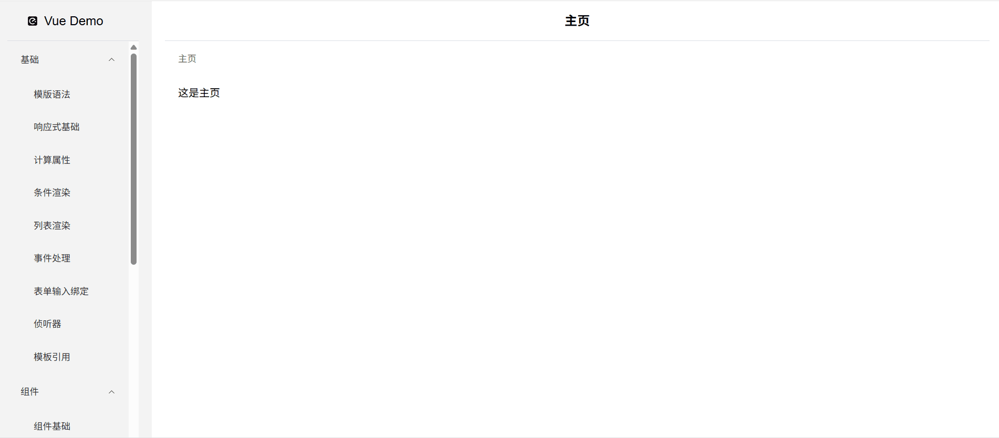
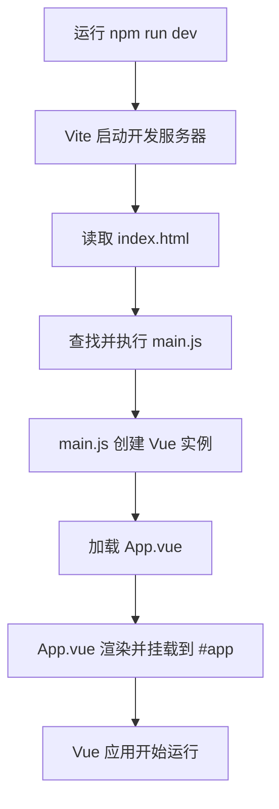
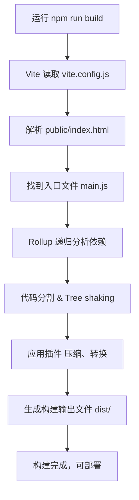
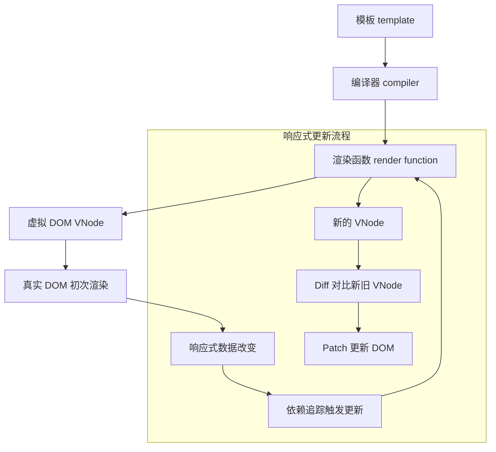
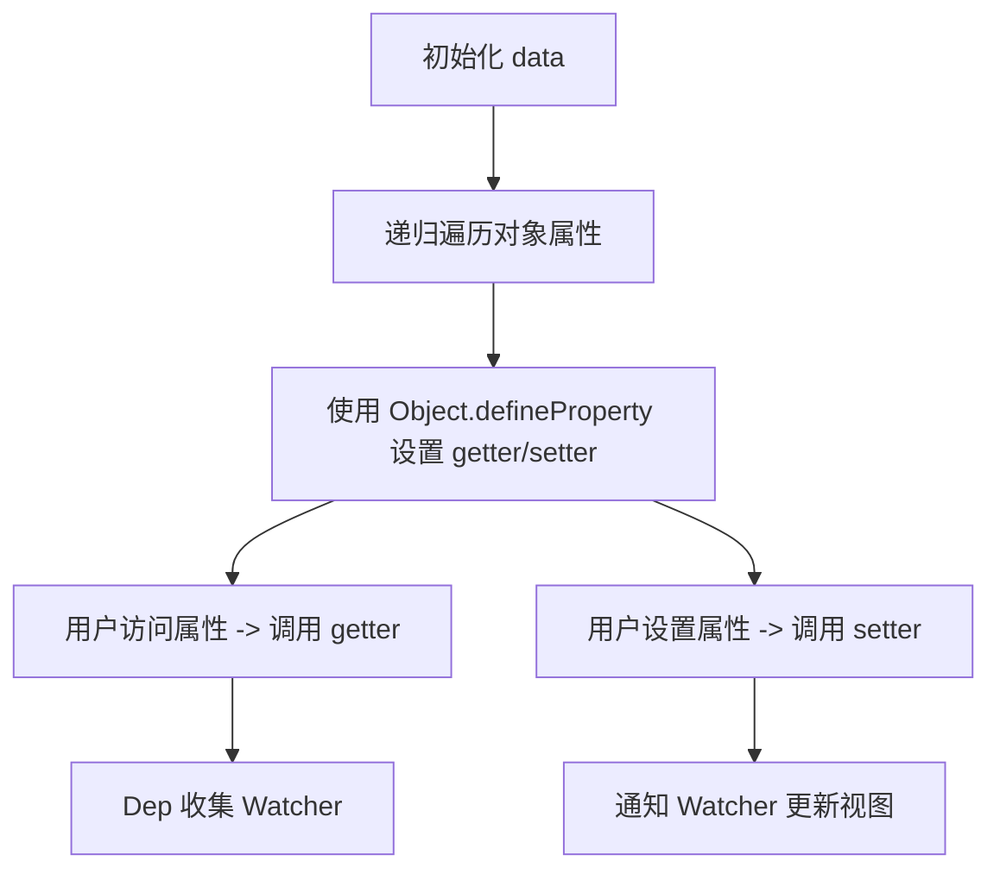
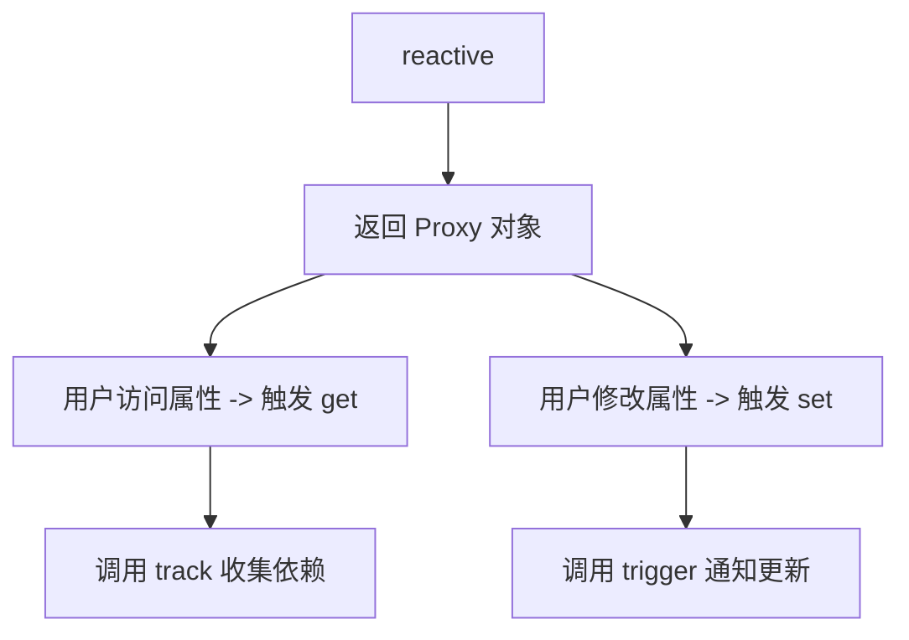
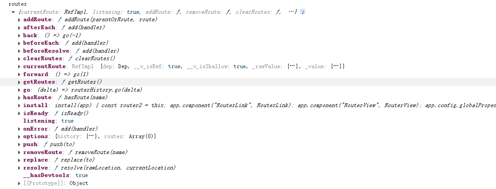
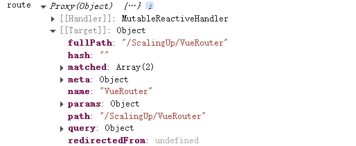
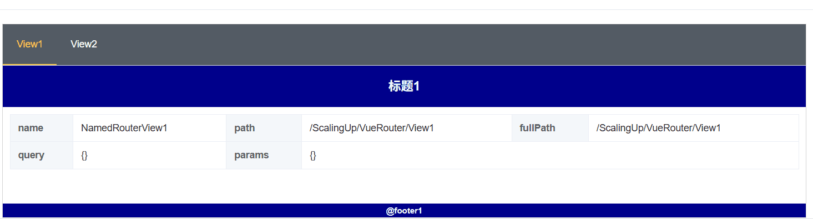
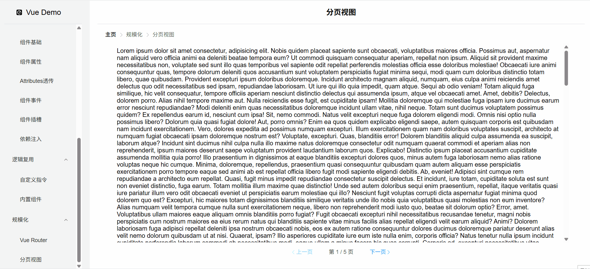

# Vue

## 介绍

`Vue` 是一款用于构建用户界面的 ***渐进式*** `JavaScript` 框架。它基于标准 `HTML` `CSS` 和 `JavaScript` 构建，并提供了一套 ***声明式*** 的、***组件化*** 的编程模型，帮助你高效地开发用户界面。

::: tip 声明

`Vue` 有极其完备的文档：https://cn.vuejs.org/

根据文档可以快速上手，解决问题，集成生态。

本文档仅从个人角度介绍 `Vue` 的常见应用与问题, 文档demo仓库：https://github.com/chenrui1996/vue-demo。



详细文档请参考官网。

:::

::: warning 渐进式框架
`Vue` 是一个框架，也是一个生态。其功能覆盖了大部分前端开发常见的需求。

但 Web 世界是十分多样化的，不同的开发者在 Web 上构建的东西可能在形式和规模上会有很大的不同。

考虑到这一点，Vue 的设计非常注重灵活性和“可以被逐步集成”这个特点。

根据你的需求场景，你可以用不同的方式使用 `Vue`：

- 无需构建步骤，渐进式增强**静态**的 `HTML`.
- 在任何页面中作为 `Web Components` 嵌入
- **单页应用 (SPA)**
- **全栈 / 服务端渲染 (SSR)**
- **Jamstack / 静态站点生成 (SSG)**
- **开发桌面端、移动端、WebGL，甚至是命令行终端中的界面**
:::

::: warning 常见前端渲染方式
| 渲染方式            | 简介                                                           | 应用场景示例                                                             |
| ------------------- | -------------------------------------------------------------- | ------------------------------------------------------------------------ |
| SSR（服务端渲染）   | 页面 HTML 在服务器生成，浏览器接收到完整 HTML 再显示           | Razor Pages、Blazor Server                                               |
| CSR（客户端渲染）   | 后端仅返回数据，页面结构和渲染逻辑在浏览器中由 JavaScript 执行 | Vue/React SPA                                                            |
| SSG（静态站点生成） | 编译时生成静态 HTML，部署时直接提供                            | [Nuxt 静态模式](https://nuxt.com/)、[Jekyll](https://www.jekyll.com.cn/) |
| ISR（增量静态生成） | 静态页面支持按需重新生成，结合 SSG 与 SSR 的优点               | [Next.js](https://nextjs.org/) ISR 模式                                  |
| 混合渲染（Hybrid）  | 某些页面 SSR，某些页面 CSR，结合使用                           | [Nuxt](https://nuxt.com/)、[Next.js](https://nextjs.org/) 支持按路由配置 |
| Prerender（预渲染） | 构建阶段预先执行 JS，生成 HTML 快照                            | Vue Prerender 插件                                                       |

:::

::: danger vue2 与 vue3
1. Vue 2 已在 2023 年 12 月 31 日到达它的截止维护日期。在此之后，Vue 2 在已有的分发渠道 (各类 CDN 和包管理器) 中仍然可用，**但不再进行更新，包括对安全问题和浏览器兼容性问题的修复等。**
2. 大部分 Vue 3 重要的特性移植回了 Vue 2.7，包括组合式 API 和 `<script setup>`。如果打算留在 Vue 2，应该至少升级至 2.7。
3. Vue 2 升级到vue3参考 [vue3迁移指南](https://v3-migration.vuejs.org/zh/breaking-changes/key-attribute.html)
4. Vue 3 提供了更小的包体积、更好的性能、更好的可扩展性和更好的 TypeScript/IDE 支持。但Vue 3 用到了一些 IE11 不支持的现代 JavaScript 特性。
5. vue 3 相对vue 2的优化
   1. Vue 3 重写了虚拟 DOM，使其更快、更轻量，内存占用更低。Patch 过程更高效，diff 算法更智能。
   2. Vue 3 使用模块化架构，支持 `Tree-shaking`，打包时可以剔除未使用的功能，减小体积。
   3. 核心库比 Vue 2 更轻量（压缩后约 10KB 左右，比 Vue 2 小约 50%）。
   4. 编译器能更好地标记静态节点，减少运行时开销。
   5. Vue 3 使用 `Proxy` 代替 vue 2中的 `Object.defineProperty`（无法监听数组索引、新增属性等） 实现响应式，能监听几乎所有操作，包括新增、删除、嵌套属性变更等。
   6. `Composition API` 替代 `Options API` 的局限性。
   7. Vue 3 重写代码为 TypeScript，原生支持，开发体验更好。
   8. ref, `reactive`, `computed`, `watch`, `watchEffect` 等新的响应式工具函数。`provide` / `inject` 更适合逻辑复用。
:::

::: danger vue3 使用注意事项
1. **在 `<script setup>` 中，this 是 undefined。`<script setup>` 是组合式 API 的编译糖，它不创建组件实例上下文，所以 this 根本不存在。**
   > **`<script setup>` 是编译阶段处理的语法糖，它相当于直接把变量写在 setup() 函数体中。在模块严格模式下普通函数this绑定undefined。（非严格模式是window）**
2. **生命周期钩子用组合式 API 替代**
3. **Vue 2 中通过 data 创建响应式属性，但 Vue 3 用的是 ref 和 reactive。**
4. **Vue 3 不推荐 mixins，推荐用组合函数（useXXX）来复用逻辑**
:::

## 创建应用

### 准备工作

::: warning node.js
[Node.js](https://nodejs.org/zh-cn) 是一个免费、开源、跨平台的 `JavaScript` 运行时环境, 

它允许开发者在**服务器端**使用 `JavaScript` 编写应用程序，从而实现前后端统一的开发语言。

---

- **核心特点**
  - 事件驱动与非阻塞 I/O：Node.js 采用单线程架构，结合事件循环机制和异步 I/O 操作，能够高效地处理大量并发连接，适用于 I/O 密集型应用，如 Web 服务器和实时通信工具。 
  - 高性能：得益于 V8 引擎的优化，Node.js 在执行 JavaScript 代码时表现出色，适合构建高性能的网络应用。
  - 丰富的生态系统：通过内置的 npm（Node Package Manager），开发者可以方便地安装和管理第三方模块，加速开发流程。 
  - 跨平台支持：Node.js 可在 Windows、Linux 和 macOS 等多个操作系统上运行，适应多样化的部署需求。

---

- **`Vue` 中为什么要使用 `node.js`**

  **1. 开发工具链依赖 Node.js**
    - Vue CLI / Vite：官方脚手架工具（如 Vue CLI 或 Vite）需要 Node.js 环境来初始化项目、管理依赖和运行开发服务器。
    - 热重载（HMR）：开发时的模块热更新依赖 Node.js 提供的本地服务器能力。
    - 构建工具：webpack、Rollup 或 Vite 等工具需要 Node.js 执行代码打包、压缩、转译等操作

  **2. npm/yarn/pnpm 包管理**
     - Vue 生态系统的大量第三方库（如 vue-router、pinia、axios）通过 npm/yarn 安装，这些工具基于 Node.js。

  **3. 前端工程化需求**
     - 模块化开发：Node.js 支持 ES Modules/CommonJS，方便组织现代前端代码。
     - 编译转换：Vue 单文件组件（.vue）需要 vue-loader 或 @vitejs/plugin-vue 转译为浏览器可执行的 JS，这需要 Node.js 环境。
     - 预处理语言：Sass/Less/TypeScript 等需通过 Node.js 工具链编译。

  **4. 服务端渲染（SSR）**
     - 使用 Nuxt.js 或直接配置 Vue SSR 时，需要 Node.js 作为服务器渲染 Vue 组件并返回 HTML，提升首屏性能和 SEO。

  **5. API 代理与 Mock 数据**
     - 开发时可通过 Node.js 服务器代理 API 请求，解决跨域问题（如 vite.config.js 中的 proxy 配置）。
     - 使用 Mock.js 等工具模拟后端接口。

  **6. 自动化与脚本**
     - 通过 Node.js 编写脚本处理重复任务（如批量生成组件、部署前优化等）。
---

- **可不可以不用 Node.js**
  - 直接引入：直接下载最新版本，通过 `<script>` 标签引入 `Vue`，或直接引入 `CDN`， 适合简单页面或学习，但无法享受工程化优势。
  - 静态生成：使用 Vue 构建纯静态站点（如通过 vitepress）后，生产环境只需静态服务器（如 Nginx）。

---


:::

::: tip webpack
[Webpack](https://webpack.js.org/) 是一个功能强大的前端构建工具和模块打包器，广泛应用于现代 JavaScript 应用程序的开发中。

它能够将项目中的各种资源（如 JavaScript、CSS、图片等）视为模块，构建出清晰的依赖关系图，并将这些模块打包成可供浏览器使用的静态文件。

---

- 核心概念

  1. 入口（Entry）

  入口指示 Webpack 应该从哪个模块开始构建依赖图。默认情况下，Webpack 会从 `./src/index.js` 作为入口。

  ```javascript
  module.exports = {
    entry: './src/index.js',
  };
  ```

  对于多页面应用，可以指定多个入口点。

  2. 输出（Output）

  输出配置告诉 Webpack 如何命名和存储打包后的文件。

  ```javascript
  module.exports = {
    output: {
      filename: 'bundle.js',
      path: path.resolve(__dirname, 'dist'),
    },
  };
  ```

  `filename` 指定输出文件的名称，`path` 指定输出目录的绝对路径。

  3. 加载器（Loaders）

  加载器使 Webpack 能够处理非 JavaScript 文件，如 CSS、图片等。它们在模块加载时进行转换，使这些资源能够被添加到依赖图中。

  ```javascript
  module.exports = {
    module: {
      rules: [
        {
          test: /\.css$/,
          use: ['style-loader', 'css-loader'],
        },
      ],
    },
  };
  ```

  上述配置允许 Webpack 处理 `.css` 文件，并将其注入到 JavaScript 中。

  4. 插件（Plugins）

  插件用于执行范围更广的任务，如打包优化、资源管理、环境变量注入等。

  ```javascript
  const HtmlWebpackPlugin = require('html-webpack-plugin');

  module.exports = {
    plugins: [
      new HtmlWebpackPlugin({ template: './src/index.html' }),
    ],
  };
  ```
  `HtmlWebpackPlugin` 插件会根据提供的模板生成一个 HTML 文件，并自动引入打包后的资源。

  5. 模式（Mode）

  Webpack 提供了三种模式：`development`、`production` 和 `none`。设置不同的模式会启用相应的优化。

  ```javascript
  module.exports = {
    mode: 'development', // 或 'production'、'none'
  };
  ```

  * `development`：启用有利于开发的设置，如未压缩的输出和详细的错误信息。
  * `production`：启用优化设置，如代码压缩和性能提升。

---
:::

::: tip Vue CLI（基于 Webpack）
Vue CLI（Command Line Interface）是 Vue.js 官方提供的脚手架工具，旨在帮助开发者快速搭建和管理 Vue 项目。

> Vue CLI 现已处于维护模式!
> 现在官方推荐使用 create-vue 来创建基于 Vite 的新项目。 另外请参考 Vue 3 工具链指南 以了解最新的工具推荐。

[官网](https://cli.vuejs.org/zh/)

:::

::: warning Vite
Vite 是一个现代化的前端构建工具，于 2020 年发布，旨在通过利用现代浏览器的原生 ES 模块支持，提供快速的开发体验。

[官网](https://cn.vite.dev/), [为什么选 Vite](https://cn.vite.dev/guide/why.html)

:::

### 创建一个 Vue 应用

[官网文档](https://cn.vuejs.org/guide/quick-start)

- **需要安装 Node.js**

> **若本地需要多个版本的Node.js，可以使用 [NVM](https://github.com/coreybutler/nvm-windows) 管理**

**Vue 和 Node.js 版本**

| Vue 版本 | 推荐 Node.js 版本 | 构建工具建议        | 生命周期状态 |
| -------- | ----------------- | ------------------- | ------------ |
| Vue 2.x  | 10 – 16           | Vue CLI 4.x         | 已停止维护   |
| Vue 3.x  | 18.3 及以上       | Vite / Vue CLI 4.5+ | 活跃维护中   |

- **需要安装 `create-vue`(默认集成了 `Vite` 作为构建工具的 `Vue` 官方提供的脚手架工具)**
 
> **如未安装建议全局安装`npm install -g  create-vue@latest`**

---

#### 创建步骤

1. **运行以下命令**
``` sh
npm create vue@latest
```

  **可选功能提示：**

``` sh
◇  请输入项目名称：
│  vue-demo
│
◆  请选择要包含的功能： (↑/↓ 切换，空格选择，a 全选，回车确认)
│  ◻ TypeScript
│  ◻ JSX 支持
│  ◻ Router（单页面应用开发）
│  ◻ Pinia（状态管理）
│  ◻ Vitest（单元测试）
│  ◻ 端到端测试
│  ◻ ESLint（错误预防）
│  ◻ Prettier（代码格式化）
```

2. **安装依赖**
``` sh
cd <your-project-name>
npm install
```

3. **启动开发服务器**
``` sh
cd <your-project-name>
npm run dev
```

4. **发布到生产环境**

``` sh
npm run build
```

---

#### 目录结构分析

```bash
my-vue-app/
├── node_modules/
├── public/
│   ├── favicon.ico
│   └── index.html
├── src/
│   ├── assets/
│   ├── components/
│   ├── App.vue
│   └── main.js
├── .gitignore
├── babel.config.js
├── package.json
├── README.md
└── vue.config.js (可选)
```

1. **`node_modules/`**

* 自动生成的依赖文件夹，存放项目用到的所有 npm 包。
* **不需要手动更改内容，通常不提交到 Git 仓库。**

2. **`public/`**

* 存放静态资源，打包时内容**原样拷贝**到最终的构建目录 (`dist`)。

| 文件/目录     | 说明                                                                                     |
| ------------- | ---------------------------------------------------------------------------------------- |
| `index.html`  | 入口 HTML 模板，Vue 应用会挂载在这里的 `<div id="app"></div>` 中。你可以自定义头部内容。 |
| `favicon.ico` | 网站图标，可替换。                                                                       |

3. **`src/`**

* 项目源码目录，是开发的主要区域。

| 文件/目录     | 说明                                                                       |
| ------------- | -------------------------------------------------------------------------- |
| `main.js`     | 应用入口文件，创建 Vue 实例并挂载到 `#app`。通常在此注册全局组件、插件等。 |
| `App.vue`     | 根组件，通常作为整个应用的框架壳，里面包含 `<router-view>` 或页面结构。    |
| `components/` | 存放 Vue 单文件组件（`.vue`），如按钮、表单、模块等 UI 单元组件。          |
| `assets/`     | 存放静态资源，如图片、字体等，会被 Webpack 处理（例如 hash 命名）。        |

* 若启用 Vue Router / Vuex，CLI 可能还会添加这些目录：

| 目录      | 用途                                                 |
| --------- | ---------------------------------------------------- |
| `views/`  | 路由页面组件（每个页面一个 `.vue` 文件）             |
| `router/` | Vue Router 配置文件，通常是 `index.js`，包含路由表。 |
| `store/`  | Vuex 状态管理目录。                                  |

4. **配置文件**

| 文件名            | 作用                                                     |
| ----------------- | -------------------------------------------------------- |
| `.gitignore`      | 配置 Git 忽略哪些文件（如 `node_modules/`）              |
| `package.json`    | 描述项目及依赖、脚本等信息。最核心的项目配置文件。       |
| `babel.config.js` | Babel 配置，用于转译 JavaScript 新语法。                 |
| `vue.config.js`   | Vue CLI 配置文件，可配置打包路径、代理、Webpack 设置等。 |
| `README.md`       | 项目说明文档，可填写使用方法、目录说明、运行步骤等。     |

---

#### 运行过程

> 在 Web 服务器中（如 Apache、Nginx、Vite 的 dev server），访问目录时会默认查找 index.html 作为入口文件。



---

#### 构建过程



## 基础

### 模板语法

`Vue` 使用一种基于 `HTML` 的模板语法，使我们能够**声明式**地将其组件**实例的数据** **绑定**到呈现的 `DOM` 上。
> 所有的 Vue 模板都是语法层面合法的 HTML，可以被符合规范的浏览器和 HTML 解析器解析。

在底层机制中，Vue 会将模板编译成高度优化的 JavaScript 代码。

结合**响应式系统**，当应用状态变更时，Vue 能够智能地推导出需要重新渲染的组件的最少数量，并应用最少的 DOM 操作。

| 功能         | 语法                            |
| ------------ | ------------------------------- |
| 插值         | `{ { message } }`               |
| 属性绑定     | `:href="url"`                   |
| 事件绑定     | `@click="handleClick"`          |
| 双向数据绑定 | `v-model="message"`             |
| 动态 class   | `:class="{ active: isActive }"` |
| 动态 style   | `:style="{ color: textColor }"` |

- **应用示例：**

``` vue
<script setup>
import { ref } from 'vue'

const message = ref('Hello Vue!')
const url = ref('https://vuejs.org')
const isVisible = ref(true)
const items = ref(['苹果', '香蕉', '橘子'])
const isActive = ref(true)
const textColor = ref('blue')

function handleClick() {
  alert('按钮被点击了！')
}
</script>

<template>
  <!-- 插值语法 -->
  <h1>{{ message }}</h1>

  <!-- 双向绑定 -->
  <input v-model="message" placeholder="修改 message" />

  <hr/>

  <!-- 属性绑定 -->
  <a :href="url" target="_blank">访问链接</a>

  <hr/>
  <!-- 条件渲染 -->
  <input v-model="isVisible" type="checkbox" />

  <p v-if="isVisible" style="display: inline-block;">这个段落是可见的。</p>
  <p v-else style="display: inline-block;">这个段落是不可见的。</p>

  <hr/>

  <!-- 列表渲染 -->
  <ul>
    <li v-for="(item, index) in items" :key="index">
      {{ index + 1 }} - {{ item }}
    </li>
  </ul>

  <hr/>

  <!-- 事件处理 -->
  <button v-on:click="handleClick">点击我</button>
  <button @click="handleClick">点击我</button>

  <hr/>

  <!-- 绑定 class 和 style -->
  <!-- 插值语法不起作用，插值语法不会被当作属性解析 -->
  <p :class="{ active: isActive }" :style="{ color: textColor }">
    动态 class 和 style 示例
  </p>
</template>

<style lang="sass" scoped>

</style>
```

---

- **渲染流程**



---

1. **模板编译**

在开发时，你写的：

```html
<h1>{{ message }}</h1>
```

Vue 编译器会将其转换为类似这样的 JavaScript 渲染函数（伪代码）：

```js
function render(ctx) {
  return h('h1', null, ctx.message)
}
```

* `h()` 是 Vue 创建虚拟 DOM 的函数（Hyperscript）
* `ctx` 是组件实例的上下文，里面包含了 `message`

> ⚠️ 注意：Vue 3 的模板在构建阶段由 `@vue/compiler-dom` 预编译成 `render` 函数，这样运行时就更高效。

---

2. **响应式绑定（Reactivity）**

Vue 使用响应式系统（基于 `Proxy`）追踪依赖：

```js
const message = ref('Hello')
```

当组件第一次渲染时，Vue 会把 `message` 读取过程记录为依赖。

当你修改它：

```js
message.value = 'Hi'
```

Vue 会触发对应的渲染函数再次执行，生成新的 **VNode 树（虚拟 DOM）**。

---

3. **虚拟 DOM 比较（Diff）和 Patch**

每次响应式数据变动时，Vue 会：

1. 使用新的数据生成新的虚拟 DOM（VNode）
2. 与旧的虚拟 DOM 进行 diff 比较
3. 通过最小化更新操作，**打补丁**到真实 DOM 上（patch）

> 优点：性能高，不需要完全重新渲染 DOM，只更新变动的部分。

---

- **注意事项**

1. **插值语法不能用于 HTML 属性**

```html
<!-- 错误 -->
<a href="{{ url }}">点击</a> <!-- 不会解析 -->

<!-- 正确 -->
<a :href="url">点击</a>
```

插值 `{{ }}` 只能用于元素内容，不能用于属性。

---

2.  **`v-bind` 简写为 `:`，`v-on` 简写为 `@`**

```html
<!-- 完整写法 -->

<button v-on:click="submit">提交</button>

<!-- 推荐写法 -->

<button @click="submit">提交</button>
```

---

3.  **模板中不能使用 JavaScript 语句**

```html
<!-- 错误 -->
<p>{{ if (ok) { return 'yes' } }}</p>

<!-- 正确（表达式可以） -->
<p>{{ ok ? 'yes' : 'no' }}</p>
```

> 只能写**表达式**，不能写完整语句（如 if、for、while、return 等）。

---

4. **双向绑定 (`v-model`) 只能用于表单元素**

```html
<!-- 正确 -->
<input v-model="username" />

<!-- 错误 -->
<!-- v-model 不能用在 <div>、<p> 等非表单元素上 -->
<div v-model="username"></div>
```

---

5. **绑定 class/style 推荐使用对象或数组语法**

```html
<!-- 推荐 -->
<p :class="{ active: isActive }"></p>
<p :style="{ color: textColor }"></p>

<!-- 不推荐 -->
<p class="{{ isActive ? 'active' : '' }}"></p> <!-- 无效 -->
```

---

6. **根节点只能有一个（在 Vue 2）**

* Vue 2：模板只能有一个根元素（如 `<div>`）
* Vue 3：允许多个根节点

---

7. **HTML 会被自动转义，除非使用 `v-html`**

```html
<!-- 渲染为字符串 -->
<p>{{ '<strong>hello</strong>' }}</p>

<!-- 渲染为 HTML -->
<p v-html="htmlContent"></p>
```

> 使用 `v-html` 时注意防止 XSS 攻击。

---

### 响应式基础

Vue 的 **响应式系统** 是其核心特性之一，能够让 **数据** 和 **视图** 保持同步。当数据变化时，视图会自动更新。

- **应用示例(Vu3)：**


``` vue
<script setup>
import { ref, onMounted } from 'vue'

onMounted(() => {
})

const count = ref(0);

function increment() {
  //js中用.value
  count.value++
}

const person = ref({
  name: 'Seven Chen',
  age: 28,
  child:{
    name: 'Little Seven Chen',
    age: 9,
  }
});

function incrementAge() {
  //js中用.value
  //包装在第一层
  person.value.age++
}

function incrementChildAge() {
  //js中用.value
  //包装在第一层
  person.value.child.age++
}

const personList = ref([
{
  name: 'SC',
  age: 30,
  child:[
  {
    name: 'LSC',
    age: 10,
  }]
},
{
  name: 'SCA',
  age: 31,
  child:[
  {
    name: 'LSCA1',
    age: 11,
  }]
}
])

function decreaseListAge(){
  personList.value.forEach(person => {
    person.age --
    if(person.child){
      person.child.forEach(child => {
        child.age--
      })
    }
  })
}

function incremenListtAge(){
  personList.value.forEach(person => {
    person.age ++
    if(person.child){
      person.child.forEach(child => {
        child.age++
      })
    }
  })
}

function removePerson(){
  personList.value.forEach(person => {
    if(person.child){
      person.child.pop()
    }
  })
}

function addPerson(){
  personList.value.forEach(person => {
    if(person.child){
      person.child.push({
        name: 'ADD',
        age: 11,
      })
    }
  })
}
</script>

<template>
  <el-card >
    <template #header>ref 创建响应式变量</template>
    
    <!-- template中用变量本身 -->
    <button @click="count--">-</button>
    <span style="margin: 0 10px;">{{count}}</span>
    <button @click="increment">+</button>
  </el-card>
  <br/>
  <el-card >
    <template #header>ref 创建响应式对象</template>
    
    <!-- template中用变量本身 -->

    <p>{{ person.name }}</p>
    <button @click="person.age--">-</button>
    <span style="margin: 0 10px;">{{ person.age }}</span>
    <button @click="incrementAge">+</button>

    <p>{{ person.child.name }}</p>
    <button @click="person.child.age--">-</button>
    <span style="margin: 0 10px;">{{ person.child.age }}</span>
    <button @click="incrementChildAge">+</button>
    <p>{{ person }}</p>
  </el-card>
  <br/>
  <el-card >
    <template #header>ref 创建响应式对象数组</template>
    
    <!-- template中用变量本身 -->
    <p>操作属性</p>
    <button @click="decreaseListAge">-</button>
    <button @click="incremenListtAge">+</button>
    <p>操作对象</p>
    <button @click="removePerson">-</button>
    <button @click="addPerson">+</button>
    <p>{{ personList }}</p>
  </el-card>
</template>


<style scoped>

</style>

```

::: warning 注意 
1. **vue 2或选项式风格只需要将数据放进data里即可：**
比如
   
``` vue
export default {
  data() {
    return {
      count: 1
    }
  },

  // `mounted` 是生命周期钩子，之后我们会讲到
  mounted() {
    // `this` 指向当前组件实例
    console.log(this.count) // => 1

    // 数据属性也可以被更改
    this.count = 2
  }
}
```

2. **新项目(Vue 3.2+)推荐使用 `<script setup>`替换`setup()`，旧项目只能使用 `setup()`**
``` vue
import { ref } from 'vue'

export default {
  // `setup` 是一个特殊的钩子，专门用于组合式 API。
  setup() {
    const count = ref(0)

    // 将 ref 暴露给模板
    return {
      count
    }
  }
}
```

| `<script setup>`功能       | 编译阶段做了什么                                                   |
| -------------------------- | ------------------------------------------------------------------ |
| 自动调用 `setup()`         | Vue 自动把你写的顶层变量、函数等封装进 `setup()` 中                |
| 自动 `return` 所有顶层绑定 | 所有变量/函数都自动暴露给模板，无需手动 `return`                   |
| 支持宏函数                 | 编译时识别 `defineProps`、`defineEmits`、`defineExpose` 等特殊语法 |
| 更好支持类型推导           | 尤其在 TypeScript 中，变量作用域明确，无需解构重赋值               |
| 模块提升                   | 顶层导入/定义提升出 `setup()`，避免重复创建对象                    |

3. **可以通过 shallow ref 来放弃深层响应性。对于浅层 ref，只有 .value 的访问会被追踪。用于避免对大型数据的响应性开销来优化性能、或者有外部库管理其内部状态的情况。**
4. **只有代理对象是响应式的，更改原始对象不会触发更新。因此，使用 Vue 的响应式系统的最佳实践是仅使用你声明对象的代理版本。**
``` js
  const raw = {}
  const proxy = reactive(raw)

  // 代理对象和原始对象不是全等的
  console.log(proxy === raw) // false

  const raw1 = {}
  const proxy1 = ref(raw1)

  // 代理对象和原始对象不是全等的
  console.log(proxy1 === raw1) // false 
  console.log(proxy1.value === raw1) // false 
```
5. **reactive() 的局限性**
   1. **只能用于对象类型 (对象、数组和如 Map、Set 这样的集合类型)。它不能持有如 string、number 或 boolean 这样的原始类型。**
   2. **不能轻易地“替换”响应式对象，因为这样的话与第一个引用的响应性连接将丢失**
   > **ref 替换 .value: 本体不变（响应系统依然追踪）.value 被 Vue 响应式代理，替换后视图自动更新**

   > **reactive 替换整个变量：user = {...} 其实是给 user 变量赋了新值, 原有的响应式追踪对象已经断开，新值不是响应式的**

   > **如果必须使用 reactive，应修改属性而非替换对象**
    ``` js
    let replace1 = reactive({ count1: 0 })

    function replaceReactive() {
      replace1 = { summer: replaceCounter++ } // 旧引用失效，原有响应断裂
    }

    let replace2 =  ref({ count2: 0 })

    function replaceRef() {
      replace2.value =  { summer: replaceCounter++ }  // 没有问题，视图正常更新
    }
    ```
   3. **将响应式对象的原始类型属性解构为本地变量时，或者将该属性传递给函数时，将丢失响应性连接**
    > **无论是reactive还是ref，只要解构对象内部属性，拿到的都是值类型，因此所拿到的变量与原对象不再有关联。**

    > **如果需要结构后的变量具有响应式，使用"toRefs()"**

    > **ref解决 结构/解构响应性丢失 的问题是指以 ref为整体时保持响应式**

    ``` js
      const state = reactive({ count: 0 })
      // 当解构时，count 已经与 state.count 断开连接
      let { count } = state
      // 不会影响原始的 state
      count++
      // 该函数接收到的是一个普通的数字
      // 并且无法追踪 state.count 的变化
      // 我们必须传入整个对象以保持响应性
      callSomeFunction(state.count)
    ```

::: danger reactive 与 ref 如何选择
> **reactive 替换对象会丧失响应式（新对象如果不是响应式可能会存在问题），ref 监听时默认不开启深度监听**
> 
> **两个都不是严重的缺陷，建议统一使用规范。要么对象都用reactive（对 对象属性重新赋值），值都用ref；要么都用ref（watch时开启深度监听）。**
:::

- **实现原理：**

Vue 2 和 Vue 3 的响应式系统实现原理有根本性区别，主要体现在：

* **Vue 2：基于 Object.defineProperty（运行时劫持）**
* **Vue 3：基于 Proxy（编译时可拓展的代理）**

---

- **Vue 2 响应式原理（基于 `Object.defineProperty`）**

  1. Vue 会递归遍历对象的每个属性
  2. 使用 `Object.defineProperty` 劫持每个属性的 getter 和 setter
  3. 在 getter 中收集依赖（Dep）
  4. 在 setter 中触发更新（通知 Watcher）



- **存在的问题：**

   * **只能监听属性，不支持数组索引或新增属性**
   * **深层对象要递归遍历所有字段，性能差**
   * **无法检测 `arr[0] = xxx` 或 `obj.newProp = 123`**

---

- **Vue 3 响应式原理（基于 `Proxy`）**
> 当 ref 的值是一个对象时，ref() 会在内部调用 reactive。
  1. 使用 `Proxy` 代理整个对象，而不是单个属性
  2. 在 `get` 拦截器中自动收集依赖
  3. 在 `set` 拦截器中自动触发更新
  4. 响应式追踪通过全局的 `effect()` 机制实现



- **优点：**

  * 支持 **数组索引、新增属性、删除属性等全部操作**
  * **惰性代理**（不递归）性能更好
  * 更好支持 Map、Set、WeakMap 等复杂数据结构

---

| 特性              | Vue 2 (`defineProperty`) | Vue 3 (`Proxy`)      |
| ----------------- | ------------------------ | -------------------- |
| 支持新增/删除属性 | ❌ 需要 Vue.set           | ✅ 原生支持           |
| 深度嵌套性能      | ❌ 初始化时全递归         | ✅ 惰性递归，按需劫持 |
| 支持数组索引响应  | ❌ 不完全                 | ✅ 完全支持           |
| 支持 Map/Set      | ❌ 不支持                 | ✅ 支持               |
| 数据追踪能力      | 一对多（Dep -> Watcher） | 多对多（targetMap）  |
| 实现方式          | 运行时遍历属性           | 编译期生成 Proxy     |

> Vue 3 在访问对象内部属性之前，不会递归劫持它的子对象。只有在你访问的时候才会代理它。

---

### 计算属性
计算属性是 Vue 提供的一种基于其响应式系统的特性，它允许我们根据已有的响应式数据声明式地计算出新的值，并在依赖项变更时自动更新结果。

> **只有依赖的数据发生改变时才会重新计算。**

- **应用示例(Vu3)**

``` vue
<template>
  <el-card >
    <template #header>基本用法</template>
    
    <!-- template中用变量本身 -->
    <p>姓：{{ lastName }}</p>
    <p>名：{{ firstName }}</p>
    <p>姓名(计算属性)：{{ fullName }}</p>
    <p>姓名(方法)：{{ (() => { return `${lastName} ${firstName} `})() }}</p>
    <el-button @click="generateName">随机生成姓名</el-button>
    
    <p>姓名(可写计算属性)：{{ fullNameWriteable }}</p>
    <el-button @click="generateFullName">随机生成姓名-写入计算属性</el-button>

    <p>姓名(生成记录)：{{ previousName }}</p>
  </el-card>
  <br/>
</template>

<script setup lang="ts">
import { ref, computed, onMounted } from 'vue';
import { fakerZH_CN as faker } from '@faker-js/faker'

const firstName = ref('')
const lastName = ref('')

const previousName = ref('')

onMounted(() => {
  firstName.value = faker.person.firstName() // 名
  lastName.value = faker.person.lastName()  // 姓
})

// 计算属性
const fullName = computed((previous) => {
  previousName.value = String(previous)
  return `${lastName.value} ${firstName.value} `
})

function generateName(){
  firstName.value = faker.person.firstName() // 名
  lastName.value = faker.person.lastName()  // 姓
}

const fullNameWriteable = computed({
  get(previous) {
    previousName.value = String(previous)
    return `${lastName.value} ${firstName.value}`
  },

  set(newValue) {
    // 注意：我们这里使用的是解构赋值语法
    [firstName.value, lastName.value] = String(newValue).split(' ')
  }
})

function generateFullName(){
  fullNameWriteable.value = `${faker.person.firstName()} ${faker.person.lastName()}`
}

</script>

<style scoped>

</style>
```

::: warning 注意
1. vue2 写法
``` vue
export default {
  data() {
    return {
      author: {
        name: 'John Doe',
        books: [
          'Vue 2 - Advanced Guide',
          'Vue 3 - Basic Guide',
          'Vue 4 - The Mystery'
        ]
      }
    }
  },
  computed: {
    // 一个计算属性的 getter
    publishedBooksMessage() {
      // `this` 指向当前组件实例
      return this.author.books.length > 0 ? 'Yes' : 'No'
    }
  }
}
```

2. 将同样的函数定义为一个方法而不是计算属性，两种方式在结果上确实是完全相同的，不同之处在于计算属性值会基于其响应式依赖被缓存。
这也解释了为什么下面的计算属性永远不会更新，因为 Date.now() 并不是一个响应式依赖：
``` js
const now = computed(() => Date.now())
```
:::

---

### 条件渲染

条件渲染（Conditional Rendering） 是控制模板中元素是否显示的关键技术。它基于 JavaScript 表达式的真假值，动态地插入或移除 DOM 元素，从而实现灵活的界面交互。

- **应用示例(Vu3)**

``` vue
<template>
  <el-card >
    <template #header>v-if</template>
    
    <p v-if="loggedIn">欢迎回来！</p>
    <p v-else>请先登录。</p>
    <el-button @click="loggedIn = !loggedIn">切换登录状态</el-button>
  </el-card>
  <br/>
  <el-card >
    <template #header>v-show</template>
    
    <p v-show="toggle">这段话只是被 display:none 了</p>
    <el-button @click="toggle = !toggle">显示 / 隐藏</el-button>
  </el-card>
</template>

<script setup>
import { ref} from 'vue';

const loggedIn = ref(false)

const toggle = ref(true)

</script>

<style scoped>

</style>
```

::: warning v-if 与 v-show 的选择比较

| 对比点       | `v-if`                                 | `v-show`                                |
| ------------ | -------------------------------------- | --------------------------------------- |
| 渲染策略     | **按需创建/销毁** DOM 元素             | 创建一次，之后仅切换 `display`          |
| 初始渲染开销 | 较大（每次条件变更都重新渲染）         | 较小（始终存在）                        |
| 适合场景     | 频繁切换不建议，适合条件变化较少的内容 | 适合频繁切换可见性的内容（如 Tab 切换） |
| DOM 保留状态 | 被销毁，状态丢失                       | 状态保留                                |

:::

::: danger 注意
1. 不能同时使用 v-if 和 v-for 在同一元素上
> 可读性差，容易误解优先级。会误认为先判断 v-if 再遍历。实际是先遍历，再判断是否渲染。
``` html
<!-- 不推荐 -->
<li v-for="item in list" v-if="item.visible">{{ item.name }}</li>

<!-- 推荐方式 -->
<li v-for="item in list" v-show="item.visible">{{ item.name }}</li>

<!-- 或者 -->

const visibleItems = computed(() => list.value.filter(item => item.visible))

```

2. v-else 和 v-else-if 必须紧跟 v-if 元素
3. v-show 不影响 v-if 的渲染逻辑
:::

### 列表渲染

- **应用示例(Vu3)**

``` vue
<template>
  <el-card >
    <template #header>v-for 遍历数组</template>
    
    <ul>
      <li v-for="(airline, i) in airlines" :key="i">{{ i }} - {{ airline }}</li>
    </ul>
    <el-button @click="generateAirlines">随机生成飞机</el-button>
  </el-card>
  <br/>
  <el-card >
    <template #header>v-for 遍历对象</template>
    
    <ul>
      <li v-for="(value, key) in person" :key="key">
        <template v-if="getType(value) === 'Object'">
          {{ key }}:
          <ul>
            <li v-for="(value, key) in value" :key="key">{{ key }}: {{ value }}</li>
          </ul>
        </template>
        <template v-else>
          {{ key }}: {{ value }}
        </template>
      </li>
    </ul>
    <el-button @click="generatePerson">随机生成人员信息</el-button>
  </el-card>
  <br/>
  <el-card >
    <template #header>v-for 遍历指定次数 <el-tag>win + 。可以输入表情</el-tag></template>
    
    <el-button @click="generateNumber">随机n个😶‍🌫️</el-button>
    <div>
      <span v-for="n in number" :key="n">😶‍🌫️</span>
    </div>

  </el-card>
  <br/>
</template>

<script setup>
import { ref, onMounted } from 'vue';
import { fakerZH_CN as faker } from '@faker-js/faker' 
import { getType } from '@/common'

const airlines = ref([])
const person = ref({})
const number = ref(0)

onMounted(() => {
  generateAirlines()
  generatePerson()
  generateNumber()
});

function generateAirlines(){
  airlines.value.length = 0;
  for (let index = 0; index < 10; index++) {
    airlines.value.push(faker.airline.airline())
  }
}

function generatePerson(){
  person.value = {
    id: faker.string.uuid(),
    fullName: faker.person.fullName(),
    gender: faker.person.sexType(),
    birthday: faker.date.birthdate({ min: 18, max: 65, mode: 'age' }),
    email: faker.internet.email(),
    phone: faker.phone.number(),
    address: {
      country: faker.location.country(),
      city: faker.location.city(),
      street: faker.location.streetAddress(),
      zipCode: faker.location.zipCode(),
    },
    avatar: faker.image.avatar(),
    job: {
      title: faker.person.jobTitle(),
      type: faker.person.jobType(),
      area: faker.person.jobArea(),
    },
  }
}

function generateNumber(){
  number.value = Math.floor(Math.random() * 100) + 1
}

</script>

<style scoped>

</style>
```

::: danger 注意
1. 使用唯一的 ID 作为 key，不要使用数组索引，尤其是列表会增删排序的情况。
2. 不要同时使用 v-if 和 v-for。必要时使用template元素过渡。
:::

### 事件处理

事件处理是响应用户交互（如点击、输入、提交等）最常用的方式之一。Vue 提供了简单直观的语法来绑定 DOM 事件，并执行相应的处理逻辑。

- **事件修饰符列表**
  - `.stop`：单击事件将停止传递
  - `.prevent`：阻止默认行为，如表单提交，链接跳转等
  - `.self`：仅当 event.target 是元素本身时才会触发事件处理器
  - `.capture`：在被内部元素处理前，先被外部(parent)处理
  - `.once`：点击按钮只触发一次
  - `.passive`：被动监听 例如被动监听滚动（不会阻止默认滚动），一般用于触摸事件的监听器，可以用来改善移动端设备的滚屏性能。
  
- **键盘事件列表**
  - `.enter`
  - `.tab`
  - `.delete (捕获“Delete”和“Backspace”两个按键)`
  - `.esc`
  - `.space`
  - `.up`
  - `.down`
  - `.left`
  - `.right`
  - `.ctrl`
  - `.alt`
  - `.shift`
  - `.meta`

- **鼠标事件列表**
  - `.left`
  - `.right`
  - `.middle`

- **自定义事件**
  可以使用"emit"实现自定义事件

- **应用示例(Vu3)**
  
``` vue
<template>
  <el-card >
    <template #header>基本用法</template>
    <!-- 方法处理 -->
    <p>方法事件处理器</p> 
    <el-button @click="sayHello">点击问好</el-button>

    <!-- 内联事件处理器 -->
    <p>内联事件处理器 当前计数：{{ count }}</p> 
    <el-button @click="count++">+</el-button>

    <!-- 内联事件处理器调用方法 -->
    <p>内联事件处理器调用方法</p> 
    <el-button @click="sayMessage('四十二号混凝土')">点击弹框</el-button>

    <!-- 在内联事件处理器中访问事件参数 -->
    <p>在内联事件处理器中访问事件参数</p> 
    <!-- 使用特殊的 $event 变量 -->
    <el-button @click="warn('Form cannot be submitted yet.', $event)">
      提交1
    </el-button>
    <!-- 使用内联箭头函数 -->
    <el-button @click="(event) => warn('Form cannot be submitted yet.', event)">
      提交2
    </el-button>
  </el-card>
  <br/>
  <el-card>
    <template #header>事件修饰符</template>
    <p>stop 单击事件将停止传递</p>
    <!-- stop单击事件将停止传递 -->
    <!-- 不会触发 -->
    <div style="height:150px;background-color: aliceblue; margin: 10px 0;" @click="parentClicked('parent3', $event)">
      <!-- 会触发 -->
      <div style="height:100px;background-color: aquamarine;" @click.stop="parentClicked('parent2', $event)">
        <!-- 会触发 -->
        <div style="height:60px;background-color: aqua;" @click="parentClicked('parent1', $event)">
          <el-button @click="handleSelfClick">点击按钮</el-button>
          <br/>
          parent1
        </div>
        parent2
      </div>
      parent3
    </div>
    <el-divider/>

    <p>self 仅当 event.target 是元素本身时才会触发事件处理器</p>
    <!-- self 仅当 event.target 是元素本身时才会触发事件处理器 -->
    <!-- 例如：事件处理器不来自子元素 -->
    <!-- 不会触发 -->
    <div style="height:100px;background-color: aquamarine; margin: 10px 0;" @click="parentClicked('parentwithself', $event)">
      <!-- 会触发 -->
      <div  style="height:60px;background-color: aqua;" @click.self="parentClicked('parentwithoutself', $event)">
        <el-button @click="handleSelfClick">点击按钮</el-button>
        <br/>
        parentwithoutself
      </div>
      parentwithself
    </div>
    <el-divider/>

    <p>once 点击按钮只触发一次; prevent 点击按钮时阻止默认行为； 可以链式调用</p>
    <el-tag>使用 @click.prevent.self 会阻止元素及其子元素的所有点击事件的默认行为，而 @click.self.prevent 则只会阻止对元素本身的点击事件的默认行为。</el-tag>
    <form @submit.prevent="handleSubmit" style="margin: 10px 0;">
      <el-button @click.stop.once="handleClickOnce">点击我（一次性按钮）</el-button>
    </form>

    <el-divider/>

    <!-- 添加事件监听器时，使用 `capture` 捕获模式 -->
    <!-- 例如：指向内部元素的事件，在被内部元素处理前，先被外部处理 -->
    <p>使用 `capture` 捕获模式，指向内部元素的事件，在被内部元素处理前，先被外部(parent1)处理 </p>
    <div style="height:60px;background-color: aqua;margin: 10px 0;" @click.capture="parentClicked('parent1', $event)">
      <el-button @click="handleSelfClick">捕获按钮</el-button>
      <br/>
      parent1
    </div>
    <el-divider/>

    <!-- 被动监听滚动（不会阻止默认滚动）-->
    <!-- 滚动事件的默认行为 (scrolling) 将立即发生而非等待 `onScroll` 完成 -->
    <!-- 以防其中包含 `event.preventDefault()` -->
    <p>passive 被动监听 例如被动监听滚动（不会阻止默认滚动）</p>
    <p>passive 修饰符一般用于触摸事件的监听器，可以用来改善移动端设备的滚屏性能。</p>
    <div
      style="height:100px;background-color: aqua;margin: 10px 0;overflow: auto;"
      @wheel.passive="handleScroll"
    >
      <div style="height:200px;">
        <ul>
          <li>滚动我</li>
          <li>滚动我</li>
          <li>滚动我</li>
          <li>滚动我</li>
          <li>滚动我</li>
          <li>滚动我</li>
          <li>滚动我</li>
          <li>滚动我</li>
          <li>滚动我</li>
          <li>滚动我</li>
          <li>滚动我</li>
        </ul>
      </div>
  </el-card>
  <br/>
  <el-card>
    <template #header>键盘事件</template>
    <el-input
      autosize
      type="textarea"
      v-model="message"
      @keydown.enter.ctrl="submitMessage"
      @keydown.esc="cancelEdit"
      @keydown.tab.prevent="insertTab"
      placeholder="Ctrl + Enter 提交，Esc 取消，Tab 插入缩进"
    ></el-input>
    <p v-if="submitted">✅ 提交成功：{{ submitted }}</p>
  </el-card>
  <br/>
  <el-card>
    <template #header>鼠标事件</template>
    <!-- 单击事件 -->
    <p>单击事件</p>
    <el-button  @click="handleClick" style="margin:10px 0">单击我</el-button >
    <el-divider></el-divider>
    <!-- 双击事件 -->
    <p>双击事件</p>
    <el-button @dblclick="handleDoubleClick" style="margin:10px 0">双击我</el-button>
    <el-divider></el-divider>
    <!-- 按下和松开 -->
    <div
      class="box"
      @mousedown="handleMouseDown"
      @mouseup="handleMouseUp"
      style="height: 100px; margin:10px 0;background-color: cadetblue;"
    >
      {{ mouseDownUp }}
    </div>
    <el-divider></el-divider>
    <!-- 鼠标进入和离开 -->
    <div
      class="box"
      @mouseenter="handleMouseEnter"
      @mouseleave="handleMouseLeave"
      style="height: 100px; margin:10px 0;background-color: cadetblue;"
    >
      {{mouseEnterLeave}}
    </div>
    <el-divider></el-divider>
    <!-- 鼠标移动 -->
    <div
      class="box"
      @mousemove="handleMouseMove"
      style="height: 100px; margin:10px 0;background-color: cadetblue;"
    >
      鼠标移动区域，移动位置：X: {{ mouseX }}, Y: {{ mouseY }}
    </div>
  </el-card>
</template>

<script setup>
import { ref, onMounted } from 'vue';

const count = ref(0)

onMounted(() => {

});

function sayHello(){
  alert("你家人好嘛？")
}

function sayMessage(message){
  alert(message)
}

function warn(message, event) {
  // 这里可以访问原生事件
  if (event) {
    // 阻止默认行为，如表单提交链接跳转
    event.preventDefault()
    alert(`${event.srcElement.innerText} : ${message}`)
  }
  
}

function handleSubmit() {
  alert("表单提交被阻止！");
}

function handleClickOnce() {
  alert("你只会看到这一次！");
}

function handleSelfClick() {
  alert("你点击按钮！");
}

function parentClicked(from, event) {
  if(event.target !== event.currentTarget){
    alert(`父元素${from} 被点击（冒泡）`);
  }
  alert(`父元素${from} 被点击（本身）`);
}

function handleScroll() {
  alert("滚动事件触发");
}

const message = ref('')
const submitted = ref('')

function submitMessage() {
  if (message.value.trim()) {
    submitted.value = message.value
    message.value = ''
  } else {
    alert('内容不能为空')
  }
}

function cancelEdit() {
  message.value = ''
  alert('编辑已取消')
}

function insertTab(event) {
  const textarea = event.target
  const start = textarea.selectionStart
  const end = textarea.selectionEnd
  const value = textarea.value

  // 插入4个空格
  textarea.value = value.substring(0, start) + '    ' + value.substring(end)
  textarea.selectionStart = textarea.selectionEnd = start + 4

  // 手动触发 v-model 更新
  message.value = textarea.value
}

const mouseX = ref(0);
const mouseY = ref(0);

const mouseDownUp = ref("按下或松开鼠标")
const mouseEnterLeave = ref("鼠标进入和离开区域")

function handleClick(event) {
  alert('单击事件触发');
}

function handleDoubleClick(event) {
  alert('双击事件触发');
}

function handleMouseDown(event) {
  mouseDownUp.value = `鼠标按下`
}

function handleMouseUp(event) {
  mouseDownUp.value = `鼠标松开`
}

function handleMouseEnter(event) {
  mouseEnterLeave.value = `鼠标进入`
}

function handleMouseLeave(event) {
  mouseEnterLeave.value = `鼠标离开`
}

function handleMouseMove(event) {
  mouseX.value = event.offsetX;
  mouseY.value = event.offsetY;
}
</script>

<style scoped>

</style>
```

### 表单输入绑定

表单绑定主要通过 v-model 指令来实现，它可以双向绑定输入控件与组件的数据。

- **应用示例(Vu3)**

``` vue
<template>
  <el-card>
    <template #header>表单绑定</template>
    <el-form :model="form" label-width="auto" style="max-width: 600px" :rules="rules" ref="formRef">
      <el-form-item label="Activity name" prop="name">
        <el-input v-model.trim="form.name" />
      </el-form-item>
      <el-form-item label="Activity zone" prop="region">
        <el-select v-model="form.region" placeholder="please select your zone">
          <el-option label="Zone one" value="shanghai" />
          <el-option label="Zone two" value="beijing" />
        </el-select>
      </el-form-item>
      <el-form-item label="Number of participants" prop="participants">
        <el-input type="number" min="0" v-model.number="form.participants" />
      </el-form-item>
      <el-form-item label="Activity time">
        <el-col :span="11">
          <el-date-picker
            v-model="form.date1"
            type="date"
            placeholder="Pick a date"
            style="width: 100%"
          />
        </el-col>
        <el-col :span="2" class="text-center">
          <span class="text-gray-500">-</span>
        </el-col>
        <el-col :span="11">
          <el-time-picker
            v-model="form.date2"
            placeholder="Pick a time"
            style="width: 100%"
          />
        </el-col>
      </el-form-item>
      <el-form-item label="Instant delivery">
        <el-switch v-model="form.delivery" />
      </el-form-item>
      <el-form-item label="Activity type">
        <el-checkbox-group v-model="form.type">
          <el-checkbox value="Online activities" name="type">
            Online activities
          </el-checkbox>
          <el-checkbox value="Promotion activities" name="type">
            Promotion activities
          </el-checkbox>
          <el-checkbox value="Offline activities" name="type">
            Offline activities
          </el-checkbox>
          <el-checkbox value="Simple brand exposure" name="type">
            Simple brand exposure
          </el-checkbox>
        </el-checkbox-group>
      </el-form-item>
      <el-form-item label="Resources">
        <el-radio-group v-model="form.resource">
          <el-radio value="Sponsor">Sponsor</el-radio>
          <el-radio value="Venue">Venue</el-radio>
        </el-radio-group>
      </el-form-item>
      <el-form-item label="Activity form">
        <el-input v-model="form.desc" type="textarea" />
      </el-form-item>
      <el-form-item label = "Acceptthe user agreement">
        <el-checkbox v-model="form.accepted" true-value="yes" false-value="no"/>
      </el-form-item>
      <el-form-item>
        <el-button type="primary" @click="onSubmit">Submit</el-button>
        <el-button @click="onReset">Reset</el-button>
      </el-form-item>
    </el-form>

    <el-divider></el-divider>

    <p>提交结果</p>
    <p v-if="submitted">{{ form }}</p>
    <p v-else>表单正在输入</p>

  </el-card>
  
</template>

<script lang="ts" setup>
import { ref, reactive, watch } from 'vue'
import { FormInstance, FormRules, ElMessage} from 'element-plus'

//用于检验
const formRef = ref<FormInstance> ()
const form = reactive({
  name: '',
  region: '',
  participants: 0,
  date1: '',
  date2: '',
  delivery: false,
  type: [],
  resource: '',
  desc: '',
  accepted: 'yes'
})

const checkParticipants = (rule: any, value: any, callback: any) => {
  if (!Number.isInteger(value)) {
    callback(new Error('Please input digits'))
  } else{
    if (value > 18) {
      callback(new Error('Participants must be less than 18'))
    } else {
      callback()
    }
  }
}

const rules = reactive<FormRules>({
  name: [
    { required: true, message: 'Please input Activity name', trigger: 'blur' },
    { min: 3, max: 5, message: 'Length should be 3 to 5', trigger: 'blur' },
  ],
  region: [
    { required: true,  message: 'Please select Activity zone', trigger: 'change', }
  ],
  participants: [
    { required: true, validator: checkParticipants,  trigger: 'blur' }
  ],
})


const submitted = ref(false)

const onSubmit = async () => {
  if(!formRef.value) return;
  await formRef.value.validate((valid, fields) => {
    if (valid) { 
      ElMessage({
        message: '提交成功.',
        type: 'success',
      })

      submitted.value = true;
      return
    } 
    ElMessage.error('验证失败！')
  })
}

const onReset = () => {
  submitted.value = false
  form.name= '',
  form.region= '',
  form.date1= '',
  form.date2= '',
  form.delivery= false,
  form.type= [],
  form.resource=  '',
  form.desc= '',
  form.accepted= 'yes'
}

watch(form, async (newValue, oldValue) => {
  submitted.value = false;
},{ deep: true })

</script>
```

- **修饰符**
- `.lazy​`
默认情况下，v-model 会在每次 input 事件后更新数据 (IME 拼字阶段的状态例外)。你可以添加 lazy 修饰符来改为在每次 change 事件后更新数据：

``` vue
<!-- 在 "change" 事件后同步更新而不是 "input" -->
<input v-model.lazy="msg" />
```

- `.number​`
如果你想让用户输入自动转换为数字，你可以在 v-model 后添加 .number 修饰符来管理输入：

``` vue
<input v-model.number="age" />
```
如果该值无法被 parseFloat() 处理，那么将返回原始值。特别是当输入为空时 (例如用户清空输入字段之后)，会返回一个空字符串。这种行为与 DOM 属性 valueAsNumber 有所不同。

number 修饰符会在输入框有 type="number" 时自动启用。

- `.trim​`
如果你想要默认自动去除用户输入内容中两端的空格，你可以在 v-model 后添加 .trim 修饰符：

``` vue
<input v-model.trim="msg" />
```

### 侦听器

侦听器（watcher）用于监听响应式数据的变化，从而在数据变化时执行特定的逻辑。

- **应用示例(Vu3)**

``` vue
<template>
  <el-card >
    <template #header>监听数据</template>
    
    <el-input-number v-model="num" :min="1" :max="10" />
  </el-card>
  <br/>
  <el-card >
    <template #header>
      监听对象
    </template>
    <el-tag type="danger" size="large" style="font-size: .8em;font-weight: bold;">once、immediate、deep 在watch注册时已经赋值，切换时需要【关闭侦听】再【开启侦听】</el-tag>
    <br/>
    <el-tag type="danger" size="large" style="font-size: .8em;font-weight: bold;">【关闭侦听】：使用注册watch的返回函数</el-tag>
    <br/>
    <div>
       <span>一次回调(once)</span> &nbsp
       <el-checkbox v-model="onceFlag" @change="onceFlagChange($event)"></el-checkbox>
    </div>
    <div>
       <span>立即回调</span> &nbsp
       <el-checkbox v-model="immediateFlag" @change="immediateFlagChange($event)"></el-checkbox>
    </div>
    <div>
       <span>深层侦听</span> &nbsp
       <el-checkbox v-model="deepFlag" @change="deepFlagChange($event)"></el-checkbox> &nbsp
       <el-tag type="primary" size="large" style="font-size: .8em;font-weight: bold;">reactive默认开启深度监听，注册时未赋值，使用默认值，以对比展示</el-tag>
    </div>
    <el-divider></el-divider>

    <div>
      <span>监听ref对象</span> &nbsp
      <el-tag type="warning" size="large" style="font-size: .8em;font-weight: bold;">ref 默认不会深度监听，需要手动使用 deep:true</el-tag>
    </div>

    <ul>
      <li v-for="(value, key) in personRef" :key="key">
        <template v-if="getType(value) === 'Object'">
          {{ key }}:
          <ul>
            <li v-for="(v, k) in value" :key="key">{{ k }}: {{ v }}</li>
          </ul>
        </template>
        <template v-else>
          {{ key }}: {{ value }}
        </template>
      </li>
    </ul>
    <el-button @click="generatePersonRef">随机生成人员信息</el-button>
    <el-button @click="updatePersonFullNameRef">随机修改人员信息</el-button>

    <el-divider></el-divider>

    <div>
      <span>监听reactive对象 </span> &nbsp
      <el-tag type="warning" size="large" style="font-size: .8em;font-weight: bold;">reactive 替换对象实例后失去响应性；但默认开启深度监听</el-tag>
    </div>
    
    <ul>
      <li v-for="(value, key) in personReactive" :key="key">
        <template v-if="getType(value) === 'Object'">
          {{ key }}:
          <ul>
            <li v-for="(v, k) in value" :key="key">{{ k }}: {{ v }}</li>
          </ul>
        </template>
        <template v-else>
          {{ key }}: {{ value }}
        </template>
      </li>
    </ul>
    <el-button @click="generatePersonReactive">随机生成人员信息</el-button>
    <el-button @click="updatePersonFullNameReactive">随机修改人员信息</el-button>
  </el-card>

  <br/>
  <el-card>
    <template #header>watchEffect</template>
    
    <el-tag type="warning" size="large" style="font-size: .8em;font-weight: bold;">只会监听方法中调用的属性</el-tag>
    <br/>
    <el-tag type="warning" size="large" style="font-size: .8em;font-weight: bold;">相对于watch，在 watchEffect 内改变其正在监听的变量时，不会导致无限递归或循环调用。</el-tag>
    <br/>
    <el-tag type="warning" size="large" style="font-size: .8em;font-weight: bold;">默认开启immediate、deep</el-tag>
    <br/>
    <el-tag type="warning" size="large" style="font-size: .8em;font-weight: bold;">
      未避免下次监听改变时 keyword 发生了变化，使用onWatcherCleanup【vue 3.5+】取消上次请求。不能在异步函数的 await 语句之后调用它
    </el-tag>
    <br/>
    <el-tag type="warning" size="large" style="font-size: .8em;font-weight: bold;"><
      onCleanup 函数还可以作为第三个参数传递给侦听器回调，以及 watchEffect 作用函数的第一个参数。
    </el-tag>
    <br/>
    <el-tag type="warning" size="large" style="font-size: .8em;font-weight: bold;">默认异步批量触发</el-tag>
    <br/>
    <el-input v-model.trim="keyword" placeholder="输入关键词…" />
    <p v-if="loading">加载中...</p>
    <ul v-else>
      <li v-for="item in results" :key="item.id">{{ item.title }}</li>
    </ul>
  </el-card>

</template>

<script setup>
import { ElMessage } from 'element-plus';
import { fa, fakerZH_CN as faker } from '@faker-js/faker' 
import { getType } from '@/common'
import { ref, reactive, computed, onMounted, watch, watchEffect, toRef } from 'vue';
import { useWatchStore } from'@/store'

/**
 * watch
 */
const store = useWatchStore()

onMounted(() => {
  startWatchRef()
  startWatchReactive()
});

//监听数据
const num = ref(1)

watch(num, async (newValue, oldValue) => {
  ElMessage.success(`newValue: ${newValue}, oldValue: ${oldValue}`)
})

const generatePersonData = () => {
  return {
    fullName: faker.person.fullName(),
    address: {
      country: faker.location.country(),
      city: faker.location.city(),
      street: faker.location.streetAddress(),
      zipCode: faker.location.zipCode(),
    },
  }
}

const onceFlag = ref(store.onceFlag)

const onceFlagChange = (value) => {
  store.$patch((state) => {
    state.onceFlag = value
  })
  stopWatchRef()
  startWatchRef()
  stopWatchReactive()
  startWatchReactive()
}

const immediateFlag = ref(store.immediateFlag)

const immediateFlagChange = (value) => {
  store.$patch((state) => {
    state.immediateFlag = value
  })
  stopWatchRef()
  startWatchRef()
  stopWatchReactive()
  startWatchReactive()
}

const deepFlag = ref(store.deepFlag)

const deepFlagChange = (value) => {
  store.$patch((state) => {
    state.deepFlag = value
  })
  stopWatchRef()
  startWatchRef()
  stopWatchReactive()
  startWatchReactive()
}

//监听对象
//ref
const personRef = ref(generatePersonData())

const generatePersonRef = () => {
  personRef.value = generatePersonData()
}

const updatePersonFullNameRef = () => {
  personRef.value.fullName = faker.person.fullName()
  personRef.value.address.city = faker.location.city()
}

let stopWatchRefTemp = null

const startWatchRef = () => {
  if(stopWatchRefTemp) 
    return
  stopWatchRefTemp = watch(personRef, 
    async (newValue, oldValue) => 
    {
      ElMessage.success(`ref watch: [newValue: ${newValue.fullName}, oldValue: ${oldValue ? oldValue.fullName : ""}]`)
    }, 
    {
      deep: deepFlag.value,
      once: onceFlag.value,
      immediate: immediateFlag.value
    }
  )
}

const stopWatchRef = () => {
  //调用返回函数
  stopWatchRefTemp()
  //清空以便下次赋值
  stopWatchRefTemp = null
}

//监听对象
//reactive
let personReactive = reactive(generatePersonData())

const generatePersonReactive = () => {
  //失去响应性
  // personReactive = generatePersonData()
  //遍历赋值不会失去响应性
  let person = generatePersonData()
  for(let key in person){
    personReactive[key] = person[key]
  }
}

const updatePersonFullNameReactive = () => {
  personReactive.fullName = faker.person.fullName()
  personReactive.address.city = faker.location.city()
}

let stopWatchReactiveTemp = null

const startWatchReactive = () => {
  if(stopWatchReactiveTemp) 
    return
  stopWatchReactiveTemp = watch(personReactive, 
    async (newValue, oldValue) => 
    {
      ElMessage.success(`reactive watch: [newValue: ${newValue.fullName}, oldValue: ${oldValue ? oldValue.fullName : ""}]`)
    },
    {
      once: onceFlag.value,
      immediate: immediateFlag.value
    }
  )
}

const stopWatchReactive = () => {
  //调用返回函数
  stopWatchReactiveTemp()
  //清空以便下次赋值
  stopWatchReactiveTemp = null
}

/**
 * watchEffect 
 */
const loading = ref(false)
const keyword = ref('')
//正在请求的Keyword
const requestingKeyword = ref('')
const results = ref([])

watchEffect((onInvalidate) => {
    if (!keyword.value) {
      results.value = []
      return
    }

    loading.value = true
    //相对于watch，虽然监听但不会无限递归
    requestingKeyword.value = keyword.value
    ElMessage.primary(`正在请求, keyword: ${keyword.value}`)
    let canceled = false

    // 未避免下次监听改变时 keyword 发生了变化
    // 每次 keyword 改变时取消之前的“请求”
    onInvalidate(() => {
      if(loading.value){
        ElMessage.error(`取消请求, keyword: ${requestingKeyword.value}`)
        canceled = true
      }
    })

    // 模拟 API 异步延时延迟
    setTimeout(() => {
      if (!canceled) {
        // 使用 faker 生成 5 条假数据
        results.value = Array.from({ length: Math.floor(Math.random() * 10) + 1 }, () => ({
          id: faker.string.uuid(),
          title: faker.word.words({ count: Math.floor(Math.random() * 10) + 1 })
        }))
        loading.value = false
        ElMessage.success(`请求成功, keyword: ${keyword.value}`)
      }
    }, 1000 * (Math.floor(Math.random() * 10) + 1))
  })

</script>

<style scoped>

</style>
```

- **注意事项**

::: warning **watch** 

**注册时其他属性：**

- **一次回调(once)**   
- **立即回调(immediate)**  
- **深层侦听(deep)** 

> once、immediate、deep 在watch注册时赋值

---

**监听ref对象**

- **ref 默认不会深度监听，需要手动使用 deep:true**

---

**监听reactive对象**

- **默认开启深度监听**
- **注意更新时不要替换对象、数组。会丧失响应性**

:::

::: warning **watchEffect** 

1. **只会监听方法中调用的属性**
2. **相对于watch，在 watchEffect 内改变其正在监听的变量时，不会导致无限递归或循环调用。**
3. **默认开启immediate、deep**
4. **未避免下次监听改变时 keyword 发生了变化，使用onWatcherCleanup【vue 3.5+】取消上次请求。不能在异步函数的 await 语句之后调用它**
5. **onCleanup 函数还可以作为第三个参数传递给侦听器回调，以及 watchEffect 作用函数的第一个参数。**
6. **默认异步批量触发**

:::

### 模板引用

模板引用（Template Refs） 是一种获取 DOM 元素或子组件实例的方式，常用于需要直接操作 DOM 或调用子组件方法的场景。

- **应用示例(Vu3)**

``` vue
<template>
  <el-card >
    <template #header>元素上的 ref</template>
    
    <input style="margin-bottom: 10px;" ref="myInput" />
    <br>
    <el-button type="primary" @click="focusInput">聚焦input</el-button>
  </el-card>
  <br/>
  <el-card >
    <template #header>组件的 ref</template>
    
    <!-- HTML 属性默认传入的值都是字符串类型, 特别注意使用 :（即 v-bind）绑定，否则就是字符串。 -->
    <ChildComponent :id = "1" title="子组件" ref="childRef" />
    <el-button type="primary" @click="callChildSayHollow">调用子组件方法</el-button>
  </el-card>
  <br/>
  <el-card >
    <template #header>v-for 中的模板引用</template>
    
    <el-tag type="danger" size="large" style="font-size: .8em;font-weight: bold;">需要v3.5 及以上版本</el-tag>
    <ul>
      <li v-for="item in list" ref="itemRefs">
        {{ item }}
      </li>
    </ul>
    <el-button type="primary" @click="callItemRefs">显示引用</el-button>
  </el-card>
  <br/>
</template>

<script setup>
import { ref, computed, onMounted } from 'vue';
import ChildComponent from '@/components/ChildComponent.vue'
import { ElMessage } from 'element-plus';
import { fakerZH_CN as faker } from '@faker-js/faker' 

onMounted(() => {
 
});

const myInput = ref(null)

const focusInput = () => {
   myInput.value.focus()  // 直接操作 DOM
}

const childRef = ref(null)

const callChildSayHollow = () => {
   ElMessage.primary(childRef.value.sayHello()) 
}

const list = ref(Array.from({ length: Math.floor(Math.random() * 10) + 1 }, () => ({
  item: faker.word.words({ count: Math.floor(Math.random() * 10) + 1 })
})))
const itemRefs = ref([])

const callItemRefs = () => {
  console.log(itemRefs.value)
  itemRefs.value.forEach((item, index) => {
      ElMessage({
        message: item.innerHTML, 
        type: 'primary' 
      })
  })
}

</script>

<style scoped>

</style>

```

## 组件

`Vue` 组件本质上是一个带有**模板**（`HTML`）、**逻辑**（`JavaScript`）和**样式**（`CSS`）的**封装体**，帮助我们构建**模块化**、**易维护**的前端应用。

### 基本用法

- **定义组件的方式**
  1. **将 Vue 组件定义在一个单独的 .vue 文件中，这被叫做单文件组件 (Single-File Component 简称 SFC)：**

  SFCBasicComponent.vue:

  ``` vue
  <template>
      <el-button @click="count++">You clicked me {{ count }} times.</el-button>
  </template>

  <script setup>
  import { ref } from 'vue'

  const count = ref(0)

  </script>

  <style scoped>

  </style>
  ```

  2. **以一个包含 Vue 特定选项的 JavaScript 对象来定义**

  JsComponent.js

  ``` javascript
  import { ref } from 'vue'

  export default {
    setup() {
      const count = ref(0)
      return { count }
    },
    template: `
      <el-button @click="count++">
        You clicked me {{ count }} times.
      <el-/button>`
    // 也可以针对一个 DOM 内联模板：
    // template: '#my-template-element'
  }
  ```

  ::: warning 注意
  使用 template 选项进行组件定义（如动态注册组件或不使用单文件 .vue 模板时），需要使用完整版（带编译器）**的 Vue。

  需要编辑 vite.config.js：

  ``` javascript
  alias: {
      vue: 'vue/dist/vue.esm-bundler.js' //添加
  }
  ```

  :::

- **注册组件的方式**
  1. **局部注册：组合式 API导入后直接使用；选项式 API 使用 components 选项来显式注册**
  2. **全局注册：使用 Vue 应用实例的 .component() 方法，让组件在当前 Vue 应用中全局可用**
  
  ``` vue
    <template>
      <el-card >
        <template #header>SFC单组件</template>
        
        <SFCBasicComponent></SFCBasicComponent>
        <SFCBasicComponent></SFCBasicComponent>
        <SFCBasicComponent></SFCBasicComponent>
      </el-card>
      <br/>
      <el-card >
        <template #header>Js对象定义组件</template>
        
        <el-tag type="warning" size="large" style="font-size: .8em;font-weight: bold;">需要在 vite.config.js 添加 alias- vue: 'vue/dist/vue.esm-bundler.js'  </el-tag>
        <br/>
        <JsComponent></JsComponent>
        <JsComponent></JsComponent>
        <JsComponent></JsComponent>
      </el-card>
      <br/>
      <el-card >
        <template #header>全局注册组件</template>
        
        <ScGlobalComponent></ScGlobalComponent>
      </el-card>
    </template>

    <script setup>
    import { ref, computed, onMounted } from 'vue';
    import SFCBasicComponent from '@/components/SFCBasicComponent.vue'
    import JsComponent from '@/components/JsComponent.js'

    const props = defineProps();

    const emits = defineEmits();

    onMounted(() => {

    });

    </script>

    <style scoped>

    </style>

  ```

---

### 生命周期


示例参考【基本用法】

---

### 属性

**属性（props）是父组件传递给子组件的数据接口**，子组件通过 props 接收这些数据，并可以在模板或逻辑中使用。

::: warning 组件属性特点

- 属性是父组件传数据给子组件的唯一方式
- 校验方式：类型强校验 + 默认值 + 自定义验证
- **只读**、**单向绑定**，子组件不应修改 props
- **Boolean 类型转换**: `booleanProp` 相当于 `:booleanProp = 'true'`
:::

- **组件属性示例**

PropsDemoComponent.vue

``` vue
<template>
  <p>String: </p>
  <p>{{ stringProp }}</p>
  <el-divider></el-divider>
  <p>Number </p>
  <p>{{ numberProp }}</p>
  <el-divider></el-divider>
  <p>Boolean </p>
  <p>{{ booleanProp }}</p>
  <el-divider></el-divider>
  <p>Array </p>
  <p>{{ arrayProp }}</p>
  <el-divider></el-divider>
  <p>Object </p>
  <p>{{ objectProp }}</p>
</template>

<script setup>
import { ElMessage } from 'element-plus';
import { watchEffect } from 'vue';

const props = defineProps({
  stringProp: String,
  numberProp: Number,
  booleanProp: Boolean,
  arrayProp: Array,
  objectProp: Object
})

watchEffect(() => {
  // 在 3.5 之前只运行一次
  // 在 3.5+ 中在 "foo" prop 变化时重新执行
  ElMessage.warning(props.stringProp)
})

function updateProps() {
  //单向数据流 会报错
  props.stringProp = "child updated"
}

defineExpose({ updateProps })

</script>

<style scoped></style>
```

:::  warning Prop 校验

- 所有 prop 默认都是可选的，除非声明了 required: true。
- 除 Boolean 外的未传递的可选 prop 将会有一个默认值 undefined。
- 如果声明了 default 值，那么在 prop 的值被解析为 undefined 时，无论 prop 是未被传递还是显式指明的 undefined，都会改为 default 值。
- 当 prop 的校验失败后，Vue 会抛出一个控制台警告 (在开发模式下)。
:::

- **组件属性校验示例**

PropsValidatorComponent.vue

``` vue
<template>
  <p>propA </p>
  <p>{{ propA }}</p>
  <el-divider></el-divider>
  <p>propB </p>
  <p>{{ propB }}</p>
  <el-divider></el-divider>
  <p>propC </p>
  <p>{{ propC }}</p>
  <el-divider></el-divider>
  <p>propD </p>
  <p>{{ propD }}</p>
  <el-divider></el-divider>
  <p>propE </p>
  <p>{{ propE }}</p>
  <el-divider></el-divider>
  <p>propF </p>
  <p>{{ propF }}</p>
  <el-divider></el-divider>
  <p>propG </p>
  <p>{{ propG }}</p>
  <el-divider></el-divider>
  <p>propH </p>
  <p>{{ propH }}</p>
</template>

<script setup>

const props = defineProps({
  // 基础类型检查
  // （给出 `null` 和 `undefined` 值则会跳过任何类型检查）
  propA: Number,
  // 多种可能的类型
  propB: [String, Number],
  // 必传，且为 String 类型
  propC: {
    type: String,
    required: true
  },
  // 必传但可为 null 的字符串
  propD: {
    type: [String, null],
    required: true
  },
  // Number 类型的默认值
  propE: {
    type: Number,
    default: 100
  },
  // 对象类型的默认值
  propF: {
    type: Object,
    // 对象或数组的默认值
    // 必须从一个工厂函数返回。
    // 该函数接收组件所接收到的原始 prop 作为参数。
    default(rawProps) {
      return { message: 'hello' }
    }
  },
  // 自定义类型校验函数
  // 在 3.4+ 中完整的 props 作为第二个参数传入
  propG: {
    validator(value, props) {
      // The value must match one of these strings
      return ['success', 'warning', 'danger'].includes(value)
    }
  },
  // 函数类型的默认值
  propH: {
    type: Function,
    // 不像对象或数组的默认，这不是一个
    // 工厂函数。这会是一个用来作为默认值的函数
    default() {
      return 'Default function'
    }
  }
})

</script>

<style scoped></style>
```

---

### Attributes 透传

`Attributes` 透传（`Fallthrough Attributes`） 是指未在组件 `props` 或 `emits` 中声明的属性（如 `class`、`style`、原生 DOM 事件等），会自动“穿透”到组件根节点。

::: warning 单层透传
- **多根节点，或者外层包裹`div`时，需要使用 `v-bind="$attrs"` 指定透传目标元素。未声明的属性透传至根元素。**
- **`class`、`style` 会合并**
- **原生事件监听器也会透传**
- **可以使用 `defineOptions({ inheritAttrs: false })` 阻止透传**

示例：

AttributeDemoComponent.vue

``` vue
<!-- MyInput.vue -->
<template>
  <div class="field">
    <el-button type="primary" class="inner-input" v-bind="$attrs" @click="onClick">{{ label }}</el-button>
  </div>
</template>

<script setup>
// defineOptions({ inheritAttrs: false })
defineProps(['label'])
import { ElMessage } from 'element-plus'
import { useAttrs } from 'vue'

const attrs = useAttrs()


const onClick = () => {
  ElMessage.info({
    duration: 30000,
    showClose: true,
    message: `子组件触发`
  })
  for (let key in attrs) {
    ElMessage.warning({
      duration: 30000,
      showClose: true,
      message: `属性：${key}  ${attrs[key]} 已透传`
    })
  }
}
</script>

<style>
.field {
  padding: 4px;
}

.inner-input {
  width: 100%;
}
</style>

```

:::


::: warning 嵌套透传
- **声明过的 props 和侦听函数不再透传，其他全部透传**

示例：

AttributeNestedDemoComponent.vue

``` vue
<!-- MyInput.vue -->
<template>
  <AttributeDemoComponent @click="onClick" />
</template>

<script setup>
import AttributeDemoComponent from './AttributeDemoComponent.vue';
import { ElMessage } from 'element-plus'
import { useAttrs, defineProps } from 'vue'
const props = defineProps({
  nestedAttr: String,
});
const attrs = useAttrs()
const onClick = () => {
  ElMessage.primary({
    duration: 30000,
    showClose: true,
    message: `中间组件组件触发, nestedAttr:${props.nestedAttr}已消费`
  })
  for (let key in attrs) {
    ElMessage.error({
      duration: 30000,
      showClose: true,
      message: `属性：${key}  ${attrs[key]} 已透传`
    })
  }
}
</script>

<style scoped></style>

```

::: 

- **调用示例：**

``` vue
<template>
  <el-card>
    <template #header>Attribute 透传</template>

    <el-tag type="warning" size="large" style="font-size: .8em;font-weight: bold;">多根节点，或者外层包裹div时，需要使用 v-bind="$attrs"
      指定透传目标元素。未声明的属性透传至根元素。 </el-tag>
    <br />
    <el-tag type="warning" size="large" style="font-size: .8em;font-weight: bold;">class、style 会合并 </el-tag>
    <br />
    <el-tag type="warning" size="large" style="font-size: .8em;font-weight: bold;">原生事件监听器也会透传 </el-tag>
    <br />
    <el-tag type="warning" size="large" style="font-size: .8em;font-weight: bold;">可以使用 defineOptions({ inheritAttrs:
      false })
      阻止透传</el-tag>
    <br />
    <AttributeDemoComponent id="sc-button" class="custom-input" @click="onClick" label="点我" nestedAttr='嵌套属性' />
  </el-card>
  <br />
  <el-card>
    <template #header>深层组件继承</template>

    <el-tag type="warning" size="large" style="font-size: .8em;font-weight: bold;">声明过的 props 和侦听函数不再透传，其他可以透传 </el-tag>
    <br />
    <AttributeNestedDemoComponent id="sc-button" class="custom-input" @click="onClick" label="点我" nestedAttr='嵌套属性' />
  </el-card>
</template>

<script setup>
import AttributeDemoComponent from '@/components/AttributeDemoComponent.vue';
import AttributeNestedDemoComponent from '@/components/AttributeNestedDemoComponent.vue';
import { ElMessage } from 'element-plus'


const onClick = () => {
  ElMessage.info({ duration: 30000, showClose: true, message: `父组件触发` })
}

</script>

<style scoped></style>
```

---

### 事件

Vue 组件之间的事件主要是指：子组件向父组件发送事件通知，父组件监听这个事件并做出响应。

::: warning emit

- 在子组件使用 `$emit('eventName', data)` 实现子组件向父组件发送事件通知
- 也可以在子组件使用 `defineEmits` 实现
- `defineEmits` 可以实现数据校验，但校验结果不影响事件传递
- 除此之外，可以使用 `defineExpose` 暴露子组件方法供父组件调用

示例：

子组件：

``` vue
<template>
  <el-button @click="$emit('greet1', '子组件: greet1')">Greet</el-button>

  <el-button type="primary" @click="submit">submit</el-button>
</template>

<script setup>
import { ElMessage } from 'element-plus';
import { ref, computed, onMounted } from 'vue';

const props = defineProps();
const emits = defineEmits({
  greet2: null,

  // 没有校验
  submit: null,

  // 校验 submit 事件
  submitwithValidator: ({ email, password }) => {
    if (email && password) {
      return true
    } else {
      ElMessage.error('Invalid submit event payload!')
      return false
    }
  }
})

const submit = () => {
  emits('submit', { email: "aa@qq.com" })
  //返回值并不会中断事件传递
  if (!emits('submitwithValidator', { email: null, password: null })) {
    ElMessage.error('事件校验失败依然传递')
  }
}
onMounted(() => {
  //代码执行时也可以使用emits传递

  let count = 0;
  const timer = setInterval(() => {
    count++
    emits('greet2', '子组件: greet2', count, 100)
    if (count === 100) {
      clearInterval(timer); // 停止定时器
    }
  }, 1000)
});


function greet3() {
  return `hello from child`
}

defineExpose({ greet3 })

</script>

<style scoped></style>

```

父组件：

``` vue
<template>
  <el-card>
    <template #header>事件处理</template>

    <p>事件处理参考:</p>
    <el-link href="/Essentials/EventHandling" type="primary">基础>事件处理</el-link>
  </el-card>
  <br />
  <el-card>
    <template #header>组件事件（emit，实现 子 => 父）</template>
    <el-tag type="warning" size="large" style="font-size: .8em;font-weight: bold;">可以在子组件使用 $emit('eventName', data)
      实现</el-tag>
    <br />
    <el-tag type="warning" size="large" style="font-size: .8em;font-weight: bold;">也可以在子组件使用 defineEmits 实现</el-tag>
    <br />
    <el-tag type="warning" size="large" style="font-size: .8em;font-weight: bold;">defineEmits
      可以实现数据校验，但校验结果不影响事件传递</el-tag>
    <br />
    <el-tag type="warning" size="large" style="font-size: .8em;font-weight: bold;">除此之外，可以使用 defineExpose
      暴露子组件方法供父组件调用</el-tag>
    <br />
    <EventDemoComponent @greet1="handeGreet" @greet2="handeGreet" @submit="submit" @submitwithValidator="submit"
      ref="eventDemoRef" />
  </el-card>
</template>

<script setup>
import { ref, computed, onMounted } from 'vue';
import EventDemoComponent from '@/components/EventDemoComponent.vue';
import { ElMessage } from 'element-plus';

const props = defineProps();

const emits = defineEmits();

onMounted(() => {
  ElMessage.info({
    showClose: true,
    duration: 5000,
    message: eventDemoRef.value.greet3()
  })
});

const handeGreet = (data, count, sum) => {
  ElMessage.success({
    showClose: true,
    duration: 5000,
    message: data + ` 第${count} / ${sum}次`
  })
}

const submit = (data) => {
  ElMessage.warning({
    showClose: true,
    duration: 5000,
    message: `submited: ${data.email}, ${data.password}`
  })
}

const eventDemoRef = ref()

</script>

<style scoped></style>
```
::: 

::: tip mitt

可以使用mitt实现兄弟组件的通讯

示例：

1. 安装mitt： `npm install mitt`
2. 新建mitt 事件总线统一管理

eventBus.js

``` js
import mitt from 'mitt'
const emitter = mitt()
export default emitter
```

3. 新建子组件

子组件A: MittChildAComponent.vue

``` vue
<template>
  <div>这是组件A</div>
  <el-button typr="primary" @click="handleClick">传递事件</el-button>
</template>

<script setup>
import { ref, computed, onMounted } from 'vue';
import emitter from '@/mitt/eventBus'
import { fakerZH_CN as faker } from '@faker-js/faker'


const props = defineProps();

const emits = defineEmits();

const handleClick = () => {
  emitter.emit('MCB', '来自A的数据: ' + faker.person.fullName(),)
}

onMounted(() => {

});

</script>

<style scoped></style>

```

子组件B: MittChildBComponent.vue

``` vue
<template>
  <div>这是组件B</div>
  <p>{{ dataB }}</p>
</template>

<script setup>
import { ref, computed, onMounted, onUnmounted } from 'vue';
import emitter from '@/mitt/eventBus'
import { ElMessage } from 'element-plus';

const dataB = ref();

onMounted(() => {
  emitter.on("*", (data) => {
    console.log(data)
  })

  emitter.on("MCB", (data) => {
    ElMessage.info(data)
    dataB.value = data
  })
});

onUnmounted(() => {
  emitter.off("MCB")
  //取消注册所有事件
  emitter.all.clear()
});

</script>

<style scoped></style>
```

4. 父组件调用

``` vue
<template>
  <el-card>
    <template #header>事件总线（mitt，实现 兄弟 => 兄弟）</template>

    <MittChildAComponent />
    <MittChildBComponent />
  </el-card>
</template>

<script setup>

import MittChildAComponent from '@/components/MittChildAComponent.vue';
import MittChildBComponent from '@/components/MittChildBComponent.vue';


</script>

<style scoped></style>
```

:::

---

### 插槽

**插槽（Slot）**是一种让父组件向子组件传递任意内容（包括 HTML、组件等）的机制。

Vue 提供了三种类型的插槽：

1. **默认插槽（default slot）** 

- 默认插槽中父组件所有未被具名插槽包裹的内容
- 内容可以是文本，也可以是任何其他东西。如果没有就是默认值

示例：

子组件：DefaultSlotComponent.vue

``` vue
<template>
  <div class="card">
    <!-- 默认插槽 -->
    <slot>默认值</slot>
  </div>
</template>

<script setup>

</script>

<style scoped>
.card {
  border: 1px solid #ccc;
  padding: 16px;
}
</style>
```

父组件：

``` vue
<template>
  <el-card>
    <template #header>默认插槽（default slot）</template>
    <el-tag type="warning" size="large" style="font-size: .8em;font-weight: bold;">默认插槽中父组件所有未被具名插槽包裹的内容</el-tag>
    <br />
    <el-tag type="warning" size="large" style="font-size: .8em;font-weight: bold;">内容可以是文本，也可以是任何其他东西。如果没有就是默认值</el-tag>
    <br />
    <!-- 默认值 -->
    <DefaultSlotComponent></DefaultSlotComponent>
    <!-- 文本 -->
    <DefaultSlotComponent>可以是文本</DefaultSlotComponent>
    <!-- 元素 -->
    <DefaultSlotComponent>
      <div style="background-color: lightblue;">还可以是元素</div>
    </DefaultSlotComponent>
  </el-card>
</template>

<script setup>
import DefaultSlotComponent from '@/components/DefaultSlotComponent.vue';
</script>

<style scoped></style>
```

2. **具名插槽（named slot）**

用于在子组件中定义多个插槽。

示例：

子组件：NamedSlotComponent.vue

``` vue 
<template>
  <div class="header">
    <slot name="header"></slot>
  </div>
  <div v-if="$slots.default" class="content">
    <slot></slot>
  </div>
  <div v-if="$slots.footer" class="footer">
    <slot name="footer"></slot>
  </div>
  <div v-if="$slots.dynamicSlotName1" style="background-color: lightcoral; padding: 5px; min-height: 50px;">
    <slot name="dynamicSlotName1">
      <p>动态插槽1</p>
    </slot>
  </div>
  <div v-if="$slots.dynamicSlotName2" style="background-color: lightgreen; padding: 5px; min-height: 50px;">
    <slot name="dynamicSlotName2">
      <p>动态插槽2</p>
    </slot>
  </div>
</template>

<script setup>
import { ref, computed, onMounted } from 'vue';

const props = defineProps();

const emits = defineEmits();

onMounted(() => {

});

</script>

<style scoped>
.header {
  padding: 5px;
  background-color: cornflowerblue;
  min-height: 50px;
}

.content {
  padding: 5px;
  min-height: 50px;
}

.footer {
  padding: 5px;
  background-color: lightgray;
  min-height: 50px;
}
</style>

```

父组件

``` vue
<template>
  <el-card>
    <template #header>具名插槽（named slot）</template>
    <el-tag type="warning" size="large"
      style="font-size: .8em;font-weight: bold;">与header不同的是，条件渲染的插槽（default，footer）如果不写则不渲染。header即使不传div也会渲染</el-tag>
    <br />
    <el-button type="primary" style="margin-bottom: 10px;"
      @click="headerSlotFlag ? headerSlotFlag = false : headerSlotFlag = true"> 切换header插槽渲染状态</el-button>
    <el-button type="primary" style="margin-bottom: 10px;"
      @click="defultSlotFlag ? defultSlotFlag = false : defultSlotFlag = true"> 切换defalut插槽渲染状态</el-button>
    <el-button type="primary" style="margin-bottom: 10px;"
      @click="footerSlotFlag ? footerSlotFlag = false : footerSlotFlag = true"> 切换fotter插槽渲染状态</el-button>
    <el-button type="warning" style="margin-bottom: 10px;"
      @click="dynamicSlotName == 'dynamicSlotName1' ? dynamicSlotName = 'dynamicSlotName2' : dynamicSlotName = 'dynamicSlotName1'">
      切换动态插槽</el-button>
    <NamedSlotComponent>
      <template v-if="headerSlotFlag" #header>
        <p>这是 header</p>
      </template>
      <template v-if="defultSlotFlag">
        <p>这是内容</p>
      </template>
      <template v-if="footerSlotFlag" #footer>
        <p>这是 footer</p>
      </template>
      <template #[dynamicSlotName]>

      </template>
    </NamedSlotComponent>
  </el-card>
</template>

<script setup>
import { ref, computed, onMounted } from 'vue';
import NamedSlotComponent from '@/components/NamedSlotComponent.vue';

const dynamicSlotName = ref('dynamicSlotName1')
const headerSlotFlag = ref(true)
const defultSlotFlag = ref(true)
const footerSlotFlag = ref(true)


</script>

<style scoped></style>

```

3. **作用域插槽（scoped slot）**

作用域插槽允许子组件将数据传递给插槽内容，由父组件决定如何使用这些数据进行渲染。

子组件：ScopedSlotComponent.vue

``` vue
<template>
  <div class="namedSlotProps">
    <p>命名作用域插槽：</p>
    <slot name="namedSlotProps" :message="message"></slot>
  </div>
  <div>
    <p>列表渲染：</p>
    <ul style="margin: 0;padding: 0;">
      <li v-for="item in items" style="list-style-type: none; margin: 0;">
        <slot name="item" v-bind="item"></slot>
      </li>
    </ul>
  </div>
</template>

<script setup>
import { ref, computed, onMounted } from 'vue';
import { fakerZH_CN as faker } from '@faker-js/faker'


const message = ref("hello")

const updateMessage = () => {
  message.value = faker.word.noun()
}

const items = ref([])

const updateItems = () => {
  items.value.length = 0;
  for (let index = 0; index < 10; index++) {
    items.value.push(faker.airline.airline())
  }
}

onMounted(() => {
  setInterval(() => {
    updateMessage()
    updateItems()
  }, 1000);
});

</script>

<style scoped></style>
```

父组件

``` vue
<template>
  <el-card>
    <template #header>作用域插槽（scoped slot）</template>
    <el-tag type="warning" size="large"
      style="font-size: .8em;font-weight: bold;">子组件将数据传递给插槽内容，由父组件决定如何使用这些数据进行渲染。</el-tag>
    <br />
    <ScopedSlotComponent>
      <template #namedSlotProps="{ message }">
        <div style="background-color: aquamarine; min-height: 50px;">
          <p style="line-height: 50px;">{{ message }}</p>
        </div>
        <el-divider />
      </template>

      <template #item="{ name, iataCode }">
        <div class="item" style="background-color: lightblue; min-height: 30px;">
          <p>{{ name }} | {{ iataCode }}</p>
        </div>
      </template>
    </ScopedSlotComponent>
  </el-card>
</template>

<script setup>
import ScopedSlotComponent from '@/components/ScopedSlotComponent.vue';

</script>

<style scoped></style>

```

---

### 依赖注入

Vue 的依赖注入（Dependency Injection）是一种在组件树中“跨层级传值”的机制。

- 依赖注入包括两个 API：
  - `provide()`: 在祖先组件中“提供”数据。
  - `inject()` : 在后代组件中“注入”数据。


- 应用场景
  - 解决 Prop 逐级透传问题
  - 跨多层组件传递全局配置
  - 表单组件共享校验上下文
  - 插件开发中注入服务对象（如 i18n、store）

::: warning 特性
  - 支持响应式数据注入
  - 建议使用 Symbol避免 key 冲突（如果有多个父组件提供了相同键的数据，注入将解析为组件链上最近的父组件所注入的值。）
  - 插槽中的子组件 并不会继承当前组件的 provide，它仍然使用其父组件的 provide。
  - 只能注入祖先组件中 provide 的内容，不能注入兄弟或后代
:::

示例：

组件结构：

``` css
├── ProvideAndInject.vue  ← 提供者（祖先）
│   └── ProvideAndInjectComponentA.vue     ← 子组件A，修改数据
│   └── ProvideAndInjectComponentB.vue     ← 子组件B，读取数据
```

ProvideAndInjectComponentA

``` vue
<template>
  <div>
    <h3>子组件 A</h3>
    <el-button @click="switchTheme">切换主题</el-button>
  </div>
</template>

<script setup>
import { inject } from 'vue'

const ThemeKey = Symbol.for('theme')
const theme = inject(ThemeKey)

function switchTheme() {
  if (!theme)
    throw new Error('未找到主题提供者')
  theme.value = theme.value === 'light' ? 'dark' : 'light'
}
</script>

```

ProvideAndInjectComponentB

``` vue
<!-- ChildB.vue -->
<template>
  <div>
    <h3>子组件 B</h3>
    <p>当前读取的主题：{{ theme }}</p>
  </div>
</template>

<script setup>
import { inject } from 'vue'

const ThemeKey = Symbol.for('theme')
const theme = inject(ThemeKey, 'default') // 提供默认值
</script>

```

ProvideAndInject

``` vue
<template>
  <el-card>
    <template #header>
      祖先组件（ProvideParent）
    </template>
    <p>当前主题：{{ theme }}</p>
  </el-card>
  <br />
  <el-card>
    <ProvideAndInjectComponentA />
  </el-card>
  <br />
  <el-card>
    <ProvideAndInjectComponentB />
  </el-card>
</template>

<script setup>
import { ref, provide } from 'vue'

import ProvideAndInjectComponentA from '@/components/ProvideAndInjectComponentA.vue'
import ProvideAndInjectComponentB from '@/components/ProvideAndInjectComponentB.vue'

const ThemeKey = Symbol.for('theme')
const theme = ref('light') // 响应式数据
provide(ThemeKey, theme)
</script>

```

---

### 异步组件

异步组件（Async Components）是一种按需加载组件的机制，可以在需要时才加载组件，而不是在初始加载时就加载所有组件。

这样做的好处是减小打包体积，提高页面加载性能，尤其适用于大型项目或路由懒加载场景。

使用方式

``` js
const AsyncComponent = defineAsyncComponent(() =>
  import('./MyComponent.vue')
)
```

或者完整写法

``` js
const AsyncComponent = defineAsyncComponent({
  loader: () => import('./MyComponent.vue'),
  loadingComponent: LoadingSpinner,
  errorComponent: LoadFailed,
  delay: 200,       // 等待超过 200ms 再显示 loading 组件
  timeout: 3000     // 加载超过 3 秒视为失败
})
```

::: warning 注意事项
- 异步组件是懒加载的，首次使用时会延迟；
- 如果依赖较多，建议配合 loadingComponent 提供良好用户体验；
- 异步组件在 SSR（服务器端渲染）中处理方式不同，需注意兼容性；
- 支持 defineAsyncComponent 是从 Vue 3 开始的，Vue 2 中使用的是工厂函数 () => import()。
:::

## 逻辑复用

### 自定义指令

除了 Vue 内置的一系列指令 (比如 v-model 或 v-show) 之外，Vue 还允许你注册自定义的指令 (Custom Directives)。

- **注册方式**
  - **局部注册**
  > 在 `<script setup>` 中，任何以 v 开头的驼峰式命名的变量都可以当作自定义指令使用
  ``` js
    <script setup>
    // 在模板中启用 v-highlight
    const vHighlight = {
      mounted: (el) => {
        el.classList.add('is-highlight')
      }
    }
    </script>

    <template>
      <p v-highlight>This sentence is important!</p>
    </template>
  ```
  > 在不使用 `<script setup>` 的情况下，自定义指令需要通过 directives 选项注册
  ``` js
    export default {
      setup() {
        /*...*/
      },
      directives: {
        // 在模板中启用 v-highlight
        highlight: {
          /* ... */
        }
      }
    }
  ```

  - **全局注册**
  
  ``` js
    app.directive('color', (el, binding) => {
      // 这会在 `mounted` 和 `updated` 时都调用
      el.style.color = binding.value
    })
  ```

- **参数说明**

  ``` js
  directive(el, binding, vnode, prevVnode)
  ```

  其中 binding 对象的属性：

    - `value`: 传给指令的值，如 v-log="123" 中为 123
    - `oldValue`: 先前的值（仅在 updated 和 beforeUpdate 钩子中可用）
    - `arg`: 传给指令的参数，如 v-log:click="123" 中为 click
    - `modifiers`: 修饰符对象，如 v-log.stop 中为 { stop: true }

- **生命周期**

| 钩子名          | 触发时机                 |
| --------------- | ------------------------ |
| `created`       | 绑定指令时（元素未挂载） |
| `beforeMount`   | 元素插入父节点之前       |
| `mounted`       | 元素已插入父节点         |
| `beforeUpdate`  | 组件更新前               |
| `updated`       | 组件更新后               |
| `beforeUnmount` | 卸载前                   |
| `unmounted`     | 卸载后                   |

- **使用示例**

示例：

``` vue
<template>
  <el-card>
    <template #header>
      局部注册指令（获取焦点）
    </template>
    <el-tag type="warning" size="large" style="font-size: .8em;font-weight: bold;">更新绑定元素时触发指令updated</el-tag>
    <br />
    <el-button type="primary" @click="changeInputWidth">
      修改输入框长度，{{ inputWidth }}
    </el-button>
    <br />
    <!-- 不推荐在组件上使用自定义指令。当组件具有多个根节点时可能会出现预期外的行为。 -->
    <input id="input" v-focus :style="{ width: inputWidth, 'margin-top': '10px' }" />
  </el-card>
  <br />

  <el-card>
    <template #header>
      全局注册指令（拖拽）
    </template>

    <el-button type="primary" @click="changeDragScope">
      切换为拖动参数为：{{ dragArg === 'parent' ? '视口' : '父容器' }}
    </el-button>
    <div :style="{ position: dargParentStyle, height: '200px', margin: '5px 0', border: 'solid 1px' }">
      <!-- 这里需要再元素update时加载，因为需要使用按钮更新行为 -->
      <div v-drag:[dragArg]
        :style="{ height: '70px', width: '70px', 'background-color': 'darkgoldenrod', 'left': dragDemoLeft, 'top': dragDemoTop }">
      </div>
    </div>
  </el-card>

</template>

<script setup>
import { ElMessage } from 'element-plus';
import { ref, computed, onMounted } from 'vue';

const dragArg = ref('')

const dargParentStyle = computed(() => {
  return dragArg.value === 'parent' ? 'relative' : 'static'
})

const changeDragScope = () => {
  dragArg.value = dragArg.value === 'parent' ? '' : 'parent'
}

const dragDemoLeft = ref("0px")
const dragDemoTop = ref("0px")

const inputWidth = ref("100px")

const changeInputWidth = () => {
  inputWidth.value = `${Math.floor(Math.random() * 1000) + 100}px`
}

const vFocus = {
  created(el, binding) {
    ElMessage.info('v-focus binding element created')
  },
  beforeMount(el, binding) {
    ElMessage.info('v-focus binding element beforeMount')
  },
  mounted: (el) => {
    el.focus()
    ElMessage.info('v-focus binding element mounted')
  },
  beforeUpdate(el, binding) {
    ElMessage.info('v-focus binding element beforeUpdate')
  },
  updated(el, binding) {
    ElMessage.info('v-focus binding element updated')
  },
  beforeUnmount(el, binding) {
    ElMessage.info('v-focus binding element beforeUnmount')
  },
  unmounted(el, binding) {
    ElMessage.info('v-focus binding element unmounted')
  }
}

onMounted(() => {
  dragArg.value = 'parent'
  // changeInputWidth()
})

</script>

<style scoped></style>
```

main.js

``` js
createApp(App)
  .directive('drag', {
    created(el, binding) {
      console.log('created', el)
    },
    beforeMount(el, binding) {
      console.log('beforeMount', el)
    },
    mounted(el, binding) {
      console.log('mounted', el)
    },
    beforeUpdate(el, binding) {
      console.log('beforeUpdate', el)
    },
    updated(el, binding) {
      console.log('updated', el)

      el.style.position = 'absolute'
      el.style.cursor = 'move'

      const limitToParent = binding.arg === 'parent'
      el.onmousedown = function (e) {
        const disX = e.clientX - el.offsetLeft
        const disY = e.clientY - el.offsetTop
        const parent = el.parentElement

        console.log("parent", parent)
        console.log("limitToParent", limitToParent)

        document.onmousemove = function (e) {
          let left = e.clientX - disX
          let top = e.clientY - disY

          if (limitToParent && parent) {
            const maxLeft = parent.clientWidth - el.offsetWidth
            const maxTop = parent.clientHeight - el.offsetHeight

            left = Math.max(0, Math.min(left, maxLeft))
            top = Math.max(0, Math.min(top, maxTop))
          }

          const maxLeft = window.innerWidth - el.offsetWidth
          const maxTop = window.innerHeight - el.offsetHeight

          left = Math.max(0, Math.min(left, maxLeft))
          top = Math.max(0, Math.min(top, maxTop))

          el.style.left = left + 'px'
          el.style.top = top + 'px'
        }
        document.onmouseup = function () {
          document.onmousemove = null
          document.onmouseup = null
        }
      }
    },
    beforeUnmount(el, binding) {
      console.log('beforeUnmount', el)
    },
    unmounted(el, binding) {
      console.log('unmounted', el)
    }
  })
```

### 插件

**插件（Plugin）** 是一种用于扩展 Vue 应用功能的机制。插件通常用于封装可复用的功能模块，比如：

- **常见用途：**
  - 添加全局方法或属性；
  - 添加全局组件或指令；
  - 注入第三方库；
  - 实现自定义功能（如权限、日志等）。

- **使用**

main.js

``` js
import ElementPlus from 'element-plus'
app.use(ElementPlus)

```

- **常见插件**
| 功能类型 | 示例                                   |
| -------- | -------------------------------------- |
| UI 框架  | Element Plus、Vuetify、Naive UI        |
| 状态管理 | Vuex（Vue 2）、Pinia（Vue 3）          |
| 路由管理 | Vue Router                             |
| 数据请求 | Axios 插件封装、Vue Resource（已废弃） |
| 国际化   | vue-i18n                               |
| 图表库   | vue-echarts、vue-chartjs               |
| 日志收集 | 自定义日志插件（上报服务端）           |


### 内置组件

Vue 提供了一些 内置组件（Built-in Components），这些组件不需要引入，可以直接在模板中使用。

| 组件名               | 用途                      | Vue 版本 |
| -------------------- | ------------------------- | -------- |
| `<component>`        | 动态组件切换              | 2 / 3    |
| `<transition>`       | 单元素过渡动画            | 2 / 3    |
| `<transition-group>` | 列表动画                  | 2 / 3    |
| `<keep-alive>`       | 缓存组件，提升性能        | 2 / 3    |
| `<teleport>`         | 将内容传送到其他 DOM 位置 | Vue 3    |

示例：

``` vue
<template>
  <el-card>
    <template #header>
      &lt;component/&gt; （动态组件）<br />
      &lt;KeepAlive/&gt; （缓存状态）
    </template>
    <el-tag type="warning" size="large" style="font-size: .8em;font-weight: bold;">使用 shallowRef 来创建组件引用是为了避免
      组件实例的深层响应式追踪
    </el-tag>
    <br />

    <el-button type="primary" style="margin-bottom: 5px;"
      @click="currentComponent = currentComponent === BuildInDemoComponentA ? BuildInDemoComponentB : BuildInDemoComponentA">切换组件</el-button>
    <br />
    <el-checkbox v-model="keepAlive">KeepAlive</el-checkbox>

    <el-divider></el-divider>
    <KeepAlive v-if="keepAlive">
      <component :is="currentComponent" />
    </KeepAlive>
    <component v-else :is="currentComponent" />
  </el-card>
  <br />
  <el-card>
    <template #header>
      &lt;transition/&gt; （动画）
    </template>
    <p>Transition</p>
    <el-button @click="show = !show">切换显示状态</el-button>
    <Transition>
      <p v-if="show">hello</p>
    </Transition>
    <el-divider></el-divider>
    <p>TransitionGroup</p>
    <el-button @click="items.splice(2, 0, faker.word.noun())">添加</el-button>
    <el-button @click="items.splice(4, 1)">删除</el-button>
    <TransitionGroup name="list" tag="ul">
      <li v-for="item in items" :key="item">
        {{ item }}
      </li>
    </TransitionGroup>
  </el-card>
  <br />
  <el-card>
    <template #header>
      &lt;Teleport/&gt; （将内容传送到 DOM 的其他位置）
    </template>
    <el-checkbox v-model="teleportToBody">传送到body</el-checkbox>
    <div style="position: relative; height: 200px;">
      <teleport v-if="teleportToBody" to="body">
        <div v-drag:parent class="suspension">
          <span style="line-height: 100px;">悬浮框</span>
        </div>
      </teleport>
      <div v-else v-drag:parent class="suspension">
        <span style="line-height: 100px;">悬浮框</span>
      </div>
    </div>

  </el-card>
</template>

<script setup>
import { ref, shallowRef, computed, onMounted } from 'vue';
import { fakerZH_CN as faker } from '@faker-js/faker'

import BuildInDemoComponentA from '@/components/BuildInDemoComponentA.vue';
import BuildInDemoComponentB from '@/components/BuildInDemoComponentB.vue';

const currentComponent = shallowRef(BuildInDemoComponentA)

const keepAlive = ref(true)

const show = ref(true)

const teleportToBody = ref(false)

const items = ref([])

onMounted(() => {
  for (let index = 0; index < 10; index++) {
    items.value.push(faker.word.noun())
  }
})
</script>

<style scoped>
/* 下面我们会解释这些 class 是做什么的 */
.v-enter-active,
.v-leave-active {
  transition: opacity 0.5s ease;
}

.v-enter-from,
.v-leave-to {
  opacity: 0;
}

.list-move,
/* 对移动中的元素应用的过渡 */
.list-enter-active,
.list-leave-active {
  transition: all 0.5s ease;
}

.list-enter-from,
.list-leave-to {
  opacity: 0;
  transform: translateX(30px);
}

/* 确保将离开的元素从布局流中删除
  以便能够正确地计算移动的动画。 */
.list-leave-active {
  position: absolute;
}

.suspension {
  position: absolute;
  background-color: darkcyan;
  width: 100px;
  height: 100px;
  top: 0;
  bottom: 0;
  left: 0;
  right: 0;
  /* margin: auto; */
  text-align: center;
}
</style>
```

## 应用规模化

### vue-router

Vue Router 是 Vue.js 官方提供的路由管理器，是构建单页面应用（SPA）时用于处理页面导航的标准方式。它可以让你在不同组件之间导航，同时保持应用状态不丢失。

“路由”指的是根据 URL 的不同，展示不同的页面组件。例如：

```
/home        => HomePage.vue
/about       => AboutPage.vue
/products/1  => ProductDetail.vue

```

::: tip 动态组件与路由

**动态组件和路由可以实现的类似的功能**

- **动态组件本质上是一个组件占位符，你可以动态切换其中显示的组件**
- **Vue Router 会根据 URL 路径 来渲染组件**

| 特性 / 区别            | **动态组件** `<component :is="...">`     | **Vue Router** 路由系统          |
| ---------------------- | ---------------------------------------- | -------------------------------- |
| **本质**               | Vue 的组件系统功能                       | Vue 官方的路由导航系统           |
| **控制方式**           | 通过变量动态切换组件                     | 根据 URL 控制当前页面组件        |
| **URL 是否变化**       | ❌ 不变，仍是同一个页面 URL               | ✅ 会变化，例如 `/home`、`/about` |
| **浏览器前进后退支持** | ❌ 无（除非你手动处理）                   | ✅ 内建支持历史记录导航           |
| **适合场景**           | 标签页切换、动态表单、多种视图快速切换等 | 页面导航、多页面 SPA 应用        |
| **懒加载支持**         | ✅ 手动使用异步组件                       | ✅ 内建支持路由懒加载             |

:::

#### 基本用法

1. **安装**

``` cmd
npm install vue-router@4
```

2. **创建路由器实例**

建议独立模块统一管理路由：

新建文件夹 router， 新建文件 index.js


``` javascript
const router = createRouter({
  history: createWebHistory(),
  routes: []
})

router.addRoute({
  path: "/",
  name: "Index",
  component: () => import('@/views/Index.vue'),
  meta: { title: '主页' }
})

export default router 
```

3. **注册路由器插件**

main.js

``` javascript
import router from './router'

const app = createApp(App)
// 其他插件
app..use(router)
```

4. **使用RouterView渲染路由组件**

在需要渲染路由组件的地方:

``` vue
<template>
  <!-- 其他组件或元素 -->
  <!-- 切换路由后路由组件会被渲染在这 -->
  <RouterView />
</template>
```

5. **切换路由**
   
**非编程式导航（`<router-link>`）**

``` vue
<router-link to="/home">首页</router-link>
```

::: tip 提示
el-menu 等框架组件并不是通过非编程式导航实现的，但可以有类似的使用方式。

如 el-menu可以通过：

- router="true"：开启路由模式，自动使用 this.$router.push(index)
- index="/about"：写上要跳转的路径
- default-active="/home"：指定默认选中的菜单项（建议设置成当前路由路径）

``` vue
<el-menu :router="true" default-active="/home">
  <el-menu-item index="/home">首页</el-menu-item>
  <el-menu-item index="/about">关于</el-menu-item>
</el-menu>

```

el-menu 内部其实帮你做了类似：

``` javascript
this.$router.push(index)
```
:::

**编程式导航**

除了使用 `<router-link>` 创建 a 标签来定义导航链接，我们还可以借助 router 的实例方法，通过编写代码来实现。

``` js
// 字符串路径
router.push('/users/eduardo')

// 带有路径的对象
router.push({ path: '/users/eduardo' })

// 命名的路由，并加上参数，让路由建立 url
router.push({ name: 'user', params: { username: 'eduardo' } })

// 带查询参数，结果是 /register?plan=private
router.push({ path: '/register', query: { plan: 'private' } })

// 带 hash，结果是 /about#team
router.push({ path: '/about', hash: '#team' })
```

6. **`router` 和 `route`**

router: 路由器实例。即由 createRouter() 返回的对象。在应用中，访问该对象的方式取决于上下文。例如，在组合式 API 中，它可以通过调用 useRouter() 来访问。在选项式 API 中，它可以通过 this.$router 来访问。



route: 当前路由。基于不同 API 风格的组件，它可以通过 useRoute() 或 this.$route 来访问。



::: danger 注意
**易错点：vue3 中 `<script setup>` 是编译阶段处理的语法糖，它相当于直接把变量写在 setup() 函数体中。在模块严格模式下普通函数this绑定undefined。（非严格模式是window）**

**所以setup不能用this.$route，而template可以用（有实例）**
::: 

#### 路由传参

路由传参可以有以下几种方式

| 方式       | 是否出现在 URL   | 是否支持刷新 | 典型用法               |
| ---------- | ---------------- | ------------ | ---------------------- |
| params     | ✅ 是             | ✅ 是         | 用户详情、编辑、ID导航 |
| query      | ✅ 是             | ✅ 是         | 搜索过滤、分页         |
| props 映射 | ✅ 是（基于上面） | ✅ 是         | 解耦组件与路由         |


示例：


SubView1.vue

``` vue
<template>
  <el-descriptions title="SubView1" style="padding: 10px;" border>
    <el-descriptions-item label="name">{{ $route.name }}</el-descriptions-item>
    <el-descriptions-item label="path">{{ $route.path }}</el-descriptions-item>
    <el-descriptions-item label="fullPath">{{ $route.fullPath }}</el-descriptions-item>
    <el-descriptions-item label="query">{{ $route.query }}</el-descriptions-item>
    <el-descriptions-item label="params">{{ $route.params }}</el-descriptions-item>
  </el-descriptions>
</template>

<script setup>
</script>

<style scoped></style>

```

SubView2.vue

``` vue
<template>
  <el-descriptions title="SubView2" style="padding: 10px;" border>
    <el-descriptions-item label="name">{{ $route.name }}</el-descriptions-item>
    <el-descriptions-item label="path">{{ $route.path }}</el-descriptions-item>
    <el-descriptions-item label="fullPath">{{ $route.fullPath }}</el-descriptions-item>
    <el-descriptions-item label="query">{{ $route.query }}</el-descriptions-item>
    <el-descriptions-item label="params">{{ $route.params }}</el-descriptions-item>
  </el-descriptions>
</template>

<script setup>
</script>

<style scoped></style>

```

SubView3.vue

``` vue

<template>
  <el-descriptions title="SubView3" style="padding: 10px;" border>
    <el-descriptions-item label="name">{{ $route.name }}</el-descriptions-item>
    <el-descriptions-item label="path">{{ $route.path }}</el-descriptions-item>
    <el-descriptions-item label="fullPath">{{ $route.fullPath }}</el-descriptions-item>
    <el-descriptions-item label="query">{{ $route.query }}</el-descriptions-item>
    <el-descriptions-item label="params">{{ $route.params }}</el-descriptions-item>
    <el-descriptions-item label="id">{{ id }}</el-descriptions-item>
  </el-descriptions>
</template>

<script setup>
const props = defineProps(['id']);
</script>

<style scoped></style>

```

**params传参：**(省略了路由注册):

``` vue

<template>
  <el-tooltip class="box-item" effect="dark"
    content="router.push({ name: 'RouterDemoSubView1WithId', params: { id: 1 } })" plaent="top">
    <el-button type="danger" style="margin: 0 10px;" link
      @click="router.push({ name: 'RouterDemoSubView1WithId', params: { id: 1 } })">
      SubView1(params传参)
    </el-button>
  </el-tooltip>
  <el-tooltip class="box-item" effect="dark" content="router.push({ path: currentPath + '/Siew1/2' })"
    placement="top">
    <el-button type="danger" style="margin: 0 10px;" link
      @click="router.push({ path: currentPath + '/SubView1/2' })">
      SubView1(params传参)
    </el-button>
  </el-tooltip>
</template>

```

**query传参：**(省略了路由注册):
``` vue

<el-tooltip class="box-item" effect="dark" content='to="/SubView2?id=1"' plaent="top">
  <router-link :to="currentPath + '/SubView2?id=1'">SubView2(query传参)</router-link>
</el-tooltip>
<el-tooltip class="box-item" effect="dark" content='to="{ path: currentPath + "/Siew2", query: { id: 2 } }'
  placement="top">
  <router-link :to="{ path: currentPath + '/SubView2', query: { id: 2 } }">View2(query传参)</router-link>
</el-tooltip>
```

**props 映射**(仅适用params传参):

``` vue
<el-tooltip class="box-item" effect="dark" content='router中props:true' plaent="top">
  <router-link :to="currentPath + '/SubView3/3'">SubView3(props传参)</router-link>
</el-tooltip>
```

#### 嵌套路由

Vue 的**嵌套路由（Nested Routes）**允许你在一个页面中嵌套多个子路由组件，，在一个父组件的 `<router-view>` 中，再嵌套子组件的 `<router-view>`，实现多层页面嵌套显示， 用于构建具有层级结构的页面。

路由配置示例（嵌套结构）

```js
import { createRouter, createWebHistory } from 'vue-router'

const routes = [
  {
    path: '/user',
    component: () => import('./views/UserLayout.vue'), // 父组件
    children: [
      {
        path: 'profile',
        component: () => import('./views/UserProfile.vue') // 子组件
      },
      {
        path: 'posts',
        component: () => import('./views/UserPosts.vue')
      }
    ]
  }
]

const router = createRouter({
  history: createWebHistory(),
  routes
})

export default router
```

---

组件结构

`UserLayout.vue`（父组件）

```vue
<template>
  <div>
    <h2>用户中心</h2>
    <router-link to="/user/profile">个人资料</router-link>
    <router-link to="/user/posts">文章列表</router-link>

    <!-- 嵌套路由出口 -->
    <router-view />
  </div>
</template>
```

`UserProfile.vue`

```vue
<template>
  <div>这是用户的个人资料页面</div>
</template>
```

`UserPosts.vue`

```vue
<template>
  <div>这是用户的文章列表页面</div>
</template>
```

---

访问效果

| 访问路径        | 渲染内容                                  |
| --------------- | ----------------------------------------- |
| `/user`         | 仅显示 `UserLayout.vue`，没有子路由内容   |
| `/user/profile` | 显示 `UserLayout.vue` + `UserProfile.vue` |
| `/user/posts`   | 显示 `UserLayout.vue` + `UserPosts.vue`   |

---

默认子路由（index）

你可以添加一个空路径来定义默认子页面：

```js
{
  path: '',
  component: () => import('./views/UserHome.vue') // 默认子页
}
```

当访问 `/user` 时会自动跳转或渲染这个子组件。

---

多级嵌套示意图

```plaintext
<App>
  └── <router-view>          // 一级
        └── <router-view>    // 二级
              └── <router-view> // 三级...
```

每一级的组件都要包含一个 `<router-view>` 来显示子路由组件。

---

#### 命名视图

Vue Router 的 命名视图（Named Views） 是一种强大的功能，可以让你在一个页面中 同时显示多个组件在不同的位置，而不是像默认那样只能通过一个 `<router-view>` 来渲染一个组件。

示例：

ContantView.vue

``` vue

<template>
  <el-descriptions style="padding: 10px;" border>
    <el-descriptions-item label="name">{{ $route.name }}</el-descriptions-item>
    <el-descriptions-item label="path">{{ $route.path }}</el-descriptions-item>
    <el-descriptions-item label="fullPath">{{ $route.fullPath }}</el-descriptions-item>
    <el-descriptions-item label="query">{{ $route.query }}</el-descriptions-item>
    <el-descriptions-item label="params">{{ $route.params }}</el-descriptions-item>
  </el-descriptions>
</template>

<script setup>
import { ref, computed, onMounted } from 'vue';

const props = defineProps();

const emits = defineEmits();

onMounted(() => {

});

</script>

<style scoped></style>
```


FooterView1.vue

``` vue
<template>
  <div class="footer">
    <p>@footer1</p>
  </div>
</template>

<script setup>
import { ref, computed, onMounted } from 'vue';

const props = defineProps();

const emits = defineEmits();

onMounted(() => {

});

</script>

<style scoped>
.footer {
  background-color: darkblue;
  color: aliceblue;
  text-align: center;
  height: 20px;
}

.footer p {
  margin: 0;
  font-size: 12px;
  font-weight: bold;
  line-height: 20px;
}
</style>

```


FooterView2.vue

``` vue
<template>
  <div class="footer">
    <p>@footer2</p>
  </div>
</template>

<script setup>
import { ref, computed, onMounted } from 'vue';

const props = defineProps();

const emits = defineEmits();

onMounted(() => {

});

</script>

<style scoped>
.footer {
  background-color: lightsalmon;
  color: black;
  text-align: center;
  height: 20px;
}

.footer p {
  margin: 0;
  font-size: 12px;
  font-weight: bold;
  line-height: 20px;
}
</style>

```


HeaderView1.vue

``` vue
<template>
  <div class="header">
    <p>
      标题1
    </p>
  </div>
</template>

<script setup>
import { ref, computed, onMounted } from 'vue';

const props = defineProps();

const emits = defineEmits();

onMounted(() => {

});

</script>

<style scoped>
.header {
  background-color: darkblue;
  color: aliceblue;
  text-align: center;
  height: 60px;
}

.header p {
  margin: 0;
  line-height: 60px;
  font-size: large;
  font-weight: bold;
}
</style>

```


HeaderView2.vue

``` vue
<template>
  <div class="header">
    <p>
      标题2
    </p>
  </div>
</template>

<script setup>
import { ref, computed, onMounted } from 'vue';

const props = defineProps();

const emits = defineEmits();

onMounted(() => {

});

</script>

<style scoped>
.header {
  background-color: lightsalmon;
  color: black;
  text-align: center;
  height: 60px;
}

.header p {
  margin: 0;
  line-height: 60px;
  font-size: large;
  font-weight: bold;
}
</style>

```

切换

``` vue

<div class="router-header">
    <!-- 使用el-menu -->
    <el-menu mode="horizontal" background-color="#545c64" text-color="#fff" active-text-colo"#ffd04b" router>
      <el-menu-item :index="currentPath + '/View1'">View1</el-menu-item>
      <el-menu-item :index="currentPath + '/View2'">View2</el-menu-item>
    </el-menu>
  </div>
  <div class="router-contant">
    <div class='n-header'>
      <RouterView name="header" />
    </div>
    <div class='n-contant'>
      <RouterView name="contant" />
    </div>
    <div class='n-footer'>
      <RouterView name="footer" />
    </div>
  </div>

```

效果：



#### 路由守卫

Vue Router 的**路由守卫（Navigation Guards）**是控制页面跳转过程中的一系列钩子函数，常用于：

- ✅ 权限验证（是否登录）
- ✅ 页面切换前确认（如保存数据）
- ✅ 日志/埋点
- ✅ 动态更改标题/设置 meta

| 类型             | 说明               | 注册位置      |
| ---------------- | ------------------ | ------------- |
| **全局守卫**     | 应用级别的导航控制 | router 实例上 |
| **路由独享守卫** | 单个路由独立控制   | 路由配置中    |
| **组件内守卫**   | 组件级别控制       | 组件内部      |

1. 全局守卫

 beforeEach（跳转前）

```js
router.beforeEach((to, from, next) => {
  if (to.meta.requiresAuth && !isLoggedIn()) {
    next('/login') // 拦截跳转
  } else {
    next() // 放行
  }
})
```

 afterEach（跳转后）

```js
router.afterEach((to, from) => {
  console.log(`已从 ${from.path} 跳转到 ${to.path}`)
})
```

---

2. 路由独享守卫

直接写在路由配置中：

```js
{
  path: '/admin',
  component: AdminView,
  beforeEnter: (to, from, next) => {
    if (hasAdminRights()) {
      next()
    } else {
      next('/403')
    }
  }
}
```

---

3. 组件内守卫（仅适用于路由组件）

Vue 3 `<script setup>` 中使用组合式 API：

```js
import { onBeforeRouteLeave, onBeforeRouteUpdate } from 'vue-router'

onBeforeRouteLeave((to, from) => {
  const answer = window.confirm('确定要离开吗？未保存的数据将丢失！')
  if (!answer) return false
})

onBeforeRouteUpdate((to, from) => {
  console.log('路径参数变化时触发，比如 /user/1 -> /user/2')
})
```

---

4. 守卫调用顺序（导航流程）

```plaintext
1. 全局 beforeEach
2. 路由 beforeEnter
3. 组件 beforeRouteLeave（离开当前组件）
4. 组件 beforeRouteUpdate（参数变化）
5. 渲染组件
6. 全局 afterEach
```

---

::: tip 守卫中 `next()` 用法（Vue 3 中不需要 `next`）

在 Vue 2 中，你必须调用 `next()`：

```js
next()           // 继续跳转
next('/login')   // 跳转其他页面
next(false)      // 阻止跳转
```

在 Vue 3 中，守卫中可以直接返回：

```js
return true       // 放行
return false      // 中断
return '/login'   // 重定向
```

:::

#### 高级匹配

Vue Router 的 高级匹配（Advanced Matching），是指在配置路由时使用一些增强语法，能更灵活地匹配 URL，满足复杂场景下的需求

| 匹配方式         | 路由配置示例                          | 匹配效果                        |
| ---------------- | ------------------------------------- | ------------------------------- |
| 动态参数         | `/user/:id`                           | `/user/123`                     |
| 可选参数（变通） | `/product/:id` 和 `/product`          | `/product` 和 `/product/1`      |
| 通配符匹配       | `/files/:pathMatch(.*)*`              | `/files/a/b/c.txt`              |
| 自定义正则匹配   | `/order/:id(\\d+)`                    | `/order/123`                    |
| 命名视图         | `{ components: { default, sidebar }}` | 多 `<router-view name="xxx" />` |
| 重定向/别名      | `{ path: '/home', redirect: '/' }`    | 跳转路径或别名                  |


#### 实践

项目地址：https://github.com/chenrui1996/vue-demo

1. 基于 menuthree实现配置化菜单

效果：


2. 自动扫描pages文件夹内页面并自动加载路由(可以嵌套在任意路由中)



## http请求