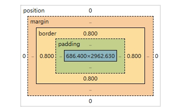

# 前端

## Html

::: tip HTML 是什么？有什么作用？

超文本标记语言（HyperText Markup Language），用于定义网页结构和内容。

HTML 本身不具备逻辑功能，主要负责语义化和结构化。

:::

::: tip HTML 语义化是什么？有什么好处？

根据内容选择合适的标签（如标题用 `<h1>`，段落用 `<p>`）。

好处：结构清晰、SEO 友好、便于维护和可访问性。（企业内部系统无效）

:::

::: tip html 常用标签

没必要记，可以通过元素周期表速查（链接MDN）

https://www.xuanfengge.com/funny/html5/element/

- 文档结构
  - `<!DOCTYPE html>`：声明文档类型
  - `<html>`：HTML 文档根元素
  - `<head>`：文档头部（元信息、样式、脚本等）
  - `<body>`：文档主体
- 文本与段落
  - `<h1> ~ <h6>`：标题，h1 最大，h6 最小
  - `<p>`：段落
  - `<br>`：换行
  - `<hr>`：水平线
  - `<span>`：行内容器（无语义）
  - `<div>`：块内容器（无语义）
- 文本格式化
  - `<strong>`：强调，语义化加粗
  - `<b>`：加粗（无语义）
  - `<em>`：语义化斜体，表示强调
  - `<i>`：斜体（无语义）
  - `<u>`：下划线
  - `<del>`：删除线
  - `<mark>`：高亮
- 列表
  - `<ul>`：无序列表
  - `<ol>`：有序列表
  - `<li>`：列表项
  - `<dl>`：定义列表
  - `<dt>`：定义标题
  - `<dd>`：定义描述
- 链接与媒体
  - `<a>`：超链接
  - ``：图片
  - `<audio>`：音频
  - `<video>`：视频
  - `<source>`：多媒体资源
  - `<iframe>`：内联框架
- 表格
  - `<table>`：表格
  - `<tr>`：表格行
  - `<td>`：单元格
  - `<th>`：表头单元格
  - `<thead>`：表头
  - `<tbody>`：表体
  - `<tfoot>`：表尾
  - `<caption>`：表格标题
- 表单
  - `<form>`：表单
  - `<input>`：输入框
  - `<textarea>`：多行文本框
  - `<button>`：按钮
  - `<select>`：下拉框
  - `<option>`：选项
  - `<label>`：标签
  - `<fieldset>`：表单分组
  - `<legend>`：分组标题
- 语义化标签（HTML5 新增）
  - `<header>`：头部
  - `<nav>`：导航
  - `<section>`：文档区块
  - `<article>`：文章内容
  - `<aside>`：侧边栏
  - `<footer>`：底部
  - `<main>`：主要内容
  - `<figure>`：图文组合
  - `<figcaption>`：图文说明
:::

::: tip HTML5 新特性

- 新标签：`<header>`、`<footer>`、`<article>`、`<section>`、`<nav>`。
- 新表单控件：email、url、number、range、date。
- 多媒体：`<audio>`、`<video>`。
- 本地存储：localStorage、sessionStorage。
  - localStorage：持久存储，除非手动删除。
  - sessionStorage：会话存储，浏览器关闭即失效。
- Canvas 绘图、SVG。
- WebSocket、WebWorker、Geolocation API。
:::

## CSS

::: tip css是什么

CSS 全称是 Cascading Style Sheets（层叠样式表），是前端开发中用于 控制网页样式和布局 的一种语言。

- HTML → 决定网页的结构（写出标题、段落、图片等内容）。
- CSS → 决定网页的外观（颜色、字体、间距、布局等）。
- JavaScript → 决定网页的行为（交互、动态效果）

:::

::: tip css 引入方式有哪些

- 行内样式
- 内部样式表
- 外部样式表

:::

::: tip 常见选择器有哪些，层叠规则是怎么样的

- 基础选择器
  - *：通配符选择器，选中所有元素。
  - element：标签选择器，选中某种标签，例如 div、p。
  - .class：类选择器，选中指定类名的元素。
  - #id：ID 选择器，选中特定 ID 的元素。
  - selector1, selector2：分组选择器，同时选中多个。
- 组合选择器
  - A B：后代选择器，选中 A 内的所有 B。
  - A > B：子元素选择器，只选中 A 的直接子元素 B。
  - A + B：相邻兄弟选择器，选中紧跟在 A 后的第一个兄弟 B。
  - A ~ B：通用兄弟选择器，选中 A 之后所有兄弟 B。
- 属性选择器
  - `[attr]`：选中带有 attr 属性的元素。
  - `[attr="value"]`：选中属性等于某值的元素。
  - `[attr^="val"]`：选中属性值以 val 开头的元素。
  - `[attr$="val"]`：选中属性值以 val 结尾的元素。
  - `[attr*="val"]`：选中属性值包含 val 的元素。
- 伪类选择器
  - 动态伪类：:hover、:active、:focus。
  - 结构伪类：:first-child、:last-child、:nth-child(n)、:nth-of-type(n)、:not(selector)。
  - UI 状态伪类：:checked、:disabled、:enabled。
- 伪元素选择器
  - ::before、::after：在元素内容前后插入内容。
  - ::first-letter、::first-line：选中文字的首字母、首行。

- 层叠规则优先级总结

优先级最高 → 最低:

1. !important
2. 特异性（内联 > ID > 类 > 元素）
   1. 内联样式（style=""）	                           1000
   2. ID 选择器（#id）	                               0100
   3. 类、伪类、属性选择器（.class，:hover，`[attr]`）	 0010
   4. 元素、伪元素选择器（div，p，::before）	           0001
3. 代码顺序（后定义的覆盖前面的）
4. 继承（部分属性可继承）
   1. 文本、字体、列表相关可以继承
   2. 盒模型、布局、定位
   3. inherit：强制继承父元素的值。
      - initial：使用该属性的初始值
      - unset：如果该属性默认可继承，则等同于 inherit，否则等同于 initial
      - revert：回退到浏览器的默认样式（User Agent stylesheet）。

"重要性 > 特异性 > 代码顺序 > 继承"

（!important > Specificity > Source Order > Inheritance）

:::

::: tip 什么时候需要重置样式表，现在嗯对UI组件库如EL-Ui会清除吗

浏览器有默认样式（User Agent Stylesheet），不同浏览器之间的默认样式不完全一致（比如 Chrome、Firefox、Safari 可能差别细微），所以开发时经常会引起 跨浏览器 UI 不一致 的问题。

Element UI / Element Plus 自带了 基础样式重置（类似 normalize.css），确保它的组件在不同浏览器上效果一致。但是 不会完全清零，比如 h1~h6 的字体大小通常还是保留的（只在组件需要时覆盖）。一般不用重复引入。

如果自己写的页面，建议使用`normalize.css`

:::

::: tip 什么是盒模型，有哪些类型

在CSS中，几乎每个元素都会生成一个“盒子”，这个盒子被称为盒模型（Box Model）。

根据不同的显示需求和元素的性质，盒子模型会有所不同。常见的盒子类型有：

- 块盒 display:block
  - 独占一行
  - 可以设置宽度和高度
  - 块级元素(容器元素、H1-H6、P)
- 行盒 display:inline
  - 不占据整行
  - 宽度和高度不能直接设置 设置行高和padding-left、padding-right改变宽高
  - 行盒的盒模型沿着内容延伸
  - 行盒的padding、margin、border在水平方向有效，垂直方向无效。
  - 内容元素(span a strong)
- 行块盒 display:inline-block
  - 能设置宽高的行盒
  - 行内块级元素常用于需要既有行内排列，又需要设置尺寸（如宽高）的场景
  - 例如，图片、按钮、链接等可以用inline-block进行布局，使得它们能够在一行内显示，并同时能够自定义大小
- Flexbox 盒子
- Grid 盒子

**盒模型：**




:::

::: tip 怎么给元素设置宽高，有哪些注意事项

1. 行盒宽度和高度不能直接设置 设置行高和padding-left、padding-right改变宽高
2. 设置宽高时，默认为 内容盒宽高，可以使用 box-sizeing: border-box; 使宽高为盒子的整体宽高。
3. 避免使用 height: 100%：​除非父元素有明确的高度，否则子元素设置 height: 100% 可能无效。
4. **margin 或 padding 设置百分比值是相对于包含块（containing block）的宽度计算的，而不是高度。**

:::

::: tip 溢出处理怎么设置

- visible - 溢流未被截断。内容在元素框外呈现
- hidden - 溢出部分将被剪切，其余内容将不可见
- scroll - 溢出部分被截断，并添加一个滚动条以查看其余内容
- auto - 类似于scroll，但它只在必要时添加滚动条

设置 overflow 属性（如 auto 或 hidden），这将触发父元素建立新的块格式化上下文（Block Formatting Context，BFC），从而包含其浮动的子元素。

解决浮动塌陷问题。
:::

::: tip 什么是包含块

包含块（Containing Block）

包含块是一个矩形区域，元素的尺寸和位置通常相对于其包含块进行计算。

大多数情况下包含块是元素最近的块级祖先元素的内容区域。​包含块的确定主要取决于元素的 position 属性。

确定规则:

- position: static 或 relative：包含块是最近的块级祖先元素的内容区域。
- position: absolute: 包含块是最近的 position 属性不为 static 的祖先元素的内边距区域。
- position: fixed: 包含块是视口（viewport）。
  - 在老版本浏览器不能兼容Flex布局时，可以使用这种方式实现后台页面布局。
- position: sticky: 包含块是最近的滚动祖先元素的内容区域。

:::

::: tip 什么是BFC

BFC（Block Formatting Context，块级格式化上下文）是一个独立的渲染区域，具有一套特定的布局规则。

BFC 是页面中的一块独立渲染区域，其内部的块级盒子按照特定规则进行布局。

​在 BFC 中，子元素的布局不会影响到外部元素，反之亦然。​可以将 BFC 理解为一个“结界”，内部的布局变化不会波及外部。

**创建新的 BFC：**

- 根元素（`<html>`）​
- 设置了 float（非 none）的元素​
- 绝对定位元素（position: absolute 或 fixed）​
- display 为 inline-block、table-cell、table-caption、flow-root 的元素​
- overflow 属性不为 visible 或 clip 的块级元素（如 hidden、auto、scroll）

**布局规则**

- BFC 内部的块级盒子在垂直方向上一个接一个地放置。​
- 同一个 BFC 中相邻的块级盒子的垂直外边距（margin）会发生重叠。​
- BFC 的区域不会与浮动元素的区域重叠。​
- 计算 BFC 的高度时，浮动子元素也会被包含在内。

:::

::: tip 常见布局方式有哪些（视觉格式化模型）

1. 常规流 默认
   1. 块盒独立一行
   2. 行盒水平方向依次排列
2. float（浮动）
   1. float: left：​元素向其包含块的左侧浮动。
   2. float: right：​元素向其包含块的右侧浮动。
   3. float: none：​默认值，元素不浮动，保持在文档流中
   4. 会高度塌陷，因为独立于常规流，解决方式：使用伪元素和clear属性清除浮动(也可以直接添加一个元素),设置 overflow 属性，触发 BFC
3. position: static 静态定位
   1. 默认值，元素按照正常文档流排列。
   2. 不受 top、right、bottom、left 属性影响。
4. position: relative（相对定位）
   1. 元素相对于其在文档流中的原始位置进行偏移。
   2. 元素仍保留在文档流中，其他元素的布局不会因为其偏移而改变。
   3. 常用于微调元素位置，**或作为绝对定位子元素的参考点。**
5. position: absolute（绝对定位）
   1. 绝对定位的元素脱离了正常的文档流，不会占据空间，其他元素会忽略它的存在。​
   2. 绝对定位元素的位置是相对于最近的非 static 定位祖先元素(如relative)进行计算的。如果没有这样的祖先元素，则相对于文档的初始包含块进行定位。​
   3. 绝对定位常用于创建弹出层、模态框、工具提示等需要精确定位的界面元素。
6. position: fixed（固定定位）
   1. 脱离文档流
   2. 相对于浏览器的视口进行定位
   3. 常用于浮动按钮、通知栏
7. flexbox 布局
   1. display: flex 或 display: inline-flex 使元素成为 flex 容器。它的直接子元素会自动成为 flex 项目。
   2. 允许水平或垂直依次排列，也可以吃掉剩余空间，现代浏览器最常用的布局方式之一
8. grid 布局
   1. 二维的布局系统，可以同时处理行和列的布局，使得复杂的网页布局更容易实现。

:::

::: tip 什么是响应式布局，怎么实现

同一套页面，在不同设备（PC、平板、手机）上自动适配，保持良好的用户体验。

核心思想：根据 设备分辨率 / 屏幕宽度 自动调整页面布局，而不是写多个版本。

实现方式：

1. 弹性布局（Flexbox / Grid）
2. 媒体查询（Media Query）
3. 视口（Viewport）适配

大多数前端组件库都支持，使用弹性布局+Max Min 宽度+媒体查询修改布局 

:::

## JavaScript

::: tip js定义

JavaScript（通常缩写为JS）是一门基于 `原型` 和 `头等函数` 的 `多范式` `高级` `解释型` 编程语言，它支持 `面向对象` 程序设计、 `指令式编程` 和 `函数式编程` 。

1. 原型（Prototype）
   1. 不通过「类」来定义对象，而是直接通过 现有对象（原型）复制/扩展 来创建新对象。
2. 多范式（Multi-paradigm）
   1. 指一门语言支持 多种编程范式，开发者可以按需选择。
   2. 常见范式：
      - 面向对象编程（OOP）
      - 指令式编程（Imperative Programming）
      - 函数式编程（Functional Programming）
3. 解释型语言（Interpreted Language）
   1. 代码不是一次性编译成机器码，而是由 解释器逐行翻译执行。

:::

::: tip 原始类型有哪些？

（string, number, boolean, null, undefined, bigint, symbol）


:::

::: tip 引用类型有哪些？

（Object, Array, Function, Date, RegExp, Map, Set, WeakMap, WeakSet）

:::

::: tip JavaScript 如何做类型判断，有哪些陷阱

1. typeof — 判断基础类型
   1. typeof null     // "object" ❌ 历史 bug
   2. typeof []       // "object" ❌
2. instanceof — 判断引用类型是否由某构造函数创建
   1. 无法判断基础类型（例如 123 instanceof Number 为 false）
   2. 不适合跨 iframe、window 判断（构造函数不同）
3. Object.prototype.toString.call(val) — 万能判断法
4. Array.isArray() — 判断数组的推荐方式
5. .constructor — 查看构造函数
   1. 可被人为更改

:::

::: tip JavaScript 隐式类型转换有哪些场景？

1. 字符串拼接时
2. 算术运算
3. 布尔上下文（Boolean Context）
4. 比较运算（==）
5. 对象 → 基本类型

注意空对象 {} 的默认行为

``` js
console.log([]);  // ""

const obj = {};
console.log(obj.valueOf());   // 返回自身对象：{}
console.log(obj.toString());  // "[object Object]"

{} + 1  // → "[object Object]" + 1 → "[object Object]1"

//注意，下面情况 JS 解释器把 {} 解析为代码块，这时它就被忽略了
{} + []  // → [] → ""

//想明确表示它是对象，必须加括号
({} + [])  // → "[object Object]"

```

:::

::: tip == 和 === 的区别？

值类型：

==  宽松等于： 隐式类型转换后再比较。

=== 严格等于： 不会做类型转换，必须 类型和值都相同 才为 true。

引用类型：

都是比较的地址。

尽量使用 `===`。

因为:

``` js
[] == false   // true
// [] == false
// → [] 转成原始值 '' → '' == false
// → '' 转成数字 0，false 也转成 0 → 0 == 0

[] == ![]     // true
// [] == ![]
// → ![] 是 false，所以变成 [] == false（同上）

null == undefined // true

// 对象与对象比较的是引用，不是值。
{} == {}; // false
[] == []; // false

// NaN 不等于自身，是 JS 中少数需要特判的值
NaN === NaN        // false
isNaN(NaN)         // true
Number.isNaN(NaN)  // true（更严格）

```

:::

::: tip 变量声明方式有哪几种

- var	
  - 函数作用域	
  - 可以重复声明	
  - 会提升 声明的变量会被提升到当前作用域的顶部
  - （注意）会“泄露”出当前代码块，导致变量被意外访问或污染。
    - **使用 var 时 for 循环中的异步操作出错**
- let(ES6)	
  - 块级作用域	  
  - 不能可以重复声明	
  - 不会提升 let 和 const 也会提升，但它们的初始化不会被提升。在声明之前访问这些变量会导致ReferenceError。，访问会直接报错（称为“暂时性死区”）。
- const(ES6)	
  - 块级作用域	 
  - 不能可以重复声明	
  - 不会提升 let 和 const 也会提升，但它们的初始化不会被提升。在声明之前访问这些变量会导致ReferenceError。，访问会直接报错（称为“暂时性死区”）。
  - 不能修改

:::

::: tip 函数提升和变量提升的区别？

- 变量 var 提升的是 名字（声明），要等到执行到那一行才赋值。
- function 提升的是 整个函数体，在作用域中随时可用。
  - 如果用 var 定义函数表达式、箭头函数，只是变量提升，但函数体不会提升。

:::

::: tip 函数的声明方式有哪些

- 函数声明 function foo()
- 函数表达式 const bar = function()
- 箭头函数 const add = (a, b) => a + b;
- 构造函数 const sum = new Function('a', 'b', 'return a + b');
- IIFE 
``` js
(function() { ... })();   // 常见写法
(function() { ... }());   // 也可以
!function() { ... }();     // 也可以（少见写法）
+function() { ... }();     // 有效（但不推荐）
```
- 对象方法简写 
``` js
const obj = {
  foo(a, b) {
    return a + b;
  }
};
```
- 类方法
``` js
class MyClass {
  constructor(x) {
    this.x = x;
  }
  getX() {
    return this.x;
  }
  static sayHi() {
    return "Hi";
  }
}

```
:::


::: tip 什么是作用域链

当访问变量时，JavaScript 会从当前作用域开始查找，若找不到，就沿着父作用域一层层向上查找，直到全局作用域为止。这个查找路径形成了作用域链。

作用域链是词法静态的，取决于函数定义位置，而非调用位置。

:::


::: tip 什么是闭包

闭包是指一个函数能够访问其词法作用域中定义的变量，即使这个函数是在其作用域外被调用的。

应用：

- 返回函数
- 在异步中使用
- 使用闭包实现私有变量

- 闭包会导致变量不会被释放，可能导致内存泄露，慎重使用
- 每个闭包都会创建新的作用域链 ，大量使用会带来性能问题
- 闭包和 this 无直接关系， this 是运行时绑定，与闭包无关
- 闭包在循环中常常会 所有函数共享同一个变量。

:::

::: tip 什么是函数柯里化？

把一个接收多个参数的函数，转化为一系列接收单一参数的函数。

换句话说：

原始函数：f(a, b, c)

柯里化后：f(a)(b)(c)

``` js
// 柯里化函数
function curryAdd(a) {
  return function(b) {
    return a + b;
  }
}
```

作用：参数复用、延迟执行、方便组合。

:::


::: tip 什么是函数防抖和节流？如何实现？

**防抖：在事件持续触发时，只在最后一次触发后，延迟一段时间再执行回调。**

``` js

function debounce(fn, delay) {
  let timer = null;
  return function (...args) {
    clearTimeout(timer);
    timer = setTimeout(() => {
      fn.apply(this, args);
    }, delay);
  };
}

```

**节流：在事件持续触发时，保证在一定时间间隔内，回调最多执行一次。**

``` js

function throttle(fn, delay) {
  let timer = null;
  return function (...args) {
    if (!timer) {
      timer = setTimeout(() => {
        fn.apply(this, args);
        timer = null;
      }, delay);
    }
  };
}

```

:::

::: tip 箭头函数和普通函数的区别？

1. this 绑定不同
   1. 普通函数：this 动态绑定，取决于调用方式。
   2. 箭头函数：this 词法绑定，继承自定义它时所在的作用域（外层作用域的 this）。
2. arguments 对象
   1. 普通函数：有 arguments，包含实参列表
   2. 箭头函数：没有 arguments，只能用 剩余参数 (...args) 来代替。
3. 箭头函数：不能作为构造函数
4. 箭头函数：没有 prototype

:::

::: tip this绑定

1. 默认绑定 全局函数、普通函数、定时器指向 
   1. 浏览器 window，Node.js Global，严格模式 undefined.
2. 隐式绑定  对象方法 构造函数调用
   1. this 指向该对象。
   2. 如果将方法赋值给另一个变量再调用，this 会丢失原有的绑定。
3. 箭头函数
   1. 由外层作用域决定
4. 事件处理函数
   1. 指向触发事件的元素
5. 显示绑定
   1. 函数.call(对象) 函数中this绑定对象（原本应该是undefined）
   2. 函数.apply(对象) 函数中this绑定对象（原本应该是undefined）
   3. 新函数 = 函数.bind(对象)，新函数永久绑定指定的 this。
:::

::: tip call、apply、bind 区别

- call
  - 函数.call(对象, 参数1, 参数2) 立即执行函数 改变 this 依次传参
- apply
  - 函数.apply(对象, [参数1, 参数2]) 立即执行函数 改变 数组传参
- bind
  - 新函数 = 函数.bind(对象)

:::

::: tip 什么是原型链？

- 每个 对象 在创建时都会关联一个内部属性 [`[Prototype]`]（在浏览器中可通过 `__proto__` 访问）。
- [`[Prototype]`] 通常指向另一个对象（即它的 原型对象）。
- 如果在对象上访问某个属性/方法时，找不到，就会沿着 [`[Prototype]`] 链一层层向上查找，直到找到或到达 null 为止。
- 这个由 对象 + 原型 逐级连接起来的结构，就是 原型链。

:::

::: tip `__proto__` 和 prototype 的关系？

- prototype：函数的属性，用来定义实例的共享原型。
- `__proto__`：对象的属性，指向它的构造函数的 prototype。
  - 实例.`__proto__` === 构造函数.prototype

:::

::: tip js中如何继承

1. 原型链继承
   1. 子类的 prototype 指向父类的实例 `Child.prototype = new Parent();` // 原型链继承
   2. 无法向父类构造函数传参
2. 构造函数继承（借用构造函数 / 经典继承）
   1. `function Child(name){ Parent.call(this, name); // 构造函数继承 } `
   2. 无法继承父类原型上的方法
3. 组合继承（原型链 + 构造函数）
   1. `Child.prototype = new Parent(); Child.prototype.constructor = Child;`
   2. 调用了两次父类构造函数
4. 寄生组合继承（优化组合继承）
   1. 通过 Object.create 创建原型对象，避免调用父类构造函数两次。`Child.prototype = Object.create(Parent.prototype);Child.prototype.constructor = Child;`
      1. Object.create(Parent.prototype) 做的事情：const obj = {}; obj.`__proto__` = Parent.prototype; 这里 并没有执行 Parent 构造函数，只是建立了原型链关系。
   2. 推荐使用
5. ES6 class 继承
   1. 本质上仍然是原型链 + 构造函数机制，但语法糖更直观。

:::

::: tip 创建对象的方式

1. 对象字面量
2. new object
3. 构造函数
4. Object.create(proto)
5. 使用类

:::

::: tip 什么是事件循环（Event Loop）？

- 单线程：JS 只有一个主线程执行代码。
- 执行栈（Call Stack）：同步代码进入栈执行，执行完出栈。
- 任务队列（Queue）：异步任务（定时器、网络请求、事件回调）先放到任务队列里，等待执行。

| 类型   | 常见来源                                                                   | 执行时机                                                 |
| ------ | -------------------------------------------------------------------------- | -------------------------------------------------------- |
| 宏任务 | setTimeout、setInterval、setImmediate（Node）、I/O、UI渲染                 | 每轮循环只执行一个宏任务，然后清空微任务队列             |
| 微任务 | Promise.then / catch / finally、process.nextTick（Node）、MutationObserver | 当前宏任务执行完后立即执行所有微任务，再执行下一个宏任务 |

工作流程

1. 执行栈执行同步代码（宏任务）。
2. 当前宏任务执行完毕 → 执行所有微任务队列。***微任务优先***
3. 执行完微任务 → 渲染（UI更新）。
4. 取下一个宏任务 → 重复步骤 2-3。

**单线程不停循环执行宏任务，执行完当前宏任务就处理所有微任务，再进行下一轮宏任务和渲染。**

**由于单线程，setTimeout 回调：即便延迟时间到达（即使delay 为 0），也不会插队同步代码或当前宏任务，会等到 当前执行栈清空 后才执行。**

**微任务优先：每轮事件循环，在宏任务执行完后会先清空微任务队列，再执行下一个宏任务。**

:::


::: tip 既然setTimeout/setInterval不能精确计时，那如何保证精确计时

递归 + 小间隔delay + 修正

``` js
let start = performance.now();
let interval = 1000; // 1秒
function tick() {
  const now = performance.now();
  const drift = now - start - interval; // 偏差
  console.log("tick", now - start);

  start = now - drift; // 修正下一次
  setTimeout(tick, interval - drift); // 调整下一次延迟
}
setTimeout(tick, interval);

```

***.NET Task.Delay() 也是类似***

:::

::: tip Promise 的状态变化规则？

``` txt

      Pending 等待
     /          \
resolve()        reject()
   /                \
Fulfilled         Rejected
  已成功             已失败


```

状态一旦改变，就不能再回到 Pending

:::

::: tip async/await 的原理

- async 函数总是返回 Promise 对象。
- 函数内部如果有 return value，等价于 Promise.resolve(value)。
- 函数内部抛出异常，等价于 Promise.reject(error)。

- await 后面可以跟 Promise 或普通值。
- await promise 会暂停 async 函数的执行，等待 Promise 完成。
- await 让后续代码在 微任务队列中执行，保证异步顺序

最终目标

- async 返回 Promise，await 等待 Promise 完成。
- await 后代码异步执行，不会阻塞主线程。

:::

::: tip Promise.all、Promise.race、Promise.allSettled 的区别？

| 方法               | 成功条件          | 短路机制           | 返回值              | 用途                       |
| ------------------ | ----------------- | ------------------ | ------------------- | -------------------------- |
| Promise.all        | 所有 Promise 成功 | 有一个失败立即拒绝 | 成功数组            | 所有任务都必须完成         |
| Promise.race       | 第一个完成        | 第一个完成就结束   | 第一个 Promise 结果 | 超时、竞速                 |
| Promise.allSettled | 不要求            | 不短路             | 每个结果对象        | 全部结果统计，无论成功失败 |

:::


::: tip 对象的属性描述符（writable, enumerable, configurable）

| 属性             | 含义                                    | 默认值             |
| ---------------- | --------------------------------------- | ------------------ |
| **writable**     | 是否可以修改属性值                      | true（对象字面量） |
| **enumerable**   | 是否可被枚举（for...in、Object.keys()） | true               |
| **configurable** | 是否可以删除属性或修改属性描述符        | true               |


:::

::: tip Object.defineProperty 和 Proxy 的区别？

Object.defineProperty = 对对象的某个单独属性添加或修改属性描述符。 给对象某个属性贴“标签”，改变属性行为

Proxy = 创建一个代理对象，可以拦截对象的各种操作（读、写、删除、函数调用等） 给对象套“拦截器”，动态控制对象所有操作

:::

::: tip 深拷贝与浅拷贝的区别？如何实现深拷贝？

| 类型   | 方法                               | 特点                                     |
| ------ | ---------------------------------- | ---------------------------------------- |
| 浅拷贝 | Object.assign / {...} / `[...arr]` | 只拷贝第一层，嵌套对象共享引用           |
| 深拷贝 | JSON.parse(JSON.stringify)         | 简单，但有局限，无法拷贝函数、循环引用等 |
| 深拷贝 | 递归 + WeakMap                     | 可处理循环引用，可扩展特殊类型           |
| 深拷贝 | Lodash _.cloneDeep  第三方库       | 稳定可靠，支持复杂对象类型               |

:::

::: tip 描述一下js的事件传播过程

捕获阶段 → 目标阶段 → 冒泡阶段(默认事件会在此阶段传播)
外 -> 内 -> 目标 -> 内 -> 外


- 可以使用 useCapture 监听捕获阶段，默认false监听冒泡阶段
  - element.addEventListener(type, listener, useCapture);
- event.stopPropagation 阻止冒泡
- event.preventDefault 阻止默认行为，如表单提交
- 事件委托：利用冒泡机制，在父级元素上统一监听子元素事件
- target 是触发元素，currentTarget 是绑定事件的元素

**对照vue**

| 修饰符     | 阶段影响     | 冒泡影响       | 默认行为                | 触发条件     |
| ---------- | ------------ | -------------- | ----------------------- | ------------ |
| `.capture` | 捕获阶段触发 | 不阻止         | 不影响                  | 任意子元素   |
| `.stop`    | 无           | 阻止冒泡       | 不影响                  | 任意阶段     |
| `.self`    | 无           | 阻止冒泡到父级 | 不影响                  | 仅自身目标   |
| `.prevent` | 无           | 不阻止         | 阻止默认行为            | 任意阶段     |
| `.once`    | 无           | 不阻止         | 不影响                  | 仅首次触发   |
| `.passive` | 无           | 不阻止         | 禁止 `preventDefault()` | 用于优化滚动 |

| 用法                  | 含义                                                    |
| --------------------- | ------------------------------------------------------- |
| `@click.stop.prevent` | 同时阻止冒泡与默认行为                                  |
| `@click.capture.stop` | 在捕获阶段监听并阻止冒泡（只执行当前）                  |
| `@click.self.prevent` | 仅点击自身触发且阻止默认行为                            |
| `@scroll.passive`     | 告诉浏览器事件不会调用 `preventDefault()`，优化滚动性能 |

:::

::: tip 集合相关

``` txt

JS 集合体系
│
├─ Array（基础集合）
│   ├─ 常用方法（map, filter, reduce...）
│   ├─ 去重、扁平化、排序
│   └─ 遍历 & 转换
│
├─ Set（唯一集合）
│   ├─ 去重
│   ├─ 并集、交集、差集
│   └─ 转数组
│
├─ Map（键值映射）
│   ├─ 键可为任意类型
│   ├─ 对象互转
│   └─ 高频统计/缓存场景
│
└─ WeakSet / WeakMap（弱引用集合）
    ├─ 不可枚举
    ├─ 自动释放内存
    └─ 适合存储对象私有数据
```
---

- **Array（数组）**

  - 数组的常见方法分类？

| 类型      | 方法                                                                       |
| --------- | -------------------------------------------------------------------------- |
| 增删      | `push`、`pop`、`shift`、`unshift`、`splice`                                |
| 遍历      | `forEach`、`map`、`filter`、`reduce`、`some`、`every`、`find`、`findIndex` |
| 排序/翻转 | `sort`、`reverse`                                                          |
| 拼接/切割 | `concat`、`slice`、`join`                                                  |
| 查找      | `indexOf`、`includes`                                                      |

  示例：

```js
const arr = [1, 2, 3, 4]
arr.splice(1, 2) // 删除索引1起2个 → [1,4]
```

---

  - `map`、`forEach`、`reduce` 的区别？

| 方法    | 返回值   | 是否可链式调用 | 能否中断       | 典型用途       |
| ------- | -------- | -------------- | -------------- | -------------- |
| forEach | 无       | 否             | 否             | 遍历执行副作用 |
| map     | 新数组   | 是             | 否             | 转换数组       |
| reduce  | 任意类型 | 是             | 可通过逻辑中断 | 累加/汇总      |

示例：

```js
[1,2,3].reduce((sum,v)=>sum+v,0) // 6
```

---

  - 数组去重的多种方法？

```js
// 方法1：Set
[...new Set([1,2,2,3])]

// 方法2：filter + indexOf
arr.filter((v,i)=>arr.indexOf(v)===i)

// 方法3：reduce
arr.reduce((acc,v)=>acc.includes(v)?acc:[...acc,v],[])
```

---

  - 数组合并的方式？

* `[...arr1, ...arr2]`
* `arr1.concat(arr2)`
* `Array.prototype.push.apply(arr1, arr2)`

---

  - 数组拍平（扁平化）？

```js
const arr = [1, [2, [3, 4]]]

// 方法1：flat()
arr.flat(Infinity)

// 方法2：递归
function flatten(a) {
  return a.reduce((acc,v)=>acc.concat(Array.isArray(v)?flatten(v):v),[])
}
```

---

  - 判断是否为数组？

```js
Array.isArray(obj) // ✅ 推荐
obj instanceof Array
Object.prototype.toString.call(obj) === '[object Array]'
```

---

- Set 集合

  - `Set` 是什么？

* ES6 新增的 **集合类型**，元素 **唯一且无序**。
* 常用于 **数组去重** 或 **集合运算（交集、并集、差集）**。

---

  - 常用方法？

| 方法            | 描述         |
| --------------- | ------------ |
| `add(value)`    | 添加元素     |
| `delete(value)` | 删除元素     |
| `has(value)`    | 判断是否存在 |
| `clear()`       | 清空集合     |
| `size`          | 元素个数     |

---

  - 常见应用：集合运算

```js
const a = new Set([1,2,3])
const b = new Set([2,3,4])

// 并集
const union = new Set([...a, ...b])
// 交集
const inter = new Set([...a].filter(x => b.has(x)))
// 差集
const diff = new Set([...a].filter(x => !b.has(x)))
```

---

  - `Set` 与数组的互转？

```js
const arr = [1,2,3]
const set = new Set(arr)
const newArr = [...set]
```

---

- Map 映射

  - `Map` 是什么？

* 一种 **键值对集合**，键可以是任意类型（包括对象）。

---

  - 常用方法？

| 方法              | 描述       |
| ----------------- | ---------- |
| `set(key, value)` | 添加键值对 |
| `get(key)`        | 获取值     |
| `has(key)`        | 是否存在   |
| `delete(key)`     | 删除键     |
| `clear()`         | 清空       |
| `size`            | 元素数量   |

示例：

```js
const m = new Map()
m.set('name','Tom')
m.set({id:1}, 'User1')
console.log(m.get('name')) // 'Tom'
```

---

  - `Map` 与对象的区别？

| 对比项   | Object                   | Map                  |
| -------- | ------------------------ | -------------------- |
| 键类型   | 字符串或Symbol           | 任意类型             |
| 元素顺序 | 无序（ES6 之后部分有序） | 按插入顺序           |
| 大小统计 | 需手动统计               | `size` 属性          |
| 性能     | 较慢（尤其频繁增删）     | 更快，更适合频繁操作 |

---

  - `Map` 与 Object 的互转？

```js
// Object → Map
const m = new Map(Object.entries({a:1,b:2}))

// Map → Object
const obj = Object.fromEntries(m)
```

---

- WeakSet & WeakMap

  - WeakSet

* 只存储 **对象引用**，且 **弱引用**（不会阻止垃圾回收）。
* 不可枚举，无 `size`。

```js
let obj = { name: 'Tom' }
const ws = new WeakSet()
ws.add(obj)
obj = null // 自动释放
```

---

- WeakMap

* 键只能是对象，值任意。
* 常用于存储对象的私有数据或缓存。

```js
const wm = new WeakMap()
let obj = {}
wm.set(obj, 'metaData')
obj = null // 自动释放
```

---

  - WeakSet/WeakMap 特点总结

| 特性         | WeakSet | WeakMap |
| ------------ | ------- | ------- |
| 键类型       | 对象    | 对象    |
| 值类型       | 无      | 任意    |
| 可迭代       | ❌       | ❌       |
| 垃圾回收友好 | ✅       | ✅       |

---

- 常见面试题汇总

  - 如何实现数组去重？

👉 使用 `Set`：`[...new Set(arr)]`

---

  - 如何计算两个数组的交集？

```js
const intersection = arr1.filter(x => new Set(arr2).has(x))
```

---

  - 如何用 `Map` 统计元素出现次数？

```js
const arr = ['a','b','a']
const count = new Map()
for (const v of arr) {
  count.set(v, (count.get(v) || 0) + 1)
}
```

---

  - `WeakMap` 在实际开发中的使用场景？

* **缓存 DOM 元素对应的状态**：

  ```js
  const cache = new WeakMap()
  function getData(el) {
    if (!cache.has(el)) cache.set(el, compute(el))
    return cache.get(el)
  }
  ```
* **实现私有属性封装**（避免暴露外部访问）

---

  - `Set` 与 `Map` 的时间复杂度？

| 操作 | 平均时间复杂度 |
| ---- | -------------- |
| 增加 | O(1)           |
| 删除 | O(1)           |
| 查找 | O(1)           |

---

- 手写题（常考）

  - 实现一个数组去重函数

```js
function unique(arr) {
  return [...new Set(arr)]
}
```

  - 实现 Map → Object 转换

```js
function mapToObj(map) {
  const obj = {}
  for (const [k, v] of map) obj[k] = v
  return obj
}
```

  - 实现交集与差集函数

```js
function intersect(a, b) {
  const s = new Set(b)
  return [...a].filter(x => s.has(x))
}
function difference(a, b) {
  const s = new Set(b)
  return [...a].filter(x => !s.has(x))
}
```

---

:::

::: tip ES6+ 常用特性

- 解构赋值
- 模板字符串
- 箭头函数
- 模块化（import/export）
- Promise / async
- Map / Set
- 可选链操作符 ?.
- 空值合并运算符 ??

:::

## Vue

### 一、基础题

#### 1. Vue 是什么？

**答案**：
Vue 是一个用于构建用户界面的 **渐进式框架**，核心特点：

* 数据响应式绑定
* 组件化开发
* 虚拟 DOM 提升性能

---

#### 2. Vue 生命周期顺序是什么？

**Vue 2**：

```text
beforeCreate → created → beforeMount → mounted → beforeUpdate → updated → beforeDestroy → destroyed
```

**Vue 3**：

```text
setup() → onBeforeMount → onMounted → onBeforeUpdate → onUpdated → onBeforeUnmount → onUnmounted
```

---

#### 3. 模板语法有哪些？

* 插值 `{{ message }}`
* 指令：

  * 条件渲染：`v-if` / `v-else` / `v-show`
  * 列表渲染：`v-for`
  * 动态绑定：`v-bind`
  * 双向绑定：`v-model`
  * 事件绑定：`v-on`
* `key`：优化渲染，标识虚拟 DOM 节点

---

#### 4. Vue 组件相关

* **注册方式**：

  * 全局组件：`Vue.component('MyComp', {...})`
  * 局部组件：在 `components` 中注册
* **组件通信**：

  * 父传子：props
  * 子传父：$emit
  * 非父子：Event Bus / Provide/Inject / Vuex/Pinia

---

#### 5. 数据响应式原理

* Vue 2：通过 `Object.defineProperty` 拦截 getter/setter
* Vue 3：通过 **Proxy** 实现，支持动态新增属性和数组变化检测

---

#### 6. 计算属性 vs 方法 vs 监听器

| 类型     | 特点             | 场景                   |
| -------- | ---------------- | ---------------------- |
| computed | 缓存依赖，性能好 | 复杂计算或依赖数据变化 |
| methods  | 每次调用都会执行 | 普通事件或方法         |
| watch    | 监听数据变化     | 异步操作或副作用       |

---

### 二、进阶题

#### 1. Vue Router

* **路由模式**：

  * hash：默认，带 `#`
  * history：HTML5 History API
* **路由传参**：

  * params：`/user/:id` → `$route.params.id`
  * query：`/user?id=123` → `$route.query.id`
* **路由守卫**：

  * 全局：`beforeEach`, `afterEach`
  * 路由独享：`beforeEnter`
  * 组件内：`beforeRouteEnter`, `beforeRouteLeave`

---

#### 2. Vuex / Pinia

* **Vuex**：

  * state、getter、mutation、action
  * 异步操作放 action
* **Pinia**（Vue 3 推荐）：

  * store 更轻量，支持组合式 API

---

#### 3. 插件和指令

* **插件**：`Vue.use(plugin)`
* **自定义指令**：

```js
Vue.directive('focus', {
  mounted(el) { el.focus() }
})
```

---

#### 4. 生命周期常见问题

* **父组件更新会触发子组件更新吗？**

  * 会触发响应式依赖更新，但非响应式数据不更新
* **v-if 与 v-show 区别**

  | 属性 | v-if           | v-show       |
  | ---- | -------------- | ------------ |
  | DOM  | 销毁/重建      | display 控制 |
  | 性能 | 切换频繁开销大 | 初始渲染一次 |

---

#### 5. 性能优化

* 避免不必要的组件更新：

  * `v-once`
  * `computed` 缓存
  * 使用 `key` 优化列表
* 异步组件 / 懒加载：

```js
const AsyncComp = () => import('./MyComp.vue')
```

* 虚拟列表优化长列表渲染

---

### 三、Vue 3 新特性题

1. **Composition API**：

   * `setup()`：组合逻辑和状态
   * `ref()` 与 `reactive()` 管理响应式数据
2. **Teleport**：将 DOM 节点挂载到指定位置
3. **Suspense**：异步组件加载状态管理
4. **Proxy 响应式 vs Vue 2 Object.defineProperty**：

   * 支持动态新增属性
   * 数组变化监听
   * 性能更优

---

### 四、常见面试题示例（含答案）

1️⃣ Vue 是什么？
👉 渐进式框架，用于构建用户界面。

2️⃣ Vue 核心思想？
👉 数据驱动 + 组件化。

3️⃣ MVVM 是什么？
👉 Model-View-ViewModel，双向绑定实现视图与数据同步。

4️⃣ Vue 的双向绑定原理？
👉 Vue2 用 `Object.defineProperty`，Vue3 用 `Proxy`。

5️⃣ 虚拟 DOM 是什么？
👉 JS 对象描述真实 DOM，提升渲染性能。

6️⃣ diff 算法做什么？
👉 比较新旧虚拟 DOM，最小化 DOM 操作。

7️⃣ key 的作用？
👉 唯一标识节点，优化 diff 性能。

8️⃣ v-if 和 v-show 区别？
👉 v-if 销毁/重建；v-show 用 CSS 控制。

9️⃣ v-for 为什么要加 key？
👉 提高更新性能，否则复用旧节点。

🔟 v-bind 和 v-model 区别？
👉 v-bind 单向绑定，v-model 双向绑定。

11️⃣ Vue 模板编译过程？
👉 template → AST → render 函数 → 虚拟 DOM。

12️⃣ Vue 数据更新为什么异步？
👉 为了性能合并多次更新，使用 nextTick。

13️⃣ nextTick 作用？
👉 DOM 更新后执行回调。

14️⃣ v-once 作用？
👉 只渲染一次，后续不更新。

15️⃣ v-html 有什么风险？
👉 存在 XSS 风险，避免插入不可信内容。

---

16️⃣ Vue2 生命周期？
👉 beforeCreate → created → beforeMount → mounted → beforeUpdate → updated → beforeDestroy → destroyed。

17️⃣ Vue3 生命周期？
👉 setup → onBeforeMount → onMounted → onBeforeUpdate → onUpdated → onBeforeUnmount → onUnmounted。

18️⃣ created 和 mounted 区别？
👉 created 可访问 data，mounted 可访问 DOM。

19️⃣ updated 触发条件？
👉 数据变化导致重新渲染。

20️⃣ keep-alive 生命周期？
👉 activated / deactivated。

21️⃣ 父子组件生命周期顺序？
👉 父 beforeCreate → 子 beforeCreate → 子 mounted → 父 mounted。

22️⃣ destroyed 后组件会被回收吗？
👉 是，事件监听和定时器需手动清除。

23️⃣ setup 执行时机？
👉 beforeCreate 之前。

24️⃣ onUnmounted 触发时机？
👉 组件销毁时。

25️⃣ Composition API 和 Options API 区别？
👉 Composition 更灵活，可组合逻辑。

---

26️⃣ 父传子？
👉 props。

27️⃣ 子传父？
👉 $emit。

28️⃣ 兄弟组件通信？
👉 EventBus(Mitt) / Vuex / Pinia。

29️⃣ 深层嵌套组件通信？
👉 provide / inject。

30️⃣ 全局状态管理？
👉 Vuex（Vue2）或 Pinia（Vue3）。

31️⃣ v-model 原理？
👉 value + input 事件组合。

32️⃣ 多个 v-model 怎么实现？
👉 自定义 `v-model:propName`。

33️⃣ props 是响应式的吗？
👉 是的，父变子更新。

34️⃣ 子组件能改 props 吗？
👉 不建议，会触发警告。

35️⃣ 如何监听 props 变化？
👉 watch。

36️⃣ emit 事件名规范？
👉 推荐 kebab-case。

37️⃣ v-slot 是什么？
👉 插槽语法糖。

38️⃣ 具名插槽怎么写？
👉 `<slot name="footer"></slot>` / `<template #footer>`。

39️⃣ 作用域插槽？
👉 父组件可访问子组件作用域变量。

40️⃣ 动态组件？
👉 `<component :is="compName">`。

---

41️⃣ 常见指令？
👉 v-if / v-for / v-bind / v-model / v-on / v-show / v-html / v-text。

42️⃣ 自定义指令注册？
👉 `app.directive('focus', { mounted(el){ el.focus() } })`。

43️⃣ 指令钩子有哪些？
👉 created / beforeMount / mounted / updated / unmounted。

44️⃣ v-if 与 v-for 优先级？
👉 v-for 优先。

45️⃣ v-for 中 key 不可用 index？
👉 因为 index 会导致复用错误。

46️⃣ v-on 修饰符有哪些？
👉 .stop .prevent .capture .once .passive。

47️⃣ v-model 修饰符有哪些？
👉 .lazy .number .trim。

48️⃣ v-bind 修饰符有哪些？
👉 .prop .sync。

49️⃣ v-pre 作用？
👉 跳过编译。

50️⃣ v-cloak 作用？
👉 防止模板闪烁。

---

51️⃣ Vue Router 模式？
👉 hash / history。

52️⃣ 路由传参方式？
👉 params / query / props 映射。

53️⃣ 路由守卫？
👉 beforeEach、beforeEnter、beforeRouteEnter。

54️⃣ 路由懒加载？
👉 `const Comp = () => import('./Comp.vue')`。

55️⃣ 路由跳转？
👉 `router.push()`、`router.replace()`。

56️⃣ 动态路由？
👉 `/user/:id`。

57️⃣ 重定向？
👉 `redirect` 配置。

58️⃣ alias 别名作用？
👉 多路径指向同组件。

59️⃣ $route 与 $router 区别？
👉 $route 当前路由信息，$router 路由实例。

60️⃣ 路由嵌套？
👉 children 配置。

61️⃣ 导航守卫返回 next() 含义？
👉 放行、重定向或中断。

62️⃣ 滚动行为控制？
👉 scrollBehavior。

63️⃣ 如何控制访问权限？
👉 路由守卫 + token 校验。

64️⃣ keep-alive 配合路由？
👉 include/exclude 指定缓存组件。

65️⃣ 如何动态添加路由？
👉 `router.addRoute()`。

---

66️⃣ Vuex 五大核心？
👉 state / getter / mutation / action / module。

67️⃣ mutation 与 action 区别？
👉 mutation 同步；action 异步。

68️⃣ getter 用途？
👉 派生状态。

69️⃣ 如何触发 mutation？
👉 `commit()`。

70️⃣ 如何触发 action？
👉 `dispatch()`。

71️⃣ 模块化 store？
👉 modules 拆分。

72️⃣ Vuex 持久化方案？
👉 localStorage / vuex-persistedstate。

73️⃣ Pinia 优势？
👉 轻量、类型支持好、组合式写法。

74️⃣ Pinia 中 store 定义？
👉 `defineStore('id', { state, actions, getters })`。

75️⃣ Pinia 如何持久化？
👉 插件扩展。

---

76️⃣ 使用 computed 缓存复杂逻辑。
77️⃣ 使用 v-once 渲染静态内容。
78️⃣ 使用 key 减少 diff 开销。
79️⃣ 异步组件懒加载。
80️⃣ 路由懒加载减少首屏包体积。
81️⃣ keep-alive 缓存不变组件。
82️⃣ 使用虚拟列表优化长表。
83️⃣ 使用分页加载。
84️⃣ 使用防抖节流优化事件。
85️⃣ 合理拆组件，减少重渲染。

---

**Vue3 特性（86–95）**

86️⃣ Composition API：setup + ref + reactive。
87️⃣ ref 创建响应式原子数据。
88️⃣ reactive 创建响应式对象。
89️⃣ toRefs 将 reactive 解构保留响应式。
90️⃣ watchEffect 自动收集依赖。
91️⃣ Teleport 实现 DOM 传送。
92️⃣ Suspense 异步组件占位。
93️⃣ Fragment 支持多根节点。
94️⃣ Emits 定义事件类型。
95️⃣ defineExpose 暴露子组件属性。

---

96️⃣ Vue diff 算法核心？
👉 同层对比，最小化 DOM 操作。

97️⃣ Vue 为何要使用虚拟 DOM？
👉 避免频繁操作真实 DOM，提高性能。

98️⃣ Vue2 响应式缺陷？
👉 无法监听对象新增属性和数组变化。

99️⃣ Vue3 Proxy 改进？
👉 全拦截对象所有操作，性能提升。

100️⃣ Vue 项目性能调优方向？
👉 懒加载、缓存、异步、CDN、SSR、打包分割。

---

✅ **总结建议**

> 高频考点集中在：
>
> * 响应式原理（defineProperty vs Proxy）
> * 生命周期（Vue2/3）
> * 组件通信方式
> * 路由与 Vuex/Pinia
> * 性能优化与 Composition API

---
