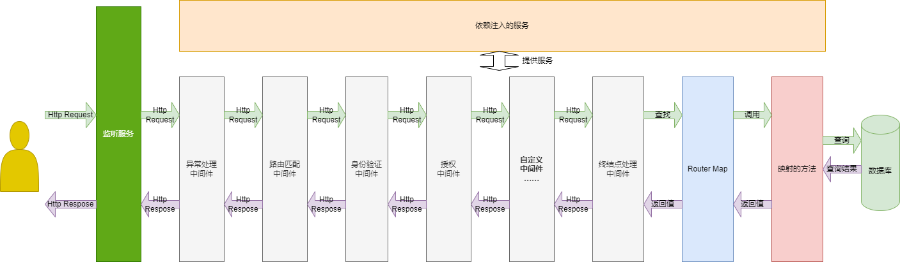

# .Net Core

## 概述

::: tip .NET Framework 与 .NET Core 的区别？

`.NET Core` 相对于 `.NET Framework`:

- 跨平台支持（Windows、Linux、macOS）
- 开源、轻量化、高性能
- 模块化（NuGet 包管理）
- 自托管（Kestrel Server）

:::

::: tip Kestrel 是什么？

- ASP.NET Core 默认的跨平台 Web 服务器
- 可作为前端服务器，也常配合 Nginx/Apache 作为反向代理。

:::

::: tip 托管代码与非托管代码区别？

- 托管代码：由 CLR 管理的代码（如 C#）。
- 非托管代码：C/C++ 编写，需要自己管理内存。

:::

::: tip CLR、CTS、CLS 的作用？

- CLR（Common Language Runtime）：运行时，负责 JIT 编译、垃圾回收、异常处理等。
- CTS（Common Type System）：公共类型系统，定义所有语言的数据类型规则。
- CLS（Common Language Specification）：公共语言规范，确保不同语言之间的互操作。

:::

::: tip .Net Core 和 ASP .Net Core的关系

.NET Core —— 基础运行时
└── ASP.NET Core —— 基于 .NET Core 的 Web 框架

:::

::: tip ASP.NET Core有哪些模块，加载顺序是什么样的

**主要模块**

1. Host主机（监听服务）
2. 服务
   1. 系统服务
      1. 日志
      2. 配置
      3. 主机服务
   2. 依赖注入的其他服务
3. 中间件
   1. 身份认证中间件
   2. 授权中间件
   3. 跨域中间件
   4. 自定义及第三方中间件
   5. 终结点中间件（路由匹配）
4. ORM 框架
   1. EF Core
   2. Dapper

**启动顺序：**

1. 调用 Program.cs/Main
2. 创建 WebApplicationBulider
   1. 初始化配置文件
   2. 初始化服务容器
   3. 初始化Kestrel 服务器
   4. 初始化默认中间件管道
3. 配置 WebApplicationBulider
   1. 绑定IP，端口
   2. WebRootPah
4. 添加系统服务
   1. Swagger
   2. 依赖注入服务
   3. 数据库上下文
5. WebApplicationBulider.build 创建 app
6. 注册中间件（严格按顺序）
   1. UseSwagger
   2. 异常处理
   3. 路由匹配
   4. 身份验证
   5. 授权
   6. 跨域
   7. 终结点
7. 开始监听

**监听时请求顺序**



:::

::: tip ASP.Net Core 有项目类型，我该怎么选择

1. ASP.NET Core Empty
   1. 只有 Host 和 Startup
2. 最小化 API（Minimal APIs）
   1. 可以不再写复杂的 Startup.cs 和 Controller，几行代码就能跑一个服务
3. ASP.NET Core Web API
   1. 提供 RESTful API 模板，默认配置路由、控制器
   2. 最常用，和Vue等搭配做前后端分离项目
4. ASP.NET Core Web App (Model-View-Controller, MVC)
   1. MVC + Razor Views（html中嵌入c#后台代码）
5. Blazor
   1. C# 全栈，很少使用


:::

::: tip 你的项目分了哪些模块

1. Api 主项目
   1. UI 接口
      1. UI Controller Base
      2. UI Controller Generated
      3. UI Controller Custom
   2. 外部接口
2. Services 服务
   1. Service Base
   2. Service Generated
   3. Service Custom
3. System 系统服务
   1. 登录
   2. 授权
   3. 日志
   4. 工作流
   5. ……
4. Core 公共模块
5. CodeGenerate 代码生成
6. Repositories 持久层数据库访问
   1. Repositories Base
   2. Repositories Generated
   3. Repositories Custom
7. Entities 实体
   1. Entities Base
   2. Entities Generated
   3. Entities Custom

推荐：

**在没有足够精力开发完整架构，建议选择第三方开源架构改进。**

:::

::: tip 跨域的原因是什么，要怎么解决

**原因：**

- 浏览器为了用户 安全，实现了 同源策略（Same-Origin Policy）
- 同源 = 协议、域名、端口 三个都相同
- 如果没有限制，恶意网站就可以随便用你的 Cookie/Token 调用接口，造成安全问题（比如 XSS、CSRF）。

**场景：**

并不是所有都会跨域。

只有在前端和后端部署在不同域名下才会跨域。

一般前后端分离项目都很分别部署，都会跨域。

**解决方案：**

1. **ASP.NET Core 内置支持 CORS（Cross-Origin Resource Sharing）。**
2. **前端代理**
3. **Nginx 反向代理 或 API Gateway 统一域名**

:::

::: tip .NET 6.0相对之前版本做了哪些重大优化

- 统一 .NET Framework、.NET Core、Xamarin（MAUI）/Mono 全部叫 .NET。
- 最小化 API（Minimal APIs）
- 写法改变（使用builder.Services代替ConfigureServices 注册服务， UseXXX 代替 Configure 注册中间件）

:::

## 主机

::: tip Host 的配置体系（Configuration）支持哪些配置源？优先级如何？

- appsettings.json
- appsettings.{Environment}.json
- 环境变量
- 命令行参数

:::

::: tip Host 如何启动不同环境

启动不同环境

- 可以加载不同的配置 【appsettings.{Environment}.json】
- 可以在代码中实现不同逻辑
``` c#
if (app.Environment.IsDevelopment())
{
    app.UseDeveloperExceptionPage();
}
else if (app.Environment.IsStaging())
{
    // staging 中间件配置
}
else if (app.Environment.IsProduction())
{
    // 生产配置
}

```

1. 命令行参数 `dotnet run --environment "Development"`
2. launchSettings.json 配置
   1. 不同的服务器可以以不同的环境启动
    如：

    ``` json
    {
      "profiles": {
        // IIS
        "IIS Express": {
          "commandName": "IISExpress",
          "launchBrowser": true,
          "environmentVariables": {
            "ASPNETCORE_ENVIRONMENT": "Development"
          }
        },
        "Legrand.WebApi": {
          "commandName": "Project",
          "launchBrowser": true,
          "environmentVariables": {
            "ASPNETCORE_ENVIRONMENT": "Development"
          },
          "applicationUrl": "http://localhost:9991"
        },
        // Docker
        "Docker": {
          "commandName": "Docker",
          "launchBrowser": true,
          "launchUrl": "{Scheme}://{ServiceHost}:{ServicePort}",
          "publishAllPorts": true,
          "useSSL": true
        }
      },
      "iisSettings": {
        "windowsAuthentication": false,
        "anonymousAuthentication": true,
        "iisExpress": {
          "applicationUrl": "http://localhost:1309",
          "sslPort": 44318
        }
      }
    }
    ```
  3. Docker 部署时在在 Dockerfile 或 docker-compose.yml 里配置
   
``` text
    environment:
        - DOTNET_ENVIRONMENT=Production
```
:::

::: tip 如何实现后台线程

两种方式

1. 长期运行且不需要管理的任务，如从消息队列里消费消息并处理，报警监控，定时日志等，
   1. 使用`IHostedService`。任何实现了 IHostedService 的类都会在 Host 启动时自动执行 StartAsync，在 Host 停止时执行 StopAsync。
   2. 直接实现IHostedService，或承 BackgroundService
2. 需要管理的任务，如设备监控，任务分发等，推荐从数据库中加载配置，并可以通过UI实现，启动，关闭，异常处理等操作

:::

::: tip 在 WebHost 中，UseKestrel()、UseIISIntegration()、UseUrls() 的区别是什么？

- UseKestrel()：使用 Kestrel 作为 Web 服务器并设置超时时间，最大访问数等参数。
- UseIISIntegration()：与 IIS/IIS Express 集成（反向代理）让应用读取 IIS 设置，例如 端口、协议、Windows 身份验证。
  - 不会启动 IIS，它只是让应用与 IIS 协作。只有在 Windows 上才有意义。
- UseUrls()：设置应用监听 URL / 端口

:::

## 依赖注入

::: tip 什么是控制反转（IoC），什么是依赖注入，它解决了什么问题？怎么实现

控制反转（IoC，Inversion of Control）：把对象创建和依赖管理的控制权从调用方转移到容器或框架中。

依赖注入（DI，Dependency Injection） 是 IoC 的一种实现方式。

.NET Core 内置 IoC 容器。

ASP .NET Core 可以通过services.AddXXX实现

也可以使用AutoFac等三方库实现

:::

::: tip 循环依赖怎么解决

**什么是循环依赖？**

A 需要 B，B 又需要 A

ASP.NET Core DI 容器 默认 不支持构造函数循环依赖

Spring（Java）容器内部通过 “三级缓存” 机制解决构造器循环依赖。

如何解决？

1. 重新设计避免循环依赖
2. 改为属性注入或延迟加载 => `Lazy<T>` 避免初始化循环依赖

:::

::: tip 依赖注入容器的生命周期，一般你是怎么用的

**内置：**

1. Transient 瞬时 每次注入时都会创建新实例，所在作用域（Scope）结束时被释放。
   1. 如果在 Web 环境里，就是 HTTP 请求结束。
   2. 如果你手动创建了 IServiceScope，那就是 Scope.Dispose() 时。
   3. 其他靠GC，外部代码不再持有对 s1/s2 的引用时。
2. Scoped（作用域）在每个 请求（Scope）内只创建一次，请求结束后释放。
   1. Web 应用里，通常就是 HTTP 请求级别单例。
   2. 同一个请求中的依赖共享一个对象，不同请求各自独立。
3. Singleton（单例）整个应用程序（进程）中 只有一个实例，所有请求共享。


Autofac 生命周期 类似，但叫法不同：

- InstancePerDependency()	每次解析都创建新实例	Transient
- SingleInstance()	全局唯一实例，应用生命周期内共用	Singleton
- InstancePerLifetimeScope()	每个 LifetimeScope 内唯一实例	Scoped（每请求一个 Scope）
- InstancePerMatchingLifetimeScope(string tag)	在指定 Tag 的 Scope 内唯一实例	高级 Scoped，用于自定义 Scope
- ExternallyOwned()	容器不管理释放，自己负责 Dispose	手动管理生命周期

**项目中一般会扫描包根据接口或基类全部注册为 InstancePerLifetimeScope**

**一般Controller注入Service，Service注入Repository，Repository注入DbContext 都会使用Scoped， 保证每个请求一次上下文。**

**不使用Singleton， EF Core 不是线程安全的，会报错或数据污染**

**注意事项：**

1. Transient容器作为参数传给新方法不会有问题，传给新线程会有问题，需要拿副本
2. Scoped 在HTTP 请求结束后会释放，此时调用方法会空指针，所以跨线程使用会出现问题。Transient在Web环境中有一样的问题

上面两个问题最常遇见的就是

**请求时一般会异步操作数据库，但DbContext会被释放**。

所以使用 async/await 而不是 Task.Run 处理大数据。

太大的数据分批传输。

不想阻塞接口，先回传OK另一个接口回传数据。
:::

::: tip 依赖注入有哪些注入方式，你一般用什么方式注入

依赖注入（DI）主要有三种注入方式：

- 构造函数注入
- 属性注入（内置 Controller 使用 `[FromServices]` 或者 其他`[Inject]`，AutoFac开启PropertiesAutowired可以自动注入）
- 方法注入（内置 Controller 使用 `[FromServices]`，其他我没实现过）
- 手动注入 （IServiceProvider）

推荐构造函数注入，依赖明确，可读性强

:::

::: tip 如果一个服务实现了多个接口，你会如何注册和解析它？

1. 原生DI 分别注入分别解析
2. Autofac 支持一行代码多接口注入

:::

::: tip 配置文件绑定（例如 appsettings.json）通常如何结合依赖注入来使用？

一般会在初始化 Program.cs 或者 SetUp.cs 里将配置项映射到实体并在通过 `builder.Services.Configure` 注入为 单例

:::

::: tip .NET Core 默认的 IoC 容器和常见第三方容器（Autofac）相比有什么优缺点？

Autofac 可以链式调用，扫描包，功能强大

内置DI 轻量化，不用依赖其他包

:::

::: tip IServiceProvider 和 IServiceCollection 的区别是什么？

- IServiceProvider解析服务
- IServiceCollection注册服务

``` swift
IServiceCollection (注册服务)
 ├─ AddSingleton<IMyService, MyService>()
 ├─ AddScoped<DbContext>()
 └─ AddTransient<Helper>()
        ↓ BuildServiceProvider()
IServiceProvider (解析服务)
 ├─ GetService<IMyService>() -> 创建/复用 MyService 实例
 ├─ GetService<DbContext>() -> 新建 Scoped 实例
 └─ GetService<Helper>() -> 新建 Transient 实例
```

IServiceCollection 内置注册扩展

| 方法                                   | 用途                                |
| -------------------------------------- | ----------------------------------- |
| `AddOptions()`                         | 启用 Options 模式（通常隐式调用）   |
| `AddLogging()`                         | 注册日志服务                        |
| `AddHttpClient()`                      | 注册 `IHttpClientFactory`           |
| `AddControllers()` / `AddRazorPages()` | 注册 MVC 或 Razor 服务              |
| `AddDbContext<TContext>()`             | 注册 EF Core DbContext，默认 Scoped |
| `AddHostedService<T>()`                | 注册后台服务（IHostedService）      |

::: 

::: tip 服务解析（Service Resolution） 的过程

服务解析 = 查注册表 → 检查生命周期 → 递归解析依赖 → 创建实例 → 返回/缓存

核心机制是 生命周期管理 + 依赖树解析

:::

::: tip 什么是 开放泛型注册？举例说明。

注册时未指定类型参数，解析时动态填充类型参数

内置DI `builder.Services.AddScoped(typeof(IRepository<>), typeof(Repository<>));`

AutoFact :

```c#
builder.RegisterGeneric(typeof(Repository<>))
       .As(typeof(IRepository<>))
       .InstancePerLifetimeScope();
```

:::


::: tip 在一个多租户系统中，不同租户需要不同的服务实例，你会如何设计依赖注入？

在多租户系统中，每个租户可能需要不同的服务实现（例如不同的数据库、配置或策略）。

多租户实现一般：

1. 按数据库隔离

需要每个租户的数据库操作给不同的上下文。
 
 添加租户 => 创建数据库 => 通过 key 注册不同连接字符串 DbContext、Service (初始化需要根据租户类别注册)

 ``` c#

  builder.RegisterType<TenantAService>().Keyed<IMyService>("TenantA");
  builder.RegisterType<TenantBService>().Keyed<IMyService>("TenantB");

  //或
  builder.Register<IMyService>(c =>
  {
      var tenant = c.Resolve<ITenantContext>().TenantId;
      return c.ResolveKeyed<IMyService>(tenant);
  }).InstancePerLifetimeScope();

 ```

 请求（当前租户信息） => Controller 通过 key 获得不同Service => 操作数据库 => 返回

 ``` c#
    private readonly IIndex<string, IMyService> _services;

    public MyController(IIndex<string, IMyService> services)
    {
        _services = services;
    }

    public IActionResult DoWork(string tenant)
    {
        if (!_services.TryGetValue(tenant, out var service))
            return BadRequest("Unknown tenant");

        service.DoWork();
        return Ok();
    }


 ```

2. 按表隔离
  
  添加租户 => 创建表

  请求（当前租户信息） => 通过表名操作数据库 => 返回

3. 按行隔离

  添加租户 => 创建表

  请求（当前租户信息） => 通过不同条件操作数据库 => 返回

按表隔离 和 按行隔离 不需要多个Service和DBContext，只需要拼接不同条件即可

:::

::: tip 不同生命周期的容器可以互相注入吗

Singleton 不能直接注入 Scoped和 Transient，会导致运行时异常
  
Singleton 生命周期比 Scoped 长

**如果允许注入，Scoped 实例会被提升为 Singleton → 会跨请求共享，数据不安全**

:::

::: tip 如何在后台任务中使用依赖注入的服务？

1. 后台任务（IHostedService， BackgroundService）

由于 Singleton不能直接注入 Scoped，IHostedService又是Singleton。

所以如果服务是Scoped，需要手动解析到轮询方法里。

2. 自定义线程

一般自定义线程通过服务启动，也是Singleton，但不会交给DI管理，所以也需要手动解析到轮询方法里，也可以直接实例化。

:::

::: tip 在中间件（Middleware）中如何获取依赖注入的服务？

1. 自定义中间件（单独的类）

- 使用 构造方法注入
- 使用 方法参数注入（中间件允许直接注入）

2. 内联中间件（Lamada）

- 直接注入服务

``` c#
app.Use(async (context, next) =>
{
    var myService = context.RequestServices.GetRequiredService<IMyService>();
    myService.DoSomething();

    await next();
});

```

:::

::: tip 如果你有一个服务需要根据请求上下文（比如当前用户信息）动态提供不同实例，你会如何实现？

- 如果只是需要请求上下文信息，直接用 IHttpContextAccessor 就够了。
- 如果不同用户/租户需要完全不同实现，用 Keyed Service + Factory。

:::


::: tip 你在项目中如何使用依赖注入？

定义接口，由Autofac扫描注册。

DBContext => Repository => Services

并封装一些crud方法

然后将 Services 注入到 Controller，

请求到达后调用Services => Repository => DBContext。

公共部分由代码生成模块生成。

:::

::: tip 遇到过哪些坑？

1. DBContext 异步中提前释放
2. 在 Singleton 服务里注入 Scoped
3. 在后台任务 中会拿不到 HttpContext（null）
   1. 在 Middleware 提取上下文数据（UserId、TenantId），放到一个 RequestContext 类里。
   2. Service 只依赖 RequestContext，而不是直接依赖 HttpContext。
4. 循环依赖

:::

## 中间件

::: tip 什么是中间件（Middleware）？它在 ASP.NET Core 中的作用是什么？

中间件（Middleware） 是一种 请求处理组件，它们按照 管道（Pipeline） 的顺序被依次调用

每个中间件都可以：

- 接收 HTTP 请求
- 对请求进行 处理（处理逻辑、修改请求、校验等）
- 决定是否把请求传递给下一个中间件，可以拦截
- 在请求完成返回响应时，还可以对 响应进行处理（修改响应、添加 Header 等）

:::

::: tip ASP.NET Core 的请求处理管道是如何构建的？

通过WebApplicantion 构建

顺序：

``` swift

Request
   ↓
[Exception Handling Middleware]
   ↓
[Routing Middleware]
   ↓
[CORS Middleware]
   ↓
[Authentication Middleware]
   ↓
[Authorization Middleware]
   ↓
[Custom Middleware...]
   ↓
[Endpoint Middleware (Controller/Action)]
   ↓
Response

```

``` c#
app.UseExceptionHandler(errorApp =>
{
    errorApp.Run(async context =>
    {
        context.Response.StatusCode = 500;
        context.Response.ContentType = "application/json";

        var exceptionHandlerPathFeature = context.Features.Get<IExceptionHandlerPathFeature>();

        if (exceptionHandlerPathFeature?.Error != null)
        {
            var errorResponse = new
            {
                Message = "An unexpected error occurred.",
                Detail = exceptionHandlerPathFeature.Error.Message  // 错误信息
            };

            await context.Response.WriteAsJsonAsync(errorResponse);  // 返回 JSON 错误响应
        }
    });
});
app.UseRouting();              // 先匹配路由，生成 Endpoint
app.UseCors();                 // 跨域处理
app.UseAuthentication();       // 身份认证
app.UseAuthorization();        // 权限验证
app.UseStaticFiles();          // 静态文件
app.MapControllers();          // 映射控制器，调用方法

```

:::

::: tip 中间件和过滤器（Filter）有什么区别？

- 中间件是管道组件，在过滤器之上，过滤器只作用在MapControllers中间件上
- 中间件全局生效，可独立于路由，可以直接终止请求，不调用下一个中间件。过滤器只能过滤Controller或 Action局部生效
- 中间件常用于处理日志、异常处理、认证、授权、CORS、静态文件，过滤器只常用于权限验证、模型验证、异常处理、缓存、结果处理

:::

::: tip 如何在 ASP.NET Core 中注册中间件？Use、Run、Map 有什么区别？

三种方式

- Use：链式调用，可拦截请求和响应
- Run：终结管道，只处理请求，尽量不要放中间
- Map：根据条件创建分支管道。只做匹配不匹配的不执行。不影响整个管道的传递。

其中每种方式都可以实现IMiddleware自定义中间件然后`app.UseMiddleware<T>()`，简单的也可以使用Lamada直接实现

:::

::: tip 中间件的本质实现机制是啥，有了解吗。

中间件的核心是 RequestDelegate 委托链

框架在构建管道时，将所有中间件拼接成 一个嵌套调用链

执行时，遵循 洋葱模型：先进入最外层，再逐层深入，最后逐层返回

Run 是特殊的终结中间件，不会调用 next

:::

::: tip 中间件如何实现请求短路（short-circuiting）？

1. 使用Run，不常用会短路所有请求
2. 常用方式：使用Use + 条件 return 或 Map/UseWhen + 条件 return 短路请求

:::

::: tip 如果要针对不同的请求路径或条件执行不同中间件，应该怎么实现？

- Map 基于路径，进入子管道，不再回到主管道。
- MapWhen 基于任意条件，进入子管道，不再回到主管道。
- UseWhen 基于任意条件，进入子管道，处理后还会回到主管道。

:::

::: tip 中间件执行过程中如果抛出异常，会发生什么？如何优雅地处理？

- 未捕获异常会沿着调用栈（即中间件链）向上传递。
- 如果整个管道没有捕获它，最终会导致服务器返回 500 Internal Server Error。
- 在开发环境，ASP.NET Core 内置的 Developer Exception Page 中间件会展示详细的异常堆栈；在生产环境，则会显示简化的错误页面。

如何处理：

1. 生产环境：`app.UseExceptionHandler("/Home/Error");` 从定向 或 `app.UseExceptionHandler(errorApp =>{ await context.Response.WriteAsJsonAsync(errorResponse); })` 统一返回，记录日志
2. 开发环境：`if ( app.Environment.IsDevelopment()){app.UseDeveloperExceptionPage(); }`

:::

::: tip 如何实现一个记录请求与响应日志的中间件？

1. 使用自定义中间件
2. 注入log4net、Serilog
3. 中间件中使用

:::

## 路由

::: tip 什么是 ASP.NET Core 路由？

路由是 请求 URL 与应用程序中处理请求的逻辑（通常是控制器动作或中间件）之间的映射机制。

由中间件UseRouting 根据 URL 匹配路由表，UseEndpoints/MapControllers 执行对应的终结点

路由可以基于 属性路由（Attribute Routing） 或 传统路由（Conventional Routing）。

:::

::: tip ASP.NET Core 路由的工作流程？

1. 请求进入中间件管道（UseRouting）。
2. Routing Middleware 根据路由表匹配请求路径，生成 Endpoint。
3. Endpoint Middleware 执行匹配到的终结点（Controller/Action/Delegate）。
4. 中间件中可使用 HttpContext.GetEndpoint() 获取当前 Endpoint。

:::

::: tip 如何注册路由，路由类型有哪些？

首先得使用用UseRouting中间件。

注册路由有以下几种方式：

1. 终结点路由（Endpoint Routing）

在 app.UseEndpoints 直接定义。

``` c#
app.UseEndpoints(endpoints =>
{
    endpoints.MapControllerRoute(
        name: "default",
        pattern: "{controller=Home}/{action=Index}/{id?}"
    );

    endpoints.MapGet("/", async context =>
    {
        await context.Response.WriteAsync("Hello World");
    });
});
```

可以简写为 `app.MapGet` `app.MapPost`  常在Mini Api中使用

2. 使用传统MVC路由

``` c#

app.UseMvc(routes =>
{
    routes.MapRoute(
        name: "default",
        template: "{controller=Home}/{action=Index}/{id?}"
    );
});

```

3. 属性路由

首先要使用中间件：

UseEndpoints/MapControllers， 可以直接简写为MapControllers。用来将映射所有使用属性路由的控制器

把所有标记了 `[Controller]` 或 `[ApiController]` 的控制器动作映射为终结点

注意：

**没有属性路由的控制器方法，在只调用 MapControllers() 的情况下，默认是没有路由的，会报错。**

如果需要默认路由要映射传统路由：

``` c#
endpoints.MapControllerRoute( // 映射传统路由
        name: "default",
        pattern: "{controller=Home}/{action=Index}/{id?}");
```

然后在控制器或动作方法上用特性定义 URL 模式：

``` c# 

[Route("products")]          // 控制器级别路由
public class ProductController : Controller
{
    [HttpGet("{id}")]         // 动作级别路由，
    public IActionResult Get(int id) => Ok(id);
}

```


省略写法`[HttpGet]` 默认一个Controller每个请求类型只有一个

:::


::: tip Endpoint 与传统路由有什么区别？

- 传统路由：ASP.NET Core 2.x 及之前主要用的方式 使用 路由模板字符串 来定义规则，按顺序匹配路由，第一个匹配成功的路由规则会终止匹配。
- Endpoint（终结点）：路由模板 + 元数据 + 处理程序，所有路由目标统一为 Endpoint。路由匹配发生在 UseRouting 中，执行发生在 UseEndpoints 中。路由表在启动时就编译完成，性能更高。

:::


::: tip 路由模版是什么，如何使用，有哪些实践

路由模板是一个字符串模式，用来定义 URL 路径和路由参数的匹配规则。

可以是：

1. 固定路径 `[Route("about")]`
2. 带参数的路径
3. Catch-all 参数（捕获所有）`[Route("files/{*path}")]`
4. 约束模版
5. 单个方法多个路由

:::

::: tip 路由如何传参

1. 静态路由+请求Body传参`[FromBody]`（使用最多）
2. 静态路由+URL传参 参数放到方法里。如果既有路由参数又有Url参数使用`[FromQuery]`
3. 路由参数，URL 路径 中定义占位符：{param}，框架会自动把 URL 中的值绑定到方法参数上（模型绑定）`[FromRoute]`
   1. 默认值`[HttpGet("products/{id=1}")]`
   2. 可选参数`[HttpGet("products/{id?}")]`


:::


::: tip 路由约束是什么，作用是什么，如何使用

路由约束是附加在路由参数上的条件，用来限制 URL 中参数的取值范围。

作用:

1. 提高路由匹配精确度
2. 解决路由冲突
3. 参数验证（轻量级）
  
| 约束             | 说明              | 示例                               |
| ---------------- | ----------------- | ---------------------------------- |
| `int`            | 整数              | `{id:int}`                         |
| `bool`           | 布尔值            | `{active:bool}`                    |
| `datetime`       | 日期时间          | `{date:datetime}`                  |
| `decimal`        | 十进制数          | `{price:decimal}`                  |
| `double`         | 双精度浮点数      | `{weight:double}`                  |
| `float`          | 单精度浮点数      | `{height:float}`                   |
| `guid`           | GUID              | `{id:guid}`                        |
| `long`           | 长整型            | `{id:long}`                        |
| `alpha`          | 仅字母（a-z/A-Z） | `{name:alpha}`                     |
| `regex(...)`     | 正则表达式        | `{code:regex(^[A-Z]{3}[0-9]{4}$)}` |
| `min(n)`         | 最小值            | `{age:min(18)}`                    |
| `max(n)`         | 最大值            | `{age:max(120)}`                   |
| `range(min,max)` | 范围              | `{age:range(18,65)}`               |
| `minlength(n)`   | 最小长度          | `{code:minlength(3)}`              |
| `maxlength(n)`   | 最大长度          | `{code:maxlength(10)}`             |
| `length(n)`      | 固定长度          | `{code:length(8)}`                 |
| `required`       | 参数必须出现      | `{id:required}`                    |

如果内置的不够用，可以实现 IRouteConstraint 来写自己的约束。

:::


::: tip 路由冲突会报错吗？如何解决路由冲突？

如果两个终结点完全相同（相同的模板 + 相同的 HTTP 方法）。无论是约定路由还是属性路由运行都会报错

解决方法：

1. 增加 HTTP 方法区分
2. 指定 路由顺序（Order）`[HttpGet("products/{id}", Order = 1)]`
3. 合理设计 API 
4. 增加 路由参数或模板差异
``` c#
[HttpGet("products")]         // /products
public IActionResult GetAll() => Ok();

[HttpGet("products/{id}")]    // /products/5
public IActionResult GetById(int id) => Ok(id);


```
5. 使用 路由约束

``` c#
[HttpGet("products/{id:int}")]     // 数字 ID
public IActionResult GetById(int id) => Ok(id);

[HttpGet("products/{name:alpha}")] // 字母 name
public IActionResult GetByName(string name) => Ok(name);


```

而路由参数和模版、路由约束可能会导致同一个路由有两种路径，所以才会有路由匹配优先级
:::

::: tip 介绍一下路由匹配优先级

**路由参数和模版、路由约束可能会导致同一个路由有两种路径，所以才会有路由匹配优先级**

原则如下：

- 更具体的模板 > 模糊模板
  - 完全静态路由（如 /about）优先级最高
  - 带约束的路由（如 /products/{id:int}）次之
  - 普通参数路由（如 /products/{id}）再后
  - 可选参数和 catch-all（如 /products/{id?}、/{*slug}）优先级最低
- 属性路由 > 约定路由
- 先注册 > 后注册


``` c#

// 请求 products/all

[Route("products/all")]        // 优先级最高
[Route("products/{id:string}")]   // 其次
[Route("products/{id}")]       // 低于 int 约束
[Route("products/{id?}")]      // 最低

```

:::


::: tip 区域（Area）路由实现？

使用特性`[Area("Admin")]`

可以区分请求前缀：

`/Areas/{AreaName}/Views/{Controller}/{Action}.cshtml`


:::


::: tip 什么是 ASP.NET Core 过滤器？

过滤器是一种 拦截请求和响应的机制，在 Action 执行前或执行后 执行自定义逻辑。可以理解为 MVC/API 的切面（AOP）。

可以用来：

1. 统一处理授权（Authorization）
2. 请求日志记录
3. 异常处理
4. 输入校验或模型验证
5. 响应格式化

:::

::: tip 过滤器有哪些类型？执行顺序是什么？

触发顺序（管道）

1. Authorization Filter → 资源授权
2. Resource Filter → 缓存、资源处理
3. Action Filter → Action 执行前
4. Action 执行
5. Action Filter → Action 执行后
6. Result Filter → Result 执行前
7. Result 执行
8. Result Filter → Result 执行后
9. Exception Filter → 捕获异常（若未被处理）

除此之外还可以自定义过滤器，重写对应生命周期方法

:::

::: tip 路由实体参数校验如何实现

1. 内置数据注解 + ModelState.IsValid
2. 自定义验证特性（ValidationAttribute）
3. FluentValidation

:::

## EF Core

::: tip EF Core 是什么？和 EF6 有什么区别？

EF Core 是 Microsoft 的轻量级、跨平台 ORM 框架。

EF Core 支持 LINQ 查询、迁移、跟踪、延迟加载等。

:::

::: tip 如何配置 EF Core？

1. 安装包
   1. 核心包 Microsoft.EntityFrameworkCore
   2. 懒加载（可选） Microsoft.EntityFrameworkCore.Proxie
   3. 数据库驱动包
      1. 建议选择Pomelo.EntityFrameworkCore.MySql作为mysql驱动，其他使用微软官方驱动
2. 配置连接字符串
   1. 只连接一个数据库可以在Program.cs 使用 AddDbContext 添加EF Core 服务到容器中并使用options配置连接字符串（建议从配置文件中读取）
   2. 如果需要多个连接，可以使用自定义Context重写OnConfiguring，然后批量注入到容器中。然后根据数据库类型使用不同的驱动实现XXXContext连接不同数据库。
3. 加载配置实体
   1. 在DBContext的OnModelCreating中使用fluent API `modelBuilder.Entity<T>`加载配置
   2. 反射批量扫描（不同DbContext实体使用不同的基类或接口） + 数据注解配置
   3. 建议高性能使用DB配置，如果没有性能需求，像我们访问量，数据量都比较小，建议使用EF Core 实体配置为主。方便迁移、跨平台、增加配置。还可以避免很多数据库执行上的问题。
:::

::: tip DbContext 和 DbSet 的作用？

DbContext：数据库上下文，负责连接数据库、跟踪实体、提交事务。

`DbSet<TEntity>`：实体集合，相当于数据库表的映射。

:::

::: tip DbContext 生命周期如何选择？

1. 一般用Scope 每次请求一个
2. 后台线程或自定义线程自己实例化并确保释放

:::

::: tip EF Core 的跟踪和不跟踪查询有什么区别？

- 跟踪查询会把查询得到的实体对象放入 DbContext.ChangeTracker，改实体属性，再调用 SaveChanges()，EF Core 会自动生成 UPDATE SQL。
- 不跟踪查询 不会把查询得到的实体放入 ChangeTracker ，更快，但不能把更新查询到的实体。通常报表使用

:::

::: tip EF Core 如何实现事务

1. 调用 SaveChanges()默认开启事务，生成事务SQL执行，保证原子性
2. 如果需要多次调用SaveChanges或者执行原生SQL则必须使用BeginTransaction显式事务
3. 如果需要使用多个DbContext，需要TransactionScope实现分布式事务

:::

::: tip EF 如何处理并发冲突？如何避免“最后一次保存覆盖前面的修改”

使用最多是版本控制。

给数据行加更新时间，保存前查看更新时间和查询的是否一致，不一致触发异常提醒刷新。

``` c#
[ConcurrencyCheck]
public byte[] RowVersion { get; set; }
```

查询时不需要事务，更新时（查看更新时间 + 更新）需要事务

:::

::: tip 如何提高 EF Core 大数据量性能？

1. 先查后操作，避免整表查
2. 尽量分页
3. 使用批量操作三方库BulkExtensions批量更新，删除。因为原生会拼接多个 Insert、Delete
4. 减少SaveChanges，每次都会有事务
5. 查询时NoTracking
6. 使用缓存
7. 必要时使用原生 SQL

:::

::: tip EFCore 的LINQ筛选时可以调用哪些方法，能不能自定义方法

EF Core 在 LINQ 查询里，能把 能翻译成 SQL 的表达式 才能下推到数据库执行，其他三方方法会报错 Client Evaluation 警告。

| 方法                           | 说明               |
| ------------------------------ | ------------------ |
| `Contains`                     | SQL `LIKE '%xxx%'` |
| `StartsWith`                   | SQL `LIKE 'xxx%'`  |
| `EndsWith`                     | SQL `LIKE '%xxx'`  |
| `ToLower`, `ToUpper`           | SQL LOWER/UPPER    |
| `Trim`, `TrimStart`, `TrimEnd` | SQL TRIM           |

| 方法           | SQL 对应  |
| -------------- | --------- |
| `Math.Abs`     | ABS()     |
| `Math.Ceiling` | CEILING() |
| `Math.Floor`   | FLOOR()   |
| `Math.Round`   | ROUND()   |

| 方法                      | SQL 对应             |
| ------------------------- | -------------------- |
| `DateTime.Year/Month/Day` | YEAR()/MONTH()/DAY() |
| `DateTime.Date`           | CAST(... AS DATE)    |
| `DateTime.DayOfWeek`      | 部分数据库支持       |

| 方法                                    | 说明              |
| --------------------------------------- | ----------------- |
| `Any`, `All`                            | EXISTS/NOT EXISTS |
| `Contains`（集合）                      | `IN`              |
| `Count`, `Sum`, `Max`, `Min`, `Average` | 聚合函数          |

如果需要自定义方法：

1. 拉到内存在处理
2. 自定义 SQL 函数映射。需要在SQL里定义函数

:::

::: tip 如何在 EF Core 中执行存储过程？

使用原生SQL执行

 `.FromSqlRaw("EXEC GetUsersByAge @MinAge", param)`

需要事务加事务
:::

::: tip 什么是影子属性、Owned Entity、值转换？

- 影子属性:

数据库有模型没有，使用t.Entry(user).Property("XXX")访问

- Owned Entity（Owned 类型/值对象）

嵌入到其他表，本身没有含义更没有主键

``` C#
public class User
{
    public int Id { get; set; }
    public string Name { get; set; }
    public Address HomeAddress { get; set; } // Owned Entity
}

[Owned]
public class Address
{
    public string Street { get; set; }
    public string City { get; set; }
}

protected override void OnModelCreating(ModelBuilder modelBuilder)
{
    modelBuilder.Entity<User>()
        .OwnsOne(u => u.HomeAddress);
}

Id | Name | HomeAddress_Street | HomeAddress_City

```

- 值转换

值转换是将 实体属性值 转换成 数据库存储类型。

必须使用Fluent API实现，数据注解没有实现方案

常用于：

  - 枚举 → 整数 / 字符串
  - 字段加密/解密
  - 特殊类型映射（例如 bool → char 'Y'/'N'）
:::

::: tip EF Core 支持哪些数据库？支持哪些特性有限制？

EF Core 是跨数据库 ORM，但特性依赖 Provider

常用 CRUD / LINQ / Owned Entity / Value Conversion：大多数数据库支持

SQLite 限制

- 不支持 ALTER COLUMN 完整修改类型
- 不支持 FULL OUTER JOIN
- 对事务和并发控制支持有限、

MySQL 也有部分限制

- 字符串方法是最大坑，IndexOf、TrimStart/TrimEnd、Substring 等可能客户端计算。
- 复杂 GroupBy / 多级 Join / 投影可能无法翻译。
- EF Core 高级特性（RowVersion、Computed Column、Owned Entity）在 MySQL 有 Provider 限制。
:::

## 认证与授权

::: tip 什么是认证（Authentication）和授权（Authorization）

1. 认证：确认用户身份，ASP .NET Core使用 中间件 UseAuthentication 实现
2. 授权：确认用户是否有权限访问资源，ASP .NET Core使用 中间件 UseAuthorization 实现

:::

::: tip ASP.NET Core 支持哪些认证方式？

- Cookie 认证：适用于 Web 应用，基于 Cookie。
- JWT（Bearer Token）认证：适用于 API，基于 Token。
- 第三方 OAuth / OpenID Connect：如 Google、Facebook、Microsoft Account。
- Windows 认证 / Active Directory：用于企业内部系统。
  
常用的是Cookie 认证和JWT 认证

:::

::: tip 项目中如何实现Cookie认证，原理是什么

1. 同域 http 请求会自动携带Cookie只要有。跨域请求需要配置
   1. `axios.get("https://api.example.com/profile", { withCredentials: true });`
   2. `fetch("https://api.example.com/profile", { credentials: "include" });`
2. 服务端 CORS 配置必须允许凭证：
  ``` c#
  app.UseCors(builder =>
    builder.WithOrigins("https://frontend.example.com")
           .AllowCredentials()
           .AllowAnyHeader()
           .AllowAnyMethod());
  ```
3. Program.cs
  ``` c#
  builder.Services.AddAuthentication("MyCookieAuth")
    .AddCookie("MyCookieAuth", options =>
    {
        options.Cookie.Name = "AuthCookie";
        options.Cookie.HttpOnly = true;         // JS 无法访问
        options.Cookie.SecurePolicy = CookieSecurePolicy.Always; // HTTPS 必须
        options.Cookie.SameSite = SameSiteMode.None; // 跨域允许
        options.LoginPath = "/account/login";   // 登录失败跳转
        options.ExpireTimeSpan = TimeSpan.FromHours(1);
    });

  var app = builder.Build();
  app.UseAuthentication();
  app.UseAuthorization();
  ```
4. 登录接口，将用户信息放入Session。设置Session过期时间，下次登录Session没过期可以直接认证成功，过期了就返回登录失败。

这么做有部分限制:

- 服务端存了大量Session，增大服务端压力
- 浏览器关闭会清空Session
- 容易被攻击。

:::

::: tip 项目中如何实现Jwt认证，原理是什么

JWT（JSON Web Token）是一种自包含的认证令牌

| 部分      | 内容                                                 |
| --------- | ---------------------------------------------------- |
| Header    | 指明签名算法，例如 `{"alg": "HS256","typ":"JWT"}`    |
| Payload   | 存储用户信息和 Claim，例如用户名、角色、权限等       |
| Signature | 用 Header + Payload + 密钥计算生成，保证数据不可篡改 |

过程：

1. 前端发送用户名/密码到服务器 登录接口
2. 服务器验证成功后生成 JWT（包含 Claim）并签名返回给前端。服务端可以吧JWT保存在Claim中。
   1. 服务端要配置AddAuthentication，AddJwtBearer
3. 前端把JWT 放在header里请求
4. 所有受保护的接口`[Authorize]`，ASP .Net Core 会从请求头解析 Token验证(一定要保存在Claim)

:::

::: tip 你在项目中如何使用认证和授权的

1. 前端登录页面发送用户信息
2. 生成JwtSecurityToken返回前端，前端进入主页
3. 访问任何方法时（由代码生成器生成，继承ControllerBase）
   1. 自定义过滤器重写OnAuthorization，查JwtSecurityToken有没有过期，过期返回 401，用户登录
   2. 自定义过滤器重写OnActionExecutionAsync，执行前筛选 表 + 方法。对比权限数据库，有权限继续执行，没有权限返回Error
   3. 自定义方法使用自定义特性传入表名+action，在OnActionExecutionAsync中筛选

**为什么没有使用ASP .Net Core提供的RABC认证**

因为方法由代码生成，并不是严格的RABC模型。用户权限需要绑定生成的Table和操作方法。如果使用注解的方式则无法实现自定义配置。

上述流程省略了无感刷新Token,除了上述的Access Token，还需要一个Refresh Token。

- 捕获到 401/498 错误时，前端自动调用 刷新接口 /api/auth/refresh，并带上 Refresh Token（可以放在LocalStorage）。
- 后端验证 Refresh Token，
  - 没过期 签发一个新的 Access Token，并更新 Refresh Token 的过期时间；返回给前端
  - 已过期返回401（用户注销时删除Refresh Token）
- 前端重新请求

如果需要使用验证码

1. 前端登录页面调用验证码接口
   1. 使用三方包SixLabors.ImageSharp
2. 把验证码放在HttpContext缓存里（请求结束失效），并设置过期时间
3. 前端登录带上验证码与缓存里的比对，超时了返回验证码超时让前端刷新

:::

::: tip 浏览器有哪些存储方式

1. Cookie
   1. 会随每次 HTTP 请求发送给服务器
   2. 浏览器关闭时清除
2. Session Storage
   1. 仅存在浏览器，不会发送给服务器
   2. 注意和服务端的Session不是一个东西
3. LocalStorage
   1. 永久存储，除非用户手动清除
   2. 按域名存储

:::

## 场景题

### 面向切面