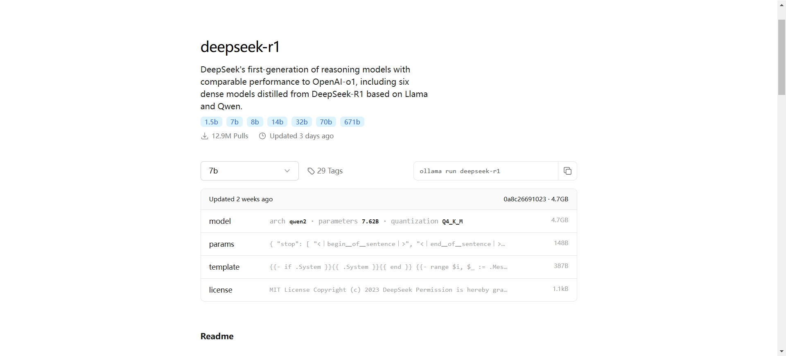

# Deepseek使用

## 官网用法
访问Deepseek官网，注册账号并开始对话。

- 官网地址：https://www.deepseek.com
- 提示库：https://api-docs.deepseek.com/zh-cn/prompt-library
- API地址：https://api-docs.deepseek.com/zh-cn
- Github地址：https://github.com/deepseek-ai

## ollama本地部署

1. **下载ollama**

访问ollama官网，下载对应操作系统版本安装。

- 官网地址：https://ollama.com/download

::: tip
官网下载速度较慢，可以前往Github仓库下载。

- Github仓库地址：https://github.com/ollama/ollama
:::

2. **安装ollama**

打开下载的安装包，按照提示安装。

3. **部署deepseek** 

从ollama官网models中找到deepseek；

打开cmd命令行，使用官网提供的命令部署对应模型。
::: tip
默认安装时，Model会存放在C盘，可以通过修改环境变量"OLLAMA_MODELS"来修改存放位置。

详细内容参考 https://github.com/ollama/ollama/tree/1f766c36fb61f7b1969664645bf38dae93f568a2/docs
:::

如：使用`ollama run deepseek-r1:1.5b`部署并运行1.5b版本的deepseek模型。

(我本地已经部署了，所以使用该命令会直接运行模型)

如果不想使用命令行，可以使用ollama提供的图形化界面。

如：

Open WebUI：https://docs.openwebui.com/
Chatbot UI：https://chatboxai.app/en

等

另外，ollama提供了chat的API，可以调用API自由开发。

API 地址：https://github.com/ollama/ollama/blob/main/docs/api.md

调用示例：

## anythingllm接入本地知识库

1. **下载anythingllm**

官网地址：https://anythingllm.com/

2. **安装anythingllm**

打开下载的安装包，按照提示安装。

3. **运行anythingllm**

安装完成后，打开anythingllm。

LLM配置（Large Language Model，大型语言模型 是一种基于深度学习的 AI 模型，训练于大量文本数据，能够理解、生成和处理自然语言。）

Embedder配置。（Embedder 模型（嵌入模型）主要用于将文本、图像或其他数据转换为向量表示（embedding）。这些向量可以用于各种机器学习和深度学习任务，如自然语言处理（NLP）、推荐系统、搜索引擎等。）

::: tip
建议选择 `nomic-embed-text`
:::

新建工作区。

上传本地知识库。
::: tip
除此之外还可以使用Github, Confluence的在线文档
:::

等待Embedding完成。

结束后就可以与LLM对话了。

::: tip webApi接口
anythingllm 提供了webApi接口。

默认接口文档地址：http://localhost:3001/api/docs

:::

## 集成到VSCode

1. **安装Continue插件**

2. **配置本地模型**

3. **使用**

分析文件

::: tip
jetbrains 全家桶也有对应的插件，可以参考官方文档。
:::

## 集成到Visual Studio
 
Visual Studio没有Continue插件，我们使用CodeGeex插件来实现。

::: danger 注意
CodeGeex插件本地模型阉割了很多功能，不推荐使用。建议使用在线模式。
:::

